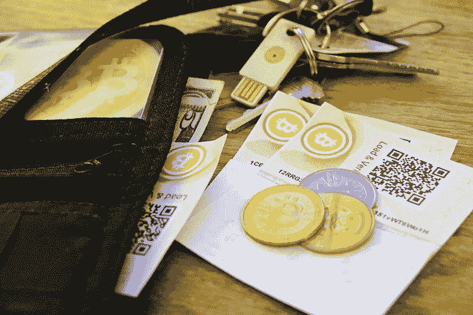

# 比特币会是未来的货币吗？

> 原文：<https://medium.com/hackernoon/will-bitcoin-be-the-currency-of-the-future-47f152c7d502>

技术改变了我们周围的一切。它已经渗透到我们的日常生活中，现在没有它们的生活是不可想象的。从医疗保健服务到娱乐技术已经征服了一切。金融业怎么能不被波及？从网上银行服务到区块链，过去几年里发生了很多变化。改变我们看待交易方式的一个变化是比特币。

许多专家对这种加密货币提出了不同的观点。从一个等待破灭的泡沫到在线交易的未来，我们都听到了。

在所有的猜测中，有一件事是肯定的，即使没有比特币，至少加密货币肯定会存在。比特币的价值波动很大，但它被视为一种可行的投资选择。它从 11 月中旬的 3000 美元飙升至 2017 年 12 月的 19000 美元。

**专家们在决定比特币的未来时考虑的参数如下:-**

**高度安全的**——和其他加密货币一样，区块链是比特币的支柱。区块链是如此安全，以至于不可能黑掉他们。此外，验证交易的成本低于中央银行，因为加密货币的交易发生在双方之间，没有银行的干预。个人进行的这些交易被记录在数字分类账或区块链中。区块链的安全性甚至让银行考虑将其作为一种选择。

**抵御经济问题**——津巴布韦和委内瑞拉等国政府已经开始使用比特币作为主要的交易手段，因为通货膨胀导致本国货币贬值。因此，在这些遭受恶性通货膨胀的国家，比特币似乎是更稳定的交易选择。

**波动值** —比特币的价值波动很大。其他货币有一个中央银行来稳定它们的价值，这是比特币所缺乏的，因此我们经常看到它们的价值发生巨大变化。

**给犯罪分子的方便**——太多隐私的问题是会给犯罪分子留有余地。由于没有第三方参与，这意味着任何人都可以使用它来购买任何值得严重关注的东西。除此之外，对比特币交易征税也存在问题，因此许多人利用它来避税。

**缺乏强大的框架** —比特币的另一个主要问题是，与 VISA 每秒能够支持 65000 笔交易的网络不同，比特币每秒只能支持 7 笔交易。这可能成为在国家层面推广比特币交易的主要障碍。此外，由于流通中的比特币数量有限，并且可以开采的比特币数量有上限。我们将永远被这个问题所困扰[还剩多少比特币？](https://www.icegold.com/how-many-bitcoins-are-left/)

考虑到上述所有因素，我们不太确定比特币作为未来货币的作用，但我们可以肯定地说，比特币为世界将加密货币视为所有交易的未来铺平了道路。