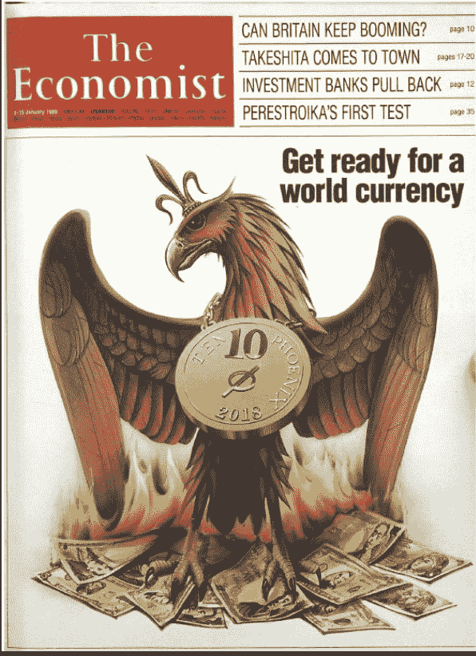
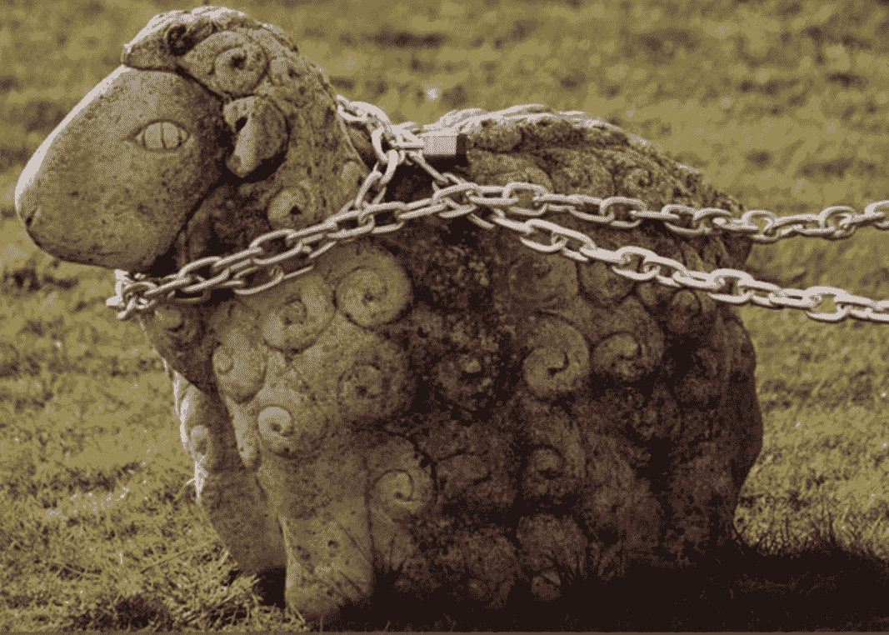

# 比特币会束缚世界吗？

> 原文：<https://medium.com/hackernoon/will-bitcoin-enchain-the-world-cf5d292ee6a5>

说到比特币，关于它在经济和社会中的作用，无疑存在很多困惑。在这一点上，人们仍然在争论 BTC 的规范，每个人都有自己的理论和对比特币及其未来的疑问。

是货币吗？是价值储存吗？这是一个新的去中心化世界的开始吗？这是否预示着我们的社会将进入一个新时代，将银行的权力交还给普通人？或者这只是一个议程的一部分，革命者正被金融界的精英们所愚弄？最重要的是…

## 谁是中本聪？

比特币创始人中本聪于 2010 年 12 月 12 日突然失踪。在他的第二个到[的最后一个帖子里他说](https://bitcointalk.org/index.php?action=profile;u=3;sa=showPosts)

*“维基解密捅了马蜂窝，蜂群正向我们扑来。”*

这是一个强烈的迹象，表明他是一个社区的一部分，因为他写给“我们”而不是“我”

有趣的是，1 月 12 日，[发布第一条关于比特币的推文的人哈尔·芬尼](https://twitter.com/halfin/status/1110302988)收到了中本聪发来的 10 BTC 以测试网络。不久后，他死于 ALS。

如今，在公众眼中，很少有人从一开始就与 BTC 有官方联系。事实上，没有人知道假名中本聪背后的个人或团体的真实身份，因为自称为克雷格·赖特聪的人没有提供任何证据。但我们知道的是 [Satoshi 的众多钱包里有超过 980.000 BTC](http://time.com/money/5002378/bitcoin-creator-nakamoto-billionaire/) ，似乎他从未兑现过其中任何一个，尽管[一个很早的矿工在 2016 年 12 月至 2018 年 1 月之间转移了 30，000+BTC](https://cryptodaily.co.uk/2018/09/satoshi-nakamoto-30000-bitcoins/)。

所以，也许在 BTC 诞生之前，中本聪就已经非常富有了。此外，谁能肯定地说，Satoshi 不是一个完整的组织，一群人，或者可能是金融系统的精英？

此外，我觉得很荒谬的是，金融精英控制着除古巴、朝鲜和伊朗这三个国家的央行之外的所有央行，他们会容忍因为一个人在电脑前发明并编码了一种数字货币而失去权力的风险。

事实上，由拥有中央银行的同一批人部分拥有的杂志[《经济学人》](https://www.economistgroup.com/results_and_governance/ownership.html)不仅于 1988 年在[发表了一篇涉及数字货币概念的文章](https://bitcoin.com.au/1988-economist-magazine-prediction-come-true/)，作者还继续指出

三十年后，美国人、日本人、欧洲人和许多其他国家的人……很可能会用同样的货币购物。

除此之外，那一期的封面上还有一枚硬币，上面有一个确定的数字: **2018** ，加密货币达到迄今为止市值最高的年份。

[https://bitcoin.com.au/1988-economist-magazine-prediction-come-true/](https://bitcoin.com.au/1988-economist-magazine-prediction-come-true/)

我不会分享这些信息来传播阴谋论。相反，我反对那些声称知道真相的人。我想传播意识，把你变成一个怀疑论者，仅仅是因为在这个假新闻盛行的时代，你不应该轻信任何事情。网络上的每一个字背后都有一个意图，而这个意图有时是故意藏在暗处的。

考虑到所有这些，我们应该以不同的眼光看待比特币背后的潜在技术。

## 比特币的技术

比特币的技术被称为区块链，是系统内所有交易的 100%透明、分散的数据库。比特币的供应量是有限的，因此，丢失的比特币等于流通供应量的减少，这反过来意味着每个没有丢失比特币的人基本上都只能获得丢失比特币的一小部分。更少的供给和至少相等的需求意味着剩余的 BTC 比以前更值钱了。此外，比特币是通过[挖掘](https://www.economist.com/the-economist-explains/2015/01/20/how-bitcoin-mining-works)创造出来的，这一过程会奖励每个拥有计算能力的人，让他们用所述区块的一小部分找到一个区块。随着流通供应量的增加，[的采矿奖励减半。因此，比特币的创造是分散的，因为与法定货币的创造不同，没有机构](https://www.bitcoinblockhalf.com/)[印刷货币](https://www.ecb.europa.eu/stats/policy_and_exchange_rates/banknotes+coins/production/html/index.en.html)并将其投入流通。

比特币是由许多独立的个人创造的，当流通的比特币达到 2100 万个币的绝对量时，挖矿就会停止。在这里你可以读到一个有趣的讨论，关于为什么供应量被限制在 2100 万。看起来很聪明，对吧？是的，但是有一个问题:

因为 BTC 矿业需要电力，而且矿业回报变少，小的个体没有能力与大的矿业集团竞争。因此，少数矿池构成了大部分的矿能。具体来说，[十个矿池](https://www.buybitcoinworldwide.com/mining/pools/)拥有近 50%的总开采量，超过[80%的矿池位于中国](https://www.buybitcoinworldwide.com/mining/pools/)。看起来不像最初想的那样分散，对吗？

## 分散

去中心化是革命派最喜欢的话题，他们因为理想主义而加入比特币运动。我个人喜欢权力下放的想法，我坚信它有可能创造一个更美好的世界，但我也看到了滥用权力下放的危险。

首先，我们要明白分权是什么意思。

[http://www.truthcoin.info/blog/measuring-decentralization/](http://www.truthcoin.info/blog/measuring-decentralization/)

如上所述，一个集中的系统有一个中心，如果你砍掉它的头，这个系统就崩溃了。中间的图片被认为是分散的，但是，如果你仔细看看，它仍然有一个中心。唯一的区别是它也有分中心。所以剩下的就是分布式网络，这不是中本聪在他的白皮书中谈到的，对吗？

不对。事实上，中本聪从未在比特币白皮书中提及去中心化。他说的是“[纯 P2P](https://satoshi.nakamotoinstitute.org/emails/cryptography/4/#selection-43.0-43.169) ”聪说

*“政府擅长砍掉 Napster 这样的中央控制网络的脑袋，但 Gnutella 和 Tor 这样的纯 P2P 网络似乎还能挺住。”*

[http://www.truthcoin.info/blog/measuring-decentralization/](http://www.truthcoin.info/blog/measuring-decentralization/)

为 Tierion 工作的比特币研究员保罗·施托尔克(Paul Sztorc)评论道:
“显然，‘去中心化’的形象仍然有一个可以‘砍掉’的‘头’事实上(比那更糟)，如果我重新排序/重新标记图像，分散的选项是最重要的！"

那么，比特币如何实现百分之百去中心化，使其成为“纯 P2P”呢？

为了回答这个问题，我想跳到 **Paul Sztorc** 的结论:

*“要加大去中心化，重点让一个完整的节点更便宜。“分散器”包括闪电网络、Tor 和计量带宽服务。”*

如果你想详细了解这一点，请查看[他的文章](http://www.truthcoin.info/blog/measuring-decentralization/)。

现在，让我们转到我关心的问题上。我想指出一个完全透明和分散的金融体系的潜在风险。还记得欧盟委员会在 2017 年 2 月提出对欧盟现金支付的[限制吗？事实上，欧盟内部正在进行一场关于现金](http://www.currency-news.com/issues/february-2017/)的[战争，用不了多久](https://fee.org/articles/why-theres-a-war-on-cash-in-europe/)[现金就会被废除](https://www.spectator.co.uk/2017/11/politicians-want-to-move-us-towards-a-cashless-world-it-would-be-a-disaster/)。原因在于现金交易的匿名性。区块链可能是迈向监控新时代的第一步，在这个新时代，一切都被完全记录下来，并永远保存在数据库中。非法活动将被追踪和追查。这对社会不一定是坏事，但当每一步都被记录在案时，对一个社会有什么影响呢？个人在日常行为中不会有明显的不同吗？此外，隐私难道不是人类尊严的一部分，是拥有自由感的必要条件吗？

此外，如果法律没有失控，追踪非法活动只会对社会产生积极的影响。事实上，如果完全没有范围，立法的权力是巨大的，而且可能过于强大。

## 人工智能和区块链

他们说，加密货币是匿名的。他们说，地址无法确定。虽然人们普遍认为区块链内的交易是匿名的，但这个[假设是有缺陷的](https://blockonomi.com/bitcoin-not-anonymous/)。虽然确实无法通过查看某个特定的事务来确定单个事务的发送者或接收者，但是每个事务都与所有其他事务相互关联，您只需确定一个事务就可以跟踪蜘蛛网的路径。举个例子，让我把你介绍给鲍勃。

Bob 有一家公关公司，他希望通过以太坊获得服务报酬。他要求托马斯付款，托马斯同意往他的地址寄 20 份乙醚。托马斯使用他的私人地址，因此，鲍勃可以看到托马斯到目前为止所做的每一笔交易，因为他可以根据每个地址找到交易的起点和终点。

更不要说大部分钱包在这一点上都是和你的个人数据相连的。人工智能能够收集所有这些数据只是时间问题，这使得识别区块链网络内的每个人变得容易，这些人不是在使用 [BTC 混合器](https://bestmixer.io/en)。

## 人工智能和权力下放

想象一下这样一个世界，今天的大部分工作都是可牺牲的，因为这些工作都是完全自动化的，由机器人来完成。人工智能可以并将连接到区块链，所有数据都存储在区块链中。如果一个人工智能可以分析所有的事实，谁还需要律师？在机器人管理一切的世界里，即使是高文凭的工作也是不必要的。进一步说，如果所有的信任都被消除了，会发生什么，因为所有的证据都在区块链里？如果你所有的钱都将储存在数字世界，你如何逃脱这个系统？根据之前的假设，透明度导致完全的认同，你将没有其他选择，只能服从系统，因为否则你的权利或财富将被人工智能管理的光荣而不会犯错的正义所放弃。幸运的是，如果系统不再正常，总会有一条出路。抗议总是重获自由和人权的一种方式，正如[法国人在 18 世纪末向我们证明的那样。](https://en.wikipedia.org/wiki/French_Revolution)但是等等，有一个缺失的部分。没错。如果没有要推翻的政权，你就不能发动革命。在一个完全去中心化的世界，正义由机器人执行，评估由人工智能完成，每一份证据都存储在区块链中，没有办法逃避这个系统的规则。

所以你最好是只好羊。

[https://www.express.co.uk/news/weird/464067/Protecting-the-flock-Owner-forced-to-chain-up-stone-sheep-in-bid-to-deter-thieves](https://www.express.co.uk/news/weird/464067/Protecting-the-flock-Owner-forced-to-chain-up-stone-sheep-in-bid-to-deter-thieves)