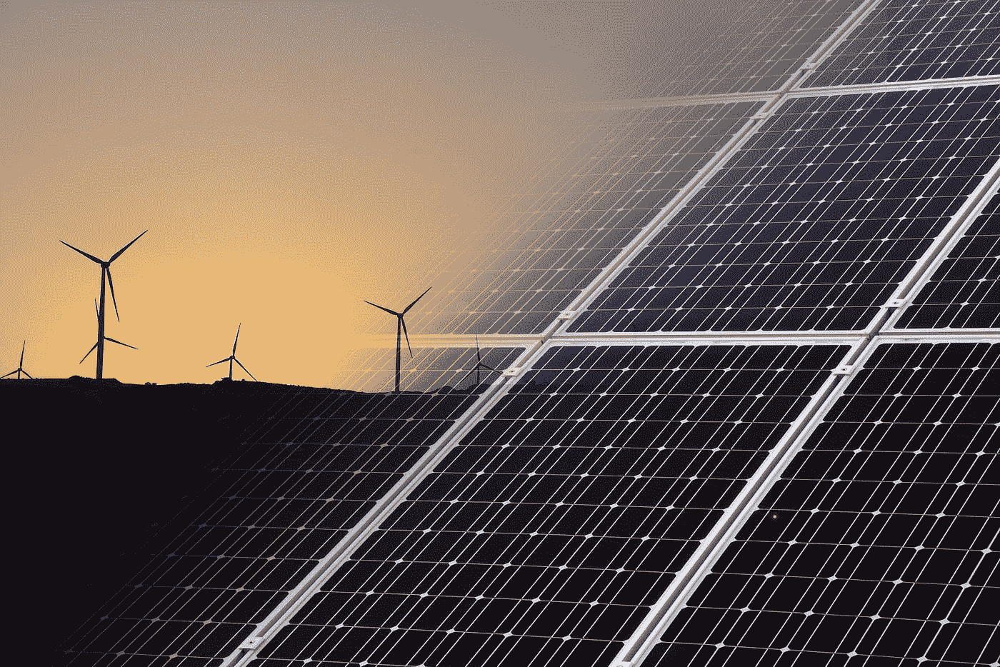
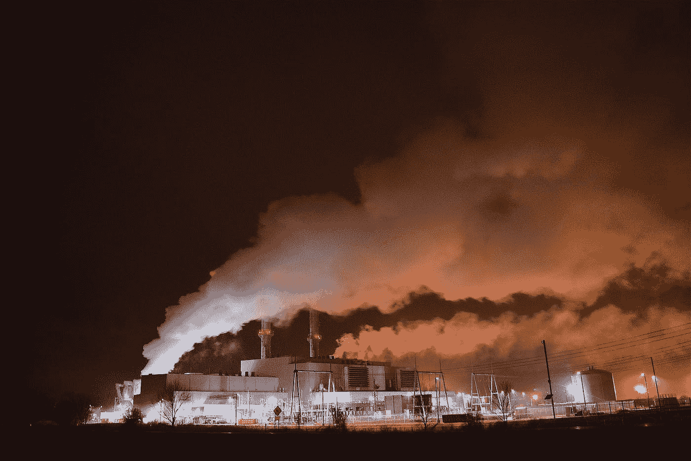
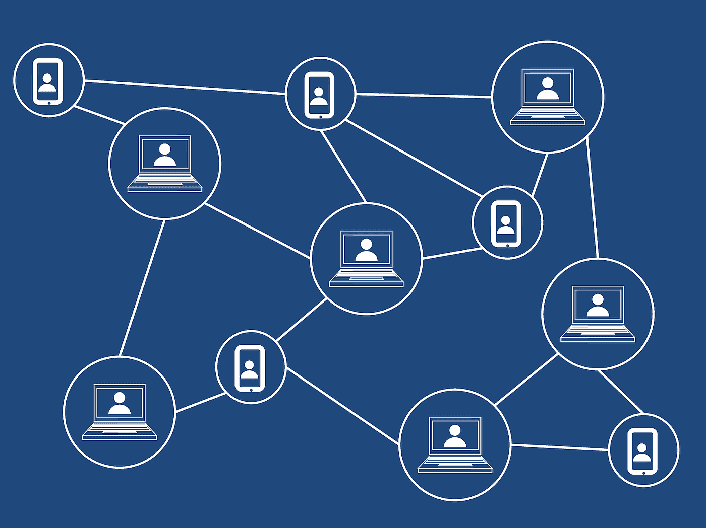

# 区块链将有助于寻找可再生能源解决方案吗？

> 原文：<https://medium.com/hackernoon/will-blockchain-assist-the-search-for-renewable-energy-solutions-46a7d2d5a028>

随着对全球气候变化的担忧日益加剧，有一个基本问题仍然存在:我们如何有效地利用可再生能源？太阳能电池板正变得越来越[高效](https://futurism.com/scientists-may-have-just-created-the-most-absorbent-solar-cell-ever)，许多社区——甚至是你通常不会想到的地区的[——都在寻求太阳能、风能和水力发电等可再生能源的优势。](https://www.smithsonianmag.com/innovation/texas-town-future-renewable-energy-180968410/)

然而，尽管越来越多的人将注意力转向可再生能源，将其作为可持续性和负责任消费的一个重要组成部分，但这可能还不够。最近，国际能源机构发布消息称，可再生能源的增长速度不足以满足气候目标。尽管国际能源机构预测到 2040 年可再生能源将占世界能源的 18 %,但这仍远低于他们 28%的理想可持续发展目标。区块链技术能否以更具弹性的方式为可再生能源的更广泛采用、使用和整合提供解决方案？

## 中央集权制

在目前的状态下，有各种各样的问题困扰着已经到位的能源网。首先，最大的缺陷之一是电网的集中化。虽然拥有一个集中的系统起初看起来并不像是一个缺陷(精简的权力，对吗？)至少可以说，这种系统的负面影响是巨大的。

鉴于近年来发生的事件，中央电网的问题现在变得很明显。如果我们看看像飓风玛利亚后的波多黎各或最近 T2 持续热浪后的澳洲墨尔本，我们会更近距离地看到影响。在这两起事件中，成千上万的居民因已建立的电网故障而断电。在这两种情况下，无论能源来源如何，系统都会发生故障，因为故障是由于系统的集中性质以及缺乏弹性和适应性造成的。集中式系统也意味着[集中式故障](https://www.nytimes.com/2012/08/01/world/asia/power-outages-hit-600-million-in-india.html)。

## 分散网格

虽然有各种各样的解决方案被提出来解决当前政府如何处理能源网的问题，但最突出的答案可能来自那些呼吁权力下放的人。劳里·格瓦拉·斯通就职于落基山研究所，致力于为地球的未来研究可再生和可持续能源问题。在 GreenBiz 的一篇[文章中，格瓦拉-斯通阐述了为什么*分散化*系统能够更好地应对日益增长的担忧。](https://www.greenbiz.com/blog/2014/08/11/can-we-make-americas-power-grid-blackout-proof)

> *“但是，尽管许多提高电网可靠性和弹性的方法都集中在加固上——加固系统中重要但脆弱的节点——但有一种更好的方法:通过分布式能源分散电网。一个系统越不集中，就越不容易出现大规模的失败，这是许多国家正在采取行动的事实。”*

当社区不依赖于集中的电力来源和获取电力的方法时，能源网能够更有弹性，我们也许有一天能够[完全避免停电](https://www.technologyreview.com/s/428666/how-power-outages-in-india-may-one-day-be-avoided/)。

## 为什么是区块链？

作为技术领域中一个快速发展的领域，区块链技术在解决能源领域的问题上具有独特的定位，这一点也不奇怪。凭借对去中心化和分布式网络的固有关注，人们可以振振有词地认为区块链技术是专门为这种应用而构建的。

政府可以利用区块链技术开始建设自己的分布式电网。借助分布式系统，本地区域能够从其电网获得更大的弹性、适应性和可靠性。事实上，这种方法的例子已经在现实世界中发生了。

例如，由非营利人工智能网格基金会支持的项目 [Eloncity Model](https://eloncity.io/) ，最近为可再生能源倡议筹集了[2000 万美元的资金，并希望利用这笔资金有所作为。Eloncity 模型利用区块链技术和可再生能源来实现更可持续的未来。为了确保能源行业的健康未来，Eloncity 正在为微电网和能源传输提供基于区块链的方法。](https://www.techinasia.com/blockchainbased-energy-grid-project-raises-20m-funding)

事实上，Eloncity 模型已经在实施了。在墨西哥下加利福尼亚半岛的圣胡安妮科，基金会正在创造一种可持续的方法，让[当地社区拥有能源](/eloncity/pioneering-an-electric-grid-in-the-middle-of-nowhere-ea77235348f8)，并提高能源传输能力。这项新计划正在创建一个分布式微电网网络，为能源传输和消耗提供一个更高效、更负责任的模式。

区块链技术在可再生能源领域发挥作用的另一个例子是 Swytch。这家总部位于奥斯丁的区块链创业公司采取了一种不同的方式，专注于奖励那些负责任地使用能源和自己生产可再生能源的人。Swytch 团队没有为更具弹性的可再生能源建设基础设施，而是“利用区块链来跟踪、验证和奖励可持续性。”

这个概念是为个人和企业提供财政激励，鼓励他们采用更负责任的能源，减少对化石燃料的依赖。财政激励这一主题也适用于寻求实施更可持续能源系统的政府。

像 Swytch 和 Eloncity 一样，政府可以利用分布式能源系统来对抗特定领域的电力垄断。如果企业和个人有经济动机转向更负责任的能源消费，而这不在大型电力公司的控制之内，那么消费者采取行动不仅是为了他们的福祉，也是为了他们的钱包，这只是一个时间问题。

随着可再生能源行业的持续增长，社区、个人和政府都在寻找适当的方法来实施合理的推广战略。随着区块链技术的出现和实施，我们可能会更早看到这一点。能源行业的未来是双重的:可持续的和有弹性的。通过结合区块链技术和可再生能源，该行业在不久的将来就可以实现这两个目标。