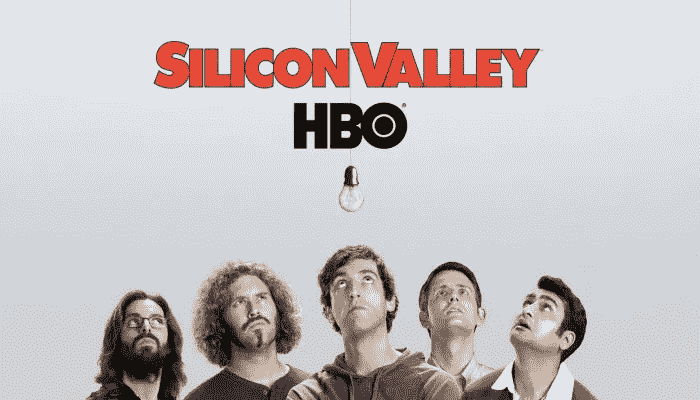
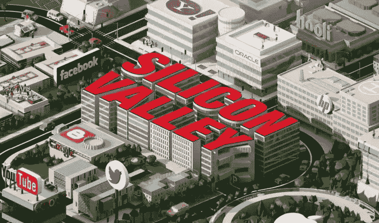
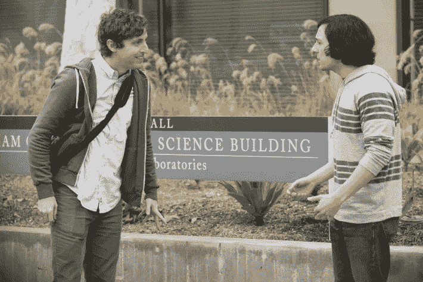

# 区块链会让 HBO 的硅谷像第五季的真实硅谷吗？

> 原文：<https://medium.com/hackernoon/will-blockchain-make-hbos-silicon-valley-like-the-real-silicon-valley-in-season-5-4d5a7b7be869>

广受欢迎的 HBO 节目《硅谷》不仅取笑真实的硅谷，还突出了硅谷的现实生活趋势。

作为虚拟初创公司 Pied Piper 及其创始人理查德的旅程的一部分，该节目非常擅长插入来自科技界的概念和迷因(什么是孵化器？独角兽是什么？什么是 Disrupt？)进入主流意识。

去年真正到过硅谷的人都知道，最热门的趋势是区块链和 T2 的加密货币。随着广受欢迎的 HBO 剧集第五季将于 3 月 25 日上映，随着区块链和点对点未来的引入，这种趋势会继续吗？

Season 5 is coming soon — will it be more or less like the real “Silicon Valley”??

自从 web 1.0 出现以来，区块链就建立在分散的点对点互联网的思想上，而不是客户端-服务器模型上。说到 web 1.0，当我 1998 年在硅谷的时候，在网络繁荣的中期，我记得我抱怨说，如果他们不是至少两家网络创业公司，我就不能走进一个公寓楼。如果你去年去了咖啡店或任何与科技相关的活动(甚至在今年的头几个月)，你就无法摆脱它。比特币！以太坊！ICO！这是否预示着魔笛手硬币和第五季中基于区块链的首次硬币发行？如果是这样的话，硅谷会比大多数主流媒体更好地解释这项技术吗？

在我们深入探讨这个问题之前，让我们先来看看一个问题，这个问题经常被不在硅谷的观众问到。HBO 的硅谷有多像真实的硅谷？

## 这部剧在多大程度上符合硅谷的现实生活趋势？

在迄今为止的四季中，该节目几乎讽刺了硅谷的方方面面，从谷歌(和一家名叫 Hooli 的公司)到彼得·泰尔、马克·贝尼奥夫甚至玛丽莎·梅耶尔等知名人士。

在喜剧中，该剧实际上非常擅长跟随真实硅谷的趋势，尽管它通常落后一年左右，并夸大了现实生活。这很有意义，因为每一季都是前一年拍摄的。

当 2016 年 IoT(物联网)和 VR 在硅谷炙手可热时，你可以看到它们的影响力是如何悄悄进入节目的。哈利·乔尔·奥斯蒙特(Haley Joel Osmont)在第四季(2017 年播出)中扮演了一位虚拟现实企业家，他的创业公司成为了独角兽，这一季以数据被转移到一个分散的物联网而结束。

## 花衣魔笛手的多种生活-它们是现实的吗？

在其曲折的旅程中，Pied Piper 经历了硅谷最著名的举措——Pivot——经常试图为理查德和他的朋友开发的革命性压缩技术找到正确的商业模式。

The show follows fictional adventures of the startup, Pied Piper

他们的压缩技术对最终用户来说是最好的吗(事实证明不是，因为太复杂了)？他们是应该许可还是卖给 Hooli 这样的巨头(可能吧，但是团队不想“出卖”)？视频聊天(Piper Chat)是这项技术的真正杀手级应用吗(他们也尝试这个)？或者它应该被用来在一个新的，分散的互联网上存储数据(这是他们最终试图让花衣魔笛手活着的地方)？

咻！要记录的东西很多，但是这些类型的支点实际上比你想象的更现实。我见过类似的关于如何将技术推向市场的斗争和辩论:消费者对 B2B，许可对构建杀手级应用。唯一的问题是，在真正的硅谷，一家公司不太可能经受住这么多的转变，因为他们在一两次转变后就没钱了！

## 管理层和董事会的斗争真的那么疯狂吗？

在花衣魔笛手从彼得·泰尔获得投资后，呃，我是说彼得·格雷戈里这个角色，他的副手劳里·布雷姆(有人说她很像玛丽莎·梅耶尔)加入了花衣魔笛手董事会。Hijinks 接踵而至。

理查德从首席执行官变成了被踢出董事会的角色，因为董事会带来了一个年纪更大、秃顶的高管，然后他自己也被踢出去了。与此同时，董事会成员彼此密谋反对首席执行官，一位早期股东被迫折价出售他的创始人股票，引发了一篇关于他可能是硅谷最愚蠢的人的文章。

这足以给人当头一棒，但同样，其中一些挣扎是真实存在的——作为我第一次创业的年轻工程师，我也被董事会换成了一位年长、秃顶的首席执行官，但没有成功。是的，在真正的硅谷，我见过董事会召集首席执行官告诉他们自己被解雇了，董事会成员密谋赶走其他董事会成员，我也见过创始人被迫折价出售股票。

## ***从工程师到 CEO 真的有那么难吗？***

在第五季的宣传预告片中，理查德被介绍给他的 50 名新员工，作为首席执行官，他必须发表演讲。他要求一分钟来整理他的想法，然后吐进他办公室的垃圾桶里——没有意识到他正被所有 50 名新员工监视着！

从一名工程师成为几个人的经理是一回事，但从一名工程师成为一家 50 人公司的首席执行官可不是一件容易的事——当我还是麻省理工学院的应届毕业生时，我自己也曾经历过。压力很大。也就是说，我不认为我见过一个 CEO 在他的员工面前呕吐(那是在办公室里！).

## 那么，硅谷有助于向主流解释区块链和无服务器的未来吗？

好的，所以我们可以看到这个节目有点现实，即使它通常落后一年，而且被夸大了很多。

那么这预示着区块链和下一季的什么呢？

在上一季的结尾，Richard 无意中发现了“去中心化互联网”是“下一件大事”的想法，并承担了一个在这个新的去中心化世界中存储大量数据的试点项目。在试图将数据从他们车库的服务器转移到斯坦福的服务器上失败后(他的朋友大头比格蒂，这部剧的山谷中的意外之喜王子，最终成为斯坦福的 CS 教授——别问是怎么做到的！)，他们神奇地获救了，因为他们的数据最终保存在 3 万台智能冰箱上。

At the end of Season 4, Richard with Big Head on the Stanford Campus

换句话说，他们从一个视频压缩技术的初创公司发展到一个无服务器、去中心化、点对点的新愿景，作为一种重新发明互联网的方式。

由于区块链完全是去中心化的点对点网络，这为艺术和生活的融合提供了完美的入口。

到目前为止，主流媒体对区块链和加密的大部分报道都是关于过去一年比特币价格的快速上涨(和下跌)。即使《生活大爆炸》有一集是关于比特币的，也是关于密码的价值。这可能是因为区块链、去中心化的对等网络和密码学都很复杂，很难超越“比特币百万富翁”的概念来解释。

HBO 的硅谷能更准确地描述无服务器的去中心化未来吗？此外，第五季中魔笛手硬币和区块链的引入能否以真正的 ico 和 crypto investor 永远无法做到的方式将这些概念引入主流？

我觉得很有可能。我们将在 3 月 25 日找到答案。

> Rizwan Virk 是 SLIVER.tv 的顾问、投资者和企业发展负责人，也是 Theta Labs，Inc .的创始团队成员，他还是 Play Labs @ MIT 的现任董事。他是加密货币和许多区块链公司的早期投资者，包括 Ripio/BitPagos、CoinMkt，以及许多游戏公司，包括 Telltale Games、Funzio、Tapjoy、Discord。他也是首批用于比特币面对面交易的点对点移动应用的设计者之一。