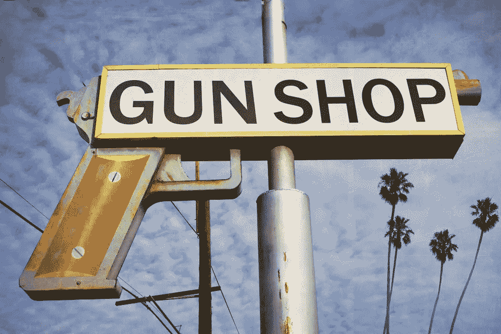

# 区块链会阻止未来的枪支暴力吗？这取决于我们

> 原文：<https://medium.com/hackernoon/will-blockchain-prevent-future-gun-violence-its-up-to-us-c3214197b4c1>

在佛罗里达州帕克兰最近发生的事件之后，我感到有必要站出来说话——不仅仅是作为一个技术专家，甚至不是作为一个美国人，而是作为一个人。

因为，坦率地说，我们都同意这不仅仅是“最近的事件”

> 过去 10 年，美国的枪支暴力一直是“近期事件”。

早在 11 月，在得克萨斯州萨瑟兰的一座教堂发生大规模枪击事件，造成 26 人死亡，20 人受伤之后，我[写了一篇文章](https://hackernoon.com/how-we-might-see-blockchain-used-to-improve-public-safety-632c4856addb)，讨论我们如何利用[区块链](https://hackernoon.com/tagged/blockchain)来改善公共安全。关于这项新的[技术](https://hackernoon.com/tagged/technology)如何帮助我们追踪武器、采购和执行法规，我给出了一些不切实际的想法。

在又一次大规模枪击事件后，我又来了，写关于“如何利用区块链防止枪支暴力”的文章

好像单靠一项技术就能遏制这个国家猖獗的校园枪击案和警察大屠杀，这是一个更大的社会政治衰退和我们民主的黄昏的地方病。

# **现实中，技术只是工具。**

如果我们不进行任何社会政治、文化或监管方面的变革，这不是一个全能的救世主，可以消除我们的问题。

> 如果我们继续忽视眼前的重大问题，就很容易认为区块链会力挽狂澜。

但是我们倾向于(在政治、科技、生活中)用有限的语言和极端的术语来谈论枪支管制等问题。这就是为什么我们需要清晰的、基于问题的术语，以便提出各种可能的解决方案。

关于如何利用区块链追踪枪支以及所有相关的规定，有很多想法在流传。与比特币类似，你可以让匿名用户用钱包来追踪实物:枪支和弹药。使用智能合同，您可以进行背景调查，并验证许可证、健康记录和任何与拥有枪支的要求相关的证明。这些记录和认证可以根据枪支类型和州进行定制。

## 而且手头还有更多[切实可行的解决方案](https://www.nytimes.com/interactive/2017/10/05/upshot/how-to-reduce-mass-shooting-deaths-experts-say-these-gun-laws-could-help.html)。

## **背景调查**

实施普遍的背景调查是枪支改革中最受欢迎的想法之一，无论是专家还是普通公民。

目前，要求普遍背景调查的法案正在参议院搁置。如果它们被签署成为法律，区块链肯定可以帮助促进背景调查的无缝过程——同时帮助各州和零售商共享这些数据，或者相反，帮助个人保持这些数据的匿名性。

## **追踪枪**

最初，追踪枪支似乎是为区块链量身定制的解决方案。但是，在枪支上放置标识符并不能阻止不良行为者移除、复制它们，或者找到其他方法如“[幽灵枪](https://www.wired.com/2015/06/i-made-an-untraceable-ar-15-ghost-gun/)”来停止追踪。

> 当然，全国已经有数百万件武器在流通。在许多州，私人枪支交易甚至不需要许可证。

那么，我们如何确保每个人都参与进来呢？尤其是在没有任何联邦或州法律要求他们这样做的情况下。更重要的是，我们如何确保保护隐私？

使用一种称为 zk-SNARK 的特殊零知识证明加密技术，可以将数据(如枪支所有权记录)注册到区块链，而不会牺牲隐私并保持这些记录的详细信息(数量或所有者)匿名。

## **跟踪或限制枪支和弹药的购买**

解决方案可以是追踪枪支和弹药的购买，这稍微简单一些。它没有解决大量枪支已经在流通的问题，但是枪支的销售点信息可以很容易地在区块链上注册。所有信息都将集中在一个地方，供相关方访问。

## **建筑联合体**

最近，纽约、新泽西、康涅狄格和罗德岛联合起来成立了一个类似于枪支改革联盟的组织。这些州互相共享数据，努力遏制枪支暴力。

组建财团是区块链最有价值的案例之一。这是一种简化的方式，便于跨州共享数据，以及跟踪武器或销售的移动，而不会泄露太多或任何关于零售商或枪支拥有者的数据。

## **交叉引用健康记录**

近年来，让枪支远离被认为精神不适合拥有武器的人已经成为一个突出的问题。

患者记录受到许多法律的保护，但是许多公司已经在致力于创建符合 HIPAA 的区块链网络来存储患者的医疗记录。

一旦发生这种情况，这些记录就可以和区块链的枪支拥有者相互参照。这将为各州和零售商提供关于试图购买枪支的个人心理健康的准确数据。

## **攻击性武器禁令**

在许多情况下，我们可以通过全面禁止跳过上述提案的复杂扭曲——就像在 [AR-15s](https://www.facebook.com/gtsiegel/posts/10210534336849841) 和其他突击步枪的情况下。那些是战争武器，它们不是为其他东西设计的。

# **归根结底，预防取决于使用该技术的人。**

所有这些解决方案都以这样或那样的方式遭到一些美国人的反对——甚至是许多美国人的反对。他们都提出了关于隐私和宪法权利的问题。

> 这就是为什么记住技术本身不是答案是如此重要。

接下来会发生什么取决于我们。这取决于我们如何选择使用我们所掌握的数据。

这些类型的问题不仅仅需要一个解决方案。这个谜题有很多很多部分。技术进步、立法以及社会文化环境和民众的变化都发挥了作用。

我们需要一个由联邦和州立法者、普通公民、零售商和枪支制造商组成的团体，一个能够致力于实施真正的解决方案而不回避问题根源的团体。

# 我们需要向预防转变。

如果我们关注这个国家的枪支改革，那么有理由猜测区块链可能在帮助防止枪支暴力方面发挥了一小部分作用。

但我们必须记住，这不仅仅是追踪枪支。这不是背景调查或许可。

> 这是一个真正的社会政治、文化和监管模式的转变。这是关于唤醒地狱。

区块链是我们作为一个国家需要建立的工具箱中的一个工具。这项技术代表了一场运动——从集中到分散，从现有权力到共享权力，从垄断到合作的转变。

> 未来已经到来，是时候集体解决问题，在未铺设的道路上立法了。

基于过去的失败找借口不再是一种选择。我们现在已经拥有了讨论、立法和实施现实枪支改革所需的所有工具。

**感谢阅读！**

**关注我的** [**推特**](https://twitter.com/iamSamsterdam) **和** [**Quora**](https://www.quora.com/profile/Samantha-Radocchia) **了解更多关于区块链技术的见解。**