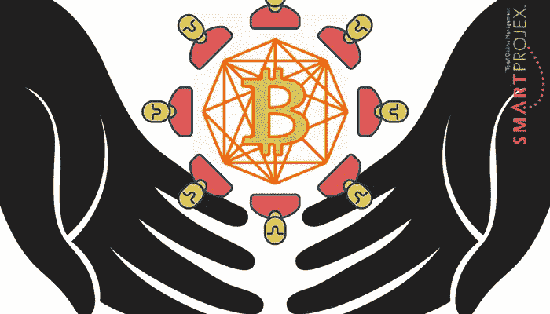

# 区块链技术会对人道主义援助项目有帮助吗？

> 原文：<https://medium.com/hackernoon/will-blockchain-technology-help-humanitarian-aid-projects-b8171b25bcc0>

人道主义援助项目这个词在某些情况下可能有非常具体的含义，而在另一些情况下听起来非常模糊。在这方面，我使用人道主义援助项目一词来指大规模的、往往是全球性的改善人类困境的努力。它们可能是政府运作的项目，比如联邦应急管理局的飓风救援工作。或者，它们可能由世界各地的非政府组织或慈善机构经营。开展人道主义援助工作的大型组织包括世界粮食计划署、T2 红十字会与红新月会国际联合会、T4 博尔根项目等等。

在这篇博客中，我解释了与人道主义援助项目相关的额外挑战，并概述了区块链和 Smart Projex 方法可能有所帮助的几种方式。本博客中讨论的许多观点可以应用于各种大型项目。

# 人道主义援助项目有什么不同吗？

与其说有什么具体的东西使人道主义援助项目不同于其他项目。这是因为它们与其他类型的项目有着共同的特征，有些人认为它们彼此之间有很大的不同。

虽然不同类型的项目在相似性上有一些交叉，但我发现了五种特殊的和独特的项目，每一种都包含它们自己独特的特征。人道主义援助项目实际上分享了所有这些独特的特征——使它们特别具有挑战性，并且适合区块链解决方案。

## 比如法律项目

管理法律事务(项目)的人有时会注意到这些项目中有额外的负担。另一方正在花时间试图破坏你的努力。人道主义援助项目可以分享这一特点。也许在你试图提供援助的国家正在进行一场战争。或者，不充分的基础设施、资源或教育系统会对您的项目工作产生不利影响。

## 比如非营利项目

人道主义援助项目可能涉及大量志愿者。志愿者带着不同的心态和不同的需求进入项目。他们中的许多人有其他工作，并且正在做这项工作，因为他们对这项事业充满热情。他们可能不会像在你办公室里，在你楼下工作时那样有规律地回复邮件。他们的工作没有报酬，因此，对于项目经理来说，几乎没有能力强迫完成任何事情。这是关于你的说服能力。

你可能有技术上有挑战的志愿者。这意味着任何针对人道主义援助项目的区块链解决方案都必须有一个极其简单的界面。它可能需要移动，或者至少它的一部分需要在手机上工作。人们会进进出出，不太可能接受你的软件培训。这与商业项目不同，在商业项目中，公司规定其团队将使用特定类型的软件，因此，学习它的动力更大。

## 比如科技项目

在[科技](https://hackernoon.com/tagged/technology)的世界里，情况瞬息万变。项目需求通常是未知的，并且随着项目的进展而发展。提前几个月对项目进行规划通常是浪费时间。因此，需要一种敏捷的方法。

## 比如建筑项目

通常需要在特定时间将物资(或人员)运送到特定地点。需要下单。日期需要最后确定。可能需要许可证。然而，在一个敏捷的世界里，我们如何做到这一点呢？

正如在一个建筑项目中可能有外包工作，有许多分包商，都有不同的需求和要求，人道主义援助项目通常可以是与多个组织，甚至其他政府的合作。

它们可能不都使用相同的技术。可能有多个项目经理在分担这项工作。

## 比如组织变革项目

有些心灵和思想需要改变。你不能简单地宣布某事正在改变。你需要建立联盟并测试想法。你需要说服力。因此，项目管理部分需要一种不同的方式，就像已经承担的推动重大组织变革的项目一样。

# 我们能在不同的党派之间建立信任吗？

我写了几篇关于 Smart Projex 如何在不同的利益相关者群体中建立信任的博客。正如我在 [one](http://www.smartprojex.com/blockchain-technology-improve-project-stakeholder-management/) 中所说，不同的用户需要不同的数据。挑战的一部分是确定整个项目所需的透明度水平。在人道主义援助项目中，还有一个额外的复杂因素，即战争可能正在进行。对饱受战争摧残的公司建立信任是很困难的。

理解谁有权使用哪些数据比乍看起来要复杂得多。在某些情况下，完全透明是一种选择，但如果你在多个处于战争状态的国家工作，这真的是一种选择吗？

志愿者需要的数据和高管需要的数据完全不同。因此，它可能是关于用户界面的，也可能是关于透明性的复杂问题。然而，在隐私和透明度之间取得平衡是至关重要的。对于正在接受帮助的受害者来说也是如此，他们中的许多人没有能力为自己辩护，或者使用目前参与比特币或替代比特币世界的人所需要的大部分技术。

一些项目管理专家认为，区块链是建立信任的终极工具。原因是它提供了一个框架，该框架提供了对以前的事务的验证，这为已经发生的事情创建了不可变的证据。尽管有一些限制，与项目相关的广泛的人员网络可以很容易地识别实际发生了什么，以及还有什么。我们将不再需要依赖对剩余工作量的估计。

# 区块链能为供应链提供什么？

一些专家认为，区块链可能会彻底改变供应链世界。使用智能合同，当合同条款得到满足时，可以通过电子方式启动产品移动。它透明、安全、可追踪。交易链是永久的。

人道主义援助项目经常涉及大量物资的运输。可能涉及多个实体。区块链会告诉我们到底做了什么，没做什么。

正如我在另一篇关于[区块链如何提高项目成功率](http://www.smartprojex.com/could-blockchain-technology-improve-project-success/)的博客中所建议的，就目前而言，我们应该在付款之前对所有完成的智能合同进行人工审计。与加密货币世界不同，这不仅仅是转移资金。在根据智能合同进行支付之前，通常需要由人工执行一些服务。

# 资金管理更重要吗？

密切监督成本的需要因项目而异。一些组织和/或客户比其他人更关心如何控制成本。一些项目从一开始就有更清晰的需求，因此，项目预算更容易估计。和许多其他非营利项目一样，人道主义援助项目通常依赖慈善捐赠。因此，有必要对捐助者负责。

根据组织的不同，也可能有管理项目收入的强烈需求，这通常不被认为是项目管理的重要部分。

然而，在大多数情况下，需要确保项目成本(和收入，也许)按照管理层和/或客户的期望进行管理。因此，例如，在适当的基础工作完成之后，尼日利亚所需的 50 万美元破伤风疫苗付款必须在适当的时间送到适当的人手中。此外，项目管理部分可能包括确保收到收入并正确记入贷方。项目时间表很少与财政年度重叠，当涉及多个组织、货币、语言和文化时，情况会变得越来越复杂。

因此，区块链框架可以在透明度和隐私之间提供平衡，同时兼顾责任和安全。这对项目财务会计至关重要。

如果你对区块链和项目管理的交集感兴趣，我很乐意和你聊聊。我正处于 Smart Projex 的十字路口，正在评估我的下一步计划。你呢？点击此处通过 LinkedIn [与我联系，或者安排一次通话。也许我会在即将发布的博客或白皮书中介绍你如何做到这一点。](https://www.linkedin.com/in/suzannesdavenport/)

在阅读这八课的电子书课程时，您将学习如何建立项目管理流程，引导您的团队走向成功。

[**即时下载**](https://smartprojex.com/cart/?add-to-cart=5555) **>**