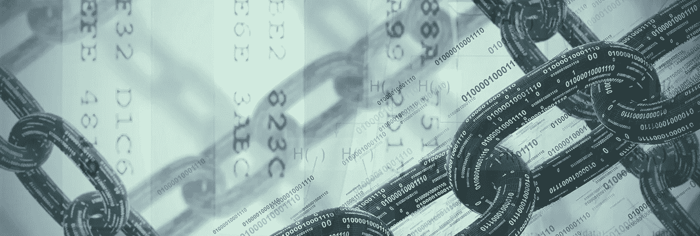

# Crypto 会(再次)崩溃吗？

> 原文：<https://medium.com/hackernoon/will-crypto-crash-again-f5205ff483cf>

比特币和更广泛的加密市场会(再次)崩溃吗？还是撞得更远？我认为开始思考这个问题的地方是为什么加密市场首先如此不稳定？或许更重要的是，波动是一件坏事吗？

我认为密码市场的波动有几个原因。我们将从最明显的开始，然后从最不明显的开始。

## 1.缺乏一致同意的估价方法

买股票就是买一个公司未来收益的一部分。股票分析师都同意，贴现现金流分析是评估企业股权的适当方法，即使他们不同意模型中应包含哪些因素。

在加密领域，没有一致认可的估值方法，而且确实存在的估值模型很可能是[误导性的，如果不是完全错误的话](https://buff.ly/2M86w4i)。因此，与其他市场相比，价格更受情绪驱动，积极情绪推动价格上涨的力度更大，消极情绪推动价格下跌的力度更大。没有像[市盈率](https://www.investopedia.com/terms/p/price-earningsratio.asp)这样的基准来约束这些变动。

更复杂的是，与美国股票等市场相比，加密市场更多的是由经验较少的散户投资者组成，他们更有可能做出情绪化的决定——在底部卖出，在顶部买入。

## 2.鲸鱼“泼水”

因为与其他资产相比，许多加密资产的所有权分布非常集中，所以大型个人持有者(所谓的鲸鱼)更容易通过大量购买或出售来推动市场——“挥霍”

过去，我们已经看到这种波动加剧了波动。例如， [Mt. Gox 受托人出售价值 4 亿美元的比特币](https://www.coindesk.com/mt-gox-trustee-sells-400-million-bitcoin-bitcoin-cash/)。或者，当已经成为比特币现金支持者的早期比特币持有者在 2017 年 11 月出售大量比特币，试图引起“翻转”并超越比特币时。

鲸鱼狂欢的一个分支是臭名昭著的“抽水转储”团体，一群鲸鱼协调起来哄抬某个代币的价格，导致其他投资者从 FOMO 涌入，然后高价卖出，压榨不老练的投机者。

## 3.流动性(或缺乏流动性)

与美国股票等传统市场相比，大多数加密市场都非常肤浅。尽管 2017 年取得了巨大的增长，但加密市场的总市值仍高达数千亿美元，相当于标准普尔 500 一家公司的规模，远小于 S&P 的整体规模(23 万亿美元)。

加密市场的实际日交易量也可能比目前的估计要小得多。有证据表明，一些主要的集中交易所可能在交易量统计上撒谎。对其他人来说，有[的手段、动机和机会](https://en.wikipedia.org/wiki/Means,_motive,_and_opportunity)，尽管没有确凿的证据存在。

我们知道，分散交易所的交易量是合法的(尽管规模很小，而且即便如此，也可能存在虚假交易来夸大交易量统计数据)。受监管的交易所(GDAX、北海巨妖、Gemini)的交易量可能是真实的，但交易所报告的其余交易量充其量是令人怀疑的。

结果是大量的滑点和波动，即使交易量相对较小。根据[的一项研究](/@sylvainartplayribes/chasing-fake-volume-a-crypto-plague-ea1a3c1e0b5e)，“像 NEO 和 IOTA 这样市值超过 30 亿美元的主要加密货币的交易对，仅仅是 5 万美元的销售就可能下跌超过 10%。”

密码市场如此不稳定的前三个原因应该会随着时间的推移而改善。更好的估值模型将被开发出来，代币发行将变得不那么集中，随着空间市值的增长，流动性将得到改善。

## 4.程序化供应

比特币和加密市场的波动性更普遍地是由加密资产的供应(以及货币政策)是由程序决定的这一事实造成的。

对于任何一种典型的商品来说，需求的变化都会引起产量的变化。

如果你种植鳄梨，鳄梨的价格上涨了 100%，你(或其他人)会在下一季种植更多的鳄梨，从而压低价格。

如果供给随着需求而增加和减少，价格的变化将会温和得多。

相比之下，像大多数加密货币一样，供应计划是通过编程确定的，没有生产者能够对价格变化做出反应。

因为供应时间表是固定的，更多的需求会导致更高的价格。

*如果您正在寻找更多关于区块链和商业加密货币的信息，* [***单击此处访问我的个人资源列表***](http://bit.ly/2KqvNXr) *，在这里我可以找到最好、最可靠的信息。*

## 5.“波动性债务”的终结

加密市场波动最有趣的原因是加密货币更加分散和无需许可的性质。

当人类中央计划者设计系统时，他们的目标之一往往是保持低波动性。

人们喜欢稳定而不是波动。当你醒来之前，你的净资产可能会下降 10%，或者你的工作明天可能会消失，或者你唯一的食物来源可能会消失，你晚上很难入睡。

然而，在一个系统的复杂性和它的波动性之间有一个不可避免的关系。

从历史上看，我们的世界远没有今天这样紧密相连，因此也比今天简单。这意味着潜在的波动性较小

与拥有原子弹、化学武器或网络攻击能力的现代恐怖分子相比，一个手持长矛的穴居人造成的伤害相对较小。

另一方面，今天给予个人的帮助他人的杠杆比以往任何时候都大。比尔和梅林达盖茨挽救了[数百万人的生命](https://www.theguardian.com/world/2017/feb/14/bill-gates-philanthropy-warren-buffett-vaccines-infant-mortality)，这在 20 世纪之前是根本不可能的壮举。从来没有一个实体有这么大的影响力。

金融系统也不例外。与过去的金融系统相比，现代金融系统高度复杂且相互关联。

从[现代复杂性科学研究](https://taylorpearson.me/complexity-science/)中得到的一个教训是，如果不调整系统的复杂程度，你就无法控制系统内的波动性。你只能控制波动性随着时间的推移是如何表现的。

降低现代金融体系复杂性的一个方法是消除或更严格地限制衍生品和杠杆。我们在 2008 年看到的那种波动只有在大量杠杆和大量衍生品的情况下才有可能出现。这方面的几个例子是:

*   导致金融危机的 CDO(债务抵押债券)包含衍生品:一揽子债券、一揽子债券内、一揽子债券内。
*   CDS(信用违约互换)意味着，可能会发行 1 亿美元的未偿债券，但有 15 亿美元的 CDS 被卖出或买入。一项资产的衍生品市场规模是基础资产的许多倍。

政策制定者的一个选择是限制杠杆和衍生品交易的水平，但金融机构强烈反对这种类型的监管，因为这将切断一个巨大的利润来源。

因此，政策制定者的任务变成了，“我们如何在不降低系统复杂性的情况下保持低波动性？”

正确答案是:不能。然而，这并不能阻止他们去尝试。

当政策市场试图以某种方式设计系统，以保持低波动性，而实际上不会降低系统的复杂性时，他们真正做的只是推迟波动性。

他们正在承担“波动性债务”:用今天的波动性换取明天的波动性。你也可以称之为“终止波动”或“终止风险”

安然、世通和 CDO 的倒闭引起了波动，因为现实被隐藏和扭曲了。不可避免地，这种错误的看法浮出了水面，而且因为有如此多的额外杠杆堆积其上，崩溃的程度要严重得多。

该计划持续的时间越长，债务的波动性就越大，因为更多的决策是基于对现实的错误理解而做出的。

承担波动性债务是有问题的，因为负波动性造成的损害是不对称的。

我喜欢用的类比是比较三个具有等量“波动性”的场景。

1.  从 1 英尺高的墙上跳下 100 次
2.  从 10 英尺高的地方跳下来。墙 10 次
3.  从 100 英尺的高空跳下。墙壁 1 次

如果你从 1 英尺高的地方跳下来。墙一百遍，没什么大不了的。几乎任何健全的成年人都能做到这一点。

如果你从 10 英尺高的地方跳下来。墙十次，压力更大。即使你身材很好，你的膝盖可能会酸痛，但你几乎肯定不会死。

如果你从 100 英尺的高空跳下。墙一次，你就不会再从上面跳下去了。

一个系统中的许多小崩溃可以保持它的健康。为了向其他欧洲贵族解释美国的民主，亚历西斯·德·托克维尔在 1840 年写道，选举是迷你革命。民主没有让紧张局势累积数十年，并以暴力革命告终，而是以选举的形式创造了一个天然的释放阀。

> "在美国，以法律的名义每四年进行一次革命."

通过延缓波动，政府更有可能以暴力革命而非和平转型告终。

同样，推迟金融市场的波动会导致连锁效应，最终导致更糟糕的后果。

比特币的起源根植于对现代金融市场的这种理解。在比特币的[创世纪区块](https://en.bitcoin.it/wiki/Genesis_block)中，中本聪嵌入了:

> *《泰晤士报》2009 年 1 月 3 日财政大臣濒临第二轮银行救助*

这一评论反映了 Satoshi 的信念，即 2008 年全球金融危机相当于从 10 英尺高的地方跳下来。墙，只能通过承担更多波动性债务来拯救。让系统放松会很痛苦，但可能不是致命的。下一次 100 英尺的时候呢。墙？我认为 Satoshi 想让比特币成为一种逃避这种命运的方式。

加密市场的波动性导致投资者更频繁地被抛出小墙。由于投资者不断被抛出，他们没有时间积累波动性债务。

这对投资者来说是好事，因为它鼓励谨慎。从 10 英尺高的地方摔下来。墙提醒你要小心，但不会杀了你。通常，投资者开始在他们不了解的东西上投入少量资金。

即使有人在 12 月份市场顶部买入，只要他们只投入净资产值的 1%或 2%左右，也没什么大不了的。

你投资组合的 2%损失 70%就是你总投资组合的 1.4%，这是非常可控的。

相比之下，在 2008 年，将退休投资组合的一半投资于“波动性非常低”的房地产市场充满了影子风险:低波动性被视为安全的标志，而不是波动性正在系统中累积的警告信号。

或者就像马克·吐温说的那样，“伤害你的不是你不知道的事，而是你确定知道的事，但事实并非如此。”

人们不再担心加密市场的波动性增加或受到抑制，从长远来看，我认为这将是一件好事。

*泰勒·皮尔森是《T3[*乔布斯的终结*](http://theendofjobsbook.com/) *的作者，并在*[*Taylor Pearson . me*](http://taylorpearson.me/)*撰写关于创业、历史、复杂性和区块链技术的文章。* [*报名领取他的人气简讯*](https://taylorpearson.me/newsletter/) *。**

*如果您正在寻找更多关于区块链和商业加密货币的信息，* [***单击此处访问我的个人资源列表***](http://bit.ly/2KqvNXr) *，在这里我可以找到最好、最可靠的信息。*