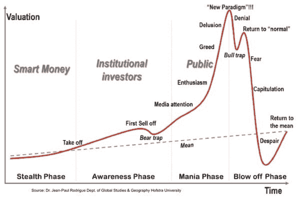

# 加密货币价格会恢复吗？

> 原文：<https://medium.com/hackernoon/will-cryptocurrency-prices-recover-e87b52b00176>

## 今年，大多数隐名犯罪都遭受了打击，但这可能不是终结

自比特币诞生以来，加密货币市场经历了许多阶段，一路走来充满坎坷。

我们现在经历的事情以前已经发生过了。我们可以将比特币视为加密货币市场运作的一个例子。

**隐身阶段** —聪明钱/原始信徒

2007 年——比特币是由“中本聪”创造的，关于他或他们可能是谁或者他们/他是否还活着有很多传言，然而这个故事是另一个时间。

2008 年 11 月—比特币白皮书发布

2009 年——中本聪和哈尔·芬尼之间的首次比特币交易完成。比特币诞生了。

比特币在这个时候几乎不值钱，直到 2010 年 3 月，比特币的价格甚至达到了 0.003 美元，不到 1 美分。

**认知阶段** —机构投资者

2011 年——人们开始听说比特币，因为比特币是开源的，新的加密货币开始出现，第一批替代货币诞生了。

维基解密开始要求比特币捐款，其他一些组织也开始接受比特币。

丝绸之路市场启动。

Vitalik Buterin(以太坊创始人)共同创办了《比特币》杂志。

有史以来最大的“比特币泡沫”发生在这一时期，比特币在 2 月份从 0.30 美元增长到 1 美元，然后在 6 月份飙升到 10 美元。接下来，比特币**在不到一周**的时间里翻了三倍，达到 30 美元。

在此期间，比特币的价格增长了 100 多倍。

狂热&爆发阶段——公众参与

**2011**——在第一个狂热阶段，比特币从 30 美分涨到 30 美元，然后跌至 5 美元，反弹至 20 美元，最后跌至 5 美元。

**2013**——比特币起价 15 美元，到 3 月中旬涨到 50 美元，大约 2 周后一个比特币价值 100 美元。不到两周，比特币又涨到了 230 美元。

第二天，比特币跌至 160 美元，一周后跌至 70 美元，随后反弹至 100 美元。

**2013 年(第二部分)** —比特币在 11 月涨到 250 美元，价格**在一个月内翻了两番**，达到 1100 美元。比特币后来稳定在 70 美元。

**2017–2018**—到 6 月，比特币从 900 美元涨到 2700 美元。比特币随后在 8 月中旬再次增长到 4300 美元，并继续增长到 20000 美元，一路上有几次下跌。

比特币在 2018 年初开始下跌，跌到 15000 美元，然后是 11000 美元，8000 美元，现在是 6200 美元。

**最终想法**

很明显，我们正在经历另一个井喷阶段，我们已经在 2 月份从 8000 美元反弹到 11000 美元，在 4 月份又从 6800 美元反弹到 9200 美元。

加密货币市场肯定有复苏的机会，如果你看看大多数加密货币的历史价格图表，你可以看到在大幅回调后的大幅上涨趋势。

每个人都喜欢在价格上涨时买入，但这并不总是最好的时机，你可以通过在低迷时期买入获得更多利润。

传统投资者称之为熊市，但机会主义投资者认为这是打折季。

最后，我想引用美国股市传奇投资者彼得·林奇的一句话。

> “会有衰退，会有市场下跌。如果你不明白这种情况会发生，那么你还没有准备好，你不会在市场上做得很好。”—彼得·林奇

## 我希望你喜欢我的故事，请随意查看下面这些有用的资源:

您可以在世界任何地方使用**购买比特币、以太坊、Ripple、比特币现金、Dash、比特币黄金、恒星流明等等**

**您可以在欧洲任何地方使用 [**BitPanda**](https://www.bitpanda.com/?ref=3127933809251797450) 购买比特币、以太坊、IOTA、OmiseGo、EOS、比特币现金、莱特币等。**

**可以跟上我上 [**推特**](https://twitter.com/CryptoniteTweet) 和****中** **。******