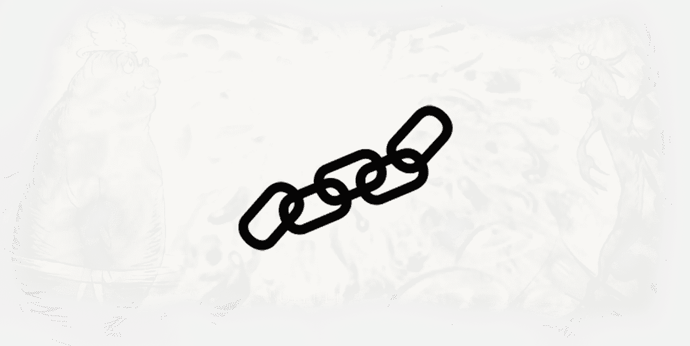
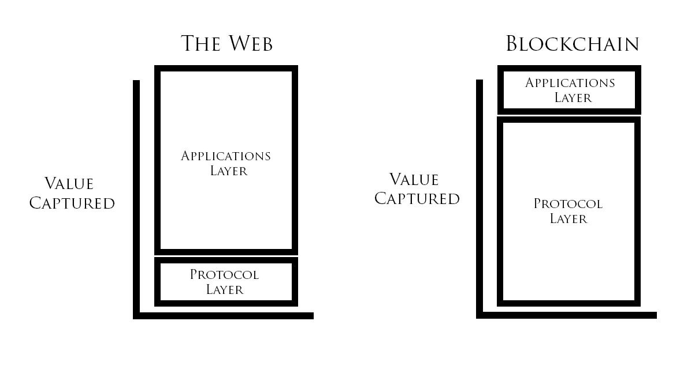
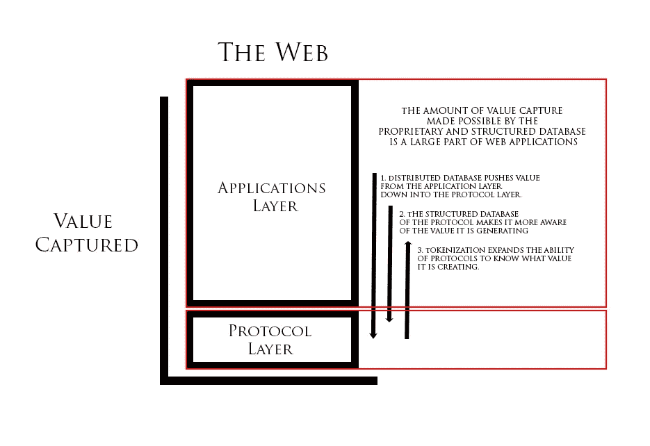
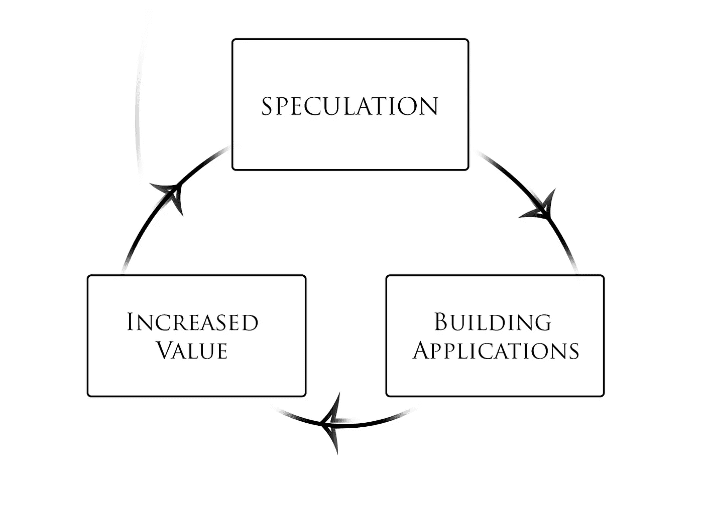
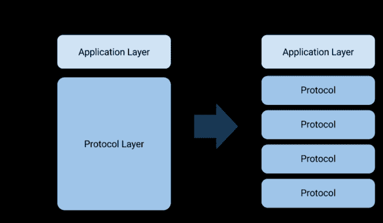
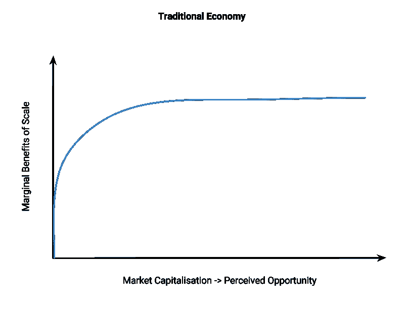
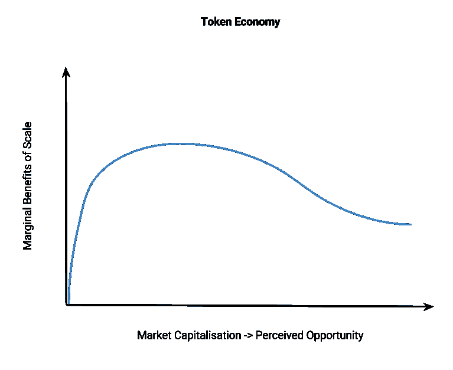

# 加密货币协议会胖还是会瘦？

> 原文：<https://medium.com/hackernoon/will-cryptocurrency-protocols-be-fat-or-thin-36584863b0f8>

> 有的比较瘦。有些人很胖。胖的那个有一顶黄色的帽子
> 。
> **苏斯博士——一条鱼，两条鱼，红色的鱼，蓝色的鱼**

Joel Monegro 的 [fat 协议论文](http://www.usv.com/blog/fat-protocols)是理解加密货币的[最重要的观点之一。](https://taylorpearson.me/crypto/)

这篇发表于 2014 年的论文指出，在网络上，价值积累到应用程序层:像脸书、谷歌和亚马逊这样的公司。

虽然 SMTP、TCP/IP 和 HTTP 等共享协议提供了巨大的价值，但它们没有任何方法来获取这种价值。

这就像 SMTP(电子邮件传输协议)的创造者比谷歌的创始人更富有一样。

让我们来看看。

到目前为止，这似乎是真的。迄今为止，价值似乎更多地来自加密货币协议层:比特币和以太坊。

然而，许多其他分析师断言，fat 协议的论点被误解了，缺乏细微差别，或者根本就是错误的。

# 加密货币协议为何如此重要

有三个理由可以相信加密货币协议将会很大。

一个是在区块链堆栈中，数据存储在区块链上，这是一个分布式数据库，每个人都可以持有一份副本，而不是应用程序层的孤岛式围墙花园，数据在 web 上积累。

大多数软件公司的核心竞争优势是他们的数据库，这就是为什么像亚马逊、脸书和谷歌这样的公司如此严密地保护他们的数据。区块链消除了这种竞争优势，将更多的价值捕获向下推至协议栈的协议层。

举个例子，考虑一下社交网络与脸书竞争有多难。为什么用户会切换到一个新的应用程序，这是一个鬼城？

相比之下，在不同的加密货币交易所之间切换很容易。他们都可以访问相同的底层区块链。如果脸书的数据在一个公共的区块链上，那么划分区块链和创建一个竞争性的社交网络就容易多了。

第二，加密货币协议比它们的 web 对应物具有更高的应用层意识，因为它们的结构化程度更高。SMTP，即瘦互联网协议，是高度非结构化的，因此对它的使用方式知之甚少。

例如，当您通过电子邮件发送发票时，电子邮件可以按照您喜欢的任意方式进行组织或格式化，只要电子邮件的接收者能够理解您的特定格式。

Paypal 等公司在应用层构建数据，然后通过对他们提供的价值收取费用来提取价值。

但是，因为 SMTP 是一个无感知的协议，所以您可以这样来组织发票:

"用现金邮寄到 123 Alphabet Blvd. Aliceton，KY 12345 . "

大多数人更喜欢 Paypal，因为它收取的费用是值得的，相对于邮寄现金而言，它速度更快，风险更低，给人的印象更专业，但协议的非结构化性质允许这两种情况。

使用 fat 协议，网络知道发票的重要细节，如金额、到期日和收件人。然后，网络可以采取适当的行动，如发送提醒、借记账户和将交易记录到相关的分类账中——这些行动是为网络上的应用程序保留的。

因为加密货币协议更了解正在发生什么，参与方是谁，以及经济状况是什么，所以它更能够为所创造的价值收费。

第三个相信协议会变得很胖的原因是，企业家有更大的动力来建立这些协议，因为他们能够创建令牌，这可以让他们随着协议使用的增加而获得一些价值。

虽然今天的大部分市值都是猜测，但最终去中心化的应用程序将需要使用以太坊或 NEO 等网络来获得计算能力，使用 Filecoin、Sia 或 STORJ 来获得存储。这种用法会增加创始团队所持代币的价值。

相比之下，在网络上，像 SMTP 这样的协议的创造者没有直接获得任何价值。

虽然这是长期推动肥胖协议的三个基本力量，但现在还有另一个短期动力在发挥作用。

随着令牌价值的增加，如比特币和以太坊在过去一年中的增长，它吸引了购买令牌的投机者、开发者和企业家，并成为对协议本身进行财务投资的利益相关者。然后，他们开始在网络上构建应用程序。

当应用程序开始显示出成功的早期迹象时，新用户就会被吸引到该协议，从而增加了对令牌的需求。与此同时，目前的代币持有者持有代币，预计它们的价格会进一步上涨。

这又带来了一波新的投机者，这个过程又开始了。

这种动态很重要，因为至少在短期内:

> “协议的市场价值总是比构建在其上的应用的总价值增长得更快，因为应用层的成功推动了协议层的进一步投机。”

这一点我们在比特币身上看得很清楚。2017 年 8 月，最大的比特币应用比特币基地[以 16 亿美元的估值融资 1 亿美元](https://techcrunch.com/2017/08/10/coinbase-raises-100m-at-a-1-6b-valuation-amid-explosive-growth/)。与此同时，比特币协议的价值为[735 亿美元](https://www.cnbc.com/2017/08/15/bitcoin-price-market-cap.html)。

许多人从投资角度得出的结论是，加密货币投资者应该更关注协议层，而不是应用层。

他们认为，通过购买底层产品，他们正在对构建在顶层的所有产品进行多元化投资。不管是比特币基地还是其他交易所成为最大的参与者，他们都会受益。

然而，这忽略了区块链和 web 堆栈之间的另一个重要区别:与 web 应用程序不同，协议是可以分叉的。

## 对加密货币和区块链感兴趣吗？

[***把你的电子邮件放在这里***](http://taylorpearson.me/newsletter) ***来注册我的简讯，获取最新更新。***

# 加密货币协议如何以及为什么可能是单薄的

如果你不喜欢协议的工作方式，你可以放弃它。比特币现金和以太坊经典是很多的第一个。

分叉意味着整个协议，包括数据库，可以被任何人复制。这就创造了一个更具竞争性的市场，降低了进入壁垒。

因为分叉，任何开发区块链协议的人的动机都是建立一个以最低成本提供服务的协议。如果他们不这样做，有人可以叉它和削弱他们。

这意味着随着协议变得越来越庞大，它越来越有可能被分成子协议，以更有效的方式提供部分功能。

例如，如果一个分散的文件存储协议变得很大，它可以被分叉成一个新的协议，专门用于特定类型的文件存储(比如说，按行业)，这将能够以“我们与那些家伙完全一样(我们实际上复制了他们的产品)，除了更便宜和更好地适合您的行业用例”的价值主张推出

最终结果很可能是区块链协议栈的每一层都有大量相互竞争的协议。

这在 web 的应用程序层是不可能的。你不能叉脸书和优化发现最好的长篇文章，而不是婴儿照片和愤怒。

因此，尽管协议层作为一个整体可能很厚，但由于分叉和市场竞争，单个协议最终可能会很薄。

Img Credit: [Thin Protocols](https://blog.zeppelin.solutions/thin-protocols-cc872258379f)

你可能会说，这并没有改变 fat 协议的投资理念，因为通过投资基础级协议，你也可以接触到所有的分支。

然而，还有一种更传统的“分叉”，新一代公司从过去的失败中吸取教训。

谷歌没有放弃 AltaVista，但他们能够从失败中吸取教训，最终在他们的成功中发挥了重要作用。脸书和 Myspace 以及其他许多网站也是如此。

以太坊不是比特币的正式分支，但显然融入了比特币的很多成分。

Monero 和 ZCash 也不是比特币的正式分支，但可以被有效地描述为“像比特币一样，但具有更好的隐私和匿名性。”

加密货币行业的开源特性让这变得更加容易。将这一点与互操作性结合起来，从投资的角度来看，您可以看到 fat 协议的论点可能会在哪里失败。

以前使用比特币但更喜欢 Monero 提供的隐私的应用程序可以迁移过来，拥有比特币不会让你暴露该应用程序正在创造的任何价值。

因此，虽然加密货币协议作为一个整体将会很胖，但单个协议的胖似乎与它们创造的价值高度相关，这与今天的 web 应用程序没有什么不同。

关于这种胖/瘦的动态，(至少)有两个重要的含义我一直在思考。

**脂肪与脂肪对比动态的来源和进一步阅读**

*   [加密令牌和即将到来的协议创新时代](http://continuations.com/post/148098927445/crypto-tokens-and-the-coming-age-of-protocol)
*   [比特币作为协议](https://www.usv.com/blog/bitcoin-as-protocol)
*   [阐明区块链的基础创新](http://continuations.com/post/105272022635/bitcoin-clarifying-the-foundational-innovation-of)
*   [区块链应用栈](http://joel.mn/post/103546215249/the-blockchain-application-stack)
*   [区块链的共享数据层](http://joel.mn/post/104755282493/the-shared-data-layer-of-the-blockchain)
*   [Fat 协议](http://www.usv.com/blog/fat-protocols)
*   [精简协议](https://blog.zeppelin.solutions/thin-protocols-cc872258379f)
*   [没有所谓的“Fat 协议”](https://www.evanvanness.com/post/166666272011/theres-no-such-thing-as-fat-protocols/amp)
*   [Fat 协议不是投资论文](https://blog.coinfund.io/fat-protocols-are-not-an-investment-thesis-17c8837c2734)

# 含义 1:护城河和垄断的终结

在传统经济中，规模的边际效益是有弹性的。一旦你达到一定规模，其他公司就很难与你竞争。

*Img Credit:* [*Thin Protocols*](https://blog.zeppelin.solutions/thin-protocols-cc872258379f)

这种优势被沃伦·巴菲特概念化为护城河。传统企业能够建造大型护城河，这使得它们可以防御，很难在竞争中胜出。

基于网络效应的企业——如脸书——有特别大的护城河。使用脸书的人越多，它的护城河就变得越大。

即使当公司不再创造更多的附加价值，进入后期的[摇钱树](https://www.smartinsights.com/marketing-planning/marketing-models/use-bcg-matrix/)模式，它的护城河也让其他公司难以竞争。Paypal 十年来没有做过任何创新，但它的护城河让其他公司很难与之竞争，并让 Paypal 保持盈利。

在一个被区块链吞噬的世界里，图表看起来有所不同。由于分叉的可能性，弹性较小。

*Img Credit:* [*Thin Protocols*](https://blog.zeppelin.solutions/thin-protocols-cc872258379f)

派生一个协议并不简单。就用户、矿工和更广泛的工具(钱包、交易所等)而言，它需要足够的规模。)，但准入门槛比传统经济中低很多。

放弃价值 5000 万美元的协议可能没有意义，但随着它变得越来越受欢迎，价值增加到 500 亿美元，越来越有可能有人会放弃它。

随着时间的推移，分叉的容易程度将会增加，这将进一步降低进入门槛，就像我们看到的 web 产品越来越容易构建一样。一个公司在 90 年代末可能花了几十万美元建立和维护的同一个网站，现在只需要几十或几百美元就可以建成，因为有了像 WordPress 和 Squarespace 这样的项目。

因此，虽然今天分叉很难，但随着时间的推移，降低分叉的可行规模会变得更容易。

实际上，这意味着区块链似乎有一种防止垄断的天然机制。

用户可以根据自己的喜好选择几十种分叉的 Facebook，而不是一个单一的整体式脸书。

共享开放数据的区块链组合与防止*赢家通吃*系统的激励系统意味着市场将从平台垄断转向用户。

彼得·泰尔指出，从历史上看，价值创造和价值获取之间几乎没有关联。一个企业可能能够创造大量的价值，但不能很好地获取它。例如，大多数新闻和调查性报道都是由《华尔街日报》和《纽约时报》等基于文本的媒体公司完成的，但更多的价值是由电视新闻公司获得的。

其他企业能够获得他们创造的更大一部分价值。软件即服务(SaaS)业务之所以如此受欢迎，很大程度上是因为重复订阅业务模式是一种非常有效的价值获取机制。

如果你已经投入了大量的资源来建立一个营销自动化套件，那么转换成本非常高，因为设置(线索评分、标记、自动化)都存储在公司的数据库中，而不是你的数据库中。

即使你找到了一个你更喜欢的服务，它也必须好得多，才能证明转换成本的合理性。

然而，在区块链，用户将拥有所有(或者至少更多)自己的数据，这使得更换服务提供商变得很容易。

这些降低的转换成本似乎表明价值创造和价值获取将变得更加密切相关。

如果一家公司从创造价值转向寻租，用户将更容易转向竞争应用。这应该激励公司更加专注于创造好的产品，并减少在寻租行为上花费的资源。

或者，这可能只是激励创建较少分叉的协议，以便它们可以保留更多所创建的长期价值，或者可以某种方式部分捕获子分叉价值的庞氏方案协议。

我认为，虽然我们会看到许多这样的协议，但从长远来看，它们不太可能获胜。在其他条件相同的情况下，消费者可能会选择开放协议而不是封闭协议。在过去，所有其他事情都是不平等的，因为开放协议的创造者没有有效的方法来捕捉他们正在创造的价值。有了令牌化，现在就有足够的动力去构建那些开放的协议——这在互联网的早期是不存在的。

这也提出了投资回报将如何在公司(或协议)的生命周期中分配的问题。

尽管很难量化，但我怀疑市值较大、处于发展后期的公司产生的大量回报是寻租，而不是创造价值。

他们之所以能够做到这一点，是因为他们围绕自己的业务建立了一条护城河。

在区块链主导的世界里，这些护城河将会消失，投资回报将会在公司生命周期的早期转移。

# 我们能同时拥有全球化蛋糕并吃掉它吗？

分叉是一种类似于生物繁殖的机制。它允许更多的亚种更快地产生，这意味着区块链生态系统可能比其传统经济对手更具弹性和效率。

区块链允许尼克·萨伯所说的社会可伸缩性:高度的协调和低度的集权。

这是一件大事，因为传统上在弹性(低水平的协调和低水平的集中)和效率(高水平的协调和高水平的集中)之间有很大的权衡。

生物进化似乎更有利于适应力。蟑螂已经存在了 3.2 亿年，因为它们非常擅长不死。

生物系统中总是存在冗余，这使得它可以用短期效率换取长期弹性。这种对适应力的偏好是生命在地球上存在了 40 亿年的原因。这也是为什么我们是相当有弹性的生物。你不需要两个肾，但有一个备用的当然很好，以防万一。

然而，在大多数人类系统中，我们选择了以长期弹性为代价的短期效率。

想想今天的金融体系。由于(相对)短期的效率提高，出现了大量的集中化。企业进入全球市场的能力提供了巨大的效率潜力，但需要大量的集中化。你需要一个值得信赖的第三方或中介，它已经有全球影响力，可以利用。

谈判双边贸易协定的民族国家及其外交官，以及在你希望涉足的所有司法管辖区都有分支机构(或合作伙伴)的银行，提供了进入全球市场所需的协调，但需要高度的集中化。

如果要在走向全球和破产之间做出选择，所有企业都会走向全球。拒绝做出这种妥协的企业会切断他们的增长潜力，从而确保最大的企业永远是做出妥协的企业。拒绝参与全球市场就是拒绝在最高水平上保持竞争力。

然而，高度的集中化和相互依赖性使得这种效率的提高成为可能，同时也为我们在 2008 年全球金融危机中所看到的情况创造了系统性风险条件。

这种全球化、集中化的系统创造了一个容易出现黑天鹅的环境。公司必须参与这个高度协调和高度集中的系统，以便有足够的效率来保持竞争力，但在这样做的时候，他们将自己暴露在系统性风险之下，最终每个人都要通过政府资助的救助来买单。

区块链带来的社会可扩展性提供了一个潜在的出路。由许多高度互操作的瘦协议组成的区块链生态系统可以提供与传统经济相同或更好的效率和协调水平，同时保持较低的集中化水平(从而提高弹性)。

加密银行可以提供与现有金融机构相同的全球市场准入，但透明度更高、风险更小。储户和股东可以实时看到银行的储备和贷款情况，消除当前系统中的信息不对称。

通过算法构建的加密银行也可以自我清算。一旦加密银行破产，其基础资产将自动支付给股东和储户。

如果这在 2008 年是可能的，事情会有很大的不同。那些跨过破产门槛的公司的资产将会立即得到分配，而不是损失不断增加，然后不得不接受纾困。

# 结论

从短期来看，加密货币协议仍将保持优势，低层协议将占据大部分价值。从长远来看，互操作性和分叉将使协议捕获的价值与它正在创造的价值大致相称，无论它是在堆栈的底部、中间还是顶部。

这种相同的互操作性和分叉能力可能会极大地改变市场动态。

首先，护城河的概念可能不像在传统经济中那样相关，在公司的生命周期中进一步推动投资回报。

从宏观经济的角度来看，它可以促进一个比我们今天更协调的全球体系，同时消除大部分系统性风险。

## 对加密货币和区块链感兴趣吗？

[***把你的邮箱放在这里***](http://taylorpearson.me/newsletter) ***来注册我的简讯，获取最新的更新。***

和我所有的论文一样，写作更多的是展示我的思考过程。欢迎在 [Twitter](https://twitter.com/TaylorPearsonMe) 上，在下面的评论中，或通过电子邮件(我在泰勒皮尔森的名字 dot me)提出想法、反馈和批评。

*鸣谢:感谢 Gary Basin 和 Tom Howard 审阅早期草稿并提供反馈。*