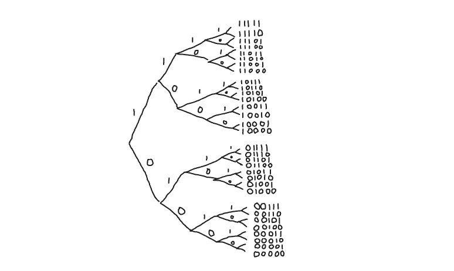

# 机器智能会破坏加密货币吗？

> 原文：<https://medium.com/hackernoon/will-machine-intelligence-undermine-cryptocurrencies-741bbff0e6d0>

人工智能和加密货币是科技领域两个令人难以置信的热门话题，然而没有多少人讨论机器[学习](https://hackernoon.com/tagged/learning)可能对加密货币产生的影响。

密码学在社会中起着很多重要的作用。密码术用于认证、授权、加密、验证等等。了解这些加密工具的用途和局限性对于负责任地管理我们的社会信息系统至关重要。

通常，[安全](https://hackernoon.com/tagged/security)的人为因素被认为是漏洞的主要来源，而数学方面被认为是其优势。来自组合学的产品的[规则是算法安全的基本数学前提:组合足够多的独立可能性，可能性的总数呈指数增长，需要先验知识来做出正确的选择，需要提取或创建数学上安全的信息。](https://en.wikipedia.org/wiki/Rule_of_product)

Binary demonstrates the combinatorial “Rule of Product”. There are 2^n binary sequences of length n.

但是，当其他一切都失败时，我们依靠人的因素来维持一个系统。面对灾难，我们一起努力修复和重建。当社区面临最大威胁时，它们会显示出真正的潜力。这是一个强大而永恒的故事，在整个人类历史中不断重复。但是当人类只是被远远超过时会发生什么呢？

象棋是另一个领域，组合可能性的爆炸使得没有先验知识不可能做出“正确”的选择。多年的训练和练习磨砺了棋手的直觉，让他做出更好的选择。

1997 年，一台电脑[第一次胜过了世界顶级棋手](https://en.wikipedia.org/wiki/Deep_Blue_versus_Garry_Kasparov)。这是一个突破性的成就，我记得媒体和公众明显的兴奋。最近，谷歌 DeepMind 项目开发的神经网络 alphazero 击败了之前名为 Stockfish 的顶级国际象棋引擎。我发现这个分析非常有趣，因为它突出了 alphazero 在国际象棋比赛中展示的创造性的、直观的方法。

alphazero 和 stockfish 之间的主要区别在于，后者是由许多人类程序员一起设计和制造的引擎[，而 alphazero 是一个](https://github.com/official-stockfish/Stockfish/issues)[神经网络](http://neuralnetworksanddeeplearning.com/)，它是被训练而不是被设计来掌握国际象棋的。这意味着它有潜力快速应用于新的和不同的问题。

# 根据应用的不同，加密算法具有不同的安全潜力

让我们来看 3 类重要的加密算法:

*   哈希函数
*   公钥加密(非对称密钥)
*   对称密钥加密

对称密钥加密用于安全地存储信息，以便只能使用私钥访问信息。因为只涉及私钥，所以是最不有趣但也是最安全的加密应用程序。对称密钥加密具有最强的安全潜力，事实上，**一次性密码本**，是“唯一可证明安全的密码系统”( [Schneier on Security](https://www.schneier.com/crypto-gram/archives/2002/1015.html#7) )。一次性密码本可以概括为使用不同的 1 字节密钥来转换每个连续的字节。即使是像 XOR 或模加法这样的简单变换，也能通过一次一密提供完美的安全性。

加密货币广泛使用哈希函数和公钥加密。工作证明使用哈希函数不断增加伪造区块链的难度。公钥加密用于签署交易。

我们依赖于这样一个事实，即没有人或计算机能够推断或模仿隐藏在显而易见的地方的信息，除非他们知道适当的加密令牌。但机器智能和量子计算可能会以新的和意想不到的方式威胁到这一点。

在某个时候，比特币和其他加密货币很可能不得不更新它们的加密算法。理想情况下，这将是一个渐进的过程，因为研究人员将逐步展示针对当前一代加密算法的更引人注目的攻击。

但是，如果一整类算法，如哈希函数或公钥密码学变得不可靠，该怎么办呢？可以想象，当这一代算法失败时，我们可能无法立即理解如何正确地设计下一代算法。如果我们必须定期更新我们的加密算法，比如每月或每周，那该怎么办？加密货币能够应对周期性的脆弱性吗？铸造的每一枚硬币都是对执行新的数学加密技术的特定经济奖励。随着加密货币中的货币总量增加，这可能会成为破解加密技术的更强努力的催化剂。在这场关于安全的猫鼠游戏中，优势会戏剧性地从一方转移到另一方。

> “该死的！看起来有人刚刚破坏了 futuresuperquantumhashfunction 3000，是时候获得新的哈希函数了。。。那一次这次只持续了 3 天！”

加密货币特别容易受到这些问题的影响，因为它们从根本上依赖于密码术。这有很多真正的好处，但也有一些风险。

如果有人可以窃听你的银行连接，他们必须通过额外的步骤来利用这一点，现在还不清楚具体会采取什么措施。此外，还有解决问题的官僚程序，因为坦率地说，预计会不时出现问题。加密货币一贯使用最佳加密实践，但它们也没有做好通过人工流程解决安全故障的准备。

虽然我不一定会想到最坏的情况，但我认为有很多有趣的意外情况我们无法事先都考虑到。