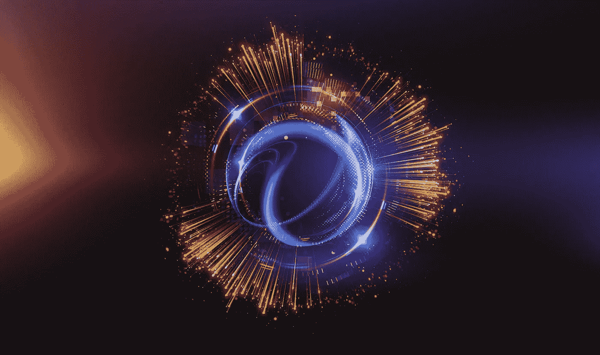

# 量子密码术将成就还是打破现代网络安全？

> 原文：<https://medium.com/hackernoon/will-quantum-cryptography-make-or-break-modern-cyber-security-25bc8005cb66>

量子计算机比“传统”计算机强大得多，可能是技术发展的自然下一步。然而，它们也给现有的网络安全措施带来了相当大的风险。

在这里，我们来看看量子计算和量子密码术的发展是否会导致适当的[安全技术](https://eleks.com/services/security-services/?utm_source=medium&utm_medium=referral&utm_campaign=Republ-Quantum-Security-Blog)的产生，或者它们是否会将个人、企业和政府置于前所未有的危险之中。

# 风险

现代网络安全在很大程度上是基于密码学的实践。简单来说，这就是利用大数和复杂的计算来创建无法轻易破解的复杂密钥。然而，量子计算机以快得多的速度执行某些计算的能力可能会使这种防御变得无用。

在一个由数字技术定义的世界里，这有着巨大的影响。从根本上来说，它让个人通信、财务、数字设备和互联网应用容易受到攻击。物联网技术的发展意味着家庭中的日常设备，从恒温器到照明设备，都很容易受到攻击。对企业来说，它增加了欺诈和商业间谍的可能性。[在全球层面上，它让各国处于危险之中](https://www.wired.com/story/quantum-computing-is-the-next-big-security-risk/)。毕竟，如果没有任何信息是安全的，你又能有多安全呢？

# 网络安全的发展

量子计算表明，网络安全威胁在不断演变，我们的[预防措施](https://eleks.com/whitepapers/preventive-actions-enterprises-can-take-to-avoid-it-security-vulnerabilities/?utm_source=medium&utm_medium=referral&utm_campaign=)也必须如此。幸运的是，量子力学本身可能提供了解决问题的希望。目前，后量子时代的网络安全有两个截然不同的方向。

首先是一种新型的后量子密码术，它将能够承受量子计算机的力量。其次，有大量的[研究正在进行量子密钥分发(QKD)](https://www.techrepublic.com/article/how-quantum-computing-could-create-unbreakable-encryption-and-save-the-future-of-cybersecurity/) 。QKD 充分利用了亚原子粒子固有的一个有趣特性，即量子不确定性。这是一种观念，即测量某样东西会对它的原始状态产生影响或改变它。QKD 独特地利用这一点来保证传输的安全性。如果一个敌对的第三方试图“监听”数据传输，他们必须识别和测量它，改变量子位本身，并提醒发送者和接收者任何干扰。从技术上讲，这允许通过不安全的通道传输数据。

# 结论

正如所有的技术进步一样，量子计算存在固有的风险——特别是在网络安全方面。然而，这种技术也可能包含开发新的网络安全措施的种子。此时此刻，大量的工作正在进行到新的后量子安全，似乎有可能找到解决方案。

不幸的是，这可能不是真正的风险。据估计，我们距离量子计算机的真正实现还有大约 15-20 年的时间。总的来说，这并不是一段很长的时间。如果企业和政府在不久的将来不开始考虑他们的后量子安全政策，我们可能会发现量子计算在我们的安全响应之前就成熟了。既然如此，我们必须尽快采取措施保护自己免受这种新威胁。

要了解更多关于量子计算安全威胁的信息，了解如何开始制定应对措施并确保企业数字系统的完整性，[联系我们](https://eleks.com/contact-us/?utm_source=medium&utm_medium=referral&utm_campaign=)。

*原载于 2018 年 3 月 9 日*[*eleks.com*](https://eleks.com/blog/will-quantum-cryptography-make-or-break-modern-cyber-security/?utm_source=medium&utm_medium=referral&utm_campaign=)*。*