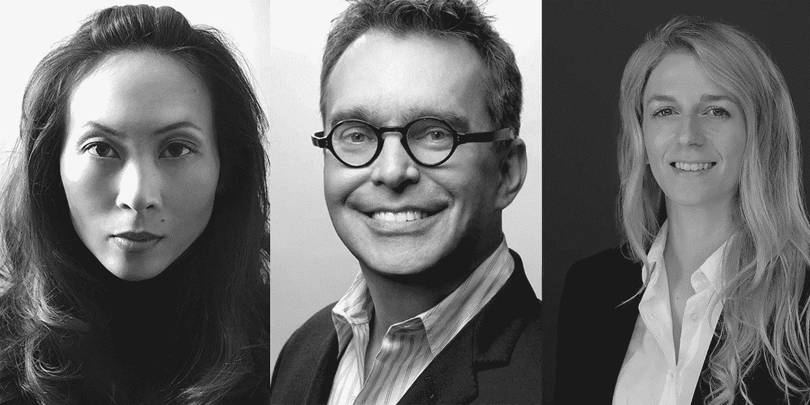

# 机器人会成为设计师吗？3 名技术设计领导者对此表示怀疑

> 原文：<https://medium.com/hackernoon/will-robots-become-designers-3-tech-design-leaders-are-skeptical-9f2e1fca6cd8>

机器人正在接管你的工作。也就是说，如果你相信未来学家托马斯·弗雷的话，他预测到 2030 年将会有 20 亿个工作岗位消失。

在一项关于就业前景的研究中，牛津大学的学者根据计算机化的可能性对 700 种职业进行了排名。设计行业——从时装设计到商业和平面设计——排名在 89 到 161 之间。

# 掌握你的沟通技巧

[*杰斯·布朗*](https://twitter.com/thejessbee?lang=en)*UX 主任，副*

要拥有一份经得起未来考验的职业，设计师需要掌握沟通。特定的工具和平台在不断发展，但讲故事永远是设计的核心。如果一个设计师能够有效地提出想法，并让其他人容易看到和理解他们文档中的过程，他们将准备好迎接数字边界演变带来的新挑战。

例如，语音控制等快速发展的技术可能会在五年或十年内成为所有数字交互的一大部分。随着 AR 和 VR 的发展，谁知道网站和应用程序需要多久才能对头部或眼睛的运动做出反应，而不是光标？

出于同样的目的，设计师总是会从随时准备适应下一步的变化中受益。养成探索和原型制作“下一件大事”的习惯，无论它是否成为现实，都将有助于设计师随着时间的推移而适应。

# 设计需要一种不同的语言

[*布莱恩·柯林斯*](https://twitter.com/briancollins1?lang=en) *，联合创始人兼 CCO，柯林斯*

作为一名设计师，你比以往任何时候都更需要预测未来的能力，甚至在你拥有你通常想要的所有信息之前就做出反应。设计的旧定义是“解决问题”这意味着在你去工作之前要等待问题的出现。但是，考虑到当今世界发展的速度，当“问题”出现时，已经太晚了。

我认为设计需要一种新的语言。设计师现在必须成为“问题寻求者”设计师应该永远站在前沿——未来事物的导师。这意味着我们可能会不时出错，但没关系。至少我们已经远远超越了简单的抛光表面，这仍然需要太多的设计。

我的家人在 Alexa 发布的前几周购买了它。它现在是我们生活中不可或缺的一部分。我们计划我们的旅行，播放音乐，获取新闻…这真是太方便了。

作为一名用户，你不会用 Alexa 触摸或看到任何东西。相反，你在和一个人工智能界面聊天。但是设计师非常注重视觉，而 Alexa 完全是以声音为导向的。对于设计师来说，这开启了一个完全非直觉的机会。视觉品牌会发生什么？到包装？这种情况下的商业广告？为了在这些新兴的环境中取得成功，设计师现在必须比文化本身走得更快。

十年前，当我们推出柯林斯时，我学到了应对未来的最好一课。我带着我们整个团队——当时只有 7 个人——在哈德逊河流域参加一个由著名尼姑[Pema CHD rn](https://www.goodreads.com/author/show/8052.Pema_Ch_dr_n)经营的冥想静修。当我们到达那里时，我们很快发现这是一个完全无声的撤退。沉默。没有人能说话。你只能听。

所以我们听了 Pema 三天。而且，在许多事情中，她教会了我们这个关键思想:“要完全活着，完全是人，完全清醒，就要不断地被扔出[窝](https://thenextweb.com/topic/nest/)。充实地生活意味着永远处于无人之境，体验每一刻都是全新的、新鲜的。活着就是愿意一遍又一遍地死去。”

她的哲学至今还在我脑海里。它教会我接受这样一个事实:你不一定一直都知道自己要去哪里。所有这些可能都是好的，因为它迫使你保持警惕。这条路不会一直走下去。但这正是冒险的开始。

# 更好地了解历史

[*娜塔莎 Jen*](https://twitter.com/njenworks?lang=en) *，合伙人兼设计师，五角星*

从智能手机问世以来的短短 10 年里，世界发生了多大的变化来看，我认为可以肯定地说，我们所理解的现在永远不会是未来。

我们没有预料到我们会变得如此依赖这款设备以及由此衍生的所有辅助服务和行业。我们吃饭、购物、旅行、交流、玩耍的方式在一眨眼之间就完全改变了。我们不认为以数字为中心的企业会消灭某些行业并创造新的行业。我们不认为外国政府会渗透社交媒体，干预选举。我们没想到唐纳德·特朗普会成为美国总统…

在这方面，面向未来的概念实际上并不那么面向未来，而且很难从实用、可靠的角度来考虑未来，比如规划你的职业生涯。例如，谁知道人工智能或机器人是否会取代实际上需要像设计师一样思考的某些类型的劳动力。

我确实相信，在一个技术如此强大、未来如此不可预测、我们似乎如此脆弱的时代，唯一有效的态度是更好地了解历史，更好地意识到我们自己与我们日常接触的平台的关系，对似乎陌生的技术潮流保持好奇，如人工智能、机器人、加密货币、生物工程，这样我们才能在不确定的时代更好地思考。

> 这个故事是由安尼克·范·迪克写的，最初发表在 T2 的下一个网站上。
> 
> 要阅读黑客正午的每周趋势 TNW 故事，请访问 Hackernoon.com/tnw 的。