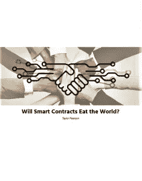

# 智能合约会吃掉世界吗？

> 原文：<https://medium.com/hackernoon/will-smart-contracts-eat-the-world-part-one-what-are-smart-contracts-d2cea816035b>

## 第一部分:什么是智能合约？

1994 年，法律学者和计算机科学家 Nick Szabo 创造了术语" [smart contract](http://www.fon.hum.uva.nl/rob/Courses/InformationInSpeech/CDROM/Literature/LOTwinterschool2006/szabo.best.vwh.net/smart_contracts_2.html) "来描述将合同(一种法律构造)嵌入计算机代码的能力。

随着区块链生态系统的出现，围绕智能合约的兴奋情绪有所抬头。

在本文中，我将探讨什么是智能合约，以及为什么将它们与区块链技术相结合来创建“区块链智能合约”是有价值的在本系列的下一篇文章中，我们将深入探讨它们解决的核心问题，然后看看一些潜在的特定用例。最后，我们将看看智能合约的障碍和缺点。唉，天下没有免费的午餐！

# 什么是智能合同？

智能合同最简单的例子是自动售货机:

***如果*** *有人投入一块钱*

***和***

***如果*** *他们按下了健怡可乐的按钮*

***然后*** *配发一杯健怡可乐*

智能合同允许将“湿代码”(法律合同等人类可读语言)转换为“干代码”(计算机可读语言)。湿代码更有延展性，更容易解释，这可以使它更灵活，但也可能使它更不公平，更昂贵(律师也必须这样做)。干代码更加僵化和确定，这使得它不太灵活，但更便宜和公平。

尽管我们不怎么考虑它们，但合同是我们经济的重要组成部分。正如经济学家罗纳德科斯(Ronald Coase)所指出的，一家公司只是一系列与员工、供应商、股东和客户的契约。

你住在自己的房子或公寓里，因为你与银行(抵押贷款)或房东有合同。无论谁拥有你的房子，他都和一个政府机构签有合同，这个政府机构维护着房产所有权登记，上面写着房子属于谁。从很多方面来说，我们的生活就是一系列合同——雇佣合同、抵押合同和婚姻合同。

智能合同背后的基本思想是，多种合同条款(如抵押、担保、产权界定等。)可以嵌入到我们处理的硬件和软件中，以这种方式使违约者为违约付出昂贵的代价(如果愿意，有时是极其昂贵的),并在这样做的同时，减少与该合同相关的交易成本。

一个比自动售货机更复杂的例子可能是处理汽车租赁。一辆汽车可以有一个“智能留置权”协议，如果有人未能履行支付租金的合同义务，他们的电子钥匙就不再工作，而由银行拥有的钥匙激活汽车。

这比用回购人来追车要便宜得多。如果汽车是自动驾驶的，你可以把它作为合同的一部分，如果没有付款，汽车会自动开到债权人指定的地点。当购车者全额付清车款后，合同会使银行持有的钥匙失效。为了安全起见，可以增加附加条款。当汽车在 40 号州际公路上以每小时 75 英里的速度行驶时，你不会想取消它的操作。

# 干式智能合同与湿式合法合同

智能合同并不是要取代现有的普通法，而是要扩展它们，让个人、企业和最终的计算机更容易相互签订合同。

好的合同有四个重要的属性:

1.  可观察性
2.  可验证性
3.  可执行性
4.  隐私

如果您与某人签订合同，如雇佣合同，您希望能够:

1.  *观察*他们正在做他们在合同中说要做的事情。
2.  如果他们没有，你希望能够有办法*证实*他们没有做他们说过要做的事情。
3.  有办法*强制执行*违约后果。
4.  理想情况下，你也想保持合同*私密*。不是每个人都需要知道你的雇佣合同或抵押贷款的条款。

如今，会计行业的主要作用是抓住构成经济的“契约纽带”，并使其可见。审计和调查行业的作用是核实合同。司法系统的作用是强制执行那些合同:如果有人违反了与你的合同，你有权将他们告上法庭并予以惩罚(通过逮捕、没收财产等方式)。)违约。

既然我们已经看了智能合约的基础，下周我们将看看区块链智能合约可以帮助现有系统更加有效和公平的两种方式。

*如果您正在寻找更多关于区块链和商业加密货币的信息，* [*在此输入您的电子邮件地址*](https://taylorpearson.me/smartcontracts-pdf/) *以获取精美的 PDF 格式的完整文章，供以后阅读。*

*本文摘自* [*智能合约会吃掉世界吗？*](https://taylorpearson.me/smart-contract-applications/)*[*Taylor Pearson . me*](http://taylorpearson.me/)*