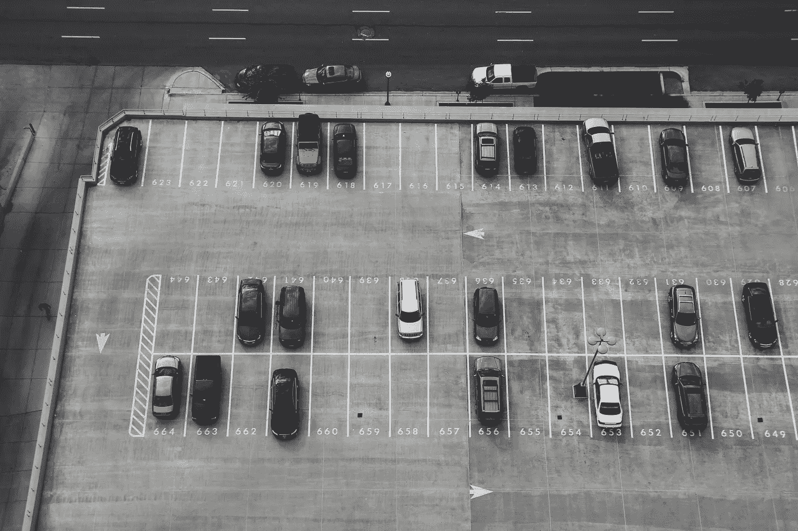

# 智能停车系统能帮助城市居民找到停车位吗？

> 原文：<https://medium.com/hackernoon/will-smart-parking-systems-help-city-dwellers-find-a-spot-aa68f6723f40>

寻找停车位可能是一场噩梦。对于当地人和游客来说，停车在每个城市都是一个重大的挑战，通常会导致人们在街区里一遍又一遍地寻找停车的地方，这非常令人沮丧。

根据联合国的数据，目前全球约有 55%的人口居住在城市地区，而这一数字预计到 2050 年将达到令人难以置信的 68%。显然，除非城市实施新的策略，否则停车挑战只会变得更糟。

随着智能城市的概念越来越重要并被越来越多的人所接受，优化交通是让我们的社区变得更宜居并提高城市生活和整个地球的可持续性的关键因素之一。目前大多数停车选择的低效率在世界各地的每个城市都造成了巨大的问题，导致越来越多的技术进步来解决这一日益严重的问题。

我们如何实现这一目标？

在 DataArt，我参与了许多旨在为城市停车开发新架构的项目。通过广泛的研究和实施，很明显，要实现这个崇高的目标，必须有几个重要的组件。

停车优化是这个高度复杂的难题的关键部分。事情是这样的:所有的停车场都必须有足够的代表，以减少在大多数当前系统中发现的严重低效。此外，司机必须了解他们的所有选择，以帮助确保每个批次都装满，从而产生市场可以支持的最大收入。

顾客并不都一样。如果选择更便宜，一些人很乐意把车停在离目的地稍远的地方，而另一些人则更愿意支付额外费用，以方便获得“最佳位置”这里存在一些设计高效城市停车系统的挑战——司机必须提前了解这些选项，而停车服务必须了解消费者行为，以准确预测不断下滑的市场需求，从而最大限度地提高可用性并相应调整价格。

最终，如果不开发一种无缝的方法，让司机通过一个应用程序或网站提前查看所有选项，让他们能够到达他们选择的停车目的地，而不会发现没有可用的停车位，就无法实现停车优化。正如我前面提到的，减少低效率的一个方面是准确地调整停车价格以匹配市场需求，随着需求的增加，停车当局对不同水平的服务和便利收取不同的费用。

成功的智能停车计划的另一个重要组成部分是消除当前部署的许多系统中存在的数据孤岛，从而将所有占用信息和其他数据集成到一个可供所有利益相关方查看的单一实体中。这种融合不仅包括停车使用和可用性，还包括城市系统数据，如空气质量、交通管理和其他相关细节。

系统的基本集成并没有就此结束。为了确保方便和安全，停车可用性信息必须显示在车辆的仪表板或平视显示器上，以便司机对道路的注意力不会受到影响。此外，停车数据需要与公共交通部门共享，以确定公共交通需求的变化。停车摄像头、传感器和支付必须协同工作，以提高便利性并减少浪费时间的工作。停车管理系统必须与城市人口统计相结合，以有效地确定价格策略，最大限度地利用所有可用的停车资源。随着电动汽车的普及，充电站也必须成为整合的一部分，确保合理的可用性，使电动汽车成为可行的城市驾驶选择。

我们正处于城市交通革命的风口浪尖。拥堵和停车不足已经成为我们全球城市社区的两个最大问题。智能停车系统将为这一巨大的挑战提供一个长期的解决方案，为我们所有人带来减少排放、增加便利和更可持续的交通解决方案。

*这篇博客的作者是技术咨询公司* [*DataArt*](http://dataart.com) *的物联网实践主管伊洛宁(Igor Ilunin)。*