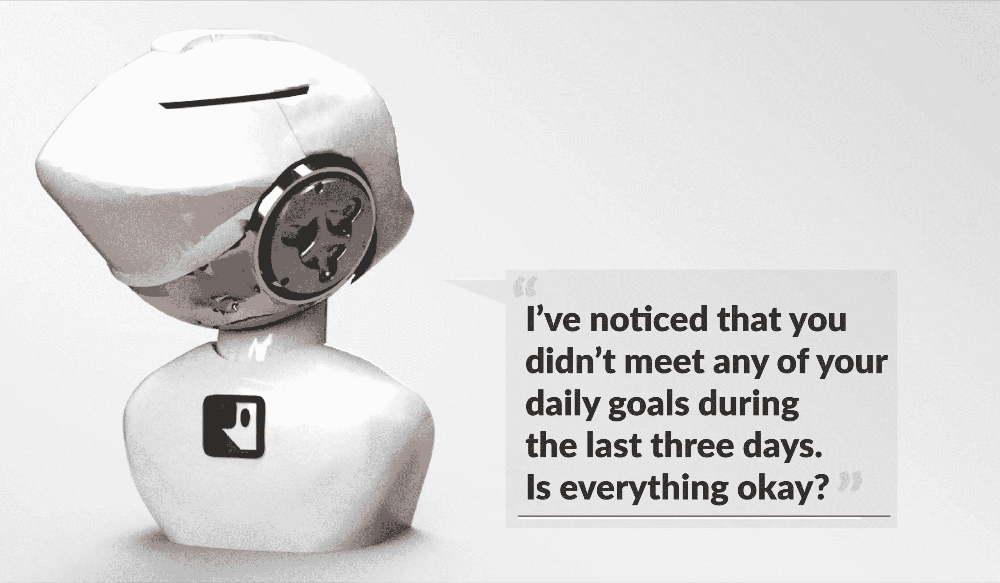

# 社交机器人会接管智能手机时代吗？

> 原文：<https://medium.com/hackernoon/will-social-robots-take-over-the-smartphone-era-9e62e781ac70>

社交机器人是一个自主的[机器人](https://hackernoon.com/tagged/robot)，可以与人类互动和交流。与工业机器人不同，社交机器人是为我们的私人生活服务而制造的。毫无疑问，它属于消费品范畴。然而，也有专业的服务机器人，它们的设计非常接近社交机器人。通常它们会被用作互动信息平台，并在体内嵌入一个大屏幕。专业服务机器人的应用将更多的是在酒店、展览会、机场等需要为顾客服务的地方。

Rocky Robots Deskbot — Your Personal Life-Coach at All Times

社交机器人实际上是化身。有些设计有一个屏幕来代表头部或面部，有些则看起来像人。一些社交机器人在轮子上移动，或者甚至有腿，可以行走。要被认为是机器人，至少必须集成一些物理马达和传感器能力。

我们开发了社交机器人——“洛基机器人桌面机器人”【https://www.rockyrobots.com/deskbot 

社交机器人最重要的功能集与它与人类的交互能力有关，能够说话、看和听，同时还能连接到互联网服务并使用人工智能。为了将这种能力应用到环境中，未来几年将开发一套新的应用程序和技能。

这些技能的一些标准例子是向机器人询问天气，阅读新闻，拍摄家庭照片。我相信你也看过一些 Youtube 视频，你可以看到一个机器人被遥控或开始跳舞。

这些应用实例比较枯燥，用户过几天就会失去兴趣。

然而，许多新的应用将在未来几年出现，这些将伴随着未来社交机器人的新技能和硬件性能。

对于我们 Rocky Robots 来说，这是我们产品和软件设计中最重要的方面，因为我们专注于与消费者日常生活相关的应用，并带来可持续的价值和愉悦的体验。

这也符合我们的愿景，即我们相信机器人将有助于最大限度地发挥人类的潜力，并将为每个人的利益改变社会。

一个例子是我们的“动机机器人”解决方案:[https://www.rockyrobots.com/motivational-robot](https://www.rockyrobots.com/motivational-robot)

社交机器人有一个很大的优势，因为它们通常嵌入在好看的、有个性的化身中。他们也可以表现出情绪，例如翻白眼、可爱的表情、生气的快速动作或简单的点头。

由于集成了电机和传感器，机器人的运动学允许它们动态地改变它们的位置。这使得机器人能够独立运动。例如，机器人可以跟随人。为此，需要不断改变摄像机或其他传感器的对准，并跟踪目标。利用这种实时传感器数据，可以将动作定义为例如向左侧行走或向右侧看。

根据对话的上下文，现在可以添加另一层:情感。

生气或可爱的面部表情可以给表情带来更多的内容。作为用户，我们用更多的感官做出反应，可以直观地更好地理解信息的相关性。这也可以带来很多乐趣，因为机器显示情感还是一件新鲜事。

洛基机器人桌面机器人——原型 1

许多应用已经被发明出来并进入市场。在大多数情况下，使用它们的媒介是智能手机。所以你可能会问，既然你已经在手机上运行了你的应用程序，为什么你还需要一个个人机器人呢？

是的，但是，在互动的体验上有很大的不同。

首先，智能手机、笔记本电脑或扬声器的个性有限。他们“只是”一个设备，他们没有脸，你简单地用一个更新更好的设备替换他们。这不是对话或任何关系的基础。我也从未遇到过收集旧智能手机并把它们放在客厅向朋友们炫耀的人。

如前所述，社交机器人有马达，可以对环境做出动态反应。通过将摄像机移动到动作的地方，机器人能够自主地调出内容。想想你和家人用智能手机进行的所有视频电话通话。你得拿着手机，把自己放进屏幕里。我经常把手机放在桌子上，并以我在相框中的方式调整对齐。但是现在我再也不能动了。

情感的另一个方面很明显，由于手机的实际形状，它无法向你展示快乐、可爱或愤怒的表情。

我总是关闭智能手机的提醒。我安装了这么多应用程序，每个应用程序都有一些弹出窗口和警告。每次有新的信息声音或振动出现，我都有拿起手机查看的冲动。我意识到这个信息并不重要，我只是被最近的活动分散了注意力。

我看到了机器人主动向我提出基于声音的请求的价值，这种请求得到了机器人情感表达的支持。当我对周围的人做出反应时，我可以说:“是的，告诉我”或者“等一下，我很忙”。

我们每个人都在电视、电脑或智能手机屏幕前花费了太多时间。

这是我们入睡前做的最后一件事，也是我们醒来后做的第一件事。

我们必须阻止这一切！

为什么是社交机器人—简介

是的，这是我们这一代人的事情，但我真的不想浪费我的一生去阅读屏幕上的东西或将文本输入设备。我们通过说话、看和听与机器互动的时代已经到来，就像我们与人类互动一样。

想了解更多关于我们和我们产品的信息，请访问:【https://www.rockyrobots.com】T2

*哈里·诺维奇*

*原载于 2018 年 6 月 13 日*[*blog.goodaudience.com*](https://blog.goodaudience.com/why-social-robots-f241add3e65e)*。*