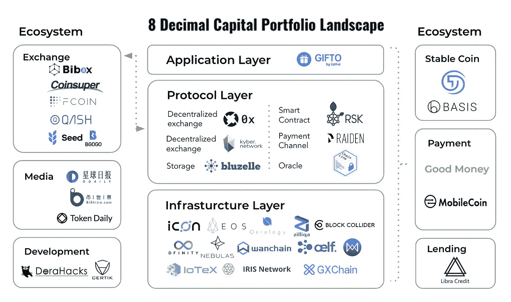

# 脸书会蚕食区块链的未来吗？

> 原文：<https://medium.com/hackernoon/will-tech-giants-like-facebook-cannibalize-the-future-of-blockchain-36d7eee67cc>

# TL；博士:

*   今年五月，脸书经历了一次重大重组，组建了一个由专门探索区块链的人才组成的小团队。这个团队由不到十几个人组成，每个人都有杰出的职业和背景。
*   *通过在未来实施区块链技术，或者至少为此做好准备，脸书可以将自己从数据泄露的丑闻中解脱出来，并减少用户对其透明度和隐私的担忧。它甚至可以让用户控制自己的信息和数据。*
*   *随着脸书探索区块链，由于其庞大的用户群，它可能会在行业中获得动力并引领潮流。8 Decimal 将脸书的参与视为投资区块链社交媒体相关项目的绝佳机会。*

> **作者:颜宁**
> 
> 编辑:布莱恩·霍夫，佐伊·钱

> “(大型科技的崛起)有一些重要的反趋势——比如加密和加密货币……我有兴趣更深入地研究积极和消极的方面。”

- [马克·扎克伯格](https://medium.com/u/c79346ea7c9a?source=post_page-----36d7eee67cc--------------------------------)，2018 年 1 月

# 专注于区块链的团队

今年 5 月，脸书遭遇了一次至关重要的重组，组建了一个由专门探索区块链的人才组成的小团队。这个团队由不到十几个人组成，每个人都有着辉煌的职业生涯和背景。前 Messenger([Messenger Platform Team](https://medium.com/u/1e5ab91900e0?source=post_page-----36d7eee67cc--------------------------------))和 PayPal([PayPal Engineering](https://medium.com/u/4c9920b6e879?source=post_page-----36d7eee67cc--------------------------------))负责人大卫·马库斯被任命在两位 insta gram([insta gram Engineering](https://medium.com/u/a4c6efa67fe0?source=post_page-----36d7eee67cc--------------------------------))高管[詹姆斯·埃弗宁厄姆](https://medium.com/u/58c9c1d5b5c9?source=post_page-----36d7eee67cc--------------------------------)和凯文·韦尔的帮助下领导团队。

如果我们看看这些团队成员的背景，我们可能会对脸书([脸书研究](https://medium.com/u/25aae929dbb1?source=post_page-----36d7eee67cc--------------------------------))的计划有所了解。马库斯，作为在线支付的专家，曾是[比特币基地](https://medium.com/u/b9034df3e57a?source=post_page-----36d7eee67cc--------------------------------) ( [比特币基地](https://medium.com/u/913e7ed84452?source=post_page-----36d7eee67cc--------------------------------))的董事会成员，后来为了避免利益冲突而辞职。他的行动可能意味着脸书可能试图利用区块链参与加密货币和小额支付。另一方面，Everingham 和 Weil 在帮助脸书([脸书设计](https://medium.com/u/5aad0942f068?source=post_page-----36d7eee67cc--------------------------------))抵御 Snapchat 的威胁方面都至关重要，他们都是提出引领市场的技术战略的专业人士。

# 为什么是区块链？

脸书每月约有 22 亿活跃用户，为其客户提供无缝的用户体验。由于脸书对其用户的集中控制，该公司能够利用用户数据进行有针对性的广告宣传，这成为剑桥分析公司数据安全丑闻的前提。

随着人们使用区块链技术讨论去中心化的概念，许多区块链初创公司正计划通过更好的用户数据保护来扰乱科技巨头。凭借其廉洁的构成和分散的数字账本，区块链已成为问责制和透明度的灯塔。

通过在未来实施区块链技术，或者至少为此做好准备，脸书可以将自己从数据泄露的丑闻中解脱出来，并减少用户对其透明度和隐私的担忧。它甚至可以让用户控制自己的信息和数据。

此外，脸书可能正在寻找更多的应用程序开发者，以便在其开发者平台上推出新产品。通过使用代币作为奖励，该公司可以向这些能够在发布时获得奖励的编码员提供更高的激励。

最后，为了应对大科技的趋势，脸书希望通过监控一些位于区块链的社交媒体平台来保持竞争力。脸书最有可能引领由区块链技术支持的下一代社交媒体平台，为用户提供对其数据的更多控制，并提供因分享数据而获得回报的机会。

# 脸书在区块链行业的可能性

尽管 David Marcus 表示脸书在实施区块链方面“从零开始”，但评论员已经预测了脸书可能采取的步骤。

脸书可能会创建自己的加密货币，以刺激电子商务，奖励服务和内容创作者。他们已经推出了一种虚拟货币——脸书之星，来回馈内容创作者的小费。

除了在现有系统中实施新的支付方式，脸书还可能开发其他产品。例如，银行应用、交易所或数据管理系统，同时管理登录层以同时访问这些功能。

然而，毫无疑问，这一次的通过将是艰难的。如果脸书完全应用区块链技术，它将失去其最有价值的收集用户数据来定向广告的商业模式。这种转变可能会缓慢发生，而该公司需要确保其用户将接受并遵循这一新方向。

# 脸书最近的发展

据[彭博](https://medium.com/u/3d76181076e6?source=post_page-----36d7eee67cc--------------------------------)日前报道，脸书正在开发一款针对汇款市场的加密货币转账应用，并将集成到 WhatsApp 中。将为这个项目开发一种可以避免巨大价格波动的稳定币。脸书选择首先在印度推出这款应用，印度是海外现金汇款最多的国家。2017 年，印度的现金汇款约为 6900 万美元，而该国现有的 WhatsApp 用户也超过 2 亿。一旦该项目获得批准，WhatsApp 可以成为印度领先的转账平台。

据报道，WhatsApp 首席执行官克里斯·丹尼尔斯(Chris Daniels)在 11 月向印度储备银行(RBI)发送了一封请求信，要求向 WhatsApp 在印度的用户提供支付服务。在正式实施之前，脸书需要获得 Bharat 货币接口(BHIM)统一支付接口(UPI)的批准，并满足印度国家支付公司(NPCI)的监管要求。据报道，作为对剑桥分析公司丑闻的回应，该公司已开始实施印度储备银行的建议，包括为印度储备银行提供支付信息的数据存储要求。

应用加密货币汇款功能的好处非常明显。这项新功能将大大降低交易成本，加快资金转移过程，特别是全球转账。

# 八进制的观点

随着脸书进入区块链领域，由于其庞大的用户群，它可能会在行业中获得动力并引领潮流。8 Decimal 将脸书的参与视为投资社交媒体相关区块链项目的绝佳机会。我们正在积极寻找可能从脸书收购的公司，作为未来投资的支点。然而，我们也认为脸书的参与是对该行业的潜在威胁。凭借全球数十亿用户，脸书有能力蚕食区块链产业的许多领域。科技巨头，如脸书和谷歌([谷歌开发者](https://medium.com/u/991272e72e68?source=post_page-----36d7eee67cc--------------------------------))，进入区块链空间将促进新技术的采用，但这也可能集中控制这个行业。

# 引文

[CB Insights](https://medium.com/u/914088e570e?source=post_page-----36d7eee67cc--------------------------------):[https://www . CB Insights . com/research/Facebook-区块链-加密货币/](https://www.cbinsights.com/research/facebook-blockchain-cryptocurrency/)

[CB Insights](https://medium.com/u/914088e570e?source=post_page-----36d7eee67cc--------------------------------):[https://www . CB Insights . com/research/tech-giants-区块链-projects/](https://www.cbinsights.com/research/tech-giants-blockchain-projects/)

美国消费者新闻与商业频道:[https://www . CNBC . com/2018/05/09/Zuckerberg-investments-in-区块链-to-keep-Facebook-relevant . html](https://www.cnbc.com/2018/05/09/zuckerberg-invests-in-blockchain-to-keep-facebook-relevant.html)

[比特币杂志](https://medium.com/u/da165ee059da?source=post_page-----36d7eee67cc--------------------------------):[https://bitcoinmagazine . com/articles/op-ed-Facebook-moving-区块链-how-may-play-out/](https://bitcoinmagazine.com/articles/op-ed-facebook-moving-blockchain-how-might-play-out/)

傻瓜:[https://www . fool . com/investing/2018/05/14/Facebook-and-区块链-together-at-last-don-get . aspx](https://www.fool.com/investing/2018/05/14/facebook-and-blockchain-together-at-last-dont-get.aspx)

[coin central](https://medium.com/u/6a3dfcbcd7f6?source=post_page-----36d7eee67cc--------------------------------):[https://coin central . com/Facebook-targets-Indian-money-transfer-market-using-crypto/](https://coincentral.com/facebook-targets-indian-money-transfer-market-using-crypto/)

[彭博观点](https://medium.com/u/76da62c75f0f?source=post_page-----36d7eee67cc--------------------------------):[https://www . Bloomberg . com/news/articles/2018-12-21/Facebook-is-said-develop-stable coin-for-whatsapp-transfers？srnd =加密货币](https://www.bloomberg.com/news/articles/2018-12-21/facebook-is-said-to-develop-stablecoin-for-whatsapp-transfers?srnd=cryptocurrencies)

> 8 十进资本:塑造区块链未来
> 
> [中型](/@8DecimalCapital)|[LinkedIn](https://www.linkedin.com/company/8-decimal-capital/)|[Twitter](https://twitter.com/8decimal)|[脸书](https://www.facebook.com/8Decimal/) | [网站](http://www.8dcapital.com/)
> 
> 电子邮件:contact@8dcapital.com，如果你对这个话题还有任何问题。

*8 DECIMAL CAPITAL is a multi-strategy investment firm focusing on token and equity investments. 8 Decimal currently has more than 40 portfolio companies with an AUM of 60M USD. The investment team consists of more than 10 venture capital veterans, researchers, and trading professionals. The advisory board comprises Fan Zhang (Former Founding Partner of Sequoia Capital China), Karen Chen (Former CEO of UBS China) and Ben Bartlett (Vice Mayor of Berkeley). Based on the professional fund index ranking agency* [*Token Metrics*](https://medium.com/u/80a0e0807b05?source=post_page-----36d7eee67cc--------------------------------)*, 8 Decimal was ranked second out of the 51 active crypto funds. 8 Decimal is also well-received in China, named one of the top 10 funds in the blockchain industry by both* [*36 氪（36Kr.com）*](https://medium.com/u/ae3950e4f2fc?source=post_page-----36d7eee67cc--------------------------------)*,* [*Chain Capture*](https://medium.com/u/ac4da81bc060?source=post_page-----36d7eee67cc--------------------------------) *, and* [*Odaily*](https://medium.com/u/9c30cbe2074f?source=post_page-----36d7eee67cc--------------------------------)*, as well as named one of the top 20 funds by Tsinghua X-Lab and Youth Education Chain League.*