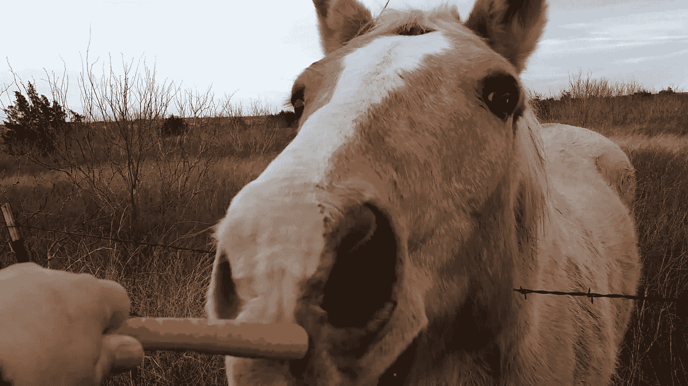
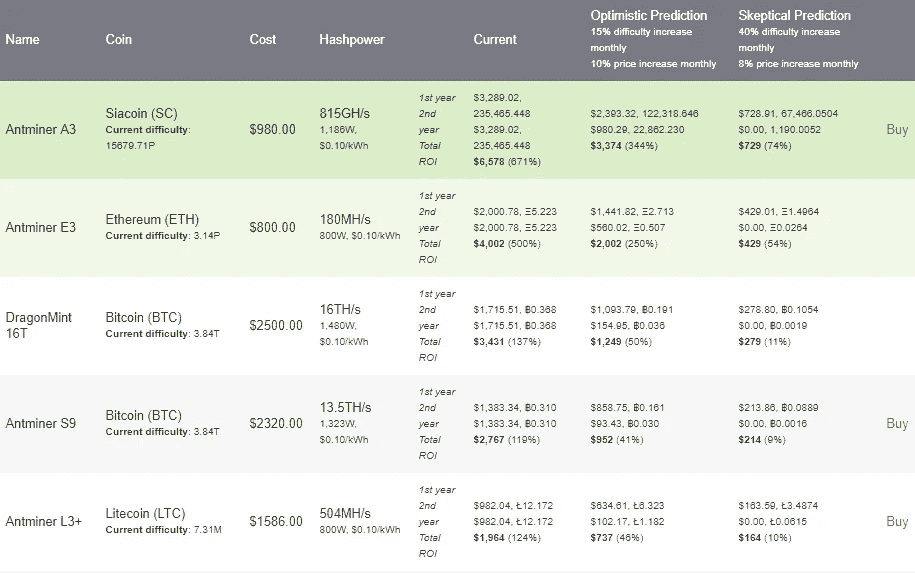

# 新的比特大陆蚂蚁矿工 E3 会让你在以太坊采矿上中大奖吗？—每周# 10KQA 问答问题

> 原文：<https://medium.com/hackernoon/will-the-new-bitmain-antminer-e3-make-you-hit-the-jackpot-on-ethereum-mining-613840a8003d>

不久前，Howtotoken 发起了 10KQA 挑战赛(详情请见[和](https://hackernoon.com/the-10-000-question-challenge-your-blockchain-journey-starts-here-98829f6b3cbc))，核心理念很简单:为任何想了解区块链和加密货币的人建立一个 1 万个问题的适度列表，这个挑战已经进入第四周:

*   [第一周报告](https://hackernoon.com/weekly-top-5-questions-about-making-a-profit-with-crypto-10kqa-challenge-602cce953a7e)
*   [第 2 周报告](https://hackernoon.com/what-are-the-main-reasons-behind-the-huge-drop-in-the-crypto-market-weekly-10kqa-questions-bc869c86c2c7)
*   [第 3 周报告](https://hackernoon.com/how-many-bitcoins-mtgox-have-already-been-sold-and-how-does-that-affect-the-price-261fe8edb060)

本周提出的最有趣的问题之一是关于比特大陆开始出售其[蚂蚁矿工 E3](https://shop.bitmain.com/product/detail?pid=00020180403174908564M8dMJKtz06B7) 的讨论，以及这将如何影响开采以太坊时的利润。感谢专家，我们已经收到了一个有趣的答案，现在我们将在每周报告中与社区分享。但是在我们深入讨论之前，让我们先回顾一下本周讨论的其他一些有趣的问题和答案。

# **为什么伊斯兰教法可以接受加密货币？**

众所周知，上周伊斯兰国家被允许使用穆罕默德·阿布·巴卡尔的密码，但这里最有趣的问题是为什么加密货币可以被认为是清真的，以下是一些原因:

*   加密货币不受中央系统控制，这使得它们比现有的其他金融系统更加安全。
*   加密货币被广泛接受；因此，它是金钱。

然而，阿布·巴卡尔指出，虽然加密货币在大多数情况下是合法的，但它们根本不是合法的。例如，在被禁止的司法管辖区，它们不是清真食品。他还表示，以投资为目的使用加密货币是不可取的。

关于比特币和其他加密货币的高波动性的现状，有一个关于稳定硬币的有趣问题。

# **哪种美元支持的稳定币最靠谱，为什么？**

Jonathan Ponciano 建议，如果你在加密领域需要一个复制资产，可以考虑 T2 true USD T3。

其主要原因是发行者为保护代币持有者而制定的法律框架。它通过在代币和潜在美元之间建立强有力的联系来做到这一点。该产品是与银行、两家华盛顿律师事务所、一家加密对冲基金和一家纽约投资公司合作开发的。这个平台叫做 TrustToken，所有使用这个令牌的操作都存储在这里。

接下来的问题是关于采矿的，因为越来越多关于这个领域的新闻是当前的热门话题。安全性和隐藏的矿工仍然困扰着用户，但有一些基本的建议，你可以遵循，以避免这一点。

# **我如何防止在我的电脑上隐藏挖掘？**

[福斯比茨](https://twitter.com/fossbytes14)的联合创始人兼活跃的企业家阿达什·维尔马在他的网站上的一篇文章中描述了六种方法来保证没有人会从你的电脑里挖矿。

他说大多数网站都在使用 Coin Hive 进行挖掘。以下是阻止它的工具:

***1。使用*** [***无币***](https://chrome.google.com/webstore/detail/no-coin-block-miners-on-t/gojamcfopckidlocpkbelmpjcgmbgjcl?hl=en) ***镀铬扩展***

“当你访问一个网站时，没有硬币会检测到并告诉你是否有这样的活动在进行。您将看到一个红色符号，如下图所示。虽然这种扩展可以阻止任何此类活动，但它也允许您在一段时间内将网站列入白名单。”

**2*2。使用***[***miner block***](https://chrome.google.com/webstore/detail/minerblock/emikbbbebcdfohonlaifafnoanocnebl?hl=en)***Chrome 扩展***

这个扩展的原理是一样的。然而，目前该服务的列表中的 miner 域较少。

***3。在主机文件*** 中屏蔽币矿域

“这是手动阻止您认为有害或令人不快的特定域的方式。由于这种阻止方法，您的浏览器将无法连接到这些域。我们可以编辑 hosts 文件并将其重定向到 0.0.0.0。

对于 Windows，导航到 C:\ Windows \ System32 \ drivers \ etc 并编辑 hosts 文档以在末尾添加 0 . 0 . 0 . 0 coin-hive.com。

请注意，此更改阻止了 coin-hive.com 托管的挖掘脚本。如果您遇到其他挖掘脚本域，您可以进一步添加它们。"

***4。在广告拦截器*中拦截域名**

转到“定制”部分，然后引导自己“通过网址阻止广告”并插入以下链接:【https://coin-hive.com/lib/coinhive.min.js

***5。在 Firefox 中使用 noscript***

如果你使用 Firefox，NoScripts 可能是一个选择。然而，这是相当积极的，通常会阻止太多的网站。

***6。Opera 浏览器***

“随着 Opera 50 网络浏览器的发布，该公司引入了内置功能来阻止 CoinHive 脚本和加密货币挖掘技术。这将允许用户确保他们的计算机不会在遇到任何使用数字硬币挖掘技术的网站时发疯。用户可以在设置(macOS 上的首选项) >基本>阻止广告中找到此选项，并在广告过滤器的推荐列表下单击 NoCoin。”

# **如何识别使用您的电脑进行挖掘的网站？**

《popularmechanics.com》的作者埃里克·利默为你提供了解决方案。

“密码劫持”最突出的症状之一是计算机整体性能的立即和突然变化。这通常会大大降低你的机器速度。

“如果你注意到这些情况中的任何一个并感到可疑，只需在 Windows 上打开任务管理器(Ctrl+Alt+Delete)或在 Mac 上打开活动监视器(Command + Space 并搜索“活动监视器”)。如果你的网络浏览器占用了特别高的 CPU 资源(几乎是全部)，可能有一个黑客在捣鬼。

如果你怀疑某个网站是罪魁祸首，你可以通过关闭标签并监控结果来测试你的理论，或者在谷歌浏览器中，进入菜单，然后更多工具，然后任务管理器，按标签检查 CPU 使用情况。"

# **比特大陆 ASIC-miner E3 对 ETH 的开采过程有什么影响？**

第一批矿工已经售罄，将于 2018 年 7 月下半月交付给其用户，但现在我们应该花时间计算和分析需要考虑的特性和风险。

蚂蚁矿工 E3 是第一个基于以太坊的 ASIC 矿工。在此之前，像 RX570 这样的 GPU 是挖掘以太坊最具成本效益的方法，以大约 12 美元的[成本提供 1MH/s。相比之下，E3 以 4.40 美元的价格提供 1MH/s 的速度，因此其成本效益大约是前者的 2.27 倍。有趣的是，它并没有更有效地使用电力；RX570 和](https://cryptoslate.com/bitmain-e3-asic-ethereum-miner/)[1080 Ti](https://www.forbes.com/sites/davealtavilla/2017/06/30/these-are-the-best-gpus-for-ethereum-crypto-mining)GPU 在这方面效率更高。

很高兴看到这个矿工的投资回报率是多少:

这里是全尺寸桌子:【https://www.anythingcrypto.com/bitcoin-mining-calculators 

采矿者面临的主要风险是，转向称为 Casper 的混合工作证明/利害关系证明算法(这可能会导致以太坊完全基于利害关系证明)的计划可能会使你无法再开采它。

真正需要问的问题是这将何时实现，因为 ASICs 将在几个月后成为一个问题。然而，Casper 可能要在几个月甚至几年后才能实现，因此可能需要一个短期的解决方案(尽管，因为 E3 并不比现有的 GPU 更高效，所以这甚至可能没有必要)。

要加入我们的挑战并获取新的更新，请关注我们:

电报: TENKQA

推特: [@howtotoken](http://twitter.com/howtotoken)

我将感谢所有的参与者、想法和讨论。我希望我们都能从这个过程中得到一些积极的东西，以及那种难忘的心流感觉。

我们还在寻找版主加入我们的挑战，他们将与我们一起学习，并在以下类别中搜索关于区块链和加密货币的新问题和答案:

*   **核心区块链开发**
*   **利润(交易、ICO、采矿)**
*   **真正的颠覆性模式**
*   **法律法规**

***我们需要你的掌声*** 👏 ***为了接触到更多的人，这是一份新的刊物。请通过推文、脸书分享等方式传播这个故事。***

## 关于作者:

基里尔·希洛夫——geek forge . io 和 Howtotoken.com 的创始人。采访全球 10，000 名顶尖专家，他们揭示了通往技术奇点的道路上最大的问题。加入我的**# 10k QA challenge:**[geek forge 公式](https://formula.geekforge.io/)。