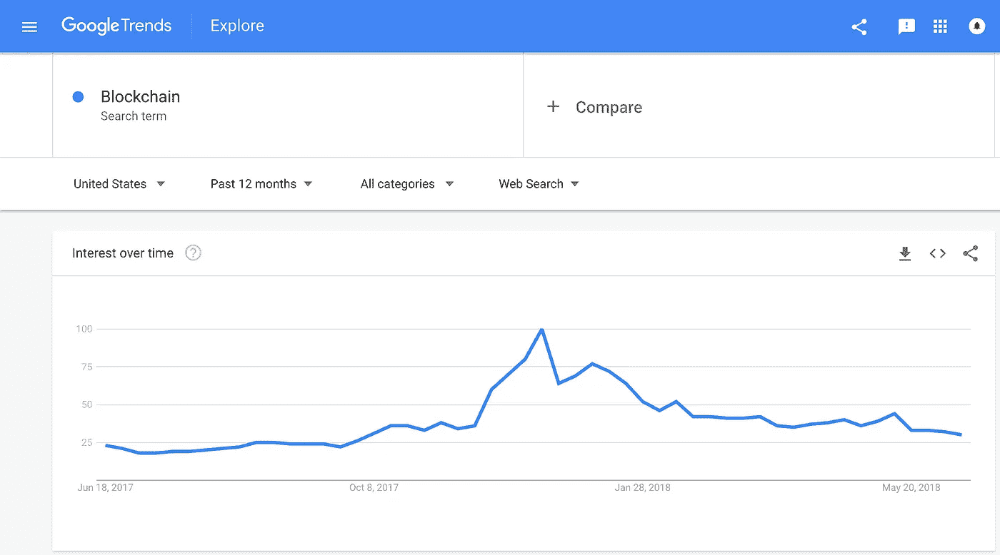
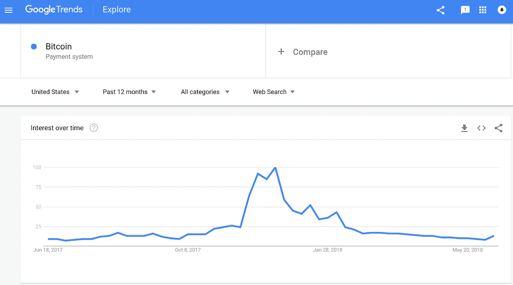

# 下一次经济危机会是加密货币和区块链的终结还是它们的合并？

> 原文：<https://medium.com/hackernoon/will-the-next-economic-crisis-be-the-end-of-cryptocurrencies-and-blockchain-or-their-consolidation-ae9dc7bf0e>

[区块链](https://hackernoon.com/tagged/blockchain)是新的[技术](https://hackernoon.com/tagged/technology)炒作，大多数对技术感兴趣的人都听说过它，很多其他人也在新闻中听说或读到过它，主要是因为它在 2017 年大幅涨价。然而，自 2018 年初以来，人们对这项技术的普遍兴趣大幅下降，根据下面的谷歌趋势图，我们看到 2017 年 12 月的兴趣达到顶峰。很多人可能会问，这是不是加密货币和区块链的终结？最重要的是，特别是对投资者而言，区块链和加密货币能挺过下一次经济危机吗？

正如我们在上面的图表中看到的，“比特币”和“区块链”的搜索数量遵循类似的模式。在过去的几个月里，搜索次数急剧减少，可能是由于比特币价格的下跌，从 2017 年 12 月的 2 万美元降至本文撰写时的 6400 美元。但自去年以来，我心中一直有一个重要的疑问，那就是区块链能否挺过金融危机。鉴于区块链的技术和兴趣在 2010 年才开始增长，同时美国经济和其他国家一样正在从衰退中复苏，它只是看到了整个市场的金融增长。我知道目前有许多国家陷入了巨大的财政困境，西班牙、意大利和希腊就是一些例子，但我们可以说，现在的世界金融比 2007/2008 年更加稳定。我所说的世界是指美国。但事实就是这样，因为美国是世界上最大的金融市场，它一咳嗽，全世界都感冒了。

# **历史重演**

如果你在谷歌上搜索下一次金融危机，你会看到很多文章谈论下一次泡沫可能是什么，或者它会在什么时候发生。但有一件事是肯定的，它会发生，我们只是不知道它会在何时何地开始。有很多指标显示我们离下一场危机越来越近，其中之一就是金融监管的力度。Jihad Dagher 在他关于这个主题的论文(监管周期:重新审视金融危机的政治经济学)中谈到，当金融监管对银行非常宽松时，经济危机是如何发生的，而在危机发生后，这些监管又非常严格。这很重要，因为我们已经进入了对金融机构更加宽容的阶段。唐纳德·川普[最近签署](https://www.cnbc.com/2018/05/24/trump-signs-bank-bill-rolling-back-some-dodd-frank-regulations.html)撤销了大衰退后实施的银行监管。因此，正如标题所言，历史可能会再次重演，并在未来几年内进入衰退。

# **下一场危机将是加密货币泡沫**

我读过很多关于加密货币泡沫的文章，以及它可能如何摧毁世界经济。比特币的价格在不到一年的时间里从不到 1000 美元涨到了近 2 万美元。这是不可持续的，但现在价格已经下降到 7000 美元以下，似乎更加稳定，尽管最近有所下降。由于比特币是同类货币中的第一种，它对所有其他货币的价格仍有很大影响。然而，在这个问题上，我正处于观望的边缘，因为我可以肯定地看到加密泡沫是如何具有毁灭性的。但我也相信，在经济危机期间，它可能是一个安全的地方。

我个人认为价格会再次上涨，并再次达到高位。我唯一担心的是这件事的时机。因为，让我们想象比特币达到 3 万美元的价格，并且预计其他大多数加密货币也将处于历史高点，但与此同时，还有其他金融工具处于崩溃的边缘。如果比特币的价格随着时间的推移慢慢上涨并达到这个价格，那么投资者就会更有信心投资于它，以防其他金融工具下跌。但如果价格像 2017 年一样大幅上涨，那么投资者可能会从加密市场撤出所有资金，并使其比预期更进一步崩溃。因此，如果是后者，那么大多数加密货币将很难回归，但如果所有价格都稳步上升，这可能会向投资者展示加密货币是如何存在的。

一个加密泡沫可能会终结大多数硬币(我相信区块链是下一个大事件，只是不知道是否每个硬币都可能幸存)，特别是因为它们中的许多只是没有工作产品的投机。如果公众的信任因为泡沫而受到伤害，就很难说服人们重新投资这项技术。

然而，如果加密市场向投资者表明它是可靠的，是一项伟大的投资，那么另一种金融工具中的泡沫只会使加密更强大，更可靠。

# **更多关于经济危机周期的信息**

这些关于危机的短文引起你的注意了吗？这是一个我非常喜欢的话题，我认为每个人都应该至少读一点。这是关于图表的技术分析。如果你认为 TA 不起作用或者没用，可以在谷歌上搜索“江恩循环”。长话短说，这个人，威廉·德尔伯特·江恩，是 19 世纪末 20 世纪初的金融交易员，他创造了各种不同的 TA 方法，其中之一就是江恩周期。它描述了金融市场的起伏如何遵循可以估计的周期性周期。在没有进入很多细节的情况下，这些周期表明，在 2019 年至 2022 年之间，可能会出现一次大衰退，可能比上一次更糟糕。请在评论中告诉我你对此的看法。

* *免责声明:我**不是**理财顾问，这不应该**而不是**被视为理财建议。你应该在投资前做好自己的研究。本文中的信息仅反映我的个人观点。

*   *如需更多密码相关信息，请查看我的 **YouTube 频道**:[https://www.youtube.com/channel/UCR7DmzG8UULUuYLLIU7FhLw?view _ as =订户](https://www.youtube.com/channel/UCR7DmzG8UULUuYLLIU7FhLw?view_as=subscriber)