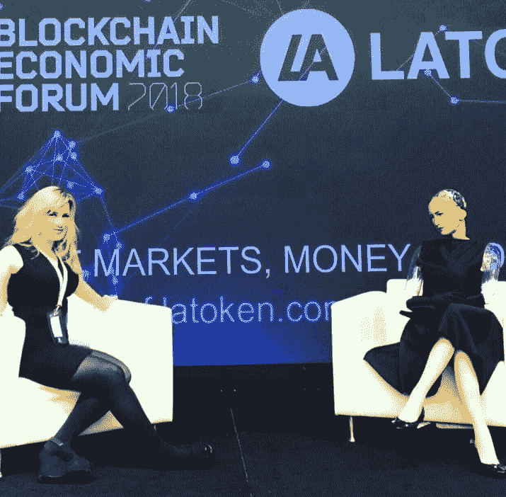

# 请真正的机器人站起来好吗

> 原文：<https://medium.com/hackernoon/will-the-real-robot-please-stand-up-6199e0e1665e>

## AI，区块链，和奇点大学的里斯·琼斯和 Project Shivom 的亨利·伊内斯在区块链经济论坛上的价值[采访]

*马丁巴黎/马丁巴黎大道*

世界上第一个去中心化的 AI 人形机器人索菲亚(Sophia the Robot)与拥有让我们成为人类的数据有什么关系？

“很多！”Shivom 的首席创新官 Henry Ines 在最近的旧金山区块链经济论坛上接受我采访时说。Ines 是 DFJ 龙基金的前合作伙伴，刚刚完成了一项 3500 万美元的 ICO，用于资助 Shivom 基因组中心的建设，现在正在与索菲亚大脑的制造商 SingularityNET 合作，使用人工智能驱动的分析和机器学习工具来推动精准医疗的到来。

“适合你的 Tylenol 可能与适合我的 Tylenol 不同，这就是为什么医学的未来是一种可以根据个体患者的生物学特性定制的药物。为了达到这个目标，研究人员需要挖掘大量的数据集。这就是为什么大型制药公司每年向 23andMe 这样的公司支付数百万美元，以获取人们在邮寄唾液样本时捐赠的数据，从而了解他们的祖先。”

“与此同时，还有一些低收入的土著人口，他们的社会资本为零，但就他们自己的基因构成而言，他们拥有巨大的内在价值。他们的基因可能是解决某些疾病的关键，所以我们想出了一种方法，让他们拥有自己的基因数据并从中获利，方法是将数据记录到区块链账本上，并直接将款项支付给捐赠者。”

我问 Shivom 如何计划大规模采用，因为大多数人还不了解区块链，特别是在欠发达国家，那里的一些人甚至没有管理钱包和钥匙的设备。

“是的，UI/UX 非常重要。我们试图让我们的平台尽可能简单，因为大多数患者都专注于他们的健康，而不是区块链。用户可以购买菲亚特的实体套件，或者只需上传他们的 23andMe 报告。他们的数据被加密、匿名并存储在后端，唯一存储在链上的是他们的 HashID、GlobalID 和任何受密钥保护的交易。用户可以完全控制谁可以访问和许可他们的数据，支付可能是在借记卡上进行的，该借记卡带有可以兑换为菲亚特或医疗服务的令牌。对于印度等地，我们仍在研究这种模式。”

区块链技术允许我们拥有自己的数据并从中获利，这是一个巨大的范式转变。大多数人如此习惯于放弃它，以至于人们只能想象生物数据成为零工经济的一部分所带来的文化分歧。

*马丁巴黎/维亚马丁巴黎*

我有机会与奇点大学的联合创始人兼董事会董事里斯·琼斯进一步谈论这个问题，他在关于进化生命和数据以及人工智能和区块链的作用的会议上做了主题发言。

想到索菲亚，他与我分享了他对即将到来的奇点的见解，在这个时间点上，计算机预计将变得比人更聪明，失控的技术增长将使事情变得不可预测，带来难以想象的后果。

“我们越来越了解作为人类意味着什么，每天都以类似人类的方式做出反应，技术越来越善于将自己表现为有意识的，但人工智能何时以及如何成为物种风险仍在激烈辩论中。在 Long Now 基金会，奇点大学的联合创始人雷·库兹韦尔(Ray Kurzweil)和电子前沿基金会(Electronic Frontier Foundation)的联合创始人米切尔·卡普尔之间有一个长期的赌注:到 2029 年，没有任何计算机或机器智能能够通过图灵测试

如果你看过 Bladerunner，你就会知道图灵测试是一个面试，在这个面试中，一个测试对象会被问一系列问题，以确定他是否是人类。谷歌深度学习背后的策划者库兹韦尔坚信，驱动数据采集和分析的算法的进步足以通过测试，但卡普尔认为，计算机永远无法伪造微妙且无法明确表达或写下的隐性人类体验。

对于任何在 5 月份的 Google IO 2018 上看过 Google Assistant 呼叫餐厅的人来说，对话式人工智能令人印象深刻，肯定具有人类声音的语调。不知道我会把赌注放在哪里，但肯定期待在下一次迭代中见到索菲亚。