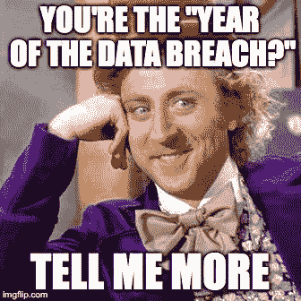
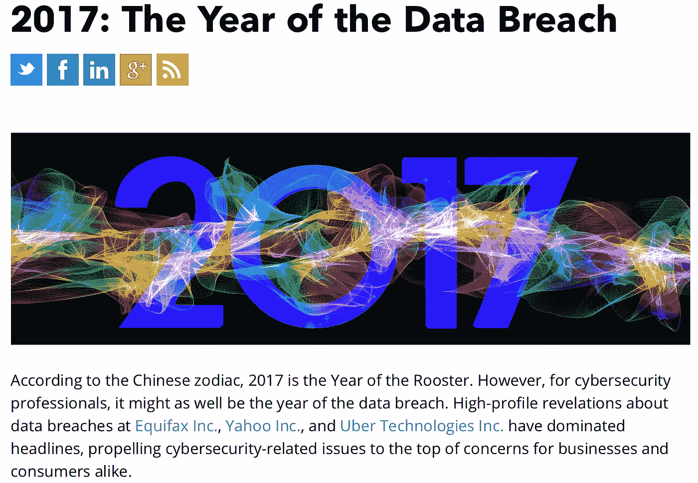

# 真正的“数据泄露年”请站出来好吗？

> 原文：<https://medium.com/hackernoon/will-the-real-year-of-the-data-breach-please-stand-up-744ab6f63615>

我的元旦仪式已经持续了近 10 年:一份迟到的早餐，一杯浓咖啡，浏览安全博客和新闻，这两件事总是让我发笑:新年的网络预测，以及宣布过去一年为“数据泄露年”的回顾会。[凯利·肖特里奇](https://twitter.com/swagitda_?lang=en)[完美地模仿了前者](/@kshortridge/2018-cyber-security-predictions-d493e25162e7)，我实际上认为我们可能会有一年没有后者，直到我在彭博新闻上发现了这个标题，其中 [2017 年被命名为数据泄露之年](https://www.bna.com/2017-year-data-b73014473359/):

Source: Bloomberg; [https://www.bna.com/2017-year-data-b73014473359/](https://www.bna.com/2017-year-data-b73014473359/)

如果你想知道，我以前在哪里见过这个…？每年都快**了。准确地说，是过去 12 年中的 10 年。**

这里是对过去 12 年的回顾和对 2018 年前景的一瞥。

# 2005

2005 年是被许多媒体宣布为“数据泄露年”的第一年，比如信息世界。“数据泄露”一词也在 2005 年进入日常使用，由于数据泄露通知法的颁布，[数据泄露](https://www.troutman.com/files/upload/hutchins-newfrontier.pdf)诉讼增加，以及 [Ameritrade](https://www.theregister.co.uk/2007/09/15/ameritrade_database_burgled/) 、[花旗集团](http://www.nytimes.com/2005/06/07/business/personal-data-for-39-million-lost-in-transit.html)和 [CardSystems](https://www.schneier.com/blog/archives/2005/06/cardsystems_exp.html) 都披露了事故。

# 2006

2006 年是数据泄露的重要一年——主要是美国在线搜索数据泄露丑闻和 T2 美国退伍军人事务部数据泄露事件。这使得[一个博客作者](http://moritzlaw.osu.edu/students/groups/is/files/2012/02/Jones.pdf)和一个安全供应商将 2006 年称为数据泄露年。

# 2007

[Attrition.org](https://www.darkreading.com/vulnerabilities-and-threats/enterprises-arent-shivering-in-their-breaches/d/d-id/1062800)、[身份盗窃资源中心](https://www.darkreading.com/vulnerabilities-and-threats/enterprises-arent-shivering-in-their-breaches/d/d-id/1062800)和加拿大联邦隐私专员在给议会的一封[信中](https://www.priv.gc.ca/en/opc-actions-and-decisions/ar_index/200708/2007_pipeda/)都宣布 2007 年为“数据泄露年”我记得 2007 年有两件事:[布兰妮的悲伤崩溃](https://www.usmagazine.com/celebrity-news/news/britney-spears-shaved-her-head-10-years-ago-relive-her-comeback-w467019/)和 [TJ Maxx 数据泄露](https://www.computerworld.com/article/2544306/security0/tjx-data-breach--at-45-6m-card-numbers--it-s-the-biggest-ever.html)。

# 2008

没什么！2008 年不是数据泄露年！干得好，2008。

# 2009

根据福布斯和安全厂商的[说法，如果 2005、2006 和 2007 年都是数据泄露年，那么 2009 年就是大规模数据泄露年。这是一个大问题，主要是由于心脏地带支付系统](https://www.imprivata.com/intl/node/3289)[的数据泄露](https://www.wired.com/2009/01/card-processor/)导致 1.3 亿条记录受损。

# 2010

在经历了 2009 年的辉煌之后，我们都决定休息一下。

# 2011

在 2008 年和 2010 年不是数据泄露年之后，就好像安全记者、供应商和网络专家都站起来，异口同声地喊道，“再也不会了！永远不会有**不是**数据泄露的一年！”

那是一个好年景。趋势科技[称之为](http://blog.trendmicro.com/trendlabs-security-intelligence/12-for-2012-what-will-the-new-year-bring/)，Brian Krebs 和其他许多人[引用了它](https://krebsonsecurity.com/2011/11/are-you-on-the-pwnedlist/)。最引人注目的事件是索尼 Playstation Network [遭遇长时间服务中断和数据泄露](https://www.reuters.com/article/us-sony-stoldendata/sony-playstation-suffers-massive-data-breach-idUSTRE73P6WB20110427)。

# 2012

一家小型安全厂商[在年终回顾](http://rmsshredding.com/looking-back-over-2012s-data-breaches-and-learning-how-to-protect-your-data/)中，将 2012 年命名为“数据泄露年”，雅虎[、](http://rmsshredding.com/looking-back-over-2012s-data-breaches-and-learning-how-to-protect-your-data/) [Zappos](http://www.zdnet.com/article/amazons-zappos-in-massive-data-breach-24-million-affected/) 和政府部门的几起高调事件占据了新闻头条。根据新西兰隐私专员的说法，这也是“新西兰数据泄露年”。

# 2013

2009 想要回它的形容词。赛门铁克[在《2013 年互联网安全威胁报告](https://www.symantec.com/connect/blogs/2013-internet-security-threat-report-year-mega-data-breach)中称 2013 年为“大规模数据泄露年”，列举了针对中小型企业和政府部门的攻击。由于发生在[塔吉特](http://www.zdnet.com/article/anatomy-of-the-target-data-breach-missed-opportunities-and-lessons-learned/)和[土坯](https://krebsonsecurity.com/2013/10/adobe-breach-impacted-at-least-38-million-users/)的事件，其他人称为“零售商违约年”。

# 2014

假设我们只能有一个“数据泄露年”，2014 年将是最强有力的竞争者。2014 年发生了大量的事件:联合包裹、迈克尔、家得宝、吉米·约翰、史泰博和摩根大通。前面提到的都黯然失色，[世纪黑客](http://fortune.com/sony-hack-part-1/)(根据财富):索尼电影娱乐黑客。

大多数媒体将 2014 年称为“数据泄露年”，还有 [Advisen](https://www.advisenltd.com/2015/01/01/look-back-2014-year-data-breach/) 、[趋势科技](http://blog.trendmicro.com/dont-data-breach-victim-appoint-ciso-late/)和 Tripwire 的[安全状态](https://www.tripwire.com/state-of-security/security-data-protection/cyber-security/2014-the-year-of-the-breach-part-2/)。

# 2015

我宣布 2015 年是“最棒的一年”。这一年是如何报道的:

*   《财富》杂志将 2015 年称为“数据泄露诉讼年”
*   安全厂商 IDM365 称之为“[超级大入侵年](http://blog.idm365.com/2015-the-year-of-the-super-mega-breach/)
*   趋势科技称之为普通的“数据泄露年”然而，趋势科技也宣布 2014 年为数据泄露年。
*   Vice.com 称 2015 年为“医疗违规年”
*   Hacked.com 称之为“[个人数据泄露年](https://hacked.com/2015-year-breach-close-200-million-personal-records-exposed/)
*   GovTech.com 选定了“数据泄露成为隐私的一年”
*   HIPAA Journal 将 2015 年称为“大型医疗数据泄露的[年”](•%09https:/www.hipaajournal.com/healthcare-data-breaches-in-2015-2016-worse-2012)

2015 年，许多美国人受到数据泄露的影响，最引人注目的事件发生在[阿什利·麦迪森](https://en.wikipedia.org/wiki/Ashley_Madison_data_breach)、 [OPM](https://www.wired.com/2016/10/inside-cyberattack-shocked-us-government/) 、[国歌](http://fortune.com/2017/01/09/anthem-cyber-attack-foreign-government/)和[国税局](https://www.usatoday.com/story/money/2016/02/26/cyber-hack-gained-access-more-than-700000-irs-accounts/80992822/)。

# 2016

2014 年和 2015 年之后，人们可能会认为是时候让“年”这个词退休了，换个说法。没有。

一家专门从事数据隐私的[小型律师事务所](https://www.dataprivacyandsecurityinsider.com/2016/12/2016-was-the-year-of-the-data-breach/)、 [SecureWorld](https://www.secureworldexpo.com/industry-news/swwebcon-year-of-the-data-breach) 和[电台主持人](https://www.komando.com/happening-now/384838/2016-the-year-of-the-data-breach?utm_medium=nl&utm_source=notd&utm_content=2016-12-31-article-f)将 2016 年命名为“数据泄露年”。

在一份完全令人费解的声明中，Ars Technica 将 2014 年和 2015 年视为“数据泄露年”，并且[还发布了一项挑战](https://arstechnica.com/information-technology/2016/10/darknet-fraud-terrifying-scope-uk-fastest-growing-crime/):

> 如果专家们不给[2016]贴上“数据泄露年”的标签，就像 21 世纪的中国黄道十二宫一样，他们根本没有做好自己的工作。

# 2017

彭博[宣布 2017](https://www.bna.com/2017-year-data-b73014473359/) 为“数据泄露年”，列举了发生在 [Equifax](https://www.forbes.com/sites/forbestechcouncil/2017/11/29/the-equifax-data-now-that-they-have-it-how-will-hackers-use-it/#c4786ef602cd) 、[雅虎](http://money.cnn.com/2017/10/03/technology/business/yahoo-breach-3-billion-accounts/index.html)和[优步](https://www.theguardian.com/technology/2017/nov/21/uber-data-hack-cyber-attack)的事件。益百利也加入了这股潮流。

# 2018:网络预测

结合我最喜欢的两件事:网络预测和“数据泄露年”宣言，非营利组织[信息安全论坛](https://www.securityforum.org/) (ISF) [称 2018 年将是“数据泄露年”。](https://istart.co.nz/nz-feature-article/fake-news-cyber-security/)

# 结论

关于[消费者数据泄露疲劳](https://blogs.wsj.com/cmo/2014/10/09/data-breach-impact-yougov/)已经写了很多。我毫不怀疑违约疲劳是真实存在的，年复一年，类似这样的头条新闻会助长这种疲劳。当关于网络安全的头条新闻过分夸张时，是时候重新思考我们如何向世界其他地方呈现该行业最紧迫的问题了。目前，宣布一年为“数据泄露年”已经变得毫无意义。我们知道数据泄露每年都会发生。或许，从今年开始，我们可以将一次值得注意的数据泄露称为“年度数据泄露”，而不是将全年命名为“数据泄露年”