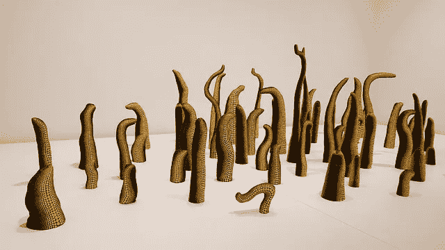

# VR 会杀死书吗？

> 原文：<https://medium.com/hackernoon/will-vr-kill-books-a5fd60719322>

在韦尔比耶艺术峰会上关于数字艺术的演讲中，道格拉斯·柯普兰宣称他认为虚拟现实将标志着书籍的终结，这成为了最近的头条新闻。“也许书被高估了，”他打趣道。“也许它们是通往虚拟现实的过渡技术，我们现在可以摆脱书本了。”

很明显，他的目标是引起争议。毕竟，[库普兰](https://www.coupland.com/)的职业生涯跨越了数字和传统媒体之间的界限，他对竖起羽毛并不陌生。他想让人们说话，他很乐意按下按钮，然后坐在一旁看人们如何回应。

但他的评论，尽管很容易引起点击，却提出了一个有趣的问题，即我们所看到的虚拟现实在讲故事和社会中的作用。虚拟现实有可能从根本上改变我们消费娱乐的方式，但它将“取代”现有媒体的想法似乎是对社会消费媒体方式的严重误解。

如果你愿意的话，想想视频杀死电台明星的时候。

在 20 世纪 60 年代，在电视被广泛采用后，广播一直保持强劲:但是[广播剧几乎销声匿迹了。从 1960 年到 2000 年美国成功的广播剧数量可以用一只手来数(其中有三部是原星球大战三部曲的广播剧改编版！).当然，这并不意味着无线电死亡；相反，它改变了方向。从戏剧和连续剧变成了音乐和脱口秀，有一段时间，我们似乎不再用声音来讲述故事。然后，事情发生了:互联网给了我们播客。突然之间，一个基于声音的故事不需要引起芝加哥所有人的兴趣就能在电视上播出。由于订阅服务，它可以针对更小的受众，并且可以在人们自己的时间接触到他们(这在现代是必要的)。现在有数百个流行的叙事播客，包括一些伪装成老派电台的播客，如](https://en.wikipedia.org/wiki/Radio_drama#1960%E2%80%932000:_Decline_in_the_United_States)[惊险刺激的冒险时间](http://thrillingadventurehour.com/)或[欢迎来到夜谷](http://www.welcometonightvale.com/)。

这不是讲故事唯一的一次演变和发展。人们曾经认为，长期、复杂的叙事，视觉“艺术”，只能在电影中找到。导演写电影；电视是大众的报纸。但在 2000 年代末，电视经历了一次转变；有些人认为我们目前正在经历叙事电视的“黄金时代”。人们经常将这种上升与《黑道家族》联系起来，这是最早鼓励疯狂观看的电视剧之一，它从一集到另一集讲述复杂的故事，并相信观众会跟着看。电视曾经不利于艺术表达，而有利于尽可能广泛的主流观众；现在，由于(再次)互联网的普及，人数不多但专注的追随者往往像黄金时段的号码一样受欢迎。不是说人人秀不想做《权力的游戏》！但它不再是衡量成功的唯一标准。

如果说讲故事是电视游戏的名称，那么它似乎是一种正在全面蔓延的趋势。看看《漫威电影宇宙的崛起》,这证明了即使在绝对的“爆米花”娱乐中，观众也需要凝聚力和叙事流。现在，索尼公司正试图用像《木乃伊》这样的怪物电影和其他即将上映的电影来创造他们自己的互联世界，尽管木乃伊很痛苦地失败了。电子游戏也在追随同样的趋势。

这种向更复杂叙事的转变再一次与技术联系在一起。这一次，是[人工智能](http://thegamedesignforum.com/features/narrative_in_games.html)打开了曾经因技术上的不可能性而关闭的大门。对话树很好，但是它们限制了玩家有限的可能性(并且需要很长时间来编程和编写！).拥有简单的人工智能可以让玩家以新的、更沉浸式的方式参与游戏，沉浸式是游戏的名字。这是 VR 准备在游戏社区做出如此大的改变的原因之一，但 VR 将完全取代它的想法可能仍然是错误的。看看像 [Cuphead](https://www.theverge.com/2017/9/28/16378364/cuphead-art-design-1930s-animation) 这种使用 20 世纪 20 年代风格卡通图形的游戏的受欢迎程度。当计算机图形学第一次出现时，人们可能会争论说它们会消灭传统动画。毕竟，它们看起来很棒，很逼真，让人身临其境！人们还想要什么？不出所料，答案是……艺术。

娱乐总是与艺术携手并进，这是一种复杂的关系，很难理解，更难预测。我们喜欢某事的原因并不总是归结为简单的一对一的交流。我们喜欢沉浸在故事中吗？当然，我们当然知道。但有些人永远不会放弃一本崭新的书的味道。其他人想要明亮、不切实际的颜色和闪烁的灯光，或者，见鬼——他们可以迷恋的可爱的名人。

所以，当道格拉斯·柯普兰说虚拟现实将取代书籍时，他真正想说的是，他从根本上误解了人类为什么消费艺术和娱乐。VR 会取代书籍吗？不会。它会取代电子游戏吗？大概不会。这是一种全新的媒体，有足够的空间让它和它的前身并存。毕竟如果其他人都可以在一起相处的这么好，VR 为什么不可以呢？

*由鹪鹩 Handman 为***所写。**