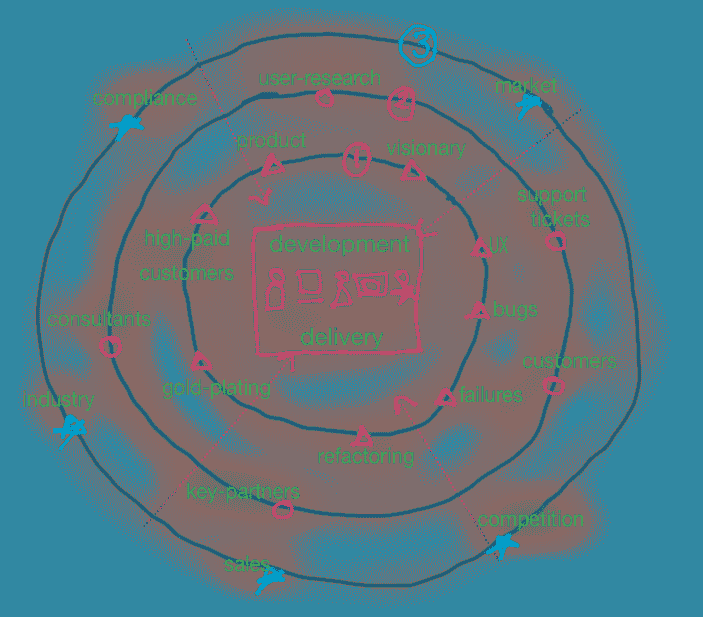
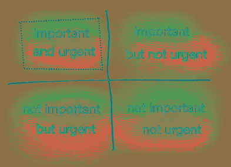

# 你会在你的有效载荷上加一个西红柿吗？管理范围蔓延。

> 原文：<https://medium.com/hackernoon/will-you-add-a-tomato-to-your-payload-managing-scope-creep-910d90a9801f>

## 范围切割是一个特征。在接受变更请求之前，先问这两个问题。

Will you add a tomato to your payload?

土星五号的有效载荷为 14 万公斤。一个中等大小的番茄重 120 克。按重量计算，它是有效载荷的 0.000086%。看起来这不会对有效载荷产生太大的影响，但是你会给有效载荷增加一个番茄吗？

软件项目的问题是很难找到这样的西红柿。其中许多是[镀金](https://en.wikipedia.org/wiki/Gold_plating_(software_engineering))，增加了客户没有要求的增强功能。

> "范围切割是一个特征."

这是否意味着您既不应该就范围进行协商，也不应该接受变更，或者遵循计划？

**你反对敏捷价值观吗？**

两个[敏捷价值观](http://agilemanifesto.org/)是*合同谈判中的客户协作*和*按照计划应对变化。*这如何适用于范围？为了理解这一点，你应该找到西红柿的来源。

**谁要求你在有效载荷中添加一个番茄？**

是客户，还是客户代表？问题是我们不再有一个客户了。变更请求可能来自产品团队、一个小的 UX 变更或许多其他来源，如下图所示。

Scope change can come from different sources

> 通常情况下，客户价值可能不是来自于客户，甚至可能不是一种价值。这些是西红柿。

争论和理解是客户价值还是西红柿总是更好。

# 管理范围的两个问题:

## **1。你要把番茄加到有效载荷里吗？**

在您开始开发之前，与客户确认是否需要更改是非常重要的。即使在发货后，这也是至关重要的。

最好是在噪声进入信号之前将其消除。所以，最好养成问零钱是不是西红柿的习惯。如果你发现零钱不是一个西红柿，那么现在就检查你是否需要它。

## **2。需要现在加吗？**

可以试试大家熟知的[艾森豪威尔决策矩阵](https://www.artofmanliness.com/2013/10/23/eisenhower-decision-matrix/)。

What is important is seldom urgent and what is urgent is seldom important. — [Eisenhower](https://www.artofmanliness.com/2013/10/23/eisenhower-decision-matrix/)

如果范围变更出现在“重要-紧急”象限中，则确定优先级。如果你意识到改变比计划的工作更重要，那么使用[一个进一个出。](https://en.wikipedia.org/wiki/One_in,_one_out_policy)

**这两个问题就像闸门一样。**

## 总结想法

范围变化并不坏，只要你能管理好它。你应该知道这是信号而不是噪音。一旦你知道这是信号，优先考虑。把你运送的所有东西都当作有效载荷的附加物。这两个问题可以作为闸门，帮助您管理范围。

1.  你会在有效载荷中加入番茄吗？
2.  **你需要现在添加吗？**

> "对变化做出反应，不要让它蔓延。"