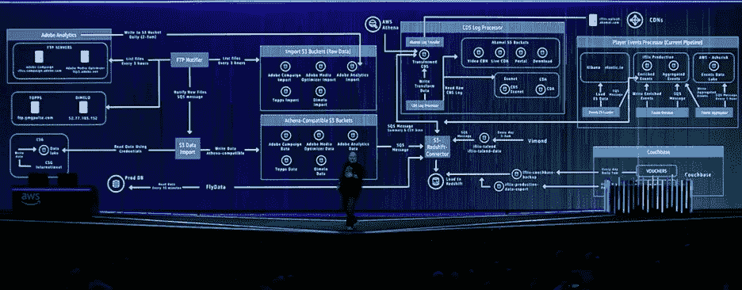
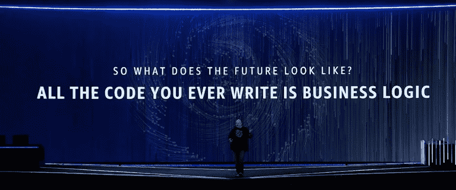
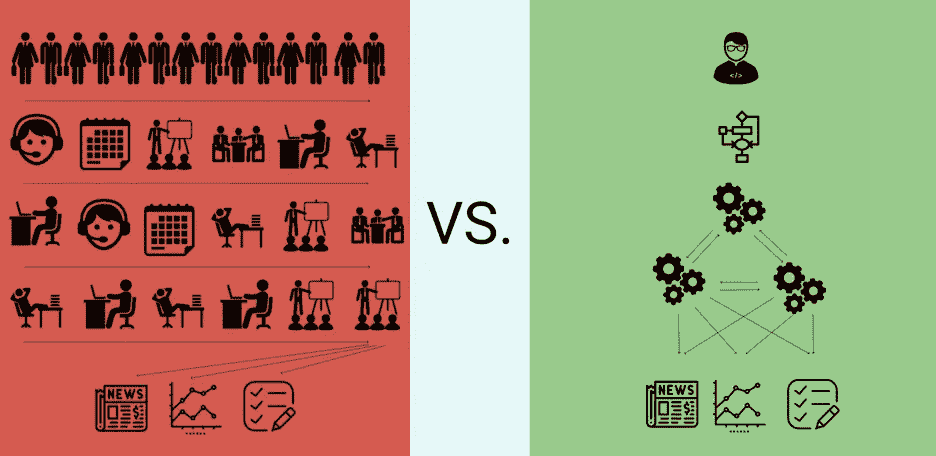

# 你的公司会定义工作的未来吗？

> 原文：<https://medium.com/hackernoon/will-your-company-define-the-future-of-work-a69075a9d59>

# AI 会如何(像电影里那样)重新定义它？

谷歌的一套 [AutoML](https://hackernoon.com/tagged/automl) [工具](https://hackernoon.com/tagged/tools)于 1 月份与 AutoML Vision 一起推出，通过允许很少或没有 ML 能力的开发人员使用谷歌的系统自动创建机器学习模型，向许多公司释放机器学习的力量。Vision 产品已经比任何人类创造的模型都要好 10%，并且计划使用语音识别和翻译工具，因此值得提出这样一个问题:“用于人类办公室工作人员协作的 AutoML 能否将工作人员协作提高 20%-40%？做了近 20 年的文职人员，我的猜测是一个响亮的“是”。

# 真的有那么大的提升空间吗？

在过去的十年中，由于 AWS 等服务、Git 等开源组件以及 Agile 等方法的广泛采用，软件开发人员的平均产出增长了 10 倍。与此同时，销售、营销、支持、法律和金融等行业员工的生产率是否以同样的速度增长，令人怀疑。办公室工作通常比二进制的“hello world”软件开发更加定性，但是软件和商业工作者之间的生产率差异仍然很大。软件人员会想“我已经做了两次了，我还得再做一次，我怎么能让它自动化呢？”他们也敏锐地意识到语境转换的[危险](https://www.joelonsoftware.com/2001/02/12/human-task-switches-considered-harmful/)，并设定他们的时间以避免任务转移。商务工作的结构不一样，不必要的电子邮件、无结构的会议、重复的报告和臃肿的 PowerPoint 演示文稿。这些现行的商业工作方法阻碍了公司的生产力。如果 AutoML 拥有电影中人工智能的力量，将人类从我们这一代的电梯操作员工作中解放出来，它会制造出什么样的产品？

# AWS 会怎么做？

首先要研究亚马逊的亚马逊网络服务(AWS)团队在自动化和加速软件构建方面做了些什么。AWS 通过将软件应用程序的几乎每一个组件都变成可以像公用事业一样打开/关闭的服务，为开发人员消除了大量工作。这个概念已经扩散到他们提供 123 种不同的产品，可以通过复选框和同一张信用卡打开。然后，AWS 将来自这些服务的数据与一组一致的应用程序编程接口(API)连接起来。这张来自 AWS re:Invent 会议的图片展示了如何为开发人员设计这些类型的系统。

*AWS CTO 上台 AWS 重新发明

我们的目标是使复杂的架构图，就像这张图片中的图一样，对任何开发人员来说都是补救性的。因此，当服务和 API 如此容易地串在一起时，“你所写的所有代码都是业务逻辑”(亚马逊首席技术官沃纳·威格尔。)

# 定义商业工作的未来

Vogel 的未来可能不会立即出现在商业工作者的面前，但基于这种服务、API 和业务逻辑生成器的产品将成为明天最成功的公司。从这个角度来看，我的猜测是 AutoML 将克隆 AWS 的开发方法，并产生一批全新的公司来自动化和加速可重复的工作。为了获得相同的最终可交付的报告、策略和支持，这种方法可以磨掉会议、繁忙的工作和政治。一些聪明的商业逻辑学家将能够消除今天需要几十个人才能完成的工作。之前和之后会是这样的:

有些人，比如 Naval Ravikant，声称我们将会看到一个创始人价值 10 亿美元的公司。虽然这可能在一段时间内不会发生，但有一系列公司已经在采用这些方法来推动业务团队实现潜在的 10 倍收益。许多仍处于萌芽状态，或者表现为微小的增量变化，但它们是不可避免的。

# 应用成为服务

一批新的服务公司正在发展。从表面上看，它们可能看起来像上一代应用程序，但它们在行业中的影响可能会大不相同。它们的设计能够显著提高生产率。比如[**Figma**](http://www.figma.com) 就是设计师的 SaaS 工具。它受益于模板化和版本化设计项目的开源方法。当设计指南被填充到 Figma 中时，它使设计人员能够加快他们的工作流程，并更快地与开发人员协作。 [**MixMax**](http://www.mixmax.com) 是销售团队自动化预约设置的工具。销售邮件被视为开发人员对待代码片段，测试其准确性，就像 web 开发人员测试转化率一样。 [**Lyrebird**](http://www.lyrebird.com) 自动化销售人员的声音，以便他们可以自动化每个电话的介绍部分。对于律师助理来说， [**Casetext**](http://www.casetext.com) 通过在几分钟内将相关的案例法查询到具体的摘要，将几周的人工工作浓缩到几分钟内。对于作者， [**GitBook**](http://www.gitbook.com) 为作者提供 Github 工作流审核流程，以便通过修订工作。对于一般的业务工作，[**idea**](http://www.notion.so)和 [**Coda**](http://www.coda.io) 为任何人提供了开发者创建和发布协同工作的权力。最后，对于所有业务用户 [**超人**](http://www.superhuman.com) 重新设想了具有更多上下文知识和相关建议的电子邮件客户端，以使每个电子邮件会话的效率提高一倍。能够将每个分散的工作项目转化为可以提高生产的服务的公司的名单每天都在增加，并且能够以更少的劳动力完成未来的工作。

# API 提供上下文

当 it 拥有应用程序编程接口(API)时，从这些服务生成的所有数据对企业的影响甚至会更大。由于 AutoML 希望进一步加快办公室工作，它将寻求许多公司将这些数据连接在一起，并开始进一步处理工作。商业团队生产力的最大杀手之一是环境转换，有些人甚至称之为对大脑有害。在应用程序之间移动会极大地破坏流程，因此 API 将是未来的关键工作。例如， [**部门**](http://www.segment.com) 是一家将 200 多个企业应用程序连接在一起以执行个性化客户跟踪等任务的公司。 [**Slack**](http://slack.com) 是一款协作产品，拥有丰富的 API，使数百个机器人能够在正确的时间用正确的信息更新员工协作。 [**Zapier**](http://zapier.com) 是一个商业工具，它将 1000 多个应用程序集成在一起。它在一个应用程序中启动工作流并在另一个应用程序中完成该操作的扩展功能模糊了 AutoML 自动化算法的最后一个关键主题:商业逻辑公司。

# 业务逻辑控制服务交付的内容

虽然服务可以提高生产力，但它们只是工具，虽然 API 可以提供惊人的上下文知识，但它们仍然需要规则来定义它们做什么。商业逻辑公司是沃纳·威格尔提到的缺失环节。他设想了这样一个世界:服务如此自动化，API 如此一致，以至于软件编程的最后一点就是编写业务逻辑。今天的商业逻辑公司通常需要很长时间才能建立起来，但一旦它们达到临界质量，它们就会变得根深蒂固并占据主导地位。对公共软件市场的快速浏览表明，具有主要工作流组件的产品已经发展成为最大的 SaaS 公司: **Salesforce、Workday、ServiceNow 和 Atlassian** 。虽然这些公司现在有许多产品，但他们建立了自己的特许经营权的核心产品是围绕管理工作流而构建的。

除了这些领导者，AutoML 可能还会倚重一家名为 [**UIPath**](http://uipath.com) 的相对较新的公司，该公司的使命是“通过智能使用软件自动化来消除重复性任务”每当构建的人类算法变得如此容易理解，可以在商业流程中设计时，它们就可以训练机器人来完成这项工作。

# 你的公司会赢吗？

我确信，像前面例子那样设计产品的公司有巨大的上升空间。当我在凯鹏华盈(Kleiner Perkins)开始我的常驻企业家之旅时，我的目标是找到志同道合的企业家，他们从这个角度看世界，并与他们一起建立世界上最伟大的新公司。如果这也是你的激情所在，伸出你的手。

关于作者:Daniel Freeman 曾在领先的企业软件公司担任产品、营销和销售领导职务，如 Atlassian、Cloudflare、Sumo Logic 和 Symantec。