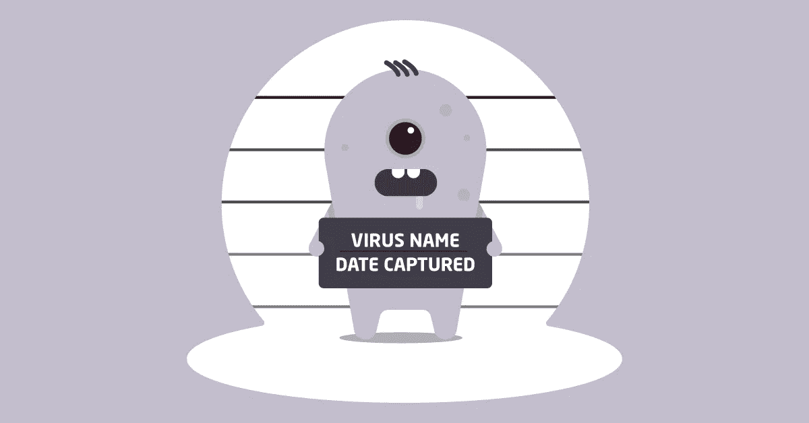

# 你的弹性集群会被黑吗？

> 原文：<https://medium.com/hackernoon/will-your-elastic-cluster-be-hacked-e280f3393cd1>

今年 1 月，超过 1100 名 NFL 球员和他们的经纪人发现他们的个人数据被泄露，并被勒索赎金。由于 Elasticsearch 安全漏洞，这成为可能。

安全技术提供商 Kromtech Security 的报告显示，部署在 AWS 上的近 4000 台 Elasticsearch 机器已经感染了 JackPOS 和 AlinaPOS 恶意软件。这些集群形成了一个巨大的僵尸网络，窃取和加密信用卡信息等个人数据。

恶意软件将自己伪装成 Java 实用程序，保存在%APPDATA%目录或 Java 相关软件的任何其他子目录中。恶意软件正在感染其他机器，在这个过程中向罪犯发送加密数据，或者要求赎金以将数据归还给合法所有者。

这怎么可能呢？当它出来时，版本 6.0 以下的 ES 安装包创建了 3 个默认用户:elastic、logstash 和 kibana，使用“changeme”密码。很明显，这些密码应该立即被替换为强个人密码，但是许多管理员松懈下来，忘记了这个过程。

结果，多达 4000 台弹性搜索机器(其中 99%部署在 AWS 上的**)被感染。AWS 有一个详细的 ES 设置/配置指南，但似乎大多数管理员只是简单地点击下一步，下一步，下一步，确定或选择快速安装选项，忽略了整个安全配置。这种情况在[弹性文章](https://discuss.elastic.co/t/ransom-attack-on-elasticsearch-cluster/71310)中有更详细的阐述。**

# **如何保护您的弹性集群？**

**Elastic 没有闲着，发表了一篇博文，指导如何保护 Elasticsearch 机器。第一个建议是更新到最新的 ES 版本，很明显…公司竭尽全力消除管理员跳过初始密码设置的可能性。**

**例如，现在甚至在集群内部也需要 TLS 连接，并且检查其设置是否正确现在是引导过程的一部分。此外，名为“*xpack . security . authc . accept _ default _ password*”的安全设置禁止在生产 ES 集群上使用默认密码。最后，配置好的 CLI 工具会自动为所有 es 默认用户生成随机引导密码，以消除黑客在安装集群和发布强永久密码之间的短时间内获得访问权限的机会。**

****

**我们建议执行以下步骤来保护您的 ES 群集:**

*   **将您的 ES 更新到[最新版本](https://www.elastic.co/downloads/elasticsearch)(撰写本文时为 6.0)。从头重新安装 ES 会更好**
*   **阻止所有不使用的端口的外部访问**
*   **将可信 IP 列入白名单**
*   **检查并监控所有服务器上的所有日志、连接和网络流量**
*   **在怀疑存在安全漏洞后，最好立即重新安装所有被入侵的机器，以避免数月内对每台机器进行分钟监控。**

**虽然看起来很平常，但这些行动将大大增加保护您的敏感数据和避免 Elasticsearch 恶意软件感染的机会。**

# **关于如何保护您的弹性集群的最终想法**

**在 IT Svit，我们从一开始就意识到了易受攻击的默认密码，并付出了额外的努力来保护我们的客户。在所有要求使用弹性集群的项目中，我们利用第三方身份验证模块来防止任何通过弱 ES 身份验证协议的潜在安全漏洞。**

**您确定您的管理员在将 Elasticsearch 集群部署到 AWS 时没有跳过安全配置吗？你的密码足够强吗？遵循上述简单步骤，确保客户敏感数据的安全，让您高枕无忧！**

**最初，我把这个故事贴在了我公司的博客上——https://itsvit.com/blog/will-elastic-cluster-hacked/**