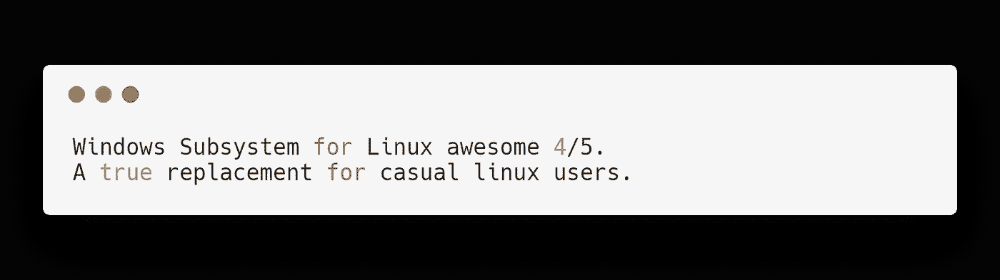
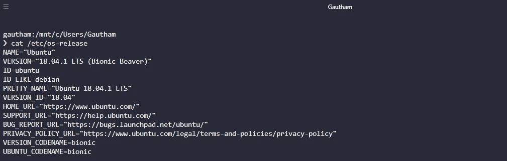
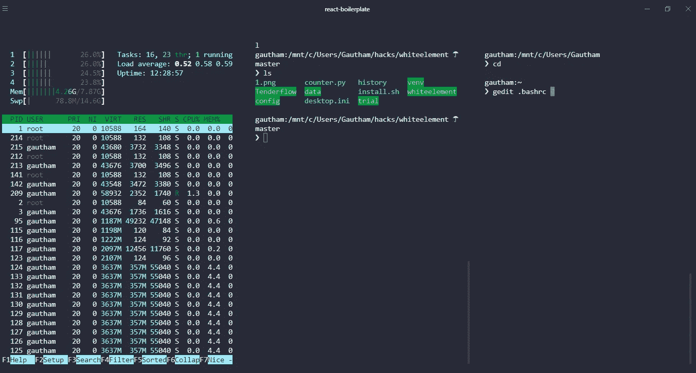
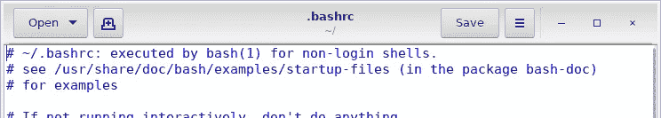

# windows Linux 子系统(WSL)评论

> 原文：<https://medium.com/hackernoon/windows-subsystem-for-linux-review-981aa7bfa43d>

## 用于 Linux 的 Windows 子系统

> WSL 提供了一个微软开发的兼容 [Linux](https://en.wikipedia.org/wiki/Linux) 的内核接口(不包含 [Linux 内核](https://en.wikipedia.org/wiki/Linux_kernel)代码)，然后可以在其上运行一个 [GNU](https://en.wikipedia.org/wiki/GNU) [用户空间](https://en.wikipedia.org/wiki/User_space)，比如 [Ubuntu](https://en.wikipedia.org/wiki/Ubuntu_(operating_system)) 、 [openSUSE](https://en.wikipedia.org/wiki/OpenSUSE) 、[SUSE Linux Enterprise Server](https://en.wikipedia.org/wiki/SUSE_Linux_Enterprise_Server)、 [Debian](https://en.wikipedia.org/wiki/Debian) 和 [Kali Linux](https://en.wikipedia.org/wiki/Kali_Linux) 。

因此，简单来说，您可以编写 bash 命令，并继续使用这个奇妙的终端。这可能是你成为开发人员后唯一的好朋友。

几年前，当微软发布 WSL 时，我检查过它，它还不够成熟。但是最近用了之后，发现它给了简单用户一个小小的 Linux 杀手。

我做一些机器学习、网页开发和一些基于区块链的开发。对于我的使用，我发现 WSL 已经足够了。我在我的 Windows 10 上安装了 Ubuntu 18，它运行得非常流畅。

# 转变的原因

## Linux 有时候会痛。

我花了很多时间在 Linux 上搜索一个简单的问题，但是没有足够的支持。主要是驱动程序或软件。而另一方面，windows 对驱动程序的处理一直很出色。

一个最奇怪的感觉是很长时间后点击和安装应用程序，而你一生都在终端上度过。Idk 为什么大多数事情在 Linux 中很难做到，这就是为什么我喜欢 Arch 和它的简单性。

但是在 Linux 中破解软件包是一件痛苦的事情。

## 双启动，虚拟机都很烂。

Idk 人们是如何做到的，从一个操作系统转换到另一个操作系统听起来只是纸上谈兵。在现实生活中，这是一种痛苦。我喜欢坚持一个 OS。我看到我的朋友重启笔记本电脑来改变程序，我从来没有这样做过。

另一方面，虚拟机应该提供一个很好的解决方案。而是它们太慢了。

## 微软已经不烂了。

曾经有一段时间，微软反对一切 OSS。但是现在他们更成熟了，接受了开放并不是那么糟糕。在收购 GitHub 和开源一些关键项目后，他们正在成为 OSS 领域的重要参与者。

我认识的大部分人都用 VS 代码。他们不再那么糟糕了。

## 几乎一切正常。

TBH:我需要的一切都正常。但我有时会发现，有些东西不起作用。在过去的 1 个月里，我使用 WSL 没有遇到任何问题。

在软件包管理器方面，我尝试了 pip、npm(yarn)和 apt，它们都非常好用。

我的设置需要使用 Hyper，我将 bash 设置为默认设置。所以它就像我的 Linux 发行版一样开放运行。奇怪的是，Hyper 是我发现在 Linux 中使用起来很奇怪的东西，但它在 Windows 中是如此的流畅和更好。

Hyper being used on WSL.

## GUI 有效！

这是对 WSL 的一个普遍误解，人们认为他们不能运行基于 GUI 的 Linux 应用程序。

这个小黑客是需要的 btw:[https://virtualizationreview . com/articles/2017/02/08/graphical-programs-on-windows-subsystem-on-Linux . aspx](https://virtualizationreview.com/articles/2017/02/08/graphical-programs-on-windows-subsystem-on-linux.aspx?m=1)

How GUI of Gedit looks in WSL

嗯，这不是最好的图形用户界面，它的作品。

反正你现在可以玩游戏了。无需重启，让我们所有人浪费更多的时间。

WSL 并不完美。

这个子系统不能运行所有的 Linux 软件，比如 32 位二进制文件，或者那些需要 WSL 中没有实现的特定 Linux 内核服务的软件。由于 WSL 中没有“真正的”Linux 内核，所以内核模块，比如设备驱动，是无法运行的。

目前它用于开发应用程序，这是大多数人使用 Linux 的目的。除非你是一个很酷的服务器端的家伙，他用一台咖啡机为你制作了一台，否则 WSL 会很适合你。

*感谢您的阅读。如果你喜欢这篇文章，就给它鼓掌👏。*

如果你喜欢这篇文章，请考虑给我买杯 https://www.buymeacoffee.com/gautham 咖啡。

*如果你想聊天，* [*DM 我在 https://twitter.com/gauthamzzz*](https://twitter.com/gauthamzzz)*。*

我是阿拉哈巴德印度信息技术学院的一名硕士研究生。我的网站【http://gauthamzz.com】**。**

*我正在做一个客户反馈追踪器访问[https://www.featuremonkey.com/](https://www.featuremonkey.com/)，它是 [canny](https://www.featuremonkey.com/alternatives/canny) 、 [hellonext](https://www.featuremonkey.com/alternatives/hellonext/) 、 [uservoice](https://www.featuremonkey.com/alternatives/uservoice/) 的一个很好的替代品，可用于[功能请求追踪](https://www.featuremonkey.com/features/feature-request-tracking/)、[内部反馈](https://www.featuremonkey.com/features/internal-feedback/)、[公共路线图](https://www.featuremonkey.com/features/public-roadmap/)等*