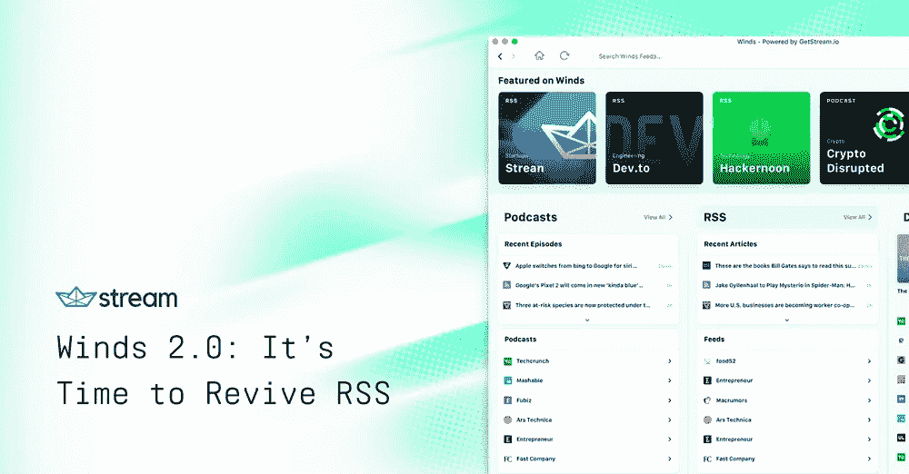
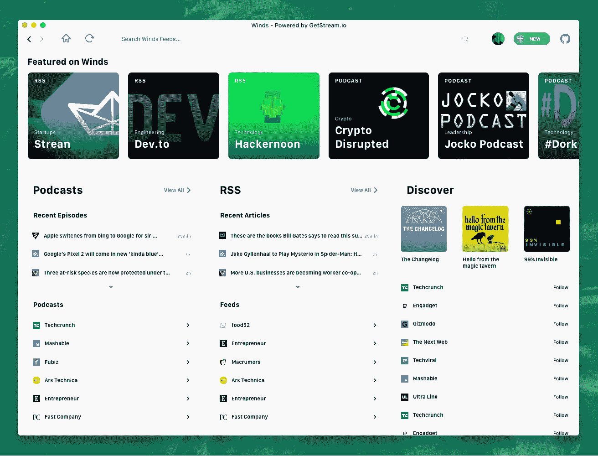

# Winds 2.0:是时候复兴 RSS 了

> 原文：<https://medium.com/hackernoon/winds-2-0-its-time-to-revive-rss-5c627757126>

我喜欢用 RSS 来跟踪我关心的节目和科技新闻。不幸的是，在过去的几年里，支持 RSS 的网站数量一直在快速下降。读者生态系统也在慢慢退化。脸书和 Twitter 的统治地位现在给 RSS 的开放标准带来了最后一击。

是时候扭转局势了。 [Stream](https://getstream.io/) 正在发布 [Winds 2.0](https://getstream.io/winds/) ，一款开源播客& RSS 阅读器。你可以在这里下载 Winds [或者前往](https://getstream.io/winds/) [Github](https://github.com/getstream/winds) 获取代码。

RSS 的许多高级用户是开发人员、设计人员和记者。我们希望一起打破平衡，重新振作起来。在社区的帮助下，我们可以建立一个完美的、没有 bug 的、足够受欢迎的 RSS 体验，来说服出版物改善他们对开放标准和 RSS 的支持。

Winds 还不完美，不过我们正在努力，在你的帮助下，我们可能会设法# **恢复**

*   [Github 上的星风](https://github.com/getstream/winds)
*   在[产品搜索](https://www.producthunt.com/posts/winds-2-0)上分享您对 Winds 功能和路线图的反馈
*   [关于风的推文& RSS](http://bit.ly/winds-tweet)
*   请你喜欢的出版物修复和/或实现 RSS 支持
*   写关于风和 RSS 的文章
*   [促成 Github 上的风](http://github.com/getstream/winds)

非常感谢:

*   [Hackernoon](https://hackernoon.com/stream-go-news-feeds-for-over-300-million-end-users-b227614cf32f) 分享这条消息
*   [dev to](https://dev.to/)让社区参与进来
*   [产品搜索](https://www.producthunt.com/)获取产品反馈
*   我在 [Stream](https://getstream.io/) 的同事们在建造和赞助风能
*   赞助风的[阿尔戈利亚](https://www.algolia.com/)
*   [MongoDB](http://mbsy.co/mongodb/228644) 帮助促销

当然，非常感谢在 [Stream](https://getstream.io/) 的 devrel 团队，他们把最初的应用程序作为一个例子，并把它变成了一个如此美好的体验！

[下载 Winds](https://getstream.io/winds) 或者在 [GitHub](https://github.com/getstream/winds) 上查看代码。

*本文最初由*[*getstream . io*](https://getstream.io)*的 CEO Thierry Schellenbach 撰写。原帖可在*[https://getstream.io/blog/winds-2-0-its-time-to-revive-rss/](https://getstream.io/blog/winds-2-0-its-time-to-revive-rss/)*找到。*