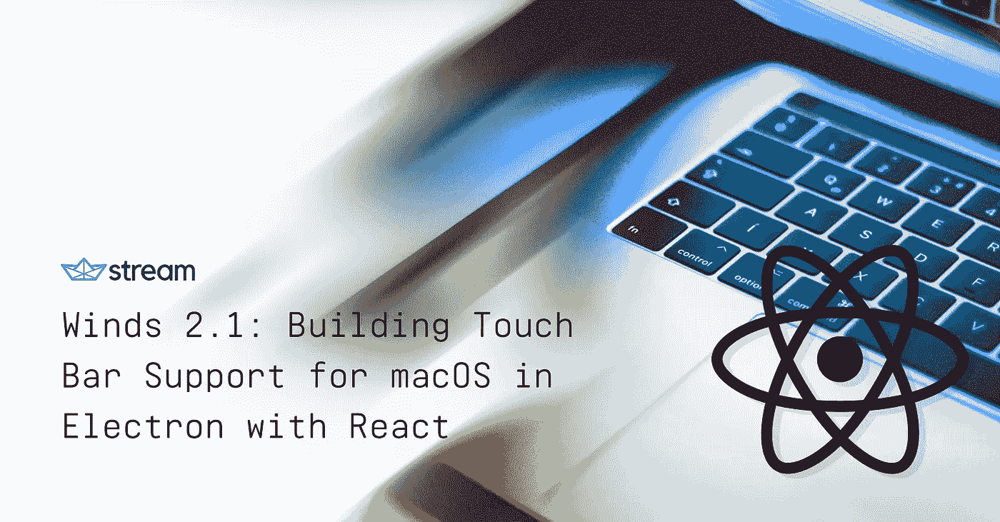

# Winds 2.1:用 React 为 macOS 构建 Touch Bar 支持

> 原文：<https://medium.com/hackernoon/winds-2-1-building-touch-bar-support-for-macos-in-electron-with-react-e10adb811c91>

最近，科技/硬件领域最新、最酷的创新之一是苹果去年在 MacBook Pro 上发布的 touch bar。随着这些机器变得越来越受欢迎，越来越多的应用程序正在利用 touch bar 以一种新的方式与用户进行交互。随着我们观察这一趋势的发展，我们认为这似乎是一个有趣的挑战，因为我们过去几个月的宠物项目 [Winds 2.0](https://getstream.io/winds) 在本月早些时候首次亮相。

随着我们继续根据社区反馈对 Winds 进行迭代，现在似乎是在 [EventEmitter](https://codeburst.io/announcing-winds-2-1-more-features-stability-and-pure-awesomeness-c109484fa1bf#events_class_eventemitter) 类的一个实例。当在主进程中使用时，它处理从呈现器进程(网页)发送的异步和同步消息。从渲染器发送的消息被发送到该模块，由事件处理程序拾取，然后传递给函数进行进一步处理。

## 从电子设备发送和接收

在 [/app/public/electron.js](https://github.com/GetStream/Winds/blob/master/app/public/electron.js) 中，一旦窗口准备好显示，我们就初始化以下代码:

事件属性指定发生了什么，而参数可以是单个值或键值对的对象。对于 Winds，我们选择使用一个对象，这样我们就可以传递额外的元数据(来自前端)，比如当前的剧集标题和播客名称。

# ipcRenderer 模块

ipcRenderer 模块是 EventEmitter 类的一个实例。它提供了一些方法，允许您从呈现器进程(web 页面)向主进程(electronic)发送同步和异步消息。

理解通信如何工作是我们获得媒体控制支持的第一步。为了更好地理解它的工作原理，我们来看几个简短的代码示例:

## 从 React 发送和接收

在[/app/src/components/player . js](https://github.com/GetStream/Winds/blob/master/app/src/components/Player.js)中，我们使用了***window . ipcRenderer***，由于 IPC renderer 不是直接可用的，因此需要我们将其从窗口对象中拖出:

**和**

因此，说了这么多，做了这么多，我们可以使用播放器上下文来区分正在播放的剧集和暂停的剧集。它看起来像这样:

**对生命周期事件做出反应**

在***componentidmount()***上，我们使用以下处理程序来确保我们的传入事件被拾取。

***注意*** *:我们通过*[*is-electronic*](https://www.npmjs.com/package/is-electron)*节点模块将我们的代码包装在一个电子检查中，以确保我们只在电子环境中执行它——这很重要，因为我们有*[*web*](https://winds.getstream.io)*和* [*本地版本*](https://getstream.io/winds) *。*

在***componentWillUnmount()***上，我们使用下面的处理程序来确保*的所有*监听器都被销毁:

# 电子触摸条 API

正如本文前面部分所指出的，我们在我们的 electron.js 文件中初始化 ipcMain。但是等等，还有更多…我们*还有*有一部分代码专门用于处理传入(和传出)消息，除了切换触摸栏图像，以及处理触摸栏事件:

这个函数应该放在 main.js 文件中，或者在我们的例子中，放在 [electron.js](https://github.com/GetStream/Winds/blob/master/app/public/electron.js) 文件中。

# 最终产品

所有这些都为 Winds 2.1 提供了一个非常棒的触摸栏功能，允许我们的用户在 Winds 中暂停和播放播客剧集，查看当前正在播放的播客，并向前和向后搜索。

随着我们继续开发这款应用程序，并且[收到来自我们令人敬畏的社区的反馈](https://github.com/GetStream/Winds/issues)，我们希望继续增加用户与 touch bar 互动的新方式，让人们对他们与 Winds 的每一次互动都感到惊喜。

# 结束语

我希望这篇小教程能帮助我们理解主进程(电子)和渲染器(反应)之间的通信。如前所述，API 还没有完全实现，所以在这个过程中你可能会遇到一些小问题——欢迎在评论中发表；我很乐意帮忙！

如果你认为我错过了什么，请在下面的评论中留言或者在 Twitter 上找到我— [@NickParsons](https://twitter.com/@nickparsons) 。