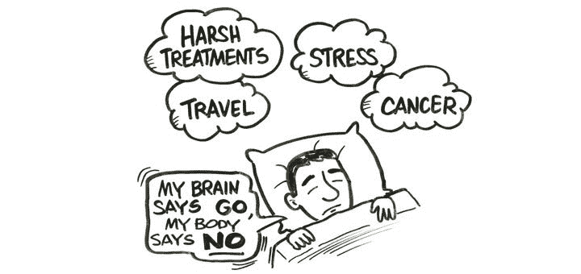

# 冬季冬眠:如何应对持续的疲劳

> 原文：<https://medium.com/hackernoon/winter-hibernation-what-to-do-with-continuous-tiredness-96a64ea1cdcb>

如果你精力充沛，那么克服困难就容易多了。但是保持能量的增加并不是一件简单的事情，尤其是在冬季。我的目标是帮助你在内在力量耗尽时找到新的生命。

**我们为什么会进入“冬眠”？**

慢性疲劳综合征(CFS)——一种[健康](https://hackernoon.com/tagged/health)状况，感觉疲劳增加，工作能力降低，注意力下降。通常，头痛或肌肉疼痛开始发作，或者开始出现睡眠障碍，如失眠和[睡眠呼吸暂停](https://www.youtube.com/watch?v=Dx4QgdN_hI4)(睡眠中呼吸暂停或浅呼吸)。此外，这些“症状”不会在好好休息后消失，就像正常疲劳的情况一样，这时睡八小时觉或短暂休息就足够了。通常，出现慢性疲劳的原因是频繁的长期压力、睡眠不良或缺乏睡眠、不健康的饮食、酒精和吸烟成瘾以及激素紊乱。

诊断 CFS 并不容易，因为症状列表太广泛了。然而，在加州大学圣地亚哥分校的科学家最近进行的一项研究中，发现所有患有慢性疲劳综合症的人都有细胞新陈代谢缓慢的现象。在这种情况下，所有的生物过程都被抑制，机体状况类似于动物的冬眠。身体应该会收到一个信号，即不再有压力来退出节能状态。根据研究人员的说法，这样的“信号”是有规律的八小时睡眠——长时间缺乏睡眠会导致神经系统和大脑的工作出现故障。

**吃什么可以避免疲劳？**

主要的能量来源是食物。如果营养不均衡(蛋白质、脂肪和碳水化合物的平衡被打破)，那么一段时间后体力下降是不可避免的。一个生动的例子是碳水化合物饮食。在许多情况下，饮食干预会导致身体疲惫、快速疲劳、冷漠和抑郁。此外，总能量消耗的 20%用于消化过程，尤其是消化蛋白质。但是专家指出，消化食物，富含所谓的“T0”异生素“T1”——对活的有机体来说是外来的合成物质——迫使身体消耗更多的能量来确保清除这些有害化合物。

我建议将习惯性食物多样化，包括低脂肉类、海鲜，主要是绿色蔬菜、柑橘类水果、坚果、豆类、全谷物和发酵乳制品。补充鱼类是有用的，鱼类含有脂肪酸 omega-3 和 omega-6。试着每两三个小时吃一小份。它将允许身体定期接收必要的能量。健康不佳和虚弱的原因也可能是体内缺乏维生素和矿物质。

**с奥菲后果**

早餐喝一杯咖啡没什么不好。另一件事是当你一天喝五杯或更多杯提神饮料时。咖啡因的作用是短暂的，心血管系统的刺激是显著的。咖啡的常见副作用是失眠或嗜睡、体力不支、头痛。c[affeine](https://web.archive.org/web/20070223063601/http://www.nlm.nih.gov/medlineplus/druginfo/uspdi/202105.html)——一种精神兴奋剂——刺激能量，但减缓神经系统恢复。一个咖啡上瘾的人陷入了一个恶性循环:恢复时间增加，所以身体更快地失去能量，需要另一部分咖啡因。

此外，即使是有机咖啡也经常含有大量的镉(这与收获谷物有关)。这种强大的精神兴奋剂会引起紧张，[会导致成瘾](https://www.naturalnews.com/045545_cacao_powder_cadmium_lab_testing_results.html)(很容易与咖啡因成瘾混淆。

为了停止经常喝咖啡或完全放弃，专家建议用菊苣、可可、草药茶来代替咖啡。

**如何获取能量？**

不停的体力和智力活动会导致疲劳。人体不能像机器一样工作，它需要时间来恢复。适度的定期锻炼有助于身体更好地应对疲劳和压力。新鲜的空气和每天至少 15-30 分钟的锻炼以及给房间通风是让你感觉更愉快的方法。缺氧导致缺氧(空气饥饿)，从而降低工作能力并扰乱代谢过程。

另一个选择是填满能量储备——尝试放松程序。例如，浮选是一种非接触松弛方法。在这个过程中，人们沉浸在一个装有温暖盐溶液的水池中，使身体保持在水面上，创造一种失重感。这可以让你消除肌肉紧张，摆脱焦虑的想法，恢复昼夜节律，从而达到完全放松。然而，专家说这对于保持健康是不够的。你需要以一种全面的方式行动，最重要的是，有规律地行动。

**如何分配负载？**

能量储存由均衡的营养、充足的睡眠和规律的身体活动组成。例如，正常模式的睡眠和休息制度创造了一种稳定感，并确保整个神经系统的正常功能。正确分配负载的能力有助于避免疲劳。例如，不要试图在工作日一次解决所有问题有助于避免 CFS。很多精力也花在了线下和线上与人的沟通上。不要对别人的负面评论小题大做。记住，憎恨者会憎恨。此外，健康问题、家庭困难或解决工作问题的障碍也可能导致他们反应不足。

不要陷入你做错了什么的想法中。最好想想如何改善这种状况。人类大脑的主要特征是不断地想不好的事情，所以转而想一些愉快的事情并不容易。但如果你想象一种积极的情绪，在现实中体验并不难。这是值得练习的，因为长期的压力不仅会消耗能量，还会引发[身心失调](https://www.youtube.com/watch?v=oVO7tZS2ZdI)。

你喜欢读这个吗？如果你想要更多这样的文章，请访问 cheapwritingservice.com。