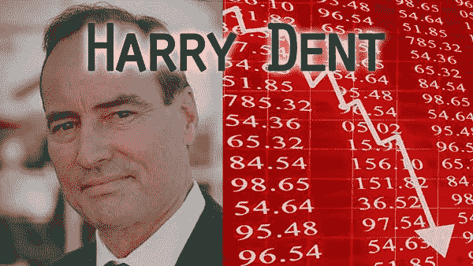

# 冬天(通货膨胀)即将来临

> 原文：<https://medium.com/hackernoon/winter-inflation-is-coming-bee4a9eb3b5f>

在生活中有很多次，我会注意到一些事情正在发生，我会在脑海中记下它，并安排时间在未来的某个时候思考那些注意到的“事情”。其中一件事在 1 月份回来了，真的打击了我——为什么美元在 2017 年如此疲软？衡量美元兑一篮子加权货币价值的美元指数最近跌至两年多来的最低水平。

就像去年发生的那样，这让我很惊讶。乍一看，美国债券的收益率比日本或欧洲高得多，这是汇率的一个因素。德国债券的收益率为 0.70%，日本债券去年大部分时间都是负数(这种投资在结构上是要花钱的)。美国经济比世界上大多数经济体都要好。那么，为什么美元在贬值呢？

有几个因素可以回答是什么影响货币价格的问题。一个是国家的整体经济。另一个是这个国家的债务收益有多少。更高的收益率吸引了资金。另一个因素仍然是贸易顺差/逆差。然而，另一个因素是，相对于 GDP，这个国家有多少未偿债务，以及赤字率是在扩大还是在收缩。

就像奇妙先生(凯文·奥利里)说的那样，“钱会花在最值得花的地方。”所以，我们不得不问一个问题——为什么美元对其他货币持续下跌？2017 年，美元相对于 [$DXY 指数](https://www.marketwatch.com/investing/index/dxy)追踪的一篮子货币下跌了 11%。为什么会这样？要回答这个问题，我们需要看看谁对待金钱最好。

从表面上看，美国似乎是最赚钱的地方。10 年期美国国债的收益率为 2.8%，相比之下，德国和日本的收益率接近 0%。那么，如果与其他国家相比，美国的回报率最高，为什么会出现资金外流呢？答案最终归结为投资者的信念，即他们将获得与他们贷出的购买力相同的回报，外加利息。我认为，目前的计算显示，大多数人不相信美国政府会以与贷款人放贷时同等的购买力偿还债务。借款人将收回他们借出的美元；只不过，每一美元在债券到期时的购买力都不会与贷出时相同。更多的赤字导致更多的通货膨胀将超过收益率。

## 政府政策

有几个因素，最近的可能是最引人注目的。从表面上看，特朗普的税收计划对企业来说很好。然而，如果你放眼未来几年，它将大幅增加美国的赤字和整体债务。这将降低每一美元的购买力，因为更多的美元，因为更多的美元将需要印刷来偿还债务。这就是美元在 2018 年继续贬值的原因。

当你看到美元兑其它货币下跌时，你就明白了我们如何从美元输入通胀的机制。这意味着我们必须用更多的美元购买外国产品，因为每一美元相对于外币的价值都在下降。如果外国产品的价格上涨，那就是通货膨胀。市场正在看到这一点，随着美元下跌，我们在美国出现高通胀的可能性增加。我怀疑我们将在 2018 年看到良好至温和的通胀。

**通货膨胀**

为了观察预测的通货膨胀，看 3 个标准:

货币供应(M2)——目前正在扩大

铜价——超过 3 美元，并略有上涨

国债收益率(10 年期)——2.8%，并且还在上升

截至目前， [M2 货币供应量一直在稳步上升](https://tradingeconomics.com/united-states/money-supply-m2)，即使美联储做出了正常化的努力。这就造成了潜在的通货膨胀，因为流通中的货币越多，每单位货币的价值就越低。查看铜的[价格](http://www.infomine.com/Investment/)，超过 3 美元。这意味着一种基本商品的价格在上涨，从而导致通货膨胀。许多投资者称之为“铜博士”，因为铜价是一个非常好的先行指标。最后， [10 年期美国国债利率](https://www.cnbc.com/quotes/?symbol=US10Y)产生了 2.8%的收益率，而且还在上升。这些迹象都指向 2018 年通胀上升。

**反通胀(滞胀)的案例**

哈里·登特做了一些工作，他概述了一个案例，通货膨胀与货币供应量无关，而是与人口统计学直接相关。他解释说，随着经济老龄化，没有办法得到通货膨胀。他预测会出现通货紧缩。你可以看看他的一些作品。

**冬天来了**

我认为指标显示中期会有一些通货膨胀。在通胀上升的环境中，一些最佳投资包括:新兴市场、大宗商品、原材料、工业、房地产和贵金属。我会把我的研究集中在这些领域。所有沉重的全球政府债务正在对金融市场产生影响。现在是时候在你的投资计划中考虑这种可能性了。我在我的 [2018 投资主题帖子](/@jake_ryan/8-great-investing-themes-for-2018-f204c5362eff)中推荐了一些建议。

根据外汇市场的反应，交易员认为美国的通货膨胀率将高于预期。这是根据美元不断贬值的事实推测出来的。它在 2017 年损失了大约 11%的价值，今年已经损失了大约 2%。交易员认为，赤字将远远超过美国政府的预测。许多人认为，从 2019 年开始，赤字将超过每年 1 万亿美元，因此，另一个值得关注的数据是 2019 年及以后的预计赤字数字。这每年会增加 1 万亿美元的国债。如果这一数字扩大到超过 1 万亿美元，我们可以假设会有更多的通货膨胀，因为这是更快摆脱债务的一种方式(通过通货膨胀，用价值更低的美元偿还债务，降低每单位货币的购买力)。

我对未来两年的预测？冬天(通货膨胀)来了。

*免责声明:以上仅代表一种观点，仅供参考。它无意成为投资建议。请自己做作业。*

[***杰克瑞恩***](/@jake_ryan) ***是 Tradecraft Capital 的创始人，创业顾问，天使投资人&投资方面的作家。如果你喜欢这篇文章，请“鼓掌”帮助别人找到它！欲知详情，敬请关注*** [***【脸书】***](https://www.facebook.com/WealthRituals/)*[***推特******。***](https://twitter.com/TradecraftJake)*