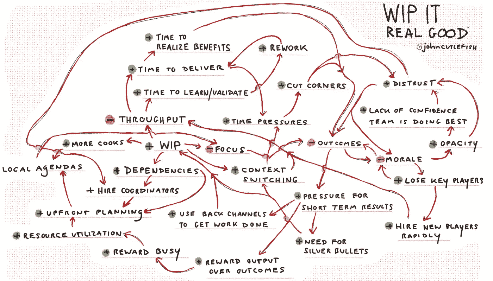

# 擦得很好

> 原文：<https://medium.com/hackernoon/wip-it-real-good-66aa710178fd>

你的任务是设计一个针对高工作进展水平(高 WIP，也就是“一次做很多事情”)优化的系统。你做什么决定？花点时间好好想想。

好的。你已经建立了系统，现在试着降低 WIP。会发生什么？系统中善意的、热情的和聪明的人已经精心设计了角色、互动、结构、自我和关系来同时做很多事情，这不是你可以简单地合理化的事情。系统将会反推(通常是因为非常真实、痛苦的原因)。同样的事情也发生在试图改变习惯的人身上。

你在对抗什么？下面我指出了一些优化领域，这些领域对于减少 WIP 的努力不再“有意义”(并且会反击)。要改善这种情况，你需要解决当前的应对机制，而这并不容易。挑出“反对变革”的人很容易，但这些挑战大多是系统性的，而且绝非微不足道。

一些常见的调整(针对高 WIP 进行优化时):

1.  [美橄]手递手传球
2.  共享资源
3.  说好！
4.  偏向于行动(而不是反思)
5.  管理个人而非团队
6.  王国和防御
7.  敬业的团队和大泳池
8.  特种宽银幕电影
9.  跨团队协作减少
10.  下一个项目

## **移交…**

移交有助于让人们保持忙碌。当人 A 正在做某件事时，人 B 可以开始一项上游任务，而人 C 可以开始一项下游任务。现在他们可以一起工作了，但是这(看起来)是低效的，并且可能需要新的工具。因此，一种移交文化出现了，你开始看到人们实际上在寻找机会“超越”事物。移交需要协调和会议(以及协调和运行这些会议的人员)。此外，可悲的是，它们影响了庆祝和感知影响的文化。如果最终结果是在“下游很远的地方”，你可能永远不会意识到自己在其中的作用(或者觉得自己有责任)。

头脑风暴问题:

*   怎样才能让一起开始一起结束更安全？
*   “超前”工作，我们得到了什么，失去了什么？
*   我们是否一直在房间里听到正确的声音？

## **共享资源**

你可能会认为追求高 WIP 需要真正的跨职能团队(嵌入式运营、UX 等)。)但情况并非总是如此。事实似乎正好相反。我们合理化地认为，我们只需要“那个 UX 人的 10%的时间”来做每一项工作，而且一个人可以在十项工作中矩阵化。追求高 WIP 倾向于使专家矩阵化的想法根深蒂固，并鼓励崇高的规模经济假设。在移交的同时(如上)，你还会看到在多个团队之间共享单一的下游 QA 功能，因为在理论上这是“有效的”，并有助于团队为下一件事做好准备。如果这些共享的资源是有用的——他们竭尽全力——他们将继续资源不足，丢球，让人们围着他们工作，失去组织的信任，并且……嗯……继续资金不足。

头脑风暴问题:

*   如果该功能 100%可用，会有什么可能？
*   我们的规模经济假设成立吗？
*   如果[某些功能]始终是“瓶颈”，那么是什么阻止了我们帮助他们呢？

## **是的！**

在一个为开始做更多事情而优化的环境中，你经常会发现说“现在不行”被认为是一个蹩脚的团队成员。没有人想听到这样一个令人清醒的现实:工作堆积如山，或者有一百个其他想法在等待着，它们也同样有价值。说“是”并接受新工作相对容易…尤其是应该“小”的小工作(忽略项目的大小只占总交付时间的一小部分)。说“不因为 _ _ _ _ _ _ _ _”等于提出“问题而不是解决方案”。

头脑风暴问题:

*   比起完成，我们更看重开始吗？
*   更多地说“不”会给我们带来什么？
*   说“是”真的能帮助我们的客户吗？

## **偏向于行动(不是反思)**

你个人是如何适应繁重的多任务处理的？至少在 n=1 时，我发现自己跳过了深入的工作，采用了脑海中出现的第一个解决方案，并且跌跌撞撞地过了一整天，甚至不记得发生了什么！我提高对行动的偏好，降低对思考的偏好。现在想象一下，扩大到整个组织都在处理高 WIP。考虑受到奖励的特质，以及不受欢迎和有问题的观点和个性/神经类型。这里有害的事情是，变戏法、暗箱操作和讨价还价“让事情发生”往往会成为有价值的生存特征。这适合一些人，但不是所有人。

头脑风暴问题:

*   我们如何更好地利用我们不同的思维方式？
*   如果有更多的时间做深入的工作，会有什么可能？
*   考虑到我们目前有多忙，我们可能感觉不到什么？

## **管理个人，而不是团队**

当个人贡献者“满载”(高利用率)时，你会看到更多关注个人任务而不是团队目标。将这篇文章中的所有观点缩小到团队层面，大多数都适用。这影响了绩效管理、代码库中的协作能力、经理在分配工作(给个人)中的角色、对实际结果的责任以及职业道路。它跑得超级深。团队在一起移动巨石时变得不太熟练，这鼓励了个人单独工作，这将经理提升为协调者的职能，这进一步阻止了实践…于是你就有了一个恶性循环。管理者变得更像“人”的管理者，而不是“团队/系统”的管理者。团队中的个人变得更关注“个人进步”，而不是“团队进步”。

头脑风暴问题:

*   是什么阻止了我们更紧密地合作？
*   我们何时以及如何作为一个团队来庆祝？
*   作为一个团队，我们外包给经理的是什么？这对我们有帮助吗？

## **王国和防御**

“摇动雪球”来应对新的挑战(不可否认)是破坏性的，但对控制工作进展很重要。在 WIP 高的情况下，你观察到的不是如何在少数项目上协同工作，而是王国倍增效应……新的“产品”、新的服务、新的部门、新的管理层等等。如果你能把你正在做的事情加工成“新的”(翻译更多的东西)，你就有机会获得资金，获得新的尊重，以及职业轨迹的提升(至少在那个组织中)。“一次做更多”以非线性的方式增加了结构，并强化了组成部分之间的界限。当你超级忙的时候，有很多活动的部分，我们倾向于在我们能控制的周围建一堵墙…即使这对全球整体没有好处。简而言之，我们有更多的王国、王国建造者和筒仓，然后是大量的结缔组织角色、筒仓翻译者和王国建造者-驯服者。

头脑风暴问题:

*   信息需要传播到哪里？我们组织中的界限在哪里可以不那么严格？
*   是否有机会将“我们对抗他们”转变为合作的机会？

## **专用团队和大泳池**

自组织的、自治的、跨职能的产品开发团队是值得一看的美好事物。你在高 WIP 环境中所看到的是，拥有一个“专注的团队”成为了真正的资产。它让玩俄罗斯方块变得更容易。但是我经常发现，这些团队远非自组织的，远非跨职能的(就上面提到的共享资源而言)，也远非自治的。他们实际上并不“拥有”一种产品或服务，缺乏端到端的视角。我们还过早地创建它们来抵御疯狂，而不是像一个模型那样，团队为了有意义的任务聚在一起，解散，也许留下关键问题的“锚”。拥有“稳定”的团队感觉很好，但有一个陷阱，你相信你可以不断增加理论上稳定的团队，以获得更多的开始和 T2 更多的正确的事情。

另一方面是一组完全可替换的资源，被视为 N 个团队，每个团队都有一个项目，没有人关心大局，并且经常被重新洗牌。这也很有挑战性！你会看到这两者都因为不同的原因出现在高 WIP 环境中，并且每一个都伴随着一大堆包袱:俄罗斯方块扮演角色、王国建设(见上)、下一个项目(见下)等等。

头脑风暴问题:

*   我们敬业的团队真的独立吗？有帮助吗？
*   是否有机会结束某些任务并开始其他任务？
*   在快速增长期间，我们如何保留关于个人服务/产品的部落知识？

## **大图和红橙绿**

事情这么多，不可能把所有的事情都记在脑子里。所以团队放弃“大图”工件，因为实时大图太忙太复杂。有趣的是，有些人仍然想看到全局，所以你也看到复杂的程序/项目管理功能出现，试图理解领导的疯狂，并协调依赖性。在这里你可以找到最受欢迎的(总是不幸过时的)红橙绿电子表格——如果一切都是绿色的，时间越长越好，对吗？通过试图过度简化宏观图景的疯狂，我们假设它并不那么复杂，我们把更多的复杂性塞进了系统。又一次恶性循环。

头脑风暴问题:

*   我们能不能“把这些都记在脑子里？”
*   我们的工件代表了系统中真正的复杂性吗？
*   我们能否探索更便宜/更轻量级的方法，让人们与大局保持一致？

## **较少的“跨团队”协作**

这是我们在上面与个人讨论的内容的放大版本。在高 WIP 系统中，团队很少直接与其他团队协作(相对于通过管理/协调层)。如果你忙于完成“你的”事情，就很难去考虑更全球化的“我们的”。这个信息就是要保持低调，完成你的团队所“挂勾”的事情。这种类型的协作需要工具、可见性、接口、顶部空间和松弛空间……当每个人都忙于单个项目时，所有这些都是短缺的(并且被忽略)。

头脑风暴问题:

*   假设我们有一个涉及多个团队工作的令人信服的大机会…我们能够应对这个挑战吗？
*   我们如何跨团队合作？

## **下一个项目！**

想象一下，你可以选择 1)让一个团队不断迭代以探索好的方面和结果，或者 2)让一个团队继续“下一件事”。当系统针对高 WIP 进行优化时，计划库存将会堆积。继续“下一件事”的压力很大(通常是银弹，因为延迟)，你会看到很多关于结果如何难以衡量的合理化，以及可能需要“一年时间来确定这是否可行”。为高 WIP 优化的系统是为开始而优化的，而不是真正结束。

头脑风暴问题:

*   我们产品决策的“平均成功率”是多少？
*   我们如何加速反馈循环？
*   通过快速转移计划，我们获得了什么？我们失去了什么？

希望这给你一种感觉，适应可以运行多深。考虑从温和的 WIP 限制开始。专注于将安全作为先决条件(参见[现代敏捷](http://modernagile.org/))。