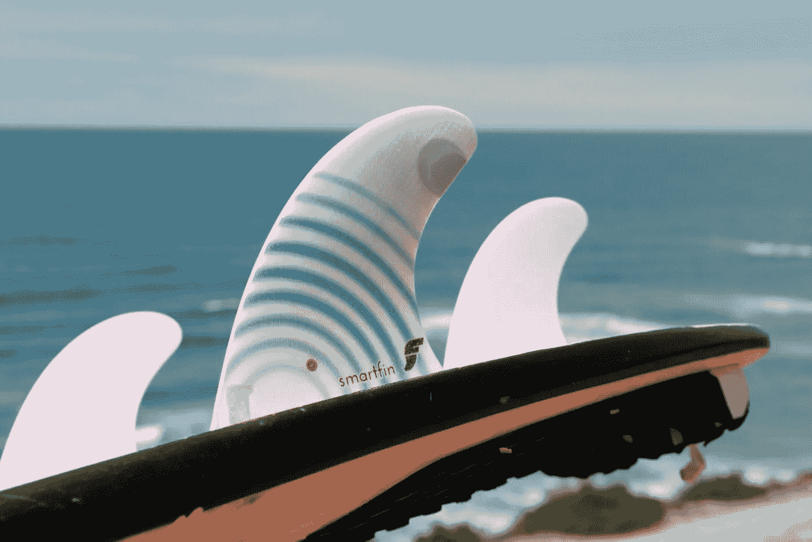
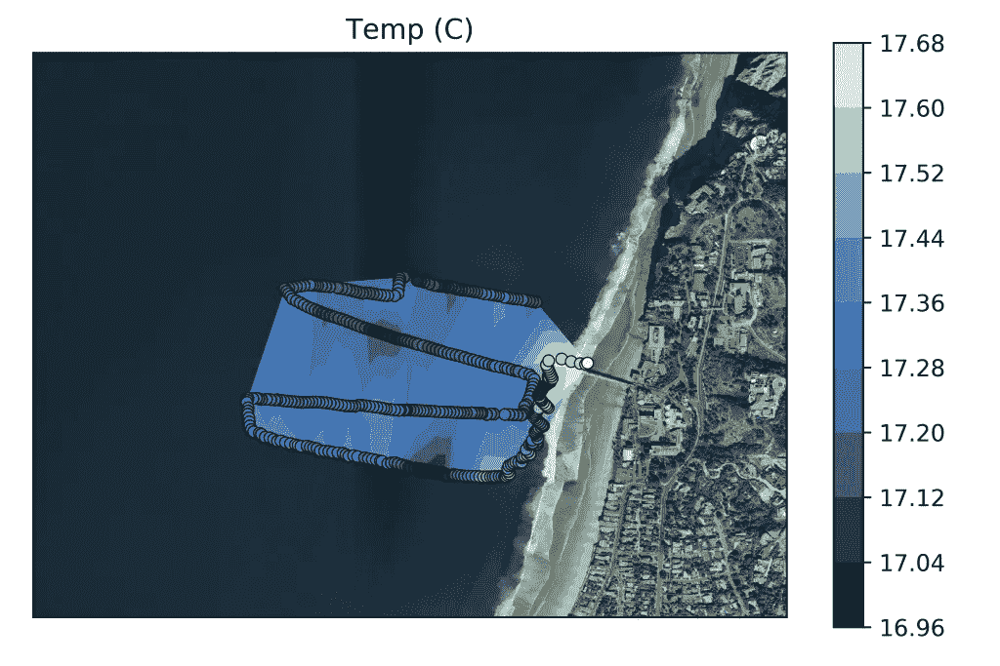
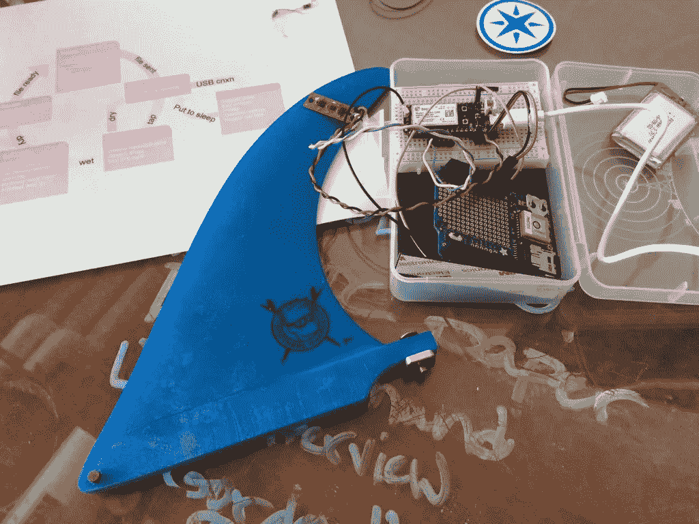
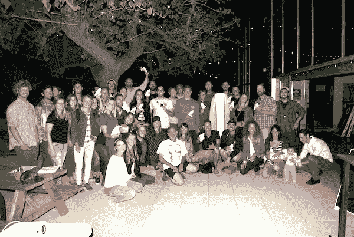

# 用智能鳍消除气候变化，智能鳍是一种电子连接的冲浪板鳍

> 原文：<https://medium.com/hackernoon/wiping-out-climate-change-with-smartfin-an-electron-connected-surfboard-fin-c20d18ed5b43>

*一种物联网冲浪板鳍，可以在冲浪者划水的整个过程中收集近岸海洋化学数据。*

[Smartfin](https://www.facebook.com/smartfinproject/photos/a.1520382494908248.1073741827.1520379244908573/1982740248672468/?type=1&theater)

纵观人类历史，海洋甚至让那些最了解它的人迷惑不解。从带着海妖、怪物和美人鱼的故事上岸的古代水手，到今天只正确绘制了整个海底 10%的深海科学家，还有许多未知的东西。

[菲尔·布雷斯纳汉](https://twitter.com/SUPScientist)，一名来自圣地亚哥的黑客、海洋学家和狂热的冲浪者，将他对研究海洋的热爱与粉碎波涛的热爱结合在一起。为了更多地了解深海，菲尔在他的[冲浪板](https://hackernoon.com/tagged/surfboard)上安装了[电子](https://store.particle.io/products/electron-3g-americas)，并寻求冲浪者和科学家的帮助。

Shred White & Blue

# 驾驭物联网浪潮

菲尔和他的团队称这个项目为智能鳍。这是一个绿色物联网倡议，来自斯克里普斯海洋研究所、冲浪基金会、迷失的小鸟。

使用智能鳍很容易升级任何典型的冲浪板，将每个使用它的人变成有价值的海洋数据收集的来源。

物联网鳍包含环境传感器，可收集近岸海洋化学数据，即从海岸线到深海的水域。

[Scripps Institution of Oceanography](https://scripps.ucsd.edu/centers/adaptation/2018/06/04/smartfin-technology-observes-bioluminescence-event-in-a-new-light/)

[Smartfin](https://hackernoon.com/tagged/smartfin) 追踪板的位置、水温、每个碎浪的运动以及水的 pH 值。

通常情况下，这类数据对科学家来说很难收集，因为近岸水域往往波涛汹涌。

幸运的是，冲浪者想去的正是这些水域！

# 从海岸连接到海洋

[Great Big Story](https://vimeo.com/greatbigstory)

在使用电子设备之前，菲尔和他的团队很难找到一种好的技术将收集到的数据传回岸上。

> “2017 年，我们通过蓝牙分发了 300 个鳍，但我们正在转向蜂窝网络，这将对云中的实时更新产生巨大的有益影响。”

[The Electron](https://store.particle.io/products/electron-3g-americas)

菲尔引用了电子可靠的蜂窝数据中继、云兼容性和全栈支持作为他选择的理由。更不用说，粒子硬件是超级容易理解，工作，并运送在一起了！

# 建立一个数据收集者社区

Find more pics on the Smartfin [Instagram](https://www.instagram.com/smartfinproject/).

Smartfin 已被学校冲浪队、社区冲浪小组、个人碎纸机使用，此外，它的存在时间很短，而且由于电子实现了简单的可扩展性，在地平线上没有放缓的迹象。

菲尔看到了蜂窝连接鳍的光明前景；

> “我们预计，一旦我们确信这一设计可行，我们将生产数百台，之后一年将生产数千台。”

通过与科学界和水上运动界的合作，Smartfin 正在帮助揭开海洋的秘密，并为世界决策者提供他们做出更明智的环境决策所需的洞察力。

要了解更多关于 Smartfin 项目的信息，甚至可能提供帮助，请点击这里与团队[取得联系。](https://smartfin.org/contact/)

[*这个帖子最初出现在粒子博客上。*](https://blog.particle.io/2018/06/19/smartfin/)