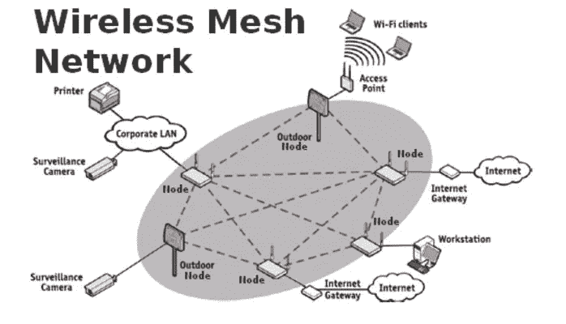
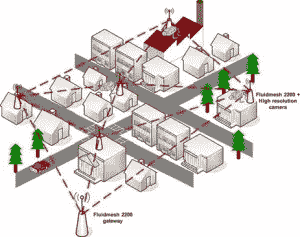
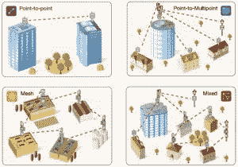
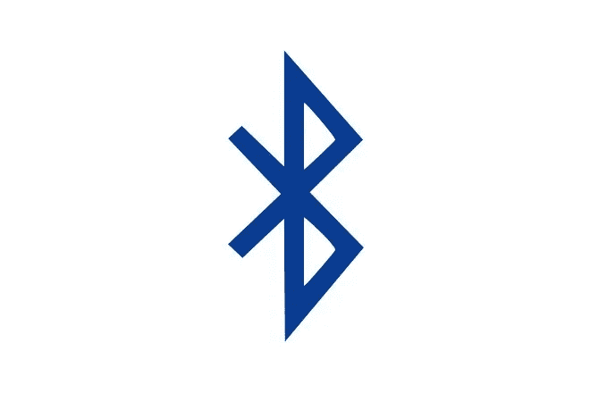
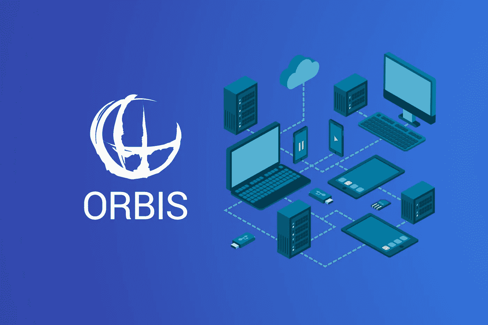
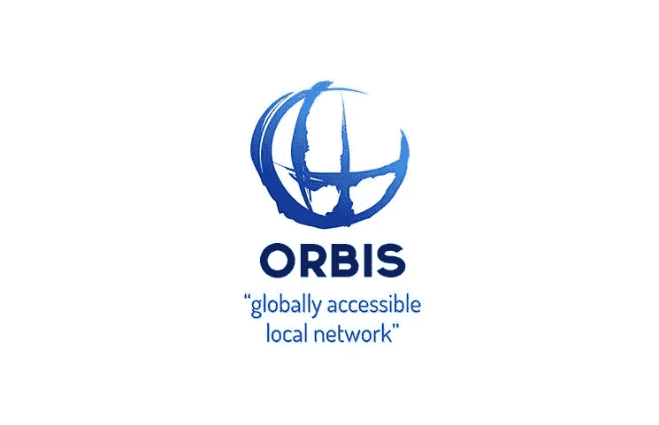

# 无线 2.0 —区块链上的集成网络。

> 原文：<https://medium.com/hackernoon/wireless-2-0-integrated-networks-on-the-blockchain-caa09a61913b>

## Orbis 如何实现无线网状网络技术

无线网状网络是一项新兴技术，它可能会将无缝连接世界的梦想变为现实。

Y 如果你认为无线网状网络只是新 Wi-Fi 路由器的另一个营销要点，这是可以原谅的，这个词是为了抬高价格而不是带来好处。

但是这一次我们可以避免愤世嫉俗:网状技术*确实比我们几年前购买并仍在市场上销售的普通老式 Wi-Fi 路由器有显著优势。*

网状网络是弹性的、自配置的和高效的。您不需要在完成通常最简单的设置工作后再去摆弄它们，它们可以提供您在家中可以实现的最好和最高的吞吐量。这些优势已经导致一些初创公司和现有公司推出网状系统，争夺家庭和小型企业的 Wi-Fi 网络美元。

**网状网络解决了一个特殊的问题**:覆盖一个相对较大的区域，在一层楼或多层住宅或办公室中超过 1000 平方英尺，特别是在没有以太网的地方，允许非网状 Wi-Fi 路由器和无线接入点更容易的有线连接。

所有当前的网状生态系统也提供了简单性。

你*可能*在**甚至是最流行的传统** Wi-Fi 路由器上用基于网络的管理控制面板工作时拔下一大把头发。

在室外无线网络中，无线网状网络是继**点对点**和**点对多点**之后的第三种拓扑结构，用于构建无线网络基础设施。无线网状网络中的每个设备通常被称为网状节点，并且同时与多个其他网状节点连接。

无线网状网络也是**多跳网络**，因为每个网状节点可以通过多跳到达另一个节点，并利用其他节点作为中继器。无线网状网络的主要优点是固有的冗余性以及可靠性，因为网状网络能够通过多条路径重新路由流量，以应对链路故障、干扰、电源故障或网络设备故障。

## **点对点、点对多点和网状网络**

通常为商业和政府应用实现两种类型的无线网状网络:

*   **非结构化或全方位无线网状网络**
*   **结构化无线网状网络**

在**非结构化无线网状网络**中，每个网状节点通常使用全向天线，并且能够与传输范围内的所有其他网状节点通信。非结构化无线网状网络中的无线链路是未规划的，并且链路可用性并不总是得到保证。

根据网状网络的密度，可能有许多不同的链路可用于其他网状节点，或者根本没有。非结构化网状网络通常用非视距无线电(NLOS)来实现，该无线电使用例如在诸如 400 MHz 的 UHF 频带或 900 MHz 的免许可频带中操作的低频和低带宽无线电。

非结构化无线网状网络利用所有无线电共享的单个信道。因此，传输所需的跳数越高，网络的总吞吐量就越低。

**结构化无线网状网络**是规划好的网络，通常在每个节点位置使用多个无线电和多个定向天线来实现。使用多个定向无线链路的环形拓扑通常用于结构化无线网状网络中，以使每个无线电设备能够在节点或链路故障的情况下通过不同路径无缝地重新路由流量。

结构化无线网状网络通常用于关键任务应用，例如无线视频监控、公共安全和工业自动化。

它们提供了**理想的网络架构**，以防某个站点需要高度可靠且可用的无线网络来支持视频、语音和数据流等宽带应用。结构化无线网状网络中的每条链路都在独立的信道上运行，因此特定传输的跳数不会影响网络的总吞吐量。

自 20 世纪 90 年代初以来，学术界已经对无线网状网络进行了多年的研究，最初主要是出于军事应用的考虑，然后在 2005 年至 2010 年间，它们开始获得显著的商业吸引力。

## 世界网状网络。

**蓝牙技术是简单、安全的无线连接的全球标准，现在支持网状网络。新的网状功能支持多对多(m:m)设备通信，并针对创建大规模设备网络进行了优化。**

它非常适合楼宇自动化、传感器网络和其他物联网解决方案，在这些解决方案中，数十、数百或数千台设备需要可靠、安全地相互通信。

> 根据网络专家约翰·谢普勒的说法，在不久的将来，你笔记本电脑中的 Wi-Fi 卡除了作为网络客户端的正常作用之外，还可能成为接入点。在全网状拓扑中，每个节点都与其他节点通信，而不仅仅是与中央路由器来回通信。在另一种称为部分网状网络的变体中，节点与所有附近的节点通信，但不与远处的节点通信。所有通信都在客户端和接入点服务器之间进行。客户机/服务器关系是这项技术的基础。

## 事物的利与弊

蓝牙网状网络在这十年中有几个优点和应用。我们中的一些人在这里入伍:

*   笔记本电脑和智能设备之间的无线连接。
*   各种外围设备(鼠标、键盘等)之间无线连接。)和设备(收音机、音频扬声器、显示器等。)和手机。
*   在手机之间传输文件、图像和 MP3。
*   向计算机传输数据的数据记录设备。
*   智能家居
*   商业物联网应用
*   智能制造
*   对等网络

但是这些应用被限定在一定的范围内。例如，我们不能在相距一英里的设备之间传输数据或文件。可以创建一个强大的蓝牙网状网络，通过提供全球访问，我们可以在包括消息传递在内的各种应用中利用它。

因此，个人消费者和开发商仍然被这个利润丰厚的市场拒之门外。

**这就是奥比斯出现的原因。**

# 奥比斯是什么？

> Orbis 平台旨在通过建立现有的基础设施和网络供开发人员部署，为蓝牙 mesh 中的消费者和商业开发建立一个平台。—杰森·曹，奥比斯首席执行官。

Orbis 创建了多用途、灵活的基础设施，供开发人员构建和消费者使用，通过三个组件实现这一点: **OrbiStore、OrbisWeb 和 OrbisToken (OBT)** 。Orbis 应用于物联网开发、众包网络和系统集成。

# 奥比斯是如何工作的？

让我们以一个简单的应用程序为例，消息传递。然而，消息传送仅代表网状网络上的一般数据传输。

为你的 IOS 或 Android 设备下载 OrbisWeb 应用程序后，点击“连接”,你的手机现在是蓝牙网络的一部分，OrbisWeb 中的一个节点。

然后，您可以下载一个应用程序，可能是来自 OrbiStore 的蓝牙信息。

使用该应用程序，你的消息被广播到范围内的所有节点，然后广播到其他用户，以实物重复和中继。这种情况会持续到收件人收到您的消息。

与此同时，由于您的手机也在转发其他人的数据，您的钱包将被记入或成为网络的一部分，然后可以用于在 OrbiStore 中购买付费应用程序。

面对看似普遍的 SMS 服务和 Wi-Fi，这种分散式消息传递的价值在于，网状网络不容易受到诸如自然灾害之后的基础设施损坏的影响，也不需要在诸如地铁隧道、地下通道或甚至农村地区的低连接性地方实现昂贵的连接性。

# 分析奥比斯

使用我所遵循的标准，这些标准已经在—

 [## 如何通过交易和投资加密货币赚钱

### 比特币！莱特币！以太坊！—激动！不知所措！还有什么不可以。

hackernoon.com](https://hackernoon.com/how-to-almost-make-millions-by-trading-cryptocurrency-2f7bd5c1cedd) 

## 1.伟大的团队:

项目的发展和进步依赖于团队成员。从一张纸上的架构概述开始，到如何在市场上实现它，以及它的持续时间往往取决于团队和顾问。奥比斯有一个由非常年轻的成员组成的团队，目的是将项目理念与实际公司合作。

## 2.真实世界的用法:

*   提供 OrisWeb android 应用程序 alpha 版本
*   没有明显的竞争对手。
*   与瑞泰科技(深圳)有限公司合作

然而，个人消费者和开发商仍然被这个利润丰厚的市场拒之门外。Orbis 平台旨在通过建立现有的基础设施和网络供开发人员部署，为蓝牙 mesh 中的消费者和商业开发建立一个平台。

Orbis 创建了多用途、灵活的基础设施，供开发人员使用，并通过三个组件提供给用户:OrbiStore、OrbisWeb 和 OrbisToken (OBT)。

## 3.未来意识形态

Orbisweb
OrbisWeb 提供了一个安全的、全球性的、分散的、开放的蓝牙社区网络，任何人都可以参与其中。OrbisWeb 旨在通过物联网、众包数据、数字基础设施、物流和系统管理等实现，使第三方开发者能够轻松访问蓝牙网格开发。对于消费者来说，Orbis 应用程序将带来传统 WiFi 应用程序无法实现的独特功能。

**Orbistore**
OrbiStore 是一个开放给第三方开发的应用平台，无论是否利用 BLE 的网络基础设施，开发者收入将由 OBT 补充。

**Orbis Token (OBT)**
开发人员根据应用程序的使用情况获得新的硬币，而消费者作为运行 OrbisWeb 移动应用程序的活跃移动节点获得新的硬币。OBT 用于购买 OrbiStore 上的付费应用程序和产品。

我对这部电影非常感兴趣。我非常看好中国的区块链项目，一旦主流采用开始， **NEO 生态系统为增长和使用提供了一个高能量、高回报的平台。**话虽如此，这个令牌击中了我的要害，我参加了 [**奥比斯空投。**](https://cryptodisrupt.com/orbis-airdrop/)

## 奥比斯（一个致力于为世界各国盲人和眼疾患者恢复光明的国际性慈善机构）

> Orbis 提供了一个安全的、全球性的、分散的、开放的蓝牙社区网络，任何人都可以参与其中。Orbis 旨在通过物联网、人群聚集数据、数字基础设施、物流和系统管理等实现，使第三方开发者能够轻松访问蓝牙网格开发。对于消费者来说，Orbis 应用程序将带来传统 WiFi 应用程序无法实现的独特功能。

**这意味着，你可以将奥比斯用于——**

1.  **IOT 工业**

智能家居、众包数据和自动化。使用 Orbis 应用程序控制您的灯光、灯罩和 HVAC，管理您的供应链，或查看实时等待时间。

**2。BTC 交易**

离线时使用 Orbis 网状网络**发送和接收加密货币。**在匹配的交易数据上传之前，资金将被托管。

**3。防御**

Mesh 在未开发的环境中提供可靠的离线通信。Mesh 可以协调士兵和系统监控和管理战场。

**4。电信**

互联网共享和网状信息。向 OBT 出售您的移动数据，并通过 mesh 向其他人发送消息。一种强大、廉价、便携的救灾解决方案。

**5。广告**

赞助地点和步行交通数据。在 OBT 访问并连接到受赞助地点的节点将获得奖励！

有趣的是， [**奥比斯也宣布了他们的空投**](https://cryptodisrupt.com/orbis-airdrop/) ，这将看到他们最近宣布空投 100 万个令牌，最多可达 6 万个近地天体地址。

简单的数学告诉你，大约是每人 16.7 OBT 币。

鉴于交易所将 OBT 的挂牌价格定为 0.70 美元，这比 11 美元多一点。

**够吃一顿免费午餐了:)**

玩笑开大了。这个令牌看起来确实是一个有趣的持有物，而且在我看来有一套很强的基本面。

**我主张投资生态系统令牌和基本面强劲的令牌。**

## 在此获取您的 OBT 代币。

## 干杯，感谢您的阅读。

****************************************************************

鼓掌 1 次或 50 次。它帮助我获得曝光率。谢谢大家！

_

阐述我多年来的想法，并超级热衷于写区块链、交易、加密货币和生活。

我的目标是以一种精致、易懂的方式将加密货币带给大众。复杂无助于任何人，有偏见的媒体也是如此。

是的，我认为这个系统是一个巨大的谎言，是时候改变它了。

_

#longlivecrypto。

**************************************************************

*免责声明:这不是一个赞助的帖子，虽然我已经注册了奥比斯空投，但我并不隶属于奥比斯。*