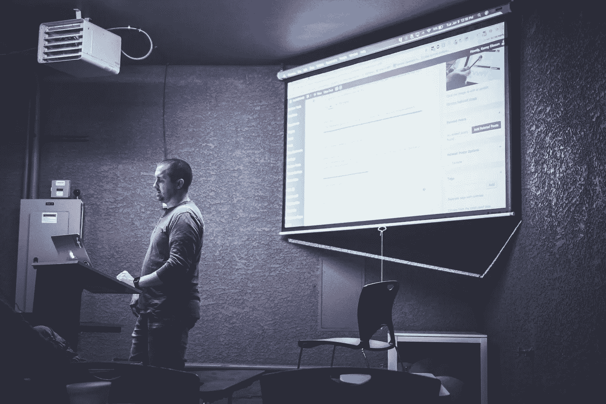

# 无线演示—有哪些选项？

> 原文：<https://medium.com/hackernoon/wireless-presentation-what-are-the-options-3c5ddddbcbf8>

我们已经为一些教室配备了固定的投影仪，更多的将会陆续安装。不时有人表示想看看你是否能从智能手机或私人笔记本电脑上“简单地”无线传输一张图片/视频或整个屏幕。到目前为止，我们已经为自己的设备提供了 VGA / HDMI 电缆。这通常很有效，但这不包括智能手机。这就是为什么我们一段时间以来一直在研究和测试投影仪和屏幕的无线演示解决方案，以及它们是否真的比有线解决方案更好、更可靠。

# 要求

我们的要求如下:

*   支持所有当前操作系统(Windows、macOS、Linux、Android、iOS)
*   镜像屏幕的可能性
*   使用方便
*   在日常学校生活中可靠
*   “劫持”，即屏幕/投影仪不应被第三方(如学生)接管

有许多 HDMI 无线加密狗承诺无线演示。此外，还有许多不同的标准:谷歌的 Chromecast、苹果的 Airplay、微软的无线显示适配器(Miracast)。如果只需要支持一种操作系统，选择将会非常多。我知道有些学校在他们的[教室](https://openschoolsolutions.org/possible-set-computer-lab-less-1500-yes/)里配备了苹果电视，并给每个同事发了一台 iPad。这在这个生态系统中运作得很好，但是我们没有这个预算🙂由于这个原因，如果你想支持 Linux，选择是非常少的。

# 铬铸

[Chromecast](http://chromecast.com/) 是 HDMI 棒，支持大量设备，实际上是 Chrome / Chromium 浏览器运行的一切。您可以轻松地将单个标签、整个屏幕或特定应用程序(如 Youtube 应用程序)中的内容传输到投影仪或屏幕。

# 优势

*   价格(大约。40$)
*   支持所有主要操作系统
*   可以连接以太网适配器

# 不足之处

*   仅支持 WPA2 个人版，不支持 WPA 企业版
*   没有管理平台来管理许多 Chromecasts
*   某些移动平台上没有屏幕镜像

一般来说，可以说 Chromecast 是为家庭使用而设计的，因此缺乏一些在学校或大学网络中可能有用的功能。

# 空气驯服

Airtame 是另一种 HDMI 加密狗，承诺非常容易操作，是专为学校、公司和大学设计的。据我所知，Fedora 本身就是在棒子上跑的。

# 优势

*   支持所有主要操作系统
*   可以连接以太网适配器
*   真正的屏幕镜像，没有“铸造”，即 Youtube 视频是由电脑传输的，而 Chromecast 是从互联网上下载的。
*   支持所有无线局域网标准(也支持 WPA 企业版)
*   管理多个机场的中央平台
*   通过引脚连接的选项

# 不足之处

# 结论

Chromecast 和 Airtame 是无线演示的两个选项。Airtame 实际上是你希望学校使用的设备，但它有它的价格。另一方面，Chromecast 便宜得多，但不提供一些“值得拥有”的功能。我们目前正在测试 Chromecast，看看它在日常学校生活和“多用户操作”中有多好，多可靠。尤其是必须测试操作的简单性，例如，这在各个平台上有何不同。

**您使用哪种设备进行无线演示？**

*最初发表于*[T5【openschoolsolutions.org】](https://openschoolsolutions.org/wireless-presentation-options/)*。* ***注册*** *订阅我们的时事通讯，获取免费的 PDF 格式，并为您的课堂提供出色的开源应用程序，或者在 Twitter 上关注*[*@ OpenSchoolZ*](https://twitter.com/OpenSchoolZ)*。*