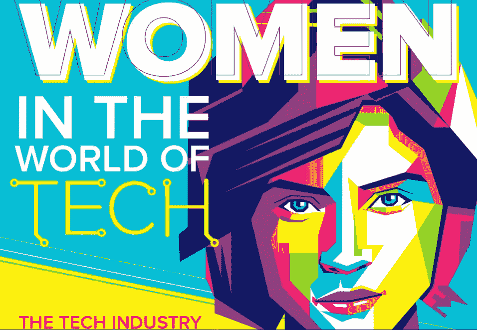
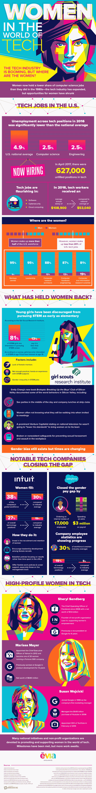

# 科技界的女性

> 原文：<https://medium.com/hackernoon/women-in-tech-9ad917a2e85>

## 我们如何缩小性别差距？

女性基本上建立了计算机科学领域，然而今天她们在这一领域的代表性严重不足。发生了什么事？

在过去的几十年里，妇女在权利和自由方面，甚至在整个就业市场上都取得了很大的进步。这是一件非常积极的事情，有助于我们整体经济的增长。但仍有许多行业的女性难以获得成功，科技是其中一个主要行业——尽管女性占美国劳动力的一半以上，但她们仅占科技工作者的 20%左右。

甚至从小学开始，女孩们就对从事技术工作失去了兴趣，而那些继续追求技术抱负的人发现，他们无法在充满敌意的环境中工作。Emily Chang 的新书《Brotopia》记录了硅谷公司中的一些事情，如性派对、脱衣舞俱乐部的公司午餐、针对性骚扰和性侵犯的保护措施被破坏或不存在等等。

然而，有许多公司做对了。Intuit 专注于招聘和留住女性人才，而 SalesForce 进行了深入研究，并缩小了性别薪酬差距。

从这张信息图中了解更多关于[缩小科技领域性别差距的信息](https://www.evia.events/women-in-technology)！

许多国家倡议和非营利组织致力于在技术领域促进和支持妇女。里程碑已经实现，但还有更多工作等待着我们。

**来源:**

[http://fortune . com/2017/03/13/female-founders-venture-capital/](http://fortune.com/2017/03/13/female-founders-venture-capital/)

[https://motherboard . vice . com/en _ us/article/evzjww/here-is-the-citations-for-anti-diversity-manifesto-circulating-at-Google](https://motherboard.vice.com/en_us/article/evzjww/here-are-the-citations-for-the-anti-diversity-manifesto-circulating-at-google)

[https://www . nytimes . com/2017/09/08/style/Ellen-pao-gender-discrimina tion-silicon-valley-reset . html](https://www.nytimes.com/2017/09/08/style/ellen-pao-gender-discrimination-silicon-valley-reset.html)

[http://www . business insider . com/性骚扰-丑闻-技术-工业-2017-7/# in-2015-女-谷歌-工程师-a-hrefhtpsarchivessfweklycomthesnitch 2015 03 07 前-谷歌-工程师-声称-她-被-性骚扰-谷歌-什么也没做-关于-it targetblank 公开指控-两名男性-工程-董事-在两个不同的场合性骚扰她](http://www.businessinsider.com/sexual-harassment-scandals-tech-industry-2017-7/#in-2015-a-female-google-engineer-a-hrefhttpsarchivessfweeklycomthesnitch20150307former-google-engineer-claims-she-was-sexually-harassed-google-did-nothing-about-ittargetblankpublicly-accused-two-male-engineering-directorsa-of-sexually-harassing-her-on-two-different-occasions-and-said-she-got-no-help-from-hr-neither-of-those-top-managers-were-ubers-singhal-by-the-way-16)

[https://www . Bloomberg . com/research/stocks/private/person . ASP？personId = 83998&privcapId = 32876141](https://www.bloomberg.com/research/stocks/private/person.asp?personId=83998&privcapId=32876141)

【https://www.forbes.com/profile/sheryl-sandberg/ 

[https://www.biography.com/people/sheryl-sandberg](https://www.biography.com/people/sheryl-sandberg)

[https://www.forbes.com/profile/marissa-mayer/](https://www.forbes.com/profile/marissa-mayer/)

[https://www.thebalance.com/powerful-women-in-tech-2071172](https://www.thebalance.com/powerful-women-in-tech-2071172)

[https://www.forbes.com/profile/susan-wojcicki/](https://www.forbes.com/profile/susan-wojcicki/)

[https://www.elephantinthevalley.com/](https://www.elephantinthevalley.com/)

[https://www . the register . co . uk/2018/01/05/Google _ pay _ gap _ suit _ gets _ another _ go/](https://www.theregister.co.uk/2018/01/05/google_pay_gap_suit_gets_another_go/)

[https://www . CNBC . com/2017/09/21/Google-xs-astro-teller-on-gender-equality-in-silicon-valley-alphabet . html](https://www.cnbc.com/2017/09/21/google-xs-astro-teller-on-gender-equality-in-silicon-valley-alphabet.html)

[https://www . USA today . com/story/tech/talking tech/2017/04/03/tech-jobs-prospering-nationwide-up-73m/99789502/](https://www.usatoday.com/story/tech/talkingtech/2017/04/03/tech-jobs-thriving-nationwide----up-73m/99789502/)

[https://TechCrunch . com/2016/05/10/科技领域缺乏女性不仅仅是一个问题/](https://techcrunch.com/2016/05/10/the-lack-of-women-in-tech-is-more-than-a-pipeline-problem/)

[https://www . ncwit . org/sites/default/files/resources/women itech _ facts _ full report _ 05132016 . pdf](https://www.ncwit.org/sites/default/files/resources/womenintech_facts_fullreport_05132016.pdf)

[https://www . theatlantic . com/business/archive/2015/11/sales force-equal-pay-gender-gap/415050/](https://www.theatlantic.com/business/archive/2015/11/salesforce-equal-pay-gender-gap/415050/)

[https://www . them use . com/advice/the-latest-stats-on-women-in-tech](https://www.themuse.com/advice/the-latest-stats-on-women-in-tech)

[https://www . fenwick . com/fenwick documents/Gender _ Diversity _ 2014 . pdf](https://www.fenwick.com/FenwickDocuments/Gender_Diversity_2014.pdf)