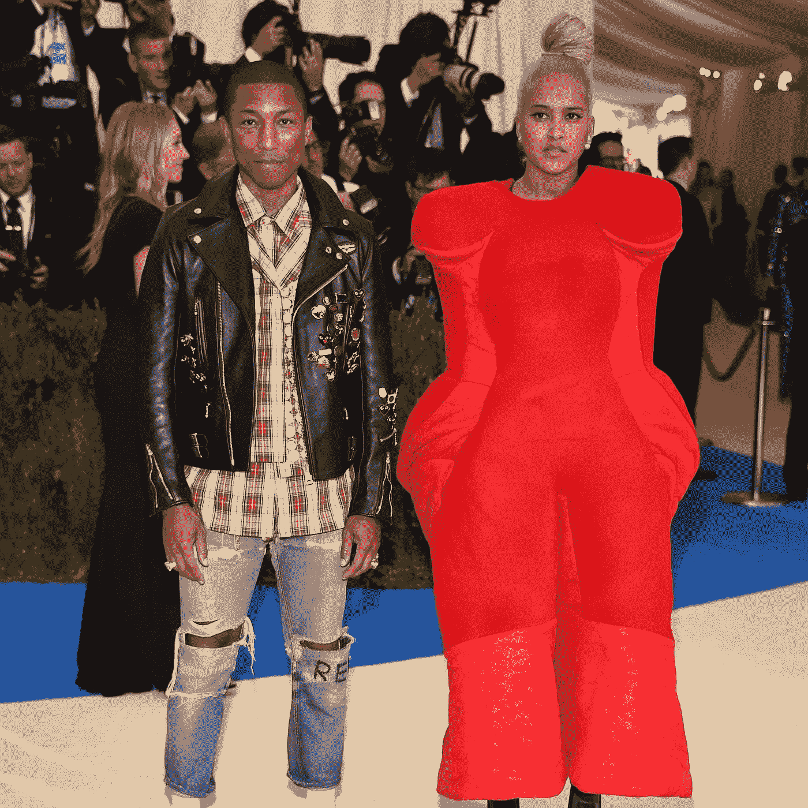
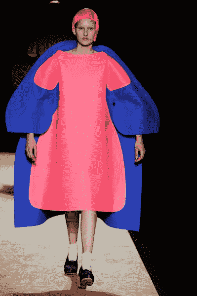
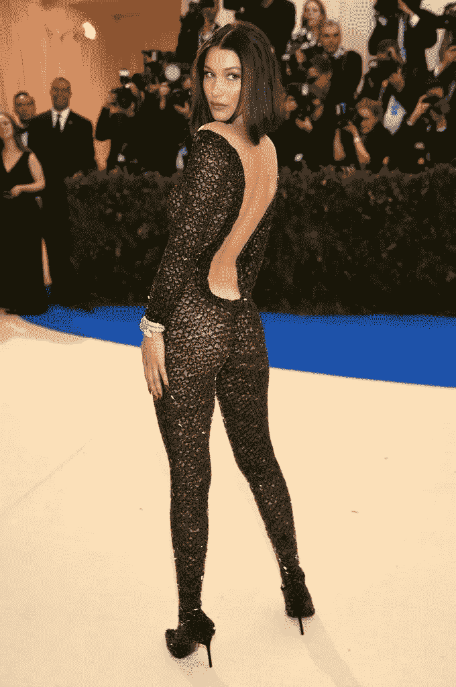
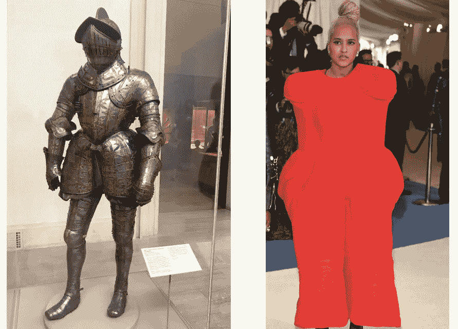
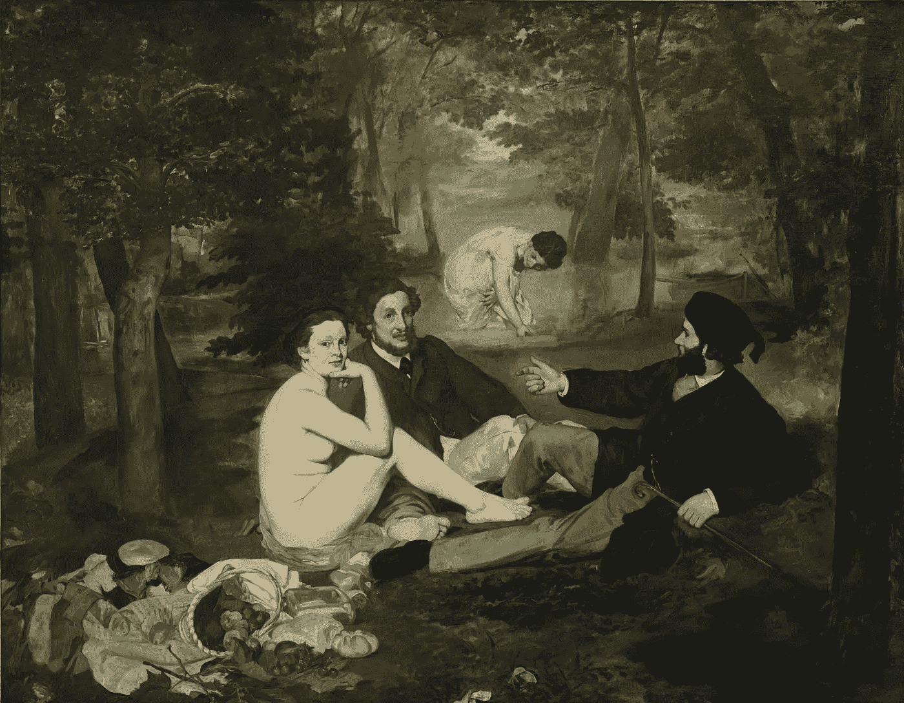
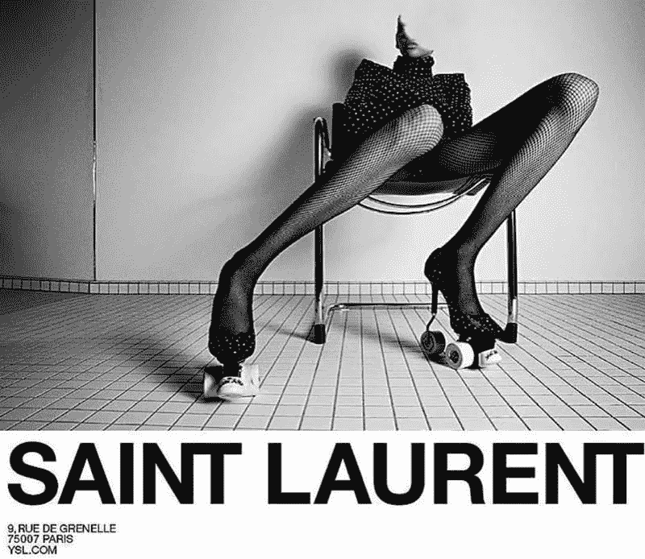
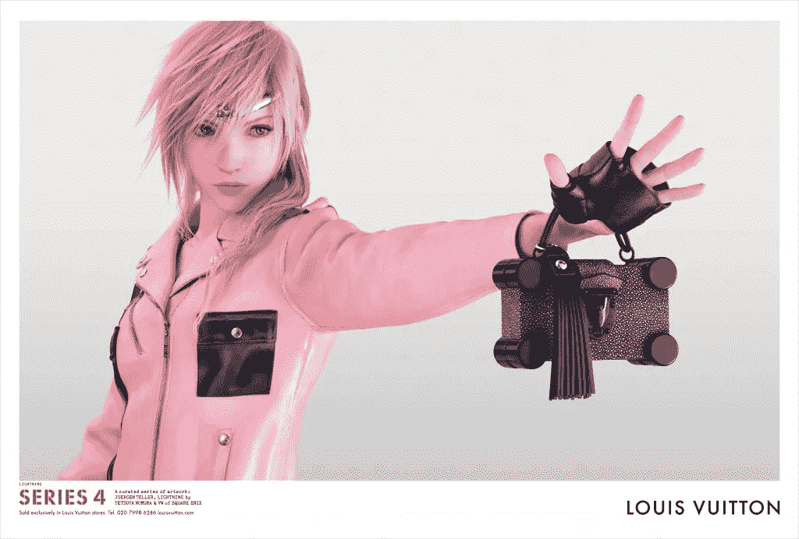
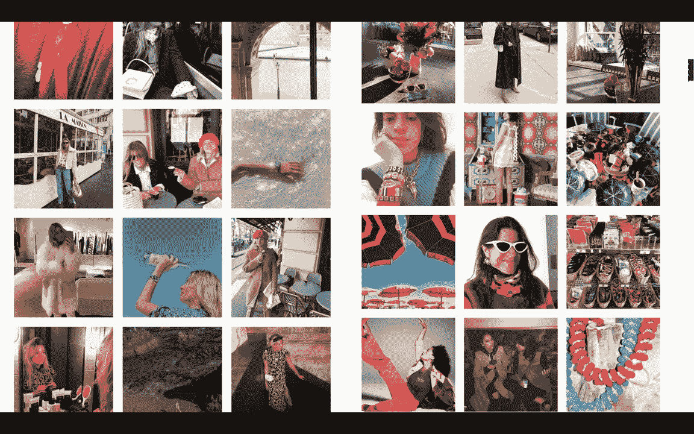
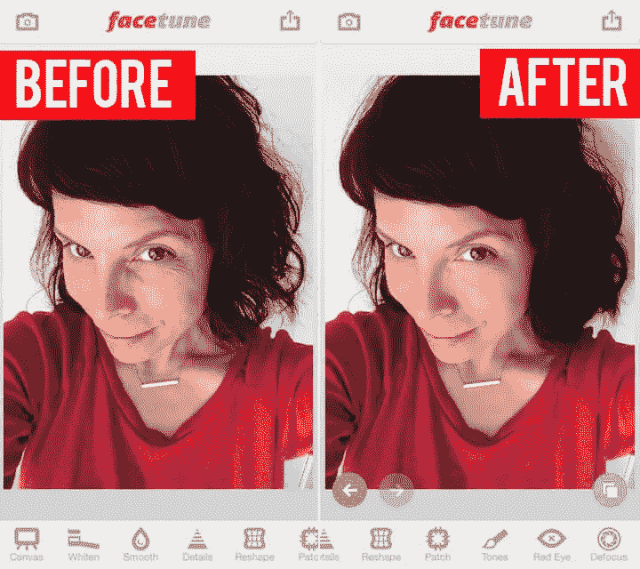
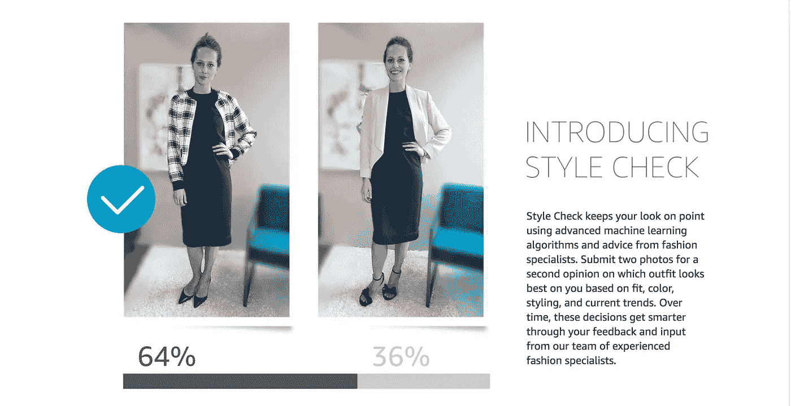

# 女人，计划，权力

> 原文：<https://medium.com/hackernoon/women-plandids-power-f06156265832>

这(几乎)是我演讲的文本，作为伦敦未来博物馆 [*展览季*](https://www.museumoflondon.org.uk/citynowcityfuture) *的一部分，关于城市中的人类。这是关于技术如何让女人和机器人的目光成为文化力量。*

我将谈论服装、身体形象和身份，以及 Instagram 和其他各种新技术正在改变和挑战人们如何看待女性，以及我们如何看待自己。以及我们注视着谁的重要性:男人，女人，还是机器人。

Who do women want to be seen by? Men, women, or robots?

我将称之为“时尚互联网”的东西对我来说很有趣，因为它基本上不在主流技术评论的视野之内。

从技术角度来看，人们知道，目前只有一个互联网——一个开放的网络，其中所有的东西都是相互连接的。但是并不是每个人对这些网络都有相同的体验——没有单一的体验来定义数字世界。

流行称之为过滤泡沫，但它和我们的其他生活一样，或多或少都是泡沫:我们居住的网络是由我们的兴趣、背景和认识的人构建的。这不仅仅是算法或个性化的结果，也是因为没有人能看到一切——没有数字全知。

这种观点的缺乏意味着对我们不久的将来的预测充其量只能代表我们中的一部分人。它们装满了无人机和自动驾驶汽车，以及当你回家时放在桌子上的冰啤酒。这些未来属于社会的一小部分——通常是富裕的男性。其他的未来当然也是可能的，但是它们并不总是被看到，或者被允许出现。

事实上，每个城市，每条街道，都同时拥有许多矛盾的未来——对我们中的一个人来说是真的，对所有人来说都不是真的——尽管如此，某些人的未来成为主导叙事，而其他人的则被淡化了。

技术如何改变了女性的时尚生活，这一点显而易见，但也隐藏在视野之外——发生在我们 Instagram 时间轴的替代现实中，而不是在我们周围的城市街道上。

这方面最明显的表现是我们对女性和权力的传统观念。乍看之下，女性显得脆弱，半裸着，容易被拍到。但这是一个很容易误解的想法，认为这是整个故事。

A snapshot of Kendall Jenner and Desi Perkin’s Instagram feeds

技术已经改变了女性外表的权力动态，并使女性的凝视成为一种具有文化意义的力量。

事实上，女性现在可以拥有和控制自己的外表，假以时日，这可能会保护我们免受日常生活中的骚扰和伤害。

我从女人穿衣服，女人化妆，女人拍照三个方面来探讨这个问题。

我从穿衣服的女人开始。

回到去年五月的一个晚上。当时有点晚了，我正准备睡觉，我在推特上看到了这张来自大都会歌剧院舞会的照片。

Helen Lasichanh and Pharrell Williams at the 2017 Met Gala Ball, picture from Vogue.com

这是法瑞尔·威廉姆斯，看起来很一般，他的妻子海伦·拉西昌，看起来很特别，不像任何正常人想象的女人在世界上或在红地毯上的样子。所以我停下手头的工作——可能是准备睡觉——看一些其他女人出现在红地毯上的直播。

庆祝活动是为了纪念来自 Commes des Garç ons 的川久保玲。她给女人做的衣服是这样的:

A dress from the Commes des Garçons Fall 2012 Ready-to-Wear Collection (Vogue)

所以我期待看到更多的女性穿着具有挑战性和非凡的服装。

但是我很快就失望了。

我意识到，我实际上从未见过，或想过，是什么让那些重大的红地毯时刻发生。当然，虽然海伦·拉西昌可能没有穿上世界上最实用的服装，但她看起来既有力量，也确实受到了保护。与外界隔绝，同时传递出一种绝对自信的信息。她不仅占用了空间，而且看起来一点也不在乎。但她是为数不多的符合着装要求的客人之一。

相反，有许多非常苗条的女性，穿着高得走不进去的鞋子和需要三个人才能整理的裙子，站在那里，看着大喊大叫的摄影师和灯光，看起来像炮弹一样震惊，等待他们的造型师告诉他们站在哪里。他们正在制作高贵典雅的照片，照片中裙子的裙摆落在一个完美的水坑里，光线从他们借来的钻石上反射回来，照亮了他们的脸。他们不是来找乐子的；他们在那里及时创造高度可联合和有利可图的时刻。

不可避免的是，当晚的突出形象与川久保毫无关系。

正是这张模特兼 Instagram 红人贝拉·哈迪德的照片，展示了她分手后的“复仇身材”。

Image: Bella Hadid in Alexander Wang (Vogue)

哈迪德是一个百万富翁，在时尚界有着不可思议的影响力。她在 Instagram 上有 1700 万粉丝，她的照片充斥着广告牌和杂志。但是看看这张照片，你永远不会知道:她是脆弱的，被动的——几乎没穿衣服，风骚，[穿着设计师亚历山大·王“缝制”的紧身衣，像一条贞操带](https://www.vogue.com/article/bella-hadid-met-gala-2017-red-carpet-dress-alexander-wang)。

值得快速浏览一下王的服装草图。

Sketches by Alexander Wang

这里的身体在解剖学上是如此的不可能，它可能是某种弯曲的，颠倒的长颈鹿:不可能走路或坐下来，大腿间隙的程度，用细长的腿支撑弯曲的底部，这使得它看起来很不可思议，这可能是一个关于衣服如何与人体相关的草图。然而，这就是强大、有影响力的年轻女性被描绘的样子。没有一条腿能长到或长到足以与设计相称。

所以，我停止了观看直播，去睡觉了，但是几个星期后，我在纽约参加了展览。后来，当我在大都会博物馆的楼下闲逛时，当我走进其中一个军械库时，我真的被这套盔甲让我想起拉西昌的装备而震惊了。填充物，顶部的结，站姿，它们都是一样的，但与哈迪德的服装的脆弱性有很大不同。

(L) A suit of armour in the Metropolitan Museum of Art; (r) Helen Lasichanh in Commes des Garçons

因为 Hadid 看起来更像是我们习惯看到的女人:裸体、顺从、可利用。

Sandro Botticelli, The Birth of Venus (Wikimedia)

从那以后，在过去的几个月里，我一直在与这种矛盾斗争:有史以来第一次，数以百万计的女性在制作和发布她们自己的照片，但这些进入大众意识的照片与 500 年前的照片没有什么不同。技术是如何改变我们正在创造和投射的自我形象的？

**拍照的女人。**

众所周知，女性在公众想象中长这样的时间要多得多:

Eduoard Manet, Le déjeuner sur l’herbe (Wikimedia)

或者这个:

The Jumanji poster, with my annotation.

比他们这样做:

Queen Elizabeth I, attributed to George Gower (National Portrait Gallery)

当然——时尚略有不同，因为女性至少还穿着衣服。但是这些女性本身往往是如此的虚无缥缈，以至于几乎不存在于此——血肉之躯，甚至在为赞美她们而发明的杂志中也不会占据太多的篇幅。

YSL 2017 Print Ad

高端女性时装主要由男性拥有、经营、设计和拍摄，与经营这一行业的女性之间有着众所周知的复杂、或许是剥削性的关系。

与高街美容产品不同，奢侈时尚不会用“[因为你值得拥有](https://www.lorealparisusa.com/about-loreal-paris/because-youre-worth-it.aspx)”这样的口号来满足女性——它创造的幻想往往更具惩罚性，几乎是受虐狂，既关注女性的缺席，也关注庆祝她们的存在。

例如，2016 年，路易威登在一次活动中使用了游戏《最终幻想》中闪电这个角色的画像，并颇为困惑地将这幅画像发送到媒体上，以谈论“她的”任命。

Louis Vuitton Print Ad (2016)

设计师尼古拉·盖斯奇埃尔对这位新的二维代表表示欢迎，称她为:“新绘画过程的象征。你怎样才能创造出超越摄影和设计经典原则的图像？闪电预示着一个新的表达时代。”

一个新时代的表达，因为，如果你错过了，她不是一个女人。她是一幅画。

在这个女人已经成为男人创造力的表达方式的世界里，时尚博主和 Instagram 影响者实际上给事情带来了一种伪坦率。

他们的照片——看起来更像真实生活，点缀着励志名言和吃意大利面的不太可能的图像——让时尚变得更加亲密和个人化——可以握在手心里审视。现在，数百万女性与数百名从未谋面的女性的生活方式、面孔和身体建立了亲密、高清的关系，Instagram 评论中有丰富的生活。

Images from Camille Charriére and Leandra Medine’s Instagram feeds

影响者 Camille Charrière 告诉 Vogue，“[我知道如果我想在 Instagram 帖子上获得 8000 个赞，那么我需要穿牛仔裤和匡威 t 恤。一般来说，人们喜欢简单。他们在寻找现实，因为这是他们可以模仿并购买的东西。](http://www.vogue.co.uk/article/what-is-an-influencer)

并购买它们。

2017 年，前 10 名有影响力的人接触到了大约有加拿大那么大的观众，来自他们的电子商务推荐已经开始[主导大牌时装店的移动流量](http://wwd.com/business-news/retail/influencers-chriselle-lim-man-repeller-leandra-medine-reward-style-drive-traffic-and-sales-10994073/)。

这意味着对于许多女性来说，屏幕——可控制、可编辑、可过滤——正变得比街头更具代表性。

甚至在 10 年前，像比尔·坎宁汉这样的街头风格摄影师骑自行车环游纽约，拍摄照片以预测未来趋势是有意义的；现在，通过喜欢 Instagram 上的图片也可以做到这一点，额外的好处是，你只需用手指轻敲一两下，就可以“购买外观”。

但问题的关键当然在于，人们所购买的“现实”就像任何虚拟世界或杂志照片一样，是另一种现实。

影响者的镜头被定位为远离现实生活的自拍杆，由算法管理，由软件过滤，由喜欢驱动。这意味着，最终，你最喜欢的影响者并不比你最喜欢的除臭剂品牌更真实。

但是在经历了这些之后，女性可能想要一个看起来和感觉上都比现实好一点的受保护的世界，这是完全有道理的。经过精心策划的自发性更安全，女性的凝视更值得信赖，她的个人品牌更令人放心。

不要介意我们永远不会知道她是如何看待那个[计划的，也不要介意大多数人在躺在厨房的柜台上喝咖啡之前穿上裤子。这是在一个鲁莽的世界里的安全逃避，就像在一个封闭的度假村里的全包假期。](https://www.manrepeller.com/2017/07/celebrity-instagram-poses.html)

这让我想到了最后一个领域:女性化妆

化妆在某些方面比时尚更民主。你买不起那些花哨的鞋子，但你仍然可以画出闪亮的眼线，如果你需要提高你的技能——嗯，有[1100 万 YouTube 教程可以帮你解决](https://www.youtube.com/results?search_query=cat+eye+makeup+tutorial)。

“化妆”是女性军械库中文化规范的一部分，化妆的仪式和结果已经从现实世界扩展到了数字世界。

虽然女性在公共生活的大多数领域仍然很少出现，但 YouTube 上有数百万女性的技术知识和技能，她们权威地分享自己在头发、化妆和护肤方面的专业知识。

当你看到一个女人在繁忙的通勤列车上站着化妆时，节奏和惯例是第二天性。她拿着镜子几乎是出于习惯，甚至不是因为她需要看到自己的手做出的形状。

照片编辑应用程序将这种随意的优化——“像你一样，在美好的一天”——从你现实生活中的人脸翻译到屏幕上。

如果你成年后每天都涂 touchéclat，调整眼袋并不是什么大不了的事情，就像如果你曾经在内眼的粉色部分涂上白色眼线以看起来“更清醒”，在 Snapchat 中添加 cat 滤镜也不是那么奇怪(专业提示:不要这么做)。这些微优化只不过是女性隐藏自身缺陷、展现“最佳自我”的数字化反映。

FaceTune, before and after.

但有趣的是在线和离线世界的碰撞方式。

化妆品公司已经迅速制造出模仿 Instagram 滤镜的产品。你可以购买粉底，让你的脸变得更模糊、更明亮、更明亮，轮廓造型持续受欢迎至少部分是因为，正如时尚博主 Leandra Medine 所说，它让你看起来像“[一个永远过滤的、更好的你自己的版本](https://www.vogue.com/article/leandra-medine-selfie-makeup)”。

对许多女性来说，这些微劳动并不是新任务，而是她们离线生活的无缝延续。如果你“戴上面具”去商店，为什么不在 Instagram 或脸书上露面呢？

但是简单就代表好吗？

可能最大的不利因素之一是个人身份与消费主义的联系更加紧密。

购物或者点击一个赞助商的帖子和和你的朋友去 TopShop 没什么不同。分享你尊敬的人推荐的东西会有一种亲密和友谊的感觉。当你真正独自坐在公交车上时，那种归属感，那种置身于一个帮派中的感觉。

以及我们留下的数据痕迹。我们在照片编辑应用程序上分享的不安全感，只有 Instagram Discover 才真正知道你有这样的困扰——这些都有利于广告定位，可能只会有助于加强你来 Instagram 躲避的不安全感。

这一切在哪里结束？

喜欢这么多东西，大概跟亚马逊。

亚马逊回声外观可能是时尚互联网的独特之处。这是一个带有摄像头的亚马逊 Echo，它会告诉你你是否好看。

Echo Look promotional film

使用机器学习和专家小组，Alexa 不仅会让你保持潮流，还会确保你穿着最讨人喜欢的衣服。

“我看起来怎么样？”(或其变体)是一个人可以问的最复杂的问题之一。它取决于环境、品味、规范，需要大量的敏感。这可能意味着我会脱颖而出吗，我会得到这份工作吗，那个人会喜欢我吗，我应该穿胸罩吗，或者更多的事情。这是一个数以百万计的重要的其他人在一个普通的周六晚上都会犯错误的问题——并不是因为他们缺乏正确的数据点。

但同时,“最讨人喜欢的样子”的训练数据需要来自某个地方。“我穿粉色还是红色更好看”的标准数据集是什么？或者“这条裤子会不会太紧了？”没有哪两家零售商能够决定 12 码的尺寸，机器学习[发现很难处理种族问题](https://boingboing.net/2018/01/11/gorilla-chimp-monkey-unpersone.html)，而[肥胖是一个女权主义问题](https://www.theguardian.com/books/2005/oct/11/gender.society)。

Amazon publicity image

问 Alexa 你看起来怎么样有点像问它谁在争论中获胜，或者评价你的自我价值。这是一个主观的问题，取决于上下文，充满了细微差别。

用一个给你一个百分比的算法来检查，比如一个学校作业，假设看起来 100%是可能的或可取的，并且[每个人都有分数](https://en.wikipedia.org/wiki/Social_Credit_System)。我们可以被机器人评价，可以被它们以平凡的日常方式注视和评判。

所以最后，我担心的是，女人的目光不会停留足够长的时间而成为一种文化人工制品——它会突然出现足够长的时间，以产生足够多的数据供机器人理解。似乎有可能，女人的目光的解放可能是非常短暂的。