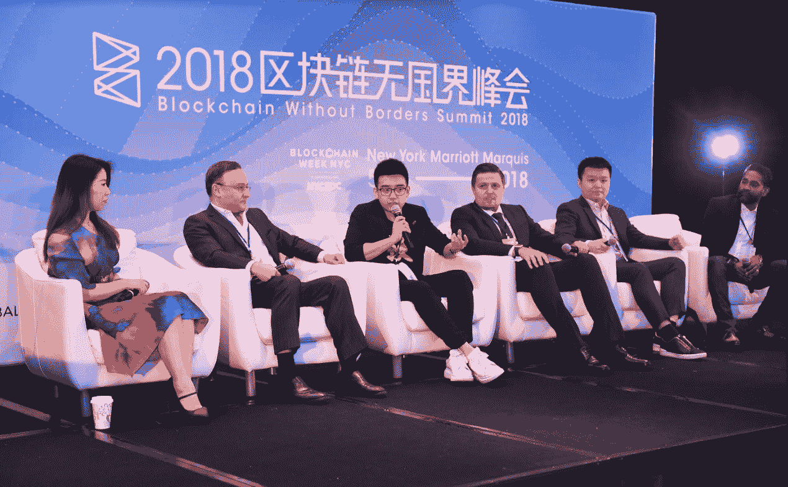

# 想知道加密货币将何去何从？纽约令牌节可能是一个值得探索的事件

> 原文：<https://medium.com/hackernoon/wondering-where-cryptocurrency-is-going-nyc-token-fest-might-be-the-event-to-explore-37e741ae980e>

我当然认为自己是不断发展的纽约市区块链社区的一员，在这样一个大城市，我必须不断过滤区块链一年中每天都在发生的事件，以找到真正带来价值和值得花时间的事件。

通常，这些活动大多规模较小，演讲者是区块链的业余爱好者，或者在非常不方便的地点举行。因此，当一个重大事件吸引了我的眼球时，我一定会让我社区的其他成员知道。

[区块链无国界令牌节 2018](https://bwb-token-fest-nyc-blockchain.eventcreate.com/) 本周传给了我。今年早些时候在纽约区块链周期间，我参加了由区块链无国界组织举办的一次活动，我觉得这次活动很有前途，所以我决定向所有有兴趣参加的人公布。以下是一些细节:

区块链无国界是一个国际公认的活动系列，举办了几场高收视率和高参与度的活动。在今年夏天的纽约区块链周期间，BWB 被评为区块链顶级会议之一，聚集了该领域的创新者和远见卓识者。

拥有超过 100 名世界级的区块链演讲者，与区块链专家的贵宾晚宴，以及聚会后的网络，BWB 看起来很有前途。

与来自世界各地的区块链专业人士的交流机会，尤其使这个活动对纽约市区块链社区的人非常有吸引力。

Token Fest 2018 将有四个主题:

*   母链:旨在平衡“公平”和“效率”。
*   达普斯:区块链实验的温床正在产生令人难以置信的结果。
*   交易所未来:加密货币交易的未来是什么？采矿会幸存吗？
*   投资机构:资产的令牌化:商业的未来在令牌中吗？

BWB 和合作伙伴精心挑选了该领域的专家，他们对区块链、加密货币和令牌化都有着深入的了解。您还可以接触到来自纽约市和世界各地参加 Token Fest 的区块链专家和专业人士。【2018 年 BWB Token Fest 将聚焦上述四个主题，这对区块链未来的成功至关重要。