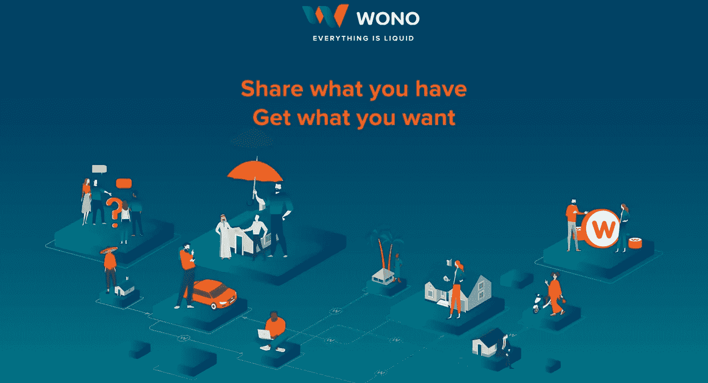
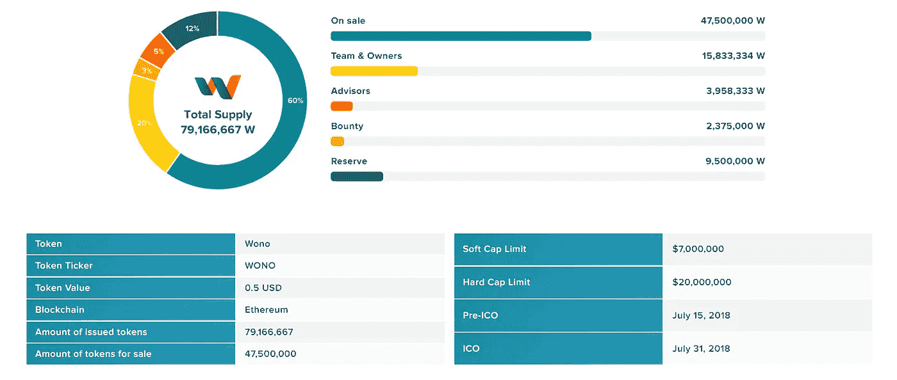

# WONO ICO 评论:Gig 经济的 P2P 平台，用于租赁和交换任何资产

> 原文：<https://medium.com/hackernoon/wono-ico-review-the-gig-economys-p2p-platform-for-renting-exchanging-any-asset-814a1be24219>

Share and Trade Anything from Homes to Cars

[**WONO**](https://wono.io) 是一个去中心化的点对点平台，可以出租或交换任何资产。该项目旨在创建一个社区驱动的、100%加密的环境，没有法令、高价中间人，甚至税务人员。

这个项目真的能创造一个 100%依赖加密的避税天堂吗？

让我们看一看…

***免责声明*** *:这不是投资或理财建议。无论如何我都不是金融专家。本文中的大部分信息都是推测性的，仅仅是我个人的观点。在参与任何创业项目之前，一定要进行自己的研究。*

永远记住，你用钱做什么是你自己的决定。如果这个决定对你一个人来说太难了，向金融专家寻求指导。

*我可能会也可能不会收到创建此内容的少量令牌分配。也就是说，我会尽我所能保持公正和公平。我尽量避开所有的 FOMO 和 FUD，也绝不希望把这些情绪传染给我的秘密首脑伙伴们。*

***参考消息*** *:某些国家被排除在 WONO 即将推出的 ICO 之外。别忘了查看(精彩！)条款和条件页面。如果你的国家被列入黑名单，你不必担心；你只需要等到交易所里没有代币了。*

# 一切都是流动的

WONO 项目试图在以太坊区块链建造他们自己的秘密天堂。一个点对点(P2P)的纯加密生态系统听起来当然很诱人。

理想情况下，你将谋生以及购买商品和服务，所有这一切都在密码。

WONO 的目标是成为区块链版的 Airbnb、Turo 和 Upwork，所有这些都打包成一个整洁的小包裹。交易汽车和房屋，在自由职业经济中工作，所有这些都是通过赚取和消费 WONO 代币实现的。

权力下放是 WONO 项目的核心。该团队致力于用一种更便宜、更高效的版本 WONO 令牌——取代中间人，这种令牌是按照 ERC20 标准制造的。

# **沃诺平台**

想象自己是一名自由工作者，希望把自己的技能带到一个新的国家。你需要住宿，甚至可能需要一辆车。

而不是在传统的菲亚特系统内出租这些东西，你将通过 WONO 来完成。

WONO 是这样用他们自己的话解释的:

*Worldwide freelancing freedom*

看视频你会发现 WONO 当然是在卖梦想。好消息是，区块链科技有能力让一些梦想成为现实…

# **WONO Token**

该项目的本土 WONO token 是为整个生态系统提供动力的气体。参与者可以使用 WONO 支付平台费用、房屋和汽车租赁，以及专业服务。

WONO 代币也是支付交易仲裁(如果需要的话)和保险的一种手段。

大多数交易将无缝发生。双方都没有问题。然而，任何 P2P 系统都在一定程度上存在欺诈。

以易贝为例。订购一些东西，你通常会得到它。但有时你没有，你需要向易贝伸出援手。这就是 WONO 的保险计划发挥作用的地方。

## **记号组学**

WONO 项目当然没有在令牌创建方面做得过多。只有不到 8000 万人会通过密码隧道。

WONO 为他们的代币计划如下:

How WONO tokens will flow throughout the ecosystem

但是，在整个操作中有一个小问题这些代币将很快供电。根据您所在的司法辖区，您可能没有资格参与 WONO 平台。

这为像我这样的人提供了一种可能性，这个平台对我来说是绝对完美的，让我成为一个旁观者。嘘。

如果美国证券交易委员会有他们的方式，你不会遇到任何美国公民在 WONO 生态系统。这是当今监管环境的可悲现实。我看到了监管带来的好处。外面会变得很难看。

但是仅仅因为地理位置而拒绝参与者绝对会对区块链理工大学试图解决的问题产生反作用。

好消息是 WONO 正在努力遵守——他们正在成为 KYC 的合规者，打开美国市场。人们只能希望…

# **沃诺团队**

WONO 的员工人数达到了两位数。他们的规模和技能取决于一个非常有前途的项目。核心团队拥有深厚的区块链专业知识，顾问也是如此。

这里有大量的知识，几个关键成员在 WONO 试图进入的市场中有丰富的经验——即 P2P 汽车共享，加上住宿和旅行。

就像他们的兄弟项目，即将到来的 NEP-5 token BizShake 一样，WONO 团队很高兴有 Ian Scarffe 先生加入顾问团队。

这几乎就像 WONO 和其他 NEP-5 一起工作，Ian 根据其他项目的工作情况向所有团队提供反馈。

# 最后的想法…

WONO 当然有一个雄心勃勃的项目。是的，这是一个很难立足的领域，但这个概念非常有意义。

拥有一个分散经营的地方听起来非常诱人。但就像任何新经济一样，人们需要有一个参与的理由。就像人们搬到俄勒冈州的 Stretchumout 去教瑜伽课。

放弃菲亚特肯定有非常令人信服的理由。不幸的是，我们在一定程度上仍然需要它。

但是像 WONO 这样的项目正在努力改变我们对菲亚特的总体看法。他们要向所有人证明，在一个不信任的 P2P 环境中，没有它我们也能和平地生活。

我很高兴看到未来平台能提供什么。而且，观察经济如何增长将会特别有趣。

我真的能在那里过上好日子吗？这些项目的报酬能和我现在做的相比吗？我附近还有其他用户吗？

因为我们仍处于早期阶段，我的问题比答案还多…

食品杂货和水电等公用事业以及垃圾处理服务怎么样？在 WONO 平台可以购买 5G 上网服务吗？不，我不认为我能。

但是可能会有合作关系，让我用代币购买所有这些东西。

这就是为什么我没有预见到“一个密码统治所有密码”的情况。比特币很棒，但它并不真正符合专用公用令牌的模式。

BTC 有它的位置，但那个位置不在这里。我们需要额外的区块链来完成 WONO 想要促成的互动。

像任何创业项目一样，时间会揭示一切。主平台预计要到 2019 年 Q2 才会发布，离发布还有将近一年的时间。

我将密切关注该平台的发展。用户群将决定它的成败。

如果 WONO 能成功完成他们的使命，创造一个免税的神秘国度(不，不是交易所！)，我们会看到一些零工经济的工作者将他们的努力转移到平台上。

如果 WONO 能够证明他们的网络的价值，并扫清 SEC 的障碍，我希望成为他们中的一员。

访问 [**WONO 网站**](https://wono.io/) 或阅读 [**WONO 白皮书**](https://wono.io/assets/i18n/en/wp.pdf) 了解更多关于该项目的信息。

如果你想和这个团队接触，你可以在这里找到他们:

> [BitcoinTalk](https://bitcointalk.org/index.php?topic=3398728)脸书 GitHubLinkedIninsta gram
> 
> [中型](/@wonoworld) [Reddit](https://www.reddit.com/r/wonoworld/) [电报](https://t.me/wonoworld) [推特](https://twitter.com/wonoworld)

## 顺便说一下…

如果你喜欢你在这里看到的，并且需要帮助把你的加密信息传递给大众，我很想听听你的项目。

请随时联系我:blockchainauthor 作者在 Gmail