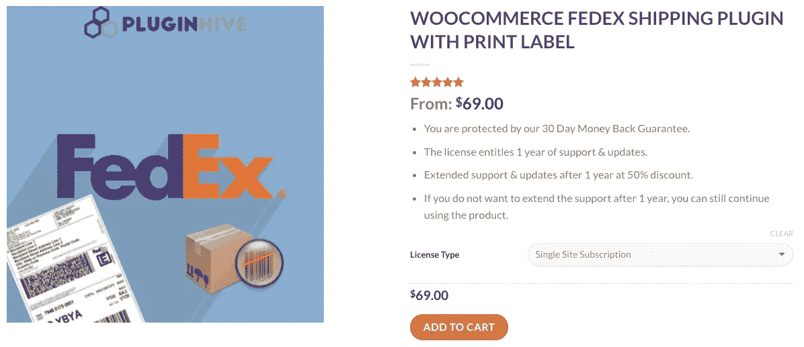

# 带打印标签的 PluginHive 联邦快递运输插件与 WooCommerce 联邦快递运输方法的比较

> 原文：<https://medium.com/hackernoon/woocommerce-fedex-shipping-method-vs-c344a8de4bdc>

有几个 [**WooCommerce 发货插件**](https://www.pluginhive.com/product-tag/woocommerce-shipping/) 为你的 WooCommerce 店铺提供最佳的发货解决方案。它们旨在帮助您满足所有运输需求，并最终按时将您的产品运送到客户手中。其中一些插件专用于特定的运输公司，而另一些如 [**WooCommerce 多运输公司运输插件**](https://www.pluginhive.com/product/multiple-carrier-shipping-plugin-woocommerce/) ，在一个插件中提供多个运输公司。

作为最好的运输公司之一，联邦快递也有很多 WooCommerce 插件。这些插件提供了一个巨大的功能列表，在使完整的运输过程无缝化方面发挥着非常重要的作用。虽然很多联邦快递的运输插件可以免费下载，但它们提供的功能很少令人失望。

目前，大多数联邦快递运输插件是由一些第三方公司提供的。许多寻求店主发现很难选择正确的插件，而他们中的一些人最终购买了错误的插件。

这就是我们创作这篇文章的原因。这里我们就比较一下 PluginHive 的 [**WooCommerce 联邦快递发货插件**](https://www.pluginhive.com/product/woocommerce-fedex-shipping-plugin-with-print-label/) 和 WooCommerce 联邦快递发货方式。我们将涵盖所有重要的参数，最终帮助你为你的 WooCommerce 商店选择正确的插件。这样你就能做出明智的决定，愉快地运送你的产品。

此外，如果你想在企业层面处理货物，而不是独自经营整个商店，那么看看 StorePep 的 [**WooCommerce FedEx 解决方案。StorePep 的行业级运输功能和端到端解决方案肯定会对您有所帮助。**](https://www.storepep.com/fedex-shipping-with-woocommerce-using-storepep/)

让我们首先从比较这两个插件所需的参数列表开始:

1.  **实时运费率**
2.  **调整退货运费**
3.  **包装方式**
4.  **打印装运标签**
5.  **出货追踪**
6.  **基本故障排除**
7.  **插件的成本**

# 实时运费

PluginHive 联邦快递运费插件直接从联邦快递服务器获取运费。它通过收集客户输入的必要数据以及您的商店详细信息(如地址、货币、您的 FedEx 帐户详细信息等)来实现这一点。根据整批货件的重量和尺寸，联邦快递会发送准确的运费率，这些运费率会进一步显示在购物车/结账页面上。这样，客户可以从运费列表中选择，并最终购买您的产品。

在计算和显示实时运费时，PluginHive 和 WooCommerce 联邦快递运费插件做的是同样的工作。该插件向 FedEx APIs 发送请求并获取费率。另一件需要知道的好事是，这些插件将获取国内和国际目的地的准确运费，所以你不必担心这一点。

您可以设置不同的 [**WooCommerce 运输等级**](https://www.pluginhive.com/ultimate-guide-set-up-woocommerce-shipping-class/) ，并通过 [**WooCommerce 多承运商运输插件**](https://www.pluginhive.com/product/multiple-carrier-shipping-plugin-woocommerce/) 为每个等级设置不同的运输选项。

# 调整退货运费

为了实现某个商业案例，你可以根据你的需求修改插件。例如，有时你想**提供联邦快递**退回运费的折扣。所以，如果你想在运费上做一些修改或改变，那么这些插件肯定会帮到你。PluginHive 联邦快递运输插件允许店主减少从联邦快递退回的额外运输费用。然而，如果你发现运费成本有点低，那么你甚至可以增加一些额外的金额。该插件允许您通过增减所需的值或简单地定义一个百分比值来改变价格。

WooCommerce FedEx 运输方式也支持这一功能。与 PluginHive FedEx 运输插件类似，店主可以根据每种运输服务设置所需的价值。同样可以参考上图。这个插件也支持统一费率和百分比值来增加或减少运费。

# 包裹包装方法

PluginHive FedEx 运输插件支持以下包裹打包方式:

*   **单独包装商品** 通过使用这种包装方法，店主将能够单独包装他们的产品，运费将根据每个包装计算。因此，订单中的项目总数将最终决定包装数量和各自的成本。
*   **将物品装入具有重量和尺寸的箱子**
    这种包装方法允许店主根据联邦快递预先定义的包裹来包装物品。你也可以参考下面给出的图片。现在，如果您想创建具有自定义尺寸和重量限制的装运箱，也可以这样做。对于喜欢定制运输箱而不是默认联邦快递箱的店主来说，这是一个非常有用的选择。
*   **重量包装** 这种包装方式是广泛使用和推荐的包装方式之一。它允许店主在插件设置中设置一个**最大重量**，根据这个值，商品将被进一步打包成一个包裹。

下图显示了插件设置页面中可用的各种联邦快递箱。

WooCommerce FedEx 运输方式也支持多种包装方式。然而，它**遗漏了最重要的包装方法之一，即基于重量的包装方法**。虽然其他两种包装方法可能足以满足您的业务需求，但即使是这样的理由也不能证明错过这样一个重要的选项是合理的。

# 打印运输标签

这是任何一个插件中最重要的特性之一。该功能允许 WooCommerce 店主直接从 WooCommerce 管理页面打印发货标签。运输标签将包含关于包裹重量、源地址、目的地址、服务名称等的必要细节。在 PluginHive FedEx 运输插件中，店主可以在创建货物后自动生成并打印运输标签。这可以直接从**订单编辑**页面完成，非常方便。此外，店主甚至可以自动化这一过程，这将进一步节省他们的时间。现在，出于某种原因，如果店主需要**打印退货标签**，他们也可以这样做。你可以参考下面的图片。

另一方面，WooCommerce FedEx 运输方法**不允许店主直接从插件创建或打印运输标签**。它只提供 WooCommerce 和 FedEx 费率之间的整合。因此，如果您想要打印运输标签，那么您需要在外部完成，这是一个非常耗时的过程。

# 装运跟踪

货件跟踪是整个运输过程中另一个最重要的部分。这是因为它与客户满意度和安全性有直接关系。现在，一旦包裹被运送，运送跟踪 ID 应该与客户共享。是的，PluginHive 联邦快递运输插件允许你这样做。店主也可以选择他们是否愿意**与他们的顾客分享跟踪细节**。他们甚至可以添加包含跟踪 ID 链接和发货日期的自定义消息。如果您在插件设置页面中启用了某个特定选项，那么插件还可以自动将跟踪详细信息与订单完成电子邮件一起附上。这样，客户可以快速查询跟踪详情。

然而，WooCommerce 联邦快递运输插件**不支持该功能**。因此，店主必须手动查找跟踪细节，然后与他们的顾客分享。

# 基本故障排除

有时，当使用插件时，你可能会面临一些技术问题。问题背后的原因可能是任何事情。这可能是因为内部(插件设置)或外部(服务器、WordPress 问题等)问题。无论是什么情况，一旦发生这种情况，您将需要一种机制来帮助您找到确切的问题并自己解决它，或者从有经验的人那里获得帮助。PluginHive 联邦快递运输插件有一个非常结构化的调试问题的方法。这可以通过启用名为**调试模式的选项从设置页面完成。**此后，您可以转到购物车或结账页面，甚至编辑订单页面来调试问题。然而，在任何一步，如果你不能自己解决问题，那么你总是可以依靠 [PluginHive 的客户支持](https://www.pluginhive.com/support/)。

Debug mode

WooCommerce 的 FedEx 运送方法也有类似的调试方法。您可以选择启用调试模式，并在购物车/结账页面中解决问题。如果你想了解更多关于 WooCommerce 联邦快递运输方法插件中可用的调试选项，请点击此链接[。](https://docs.woocommerce.com/document/fedex/)

# 插件的成本

在做出决定之前，你应该注意，WooCommerce FedEx 运输方式中几乎所有可用的功能都可以在 PluginHive FedEx 运输插件 的 [**免费版中获得。所以，如果你决定购买一个插件，那么最好使用 PluginHive FedEx Shipping 插件，因为它只需要花费 **$69** 。**](https://www.pluginhive.com/woocommerce-fedex-shipping-plugin-free/)

而 WooCommerce 的联邦快递运输方式将花费你**79 美元。**另一个好处是，你可以尝试免费版的联邦快递运输插件的一些功能，然后决定购买高级版。但是，遗憾的是，在 WooCommerce FedEx 运输方式的情况下，你不能这样做，因为没有免费或基本版本的插件。

# 你应该选择哪一个？

为你的 WooCommerce 商店选择合适的插件似乎是一项艰巨的任务。为了更简单，你只需要根据参数评估插件。这些参数可能取决于你的 WooCommerce 商店的需求。例如，如果你确实需要打印运输标签，那么就使用提供这种功能的运输插件。然而，根据我们的分析，PluginHive FedEx Shipping plugin 被证明是高度功能化的。它提供了大量的功能，肯定有助于通过联邦快递运送产品。

如果你对本文或 WooCommerce 联邦快递运输插件与你的 WooCommerce 的整合有任何疑问，请在下面的评论区分享你的观点。我们将非常乐意帮助您了解这个插件如何能够一起工作，以满足您的运输要求。

或者如果你想知道联邦快递运输插件还能提供什么，我想请你 [**点击这里**](https://www.pluginhive.com/product/woocommerce-fedex-shipping-plugin-with-print-label/) **访问官方产品页面。**如果您需要关于我们插件的帮助，您也可以 [**联系我们的支持团队**](https://www.pluginhive.com/support/) **。我们总是乐意帮忙。**

# 关于插件…

## WooCommerce FedEx 运输插件，带打印标签

*   WooCommerce 要求至少 2.6 到 3.2。
*   该许可证享有 1 年的支持和更新。
*   没有月费或年费。
*   1 年后以 50%的折扣延长支持和更新。
*   受 30 天退款保证保护。