# WooCommerce 预订和约会——像专家一样出售您的时间！

> 原文：<https://medium.com/hackernoon/woocommerce-free-bookings-and-appointments-plugin-review-94e78fdb5b74>

使用预订系统经营网上业务时，你很容易会遭遇一些失败。一个糟糕的预订软件，一些不适当的支付网关，和一个不可持续的订单管理系统真的可以拒绝你建立一个自我可持续的预订网站的梦想。

在 WordPress 知识库中，几乎每隔一个 [**WordPress 预订插件**](https://www.pluginhive.com/wordpress-booking-plugin-free/) 就被设计成只适合一两个商业案例，这使得它们没有通用性。对于一个预订插件来说，随时改变它的形状是非常重要的。

一个理想的预订插件应该可靠、易于实现、简单易用，并且在处理多个预订时不会给你带来太多的麻烦[。](https://www.pluginhive.com/why-go-for-a-woocommerce-bookings-and-appointments-solution-at-all/)

# 提示， [WooCommerce 预订和预约](https://www.pluginhive.com/product/woocommerce-booking-and-appointments/)

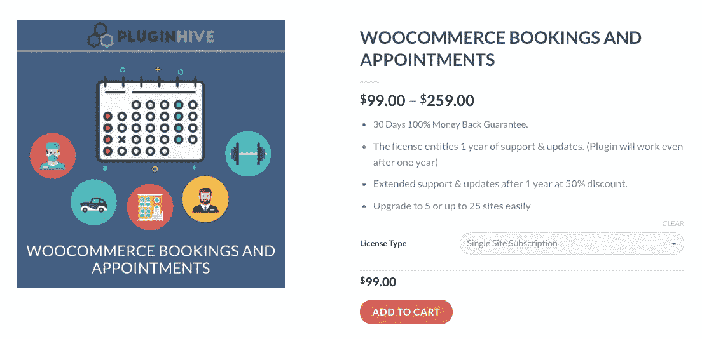

这个 [**WooCommerce 预约排班插件**](https://www.pluginhive.com/product/woocommerce-booking-and-appointments/) 一句话就是**不拘一格**。它从许多真实的业务案例中获得灵感，因此支持各种实际的实现。

它通过提供适合企业的功能而脱颖而出，如派对设备租赁、酒店房间预订、医生预约、水疗预订或任何其他需要预订系统的网站。

# 我需要花多少钱？

该插件为单站点许可证提供了 99 美元的合理费用**。您也可以扩展站点的数量([点击此处了解更多](https://www.pluginhive.com/product/woocommerce-booking-and-appointments/))。许可证包括一年的客户支持和插件更新。**

但是也有一个 [WooCommerce 免费预订](https://www.pluginhive.com/wordpress-booking-plugin-free/)插件供你查看。这个插件的免费版本太棒了。如果你想在你的 WooCommerce 网站上建立一个基本的预订功能，你可以使用它。

# 但是，为什么要选择这个预订插件呢？

**无需订阅或额外费用:**无需支付额外费用，因此您只需一次性付款即可。没有每月订阅，所以你不必担心支付间隔的钱。请注意，插件将继续工作，甚至超过其到期日期。

**质量保证:** PluginHive 是 XAdapter 的**厂商，拥有**超过 5 万活跃用户**。PluginHive 的每一个插件都会不时经过严格的审查过程。在发布新版本之前，它们已经过彻底的检查和测试。**

**30 天 100%退款保证:**如果你对产品不满意，这个插件提供 30 天退款保证。也就是说，如果你不喜欢这个插件和它的表现，你可以在购买后的 30 天内索赔。

# 使用 WooCommerce 预订和约会插件有什么好处？

不像其他任何预订插件，这是一个多功能的预订解决方案。也就是说，不管你经营或者想要经营什么样的业务，这个 bookings 插件都可以相应地改变它的形状。这是因为它具有多种特性和功能。让我们来看看在你的基于 WordPress 的网站上使用这个插件的一些主要优点。

## 将任何 WooCommerce 产品转化为可预订资源

是的，你没听错！创建一个可预订的产品就像用 WooCommerce 创建一个产品一样简单。定义完产品后，您可以将产品定义为可预订的产品。

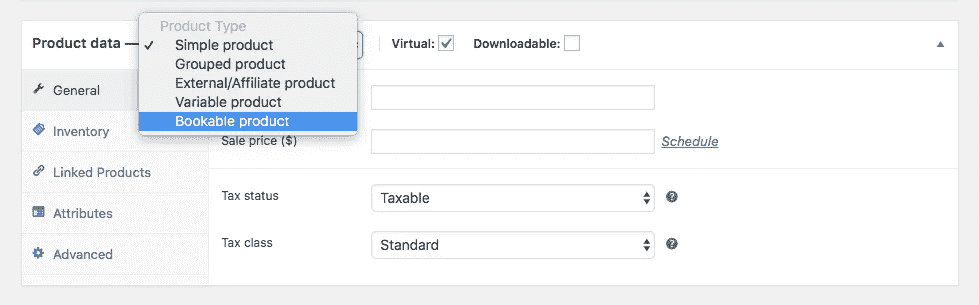

## 您可以直接从日历上预订

使用这个插件，你可以在产品页面上显示日历。客户可以直接在日历上选择已定义的预订期——这是大多数预订插件都不提供的。

## 选择预订持续时间/期间并显示日历范围

该插件提供了四个预约时段— **分钟，小时，天，月**。所以你可以很容易地建立一个由 40 分钟组成的预约系统。该插件还允许您显示**固定时段**或**日历范围**的预订时段。

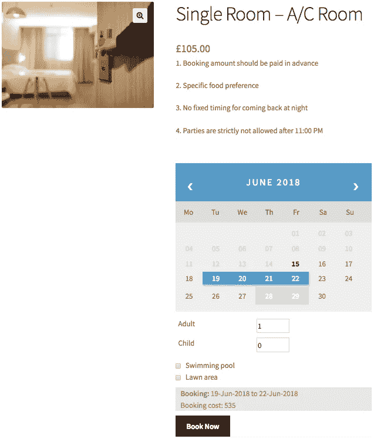

Calendar range booking

## 允许从客户方取消

WooCommerce 预订和约会插件有一个智能功能。因此，启用此选项后，您的客户将能够从**我的帐户**页面取消预订。该插件还有一个功能，让您的客户向您发送预订确认请求。一旦您(作为用户)确认了这个请求，您的客户就可以支付预订金额。

# 设置预订可用性

您可以根据可预订服务或资源的可用性提供预订。例如，你从周一到周五提供某种服务，但周末不工作。在这种情况下，该插件可以帮助您将预订限制在工作日。

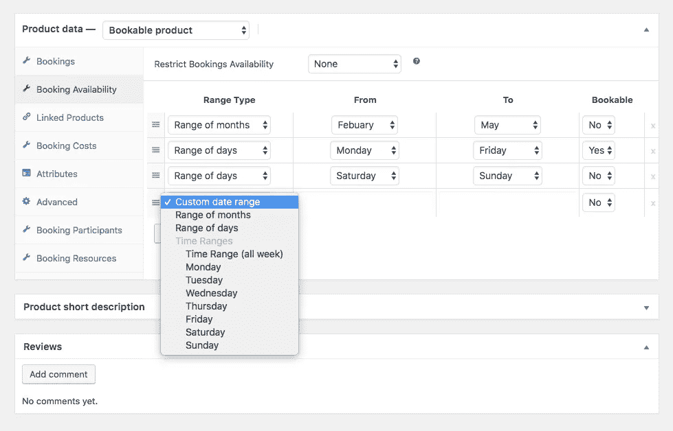

Restricting the bookings

# 报价预订成本

我们都知道，设定预订成本可能是一个棘手的问题。特别是，当你在酒店接待客人时，你必须提供特殊资源，如预付费 WIFI 和专属 Spa。不管是什么情况，你都可以使用这个插件来设置你想要的价格选项。

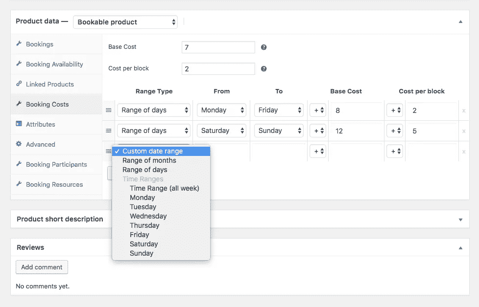

在上面的例子中，您可以提供一个租赁项目，并设置从**周一到周五**的基本成本为 15 美元((7+8)+(2+2))。假设你想在**周末**收取更多费用，那么你甚至可以设定一个更高的价格，在这种情况下，26 美元((7+12)+(2+5))。让我们看看这将如何出现在产品页面上。

# 您可以添加参与者并提供资源

有了这个插件，你就可以拥有一个系统，让客户告诉你住在你酒店房间的人数。更神奇的是，你还可以按人收费。预订参与者功能可让您完成所有这些工作。

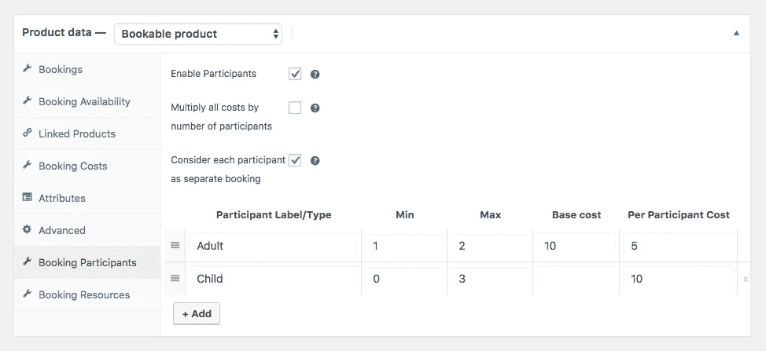

记住上面的例子，让我们假设酒店老板想对进入他们房间旁边的游泳池和个人草坪区的客人收取额外的费用。在这种情况下，他或她可以在预订资源部分设置以下条件。

在这里，您可以选择自动将资源分配给每个房间预订或让客户选择。费率也可以基于每个参与者来计算。让我们看看它在产品页面上会是什么样子。

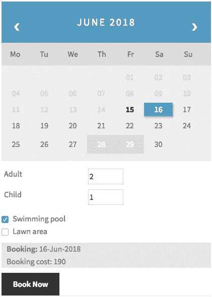

预订总费用将达到 190 美元，因为 50 美元是游泳池资源的额外费用。

# 在后端管理您的预订

预订可以在后台管理，就像 WooCommerce 中的其他正常订单一样。你需要去 WooCommerce 仪表板，进入专门的**预订**部分。一旦你进入，你就可以在你的网站上看到所有预订的列表。您还可以有三个主要选项来**删除、取消或确认特定预订**。请看下图:

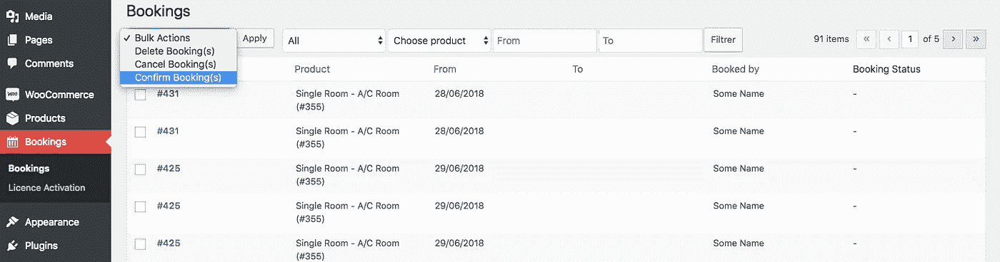

因此，假设您启用了**要求确认**选项，并且您收到了一个新的预订。插件会这样指示，看看吧。

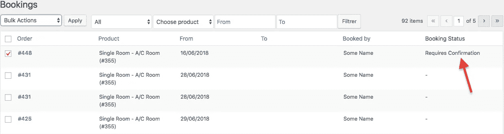

一旦批准预订，客户将能够看到如下所示的**支付**选项。该选项会将他们带到结帐页面，在那里他们可以选择正确的支付选项来完成预订。看看下面的图片:

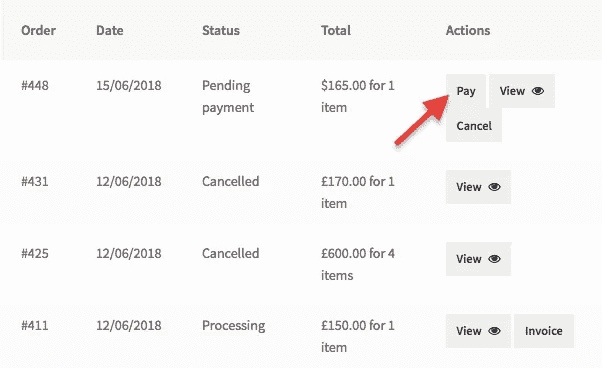

另一个好处是，如果您启用了**允许取消**功能，那么您的客户将能够直接从“我的帐户”页面取消订单。

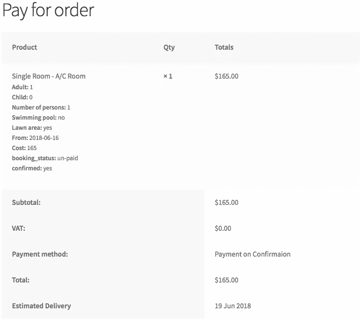

# 最后的话…

在寻找最终解决方案和努力构建一个强大的预订系统的过程中，我们没有意识到这个过程可以通过这个简单而强大的插件变得多么容易。

所以，如果你想在你的 WooCommerce 中加入这个预订功能，并以多种方式扩展你的业务**，那么现在就来看看这个插件吧。**