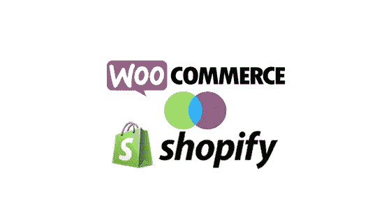

# WooCommerce vs Shopify:选择最佳电子商务平台

> 原文：<https://medium.com/hackernoon/woocommerce-vs-shopify-choose-the-best-ecommerce-platform-f892c3cbad64>

与几年前相比，现在创建网上商店已经变得容易多了。事实上，即使是不精通技术的人，也可以在一些非常棒的平台的帮助下轻松创建一个商店。在本文中，我们将比较两个最佳选择——woo commerce 和 Shopify。这两个平台都被全球大量成功的电子商务商店所使用。然而，对于一个刚刚涉足在线业务的人来说，选择一个可能是一项艰巨的任务。我们将努力让您了解其中一个可能比另一个更有用的特定领域。希望在读完这篇文章后，你能从中挑选一个。

# 选择电子商务平台——需要考虑的因素

当你选择一个平台开始你的网上商店，有几个因素要考虑。以下是您可能也想到的一些事情:

*   **易于设置**
*   **价格**
*   **设计**
*   **特性和增强功能**
*   **SEO**
*   **支持**

现在，考虑到这些因素，你可能有不同的策略。根据您的技术知识或帮助的可用性，您可能会选择其中之一。本文的目的是指出这两个平台在具体考虑时的表现。

# WooCommerce vs Shopify:如何选择一个？

从根本上说，Shopify 是一项全面的服务，可以帮助您有效地管理在线商店的所有方面。然而，WooCommerce 是一个工作在 WordPress 之上的开源插件，拥有许多自己的扩展插件来增加功能。这两个都是世界上许多成功的在线商店使用的伟大解决方案。

# 易于设置

对于刚接触电子商务世界的人来说，这是一个需要考虑的重要方面。让我们来看看 WooCommerce 与 Shopify 在易于设置方面的正面比较结果。

***Shopify***

也许这是 Shopify 在吸引新用户方面的一个优势。使用 Shopify 开设商店绝对没有任何麻烦。您只需登录即可免费试用，并为您的商店选择一个主题。当然，以后要根据自己的需求选择合适的定价方案。此外，还有几个附加组件可以根据您的具体要求进行选择。您将获得一个托管计划和域名，其中包含您在 Shopify 中选择的包。此外，你还可以获得一个免费的 SSL 证书和一个子域。所以你不用在设置的时候担心很多方面。

***WooCommerce***

另一方面，WooCommerce 是一个集成到你的 WordPress 站点的插件。所以，在安装 WooCommerce 之前，你需要建立一个有主机计划和域名的网站。如果你真的对技术不感兴趣，在这个阶段你可能需要一些帮助。然而，一旦你用托管计划、域名和 SSL 证书建立了一个 WordPress 站点，WooCommerce 的事情就很顺利了。安装和配置 WooCommerce 非常简单，有一个很棒的设置向导可以帮助你。如果你想了解更多关于为 WooCommerce 选择合适的托管计划的信息，请阅读我们的文章。

# 价格

你的网上商店的范围很大程度上是一个相对的事情。然而，Woocommerce 和 Shopify 都为不同的预算提供了很好的选择。你如何看待它会有很大的不同。

**Shopify**

Shopify 提供清晰透明的定价，您可以在 14 天的免费试用后决定。计划中有足够多的变化，使其对所有预算都具有竞争力——对于开始进入大企业的人来说。基本计划起价为每月 29 美元，具有无限数量的产品和文件存储等功能。有一个中级计划，价格为 79 美元，具有欺诈分析、专业报告和[废弃购物车](http://learnwoo.com/woocommerce-abandoned-cart/)回收等功能。有一个 299 美元的高级计划，其中有先进的报告和第三方航运运营商集成。对于企业级解决方案，您可以查看 [Shopify Gold](https://www.shopify.in/gold) 。

此外，请注意，如果您选择任何付费附加服务，您可能需要支付一些额外的费用。

***WooCommerce***

当你单独考虑 WooCommerce 时，它是一个免费的开源解决方案，你可以下载并安装在你的 WordPress 站点上。然而，事情并没有看起来那么简单。如上所述，你需要考虑托管、域名、SSL 证书等费用，这些都包含在 Shopify 中。现在，当你刚刚起步时，基本的 WooCommerce 安装可能会帮你完成这项工作。而且，随着你的成长，你肯定需要高级选项，你可以从 WooCommerce 和一些第三方开发者那里找到很多。

使用 WooCommerce 的一个好处是，你可以灵活地从社区的大量免费和优质插件中选择扩展。当然，你可能不得不集成多种功能，这意味着你可能不得不为每一种功能支付单独的费用。然而，来自多个第三方供应商的几种解决方案的可用性对于许多人来说可能是一个方便的问题。例如，你可以[从像这样的知名开发商那里找到几个高质量的 WooCommerce 运输公司集成。事实上，对于该功能，您需要选择 Shopify 中的高级计划。](http://learnwoo.com/refer/xadapter-woocommerce-shipping-plugins)

# 设计

你真的需要付出很多努力和思考，为你的网上商店找到正确的设计。WooCommerce 和 Shopify 都提供了丰富的选项，帮助您根据产品范围选择合适的设计。让我们来对比一下 WooCommerce 和 Shopify 各自的表现。

**Shopify**

Shopify 在自己的商店上提供一系列高质量的免费和优质主题。设计是顶级的，许多有经验的设计师更喜欢 Shopify 的内部主题。所有的 Shopify 主题都是有针对性的，体现了现代的设计和美学理念。对于高级主题来说，价格可能有点高，但是在预算有限的情况下，你也可以选择免费主题。还有几个第三方选项，在那里你可以找到很棒的 Shopify 主题。

***WooCommerce***

当谈到 WooCommerce 时，设计选择是多种多样的。然而，由于有大量的选择，你可能需要做一些工作来为你的 WooCommerce 商店选择最合适的主题。当你刚开始做 WooCommerce 的时候，最好的选择是[选择内部主题的店面](http://learnwoo.com/install-configure-woocommerce-storefront-theme/)。它完美地集成了 WooCommerce 和所有相关插件。此外，它还有各种各样的儿童主题，你可以用它们来适应你特定的商业策略和产品组合。而如果你想[创建自己的店面子主题](http://learnwoo.com/create-woocommerce-storefront-child-theme/)，也没那么难。此外，你可以在 Envato themeforest 这样的网站上获得大量的 WooCommerce 主题选项。

# 特性和增强功能

这是你真正看到一个好的电子商务平台的效果的地方。幸运的是，Shopify 和 WooCommerce 都在这一领域表现出色，提供了添加功能的出色选项。它更多的是关于适应独特业务案例的灵活性，而不是呈现一组精心设计的功能。

***Shopify***

如上所述，Shopify 是一个包罗万象的包，它具有针对每个定价方案的大量功能。因此，在需要时，您自然可以选择使用高级定价计划。此外，Shopify 应用商店有各种功能的插件，包括会计、运输、电子邮件营销等。这里的好处是，基本包中包含的选项在很多情况下是足够的。就定制而言，Shopify 允许增强主题、产品、价格、结账等。以满足您的特定需求。

***WooCommerce***

默认情况下，WooCommerce 拥有一套运营小型电子商务商店的基本功能。然而，WooCommerce 最受欢迎的一点是它令人敬畏的灵活性，可以根据你的需要扩展你的商店功能。WooCommerce 在各种功能上都有自己的一套扩展。最重要的是，一些第三方开发者正在以有竞争力的价格和令人敬畏的支持为[提供高质量的 WooCommerce 插件](http://learnwoo.com/refer/xadapter)。WooCommerce 用户在 WordPress 的开源模式上绝对有优势，在那里你可以找到每一个可以想象的功能的插件。

而且，定制选项也很棒。有编码知识的人可以使用 hooks 自行完成大量的 WoooCommerce 定制。你甚至可以根据自己的需要雇佣从事网络商务定制的[公司的服务。](http://learnwoo.com/refer/wisdmlabs-woocommerce-extension-development)

# 搜索引擎优化

搜索引擎优化对于网店来说是一件非常重要的事情。这是通过良好的搜索排名，你的客户会找到你。好在 WooCommerce 和 Shopify 都有不错的 SEO 特性。让我们来看看 WooCommerce 和 Shopify 的直接比较是如何进行的。

***Shopify***

Shopify 拥有强大的功能，可以确保搜索引擎对你的在线商店进行良好的排名。在后端，Shopify 提供了一个很好的链接结构，可以确保搜索引擎注意到你的网站。此外，Shopify 确保页面加载速度对您的网站有利。此外，集成的搜索引擎优化功能，如图像优化，元描述等。，随 SSL 证书一起提供，适用于所有定价包。

***WooCommerce***

因为 WordPress 在搜索引擎优化功能上非常专注，WooCommerce 的所有者可以放心。有相当多的好的外部解决方案可以在 SEO 方面帮助你。然而，你必须小心选择你的主机方案，因为它会影响你的页面加载速度。你可以在这里阅读更多关于 WooCommerce SEO 解决方案的信息。

# 支持

当您使用软件工具时，经常会遇到问题是很自然的。区别在于你如何快速解决这个问题。当您的业务完全依赖软件时，这变得更加重要。让我们看看 WooCommerce 与 Shopify 在提供支持方面的结果如何。

***Shopify***

Shopify 为其用户提供全天候支持。当他们遇到问题时，用户可以通过电话、电子邮件或实时聊天与他们联系。最重要的是，有一个很好的知识库和大量的文档来帮助自助服务。

***WooCommerce***

WooCommerce 在很大程度上是一个 DIY 工具，这也反映在他们的支持场景中。因为这是一个免费的工具，一旦你登录，你可以在 WordPress 论坛和 WooCommerce 官方网站寻找支持。然而，你可以找到为 WooCommerce 用户提供专门支持的公司。此外，如果您使用外部插件，您可以获得个人开发者的专门支持。与 WooCommerce 相关的社交媒体论坛也相当活跃。总的来说，如果你喜欢自己寻找问题的解决方案，你会喜欢 WooCommerce 的支持方式。

# 结论

对于一个电子商务店主来说，开店时需要考虑多个方面。WooCommerce 和 Shopify 都提供了很棒的功能，确保你能经营一个很棒的商店，保证用户体验。然而，有一些显著的不同之处会对用户产生不同的吸引力。例如，一些用户更喜欢 Shopify 的一揽子交易，而不是 WooCommerce 的“随心所欲地建立你的商店”模式。此外，还有一些人更喜欢 WooCommerce，因为这让他们可以完全控制自己的数据。而且，仍然会有一些人不喜欢在 WooCommerce 中遇到的主机托管的麻烦。

因此，我们的结论是，选择哪一个平台是个人的选择。希望这篇文章已经覆盖了足够多的领域来帮助你做决定。如果你想分享关于 WooCommerce vs Shopify 争论的具体观点，请告诉我们。

*原载于 2018 年 1 月 17 日*[*learnwoo.com*](http://learnwoo.com/woocommerce-vs-shopify/)*。*