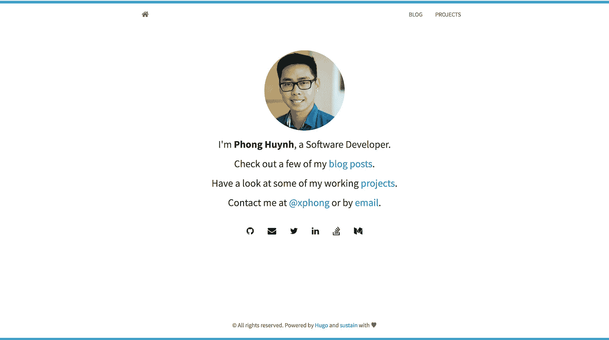
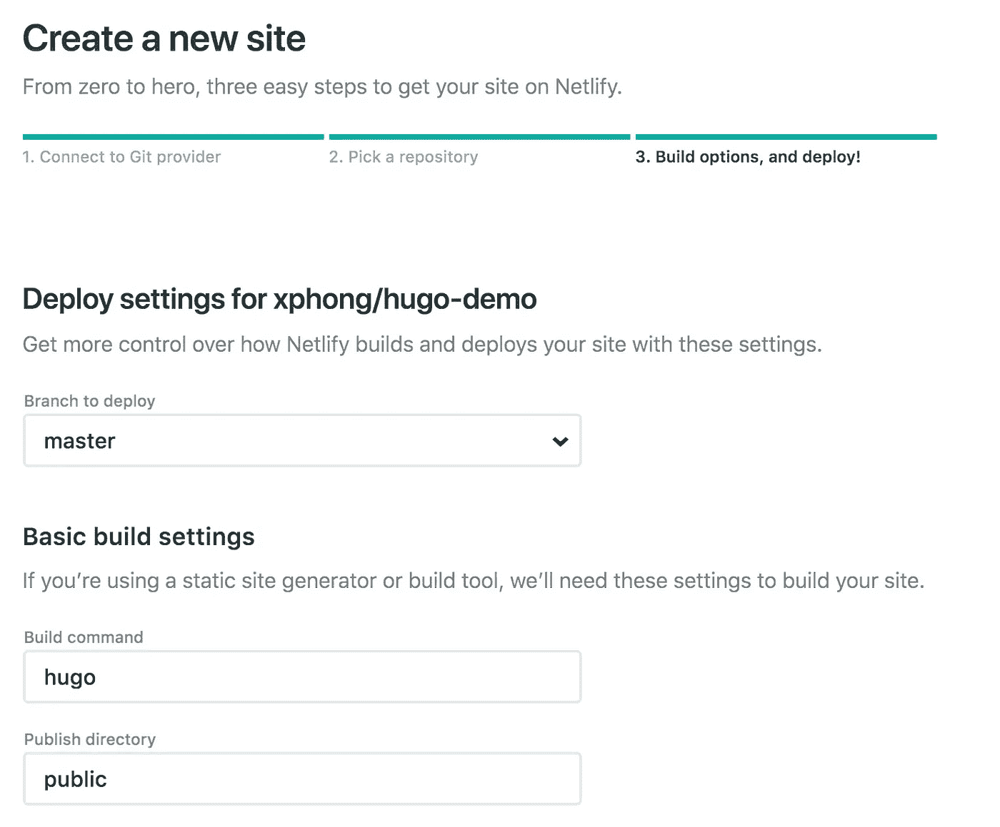
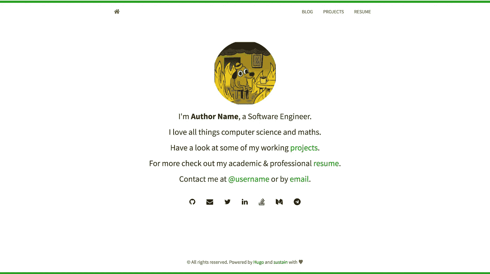

# WordPress 到静态站点生成器(Hugo)的迁移和部署

> 原文：<https://medium.com/hackernoon/wordpress-to-static-site-generator-hugo-migration-and-deployment-788a69b93e66>



TL；DR——这篇文章将向你展示如何将一个简单的 [WordPress](https://wordpress.com/) 网站迁移到一个静态站点生成器( [Hugo](https://gohugo.io/) )上，并在 [Netlify](https://www.netlify.com/) 或 [GitHub 页面](https://pages.github.com/)上免费托管它。

[此演示的 GitHub 存储库](https://github.com/xphong/hugo-demo) / [演示站点](https://hugo-blog-demo.netlify.com/)

跳到[开始使用](#6953)

# 雨果是什么？


Hugo Logo

> Hugo 是一个用 go 编写的静态 HTML 和 CSS 网站生成器。它针对速度、易用性和可配置性进行了优化。Hugo 获取一个包含内容和模板的目录，并将其呈现为一个完整的 HTML 网站。
> 
> Hugo 依赖于带有 front matter 的 Markdown 文件作为元数据，你可以从任何目录运行 Hugo。这对于共享主机和其他没有特权帐户的系统非常有效。
> 
> Hugo 可以在几分之一秒内渲染一个典型的中等大小的网站。一个很好的经验法则是每段内容在大约 1 毫秒内呈现。Hugo 设计用于任何类型的网站，包括博客、tumbles 和 docs。
> 
> ([https://github.com/gohugoio/hugo#overview](https://github.com/gohugoio/hugo#overview))

# 什么是 GitHub Pages？

> GitHub Pages 是一个静态站点托管服务，旨在直接从 GitHub 存储库中托管您的个人、组织或项目页面。
> 
> ([https://help.github.com/articles/what-is-github-pages/](https://help.github.com/articles/what-is-github-pages/))

# 什么是 Netlify？

> Netlify 正在完善一个统一的平台，使你的代码自动化，以创建高性能、易于维护的网站和网络应用。
> 
> (【https://www.netlify.com/press/】T21)

# 入门指南

首先，您需要[为您的 Hugo 项目创建一个新的 GitHub 库](https://help.github.com/articles/create-a-repo/)。

在存储库中，我们将[创建一个新的 hugo 站点。](https://gohugo.io/getting-started/quick-start/)

## 步骤:

1.  安装 Hugo:

```
brew install hugo
```

2.在存储库的目录中创建新站点:

```
hugo new site . --force
```

3.添加一个主题(我现在使用的主题叫做[延音](https://github.com/nurlansu/hugo-sustain/)):

```
git clone https://github.com/nurlansu/hugo-sustain.git themes/hugo-sustain
```

4.更新 config.toml 文件(取决于您的主题):

```
baseurl = "[https://hugo-blog-demo.netlify.com/](https://hugo-blog-demo.netlify.com/)"
languageCode = "en-US"
title = "Hugo Site"
disqusShortname = ""
googleAnalytics = ""
theme = "hugo-sustain"[permalinks]
  post = "/:year/:month/:day/:slug"[params]
  avatar = "profile.png"
  author = "Author Name"
  description = "Describe your website"custom_css = []
  custom_js  = [][params.social]
  Github        = "username"
  Email         = "[email@example.com](mailto:email@example.com)"
  Twitter       = "username"
  LinkedIn      = "username"
  Stackoverflow = "username"
  Medium        = "username"
  Telegram      = "username"[[menu.main]]
  name = "blog"
  weight = 100
  identifier = "blog"
  url = "/blog/"
[[menu.main]]
  name = "projects"
  identifier = "projects"
  weight = 200
  url = "/projects/"
[[menu.main]]
  name = "resume"
  identifier = "resume"
  weight = 300
  url = "/resume/"
```

5.添加内容:

```
hugo new blog/my-first-post.md
```

当您在本地服务您的网站时，您应该能够看到 Hugo 站点启动并运行。

```
hugo server
```


localhost:1313/blog

# WordPress 迁移

如果您没有将 [WordPress](https://hackernoon.com/tagged/wordpress) 网站迁移到 Hugo，您可以跳到[网站部署部分](#e80e)。

## 导出内容

我们将成为 [Jekyll Exporter WordPress 插件](https://wordpress.org/plugins/jekyll-exporter/)来将当前的 WordPress 内容迁移到 Hugo。这个插件将你在 WordPress 上的所有文章、页面、图片和内容转换成 Hugo 可以使用的文件。

现在我们可以将从插件导出的转换后的博文文件复制到 Hugo 的`/content/blog`中。

## 保存图像

要保留任何图像，您可以将导出的`wp-content`文件夹复制到 Hugo 项目的`static`文件夹中。`static`文件夹里面的任何东西都可以相对引用。例子:`/wp-content/uploads/image.jpg`

如果你有任何引用这些图片的博客文章，你可以在 Hugo 项目中做一个查找替换来用相对路径替换你的 WordPress 网站的绝对路径。示例:`http://wordpress-domain.com/wp-content/uploads/image.jpg`将改为`/wp-content/uploads/image.jpg`


Migrated Blog Post

# 网站部署

免费托管和部署您的 Hugo 网站。你可以使用 [Netlify](https://www.netlify.com/) 或者 [GitHub Pages](https://pages.github.com/) 。

## 网络生活

使用 Netlify 部署的步骤:

1.  Netlify 帐户的第一次[注册](https://app.netlify.com/signup)。
2.  [创建一个链接到你的](https://app.netlify.com/start) [GitHub](https://hackernoon.com/tagged/github) 库的新站点。
3.  选择您的选项并部署。



在您点击 deploy 之后，它应该构建并部署到一个 Netlify 子域。Netlify 还提供持续部署，这取决于你如何设置它。默认情况下，每次推送 Github 时，Netlify 都会构建存储库的主分支，并部署到 Netlify 的内容交付网络(cdn)。

示例:每次提交到我的库的主分支[时，Netlify 构建并部署到](https://github.com/xphong/hugo-demo)[https://hugo-blog-demo.netlify.com/](https://hugo-blog-demo.netlify.com/)

此外，您可以将自己的[自定义域](https://www.netlify.com/docs/custom-domains/)添加到 Netlify 中。

## GitHub 页面

使用 [GitHub 页面](https://pages.github.com/)进行部署的步骤:

1.  用`<username>.github.io`创建另一个存储库来托管 Hugo 网站。
2.  在您最初的 Hugo 项目存储库中，添加您的`<username>.github.io`存储库作为子模块:

```
git submodule add -b master [git@github.com](mailto:git@github.com):<username>/<username>.github.io.git public
git push
```

3.在 Hugo 项目存储库的根目录下创建一个名为`deploy.sh`的部署脚本:

```
#!/bin/bashecho -e "\033[0;32mDeploying updates to GitHub...\033[0m"# Build the project.
hugo -t hugo-sustain --baseURL="[https://hugo-demo.github.io/](https://hugo-demo.github.io/)" # if using a theme, replace by `hugo -t <yourtheme>`# Go To Public folder
cd public
# Add changes to git.
git add -A# Commit changes.
msg="rebuilding site `date`"
if [ $# -eq 1 ]
  then msg="$1"
fi
git commit -m "$msg"# Push source and build repos.
git push origin master# Come Back
cd ..
```

4.运行部署脚本:

```
sh deploy.sh
```

5.该站点现在应该部署在`https://<username>.github.io`

[关于 GitHub 页面部署的更多信息](https://gohugo.io/hosting-and-deployment/hosting-on-github/#github-project-pages)如果您想要使用项目页面或从不同的分支进行部署。



[https://hugo-blog-demo.netlify.com/](https://hugo-blog-demo.netlify.com/)

[此演示的 GitHub 存储库](https://github.com/xphong/hugo-demo) / [演示站点](https://hugo-blog-demo.netlify.com/)

[Phong Huynh](/@xphong) 软件开发商
[@xphong](https://twitter.com/xphong)