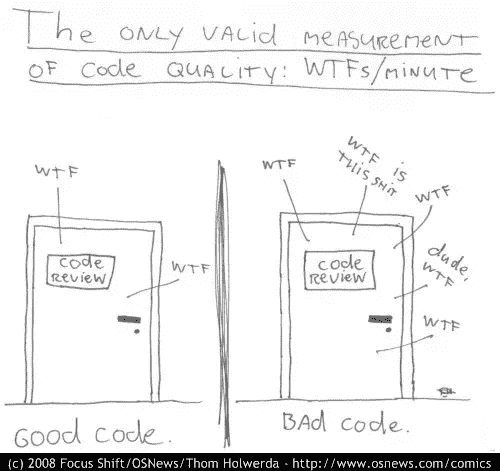

# 工作生活平衡= Fn(代码质量、最佳实践、技术债务)

> 原文：<https://medium.com/hackernoon/work-life-balance-fn-code-quality-best-practices-technical-debt-fb659dae581e>

这是基于我在回顾我作为开发人员的职业生涯时对代码质量、最佳实践等的一系列认识。然而，这篇博文并不是要教你传统意义上的任何 it(或软件工程)的重要性。有大量的文章/书籍/网站致力于这样做，只需点击几下鼠标。

我想写的是在我们的个人生活中不遵循这些原则的影响。

首先，让我们考虑一个新项目[T=0]:

偶尔，我们足够幸运地工作在一个新的代码基础上(还没有写代码，只是创建了回购)。在最初的几周，每个人似乎都很开心；代码正在编写，审查/测试已经完成，功能已经交付。客户满意，团队也满意。

但是随着时间的推移(例如，在第 5 到第 7 次冲刺时)，我们意识到有问题突然出现，很难在不破坏另一个错误的情况下添加功能、进行修改或修复某个错误。我不打算在这里列出详细的清单，但是读者(假设你在软件行业工作)非常了解他们在日常生活中遇到的问题类型。这是技术债。我们在项目的时间跨度内(任何大规模项目/代码库的生命周期超过十年)所做的每个发布、错误修复都会积累技术债务。

一个重要的观察，我们必须在这里做的是，我们大多数人最终将花费大量的时间试图解决混乱。这个烂摊子要么是我们自己造成的，要么是别人制造的。最常见的情况是“某人”甚至不是当前团队的成员！

持续这样做几年，就会有结果，

1.  花大量时间在办公室/项目上，彻夜难眠
2.  精神压力很大
3.  搞砸了健康(-是的——我们在办公室熬夜吃的那些垃圾食品最终会在我们 30 多岁(如果你幸运的话，40 多岁)时搞砸我们的健康。)
4.  最终(在重复做了几年第一和第二之后)，探索深层的东西，比如(A)生活的目的，(B)我是谁…我为什么要这么做！。或者更糟的是被治疗抑郁和焦虑！LOL！

现在我不会说我们可以将技术债务保持为零。事实上，只要有足够的时间和复杂性，任何项目/代码库都会有一些债务。在我看来，这只是生活/世界不完美的副作用。怎么会？总会有的，

*   我们将改变我们不太了解的代码区域！
*   发布截止日期和生产问题。
*   生活中的各种问题影响了我们对工作的决定。
*   这样的例子不胜枚举！

正如我再次提到的，有大量的书籍/材料只是为了教如何编写高质量的代码。我们大多数程序员在大学期间都完成了关于这些主题的课程。所有这些问题持续存在，我们都深受其害！

我的观察是，作为程序员，没有人真正理解或注意到糟糕代码在我们生活中的影响。

这几乎类似于环境污染。我们知道这很糟糕。因此，我们谈论它，并像任何正常人一样，尽我们所能把它保持在最低限度！但是总有一些人会做一些对环境有害的事情！

代码库也是如此，虽然每个人都热衷于编写干净的代码，并遵循被认为是项目最佳实践的任何实践，但总有人会提交一些“不太好”的代码(由于上面提到的各种原因！).从长远来看，这不仅毁了**内心的平静，也毁了很多其他人！**

这些年来，这种观察让我把这些糟糕的程序员视为对他人缺乏同理心的人或糟糕的团队成员。我的理由是:假设有一个团队成员写的东西达不到预期的标准(-导致技术债务增加)，这增加了工作/周期。这些周期必须来自他或其他团队成员。基本上，必须有人来收拾残局(无论是在第二天还是第三年，一个人可能甚至不在团队中，从而使当前的团队成员变得更糟)。

出现了两个问题:

1.  你想成为那个人吗？他们最大程度地破坏了工作和生活的平衡，令团队失望。
2.  你希望项目中你旁边的人成为那个人吗？他/她制造的后果，你可能会在哪里结束？

对我来说，第一个问题的答案围绕着，他/她是否适合他被雇佣的工作/角色。第二个问题的答案显然是否定的。这又让你思考第一个问题。但答案略有不同。如果你不想下一个人变成那样，为什么不茁壮成长，而不是成为那个人呢？

我过去观察到的另一个现象是，任何过程、工具、材料都会失败，除非我们(作为程序员)的心态没有积极地改变。**除非我们不断要求自己和身边的队友做到优秀，否则没有任何工具/流程可以拯救我们！**