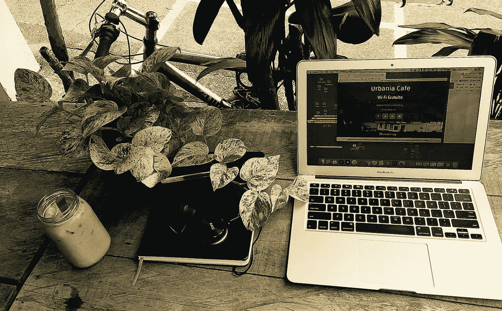

# 在任何地方工作，任何地方工作

> 原文：<https://medium.com/hackernoon/working-anywhere-working-everywhere-adf365fe13b5>

## 即使总是在移动中，也能在工作中保持流畅。

> 1971 年，程序员雷·汤姆林森在他的剑桥**马萨诸塞州**实验室里，从他的电脑向邻近的电脑发送了第一封电子邮件。两年后，摩托罗拉雇员马丁·库珀用第一部手机从曼哈顿打电话给新泽西。从那以后，工作变得不一样了。

当耶路撒冷在 2004 年成为第一个支持 Wi-Fi 的城市时，在任何有可靠网络连接的地方工作的崇高想法变成了现实。我们现在都是移动工作者。好吧，也许这个星球上的[51 亿](https://digitalreport.wearesocial.com/)移动用户中只有一部分是这样的。关键是我们有很多人。我们在时髦的多伦多咖啡店里，在薄薄的笔记本电脑上打出文字，以满足东京客户的最后期限。我们在麦德林的 makerspaces 为旧金山的远程公司推送像素或波兰代码。你明白了。已经有一段时间，工作不再是你去的地方，而不是你做的[事情。](https://www.inc.com/jonas-altman/how-to-finally-be-master-of-your-own-day.html)

然而，这种难以置信的工作时自由移动并非没有缺点。迷失方向、精疲力尽、孤立、上瘾和其他问题都是需要注意的危险因素。最大的挑战之一就是保持你的注意力足够长的时间来真正完成事情。

请放心，有一些方便的方法可以帮助缓解这个第一世界的问题。

# 校准和工艺

首先，无论何时你在一个新的地方着陆，你都必须校准。这可能包括逛逛当地的咖啡店，试吃他们的杏仁羊角面包。这可能意味着系紧你的跑步者，在人行道上很有可能迷路。这个想法是尽可能快地让自己适应新的环境。你在外国环境中感觉越舒服，你就越有可能开始一些实际的工作。

接下来要问的是你实际在做什么工作？如果你像许多其他地方的工作者一样，你会有一个需要保护你最有创造力的时间的时间表。你的保护措施是对抗一系列没完没了的慢性障碍，包括时差、社会义务、懈怠警报、旅游癖、糟糕的 Wi-Fi、客户端时区、那些被称为人类的有趣事物等等。许多只是分心，可以通过一点训练来克服。

两个小帮手相对轻松；[时间阻塞](https://www.fastcompany.com/3069293/could-time-blocking-replace-your-to-do-list)和休息。要划分时间段，只需将你的工作分成 90 分钟的小块。记住什么时候是执行一项特定活动的最佳时机，然后围绕这一部分来设计你一天中的其他事情。

刻意的休息听起来很可爱，但当你有这么多来自新环境的刺激时，这很有挑战性。然而，休息是明智的；当你的大脑在后台处理问题时，它会增强你的创造力，具有讽刺意味的是，它会完全减轻你的时间压力感。

尽管我承认自己是一个咖啡因迷，但其他人有更戏剧性的[生物黑客](/@mrryangoodwin/my-personal-biohack-stack-for-optimized-brain-performance-a44ed06bfe57)技巧，他们声称万无一失(或者防弹，如果那是你的包)。实验要自担风险。关键是要有自己的诀窍来帮助你找到并坚持一种能激发你创造力的工作节奏。

# 鼹鼠皮和无印良品

如果我每次看到有人摇晃鼹鼠皮笔记本(通常是黑色的)和无印良品中性笔(通常是 0.5 毫米厚的)时，我都能得到一便士，那我就是一个非常富有的人了。这里的重点是要确保你有交易的工具，甚至一些备用工具。

就在任何地方工作而言，*云*可能是你最好的朋友。你的*堆栈*应该是最适合你的。通常的嫌疑人包括 Google Drive、Dropbox、Trello、Slack、Evernote、Asana、Monday 以及其他一些名字听起来像周日早晨卡通人物的公司。

# 面对面时间和面对面时间

你已经听过无数次了——没有什么可以取代人情味。也有很好的理由；技术只能支持人的因素。此外，作为社会人，我们渴望在工作中与他人在一起(为了反馈和获得意义)。所以这里的关键是确保你有足够的时间和那些重要的同事、同事和客户见面。你的*堆栈*可以帮助扩大，在许多情况下，加强这些关系。​

视频会议也是如此，从 Adobe Connect 到 Zoom，它只是作为一种技术推动者而受益。这个工具之所以有用，是因为它支持你与他人的联系。问问 [Buffer](https://open.buffer.com/) 或 [Hanno](https://hanno.co/playbooks/) 的人就知道了，他们是分布式工作和协作的先驱。

流畅工作的能力是任何人成功所需的当前技能。我们都需要在不确定性中繁荣的必要手段。如果你对不舒服感到舒服，这对你来说是旧帽子。如果不是，这些建议的黑客仅仅是建议。在任何地方工作的秘密就是简单地做任何有效的事情*。*

*加入 10，000+其他人并注册我的关于工作的简讯* [***这里***](https://www.jonasaltman.com/newsletter)