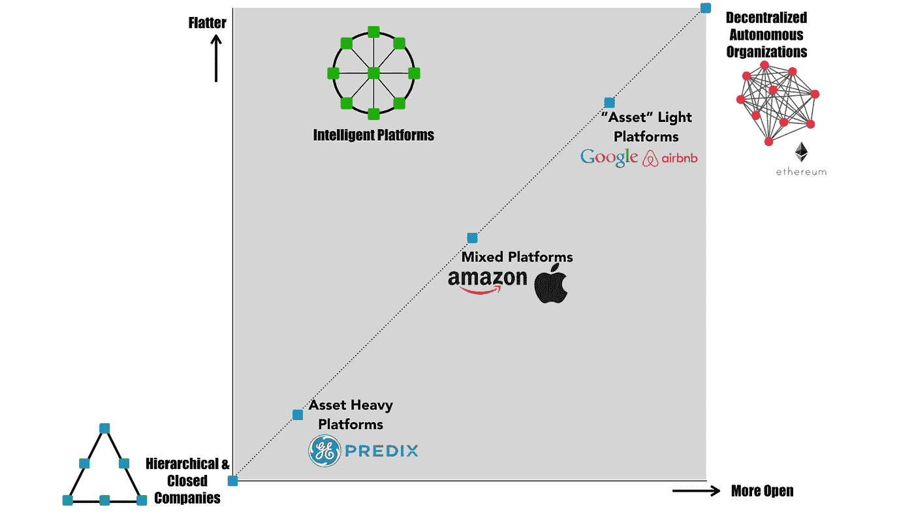
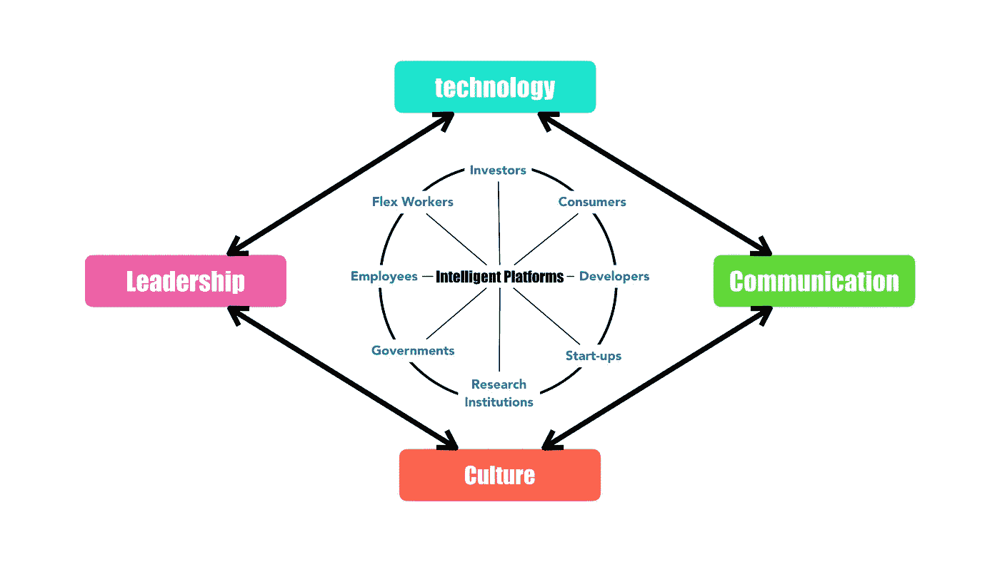

# 为“大公司”工作可能很有趣，如果。。。

> 原文：<https://medium.com/hackernoon/working-for-a-big-company-can-be-fun-if-8eaf1eb560d9>

## *它作为一个“智能平台”运行*

> *大公司创新不够快。*
> 
> *大公司倾向于在自己周围建立一个“杀戮地带”。他们摧毁一切和所有靠得太近的人。*
> 
> 在大公司工作没有什么乐趣。更多的个人成就感可以在创业公司或其他更年轻更小的组织中找到。

最近，我在媒体(新旧媒体)上经常看到这些说法。我的许多同事和学生似乎都同意这一点。

当然，这些想法是有道理的。数字创新的速度和范围以及更短的创新周期使大公司更难生存。这种压力不会带来稳定和令人满意的工作环境。这一趋势似乎将在未来继续，让为大公司工作(或与大公司一起工作)变得更加没有吸引力。

但是也有不好的一面，我们不应该太快地放弃企业巨头。为大公司工作(作为一名员工)或为大公司工作(作为一家初创公司或研究机构)可能会令人兴奋、有回报和鼓舞人心。这甚至可能是建立职业生涯或对你的创业产生影响的最佳和唯一方式。

然而，这将完全取决于这家大公司是否在作为一个“智能平台”运营。

# **什么是“智能平台”？**

当我使用“智能平台”这个词时，人们马上会认为我在谈论那些运营“社交”平台(*脸书，Instagram* )，“交换”平台(*亚马逊*， *Airbnb* )，“内容”平台( *YouTube，Medium* )，“软件”平台( *GE 的 Predix，微软的 GitHub* )，甚至“区块链”平台(*以太坊，谷歌*

这并不奇怪。毕竟，这些新平台和服务的出现是过去二十年来最重要的经济发展之一。

但我们应该认识到，“平台公司”不仅仅是促进交易、交换信息或联系人们。从这些公司的成功中，我们可以学到更重要的一课。

> 所有平台公司的共同点是，它们授权并促进多个利益相关者群体之间的实验、协作和共同创造。

这些利益相关者包括员工和投资者，但也包括消费者、开发者、内容创作者、其他公司(无论大小)、非营利组织、教育机构、政府等。

“智能平台”的特别之处在于，它使用利益相关者的输入和反馈来改善用户体验以及与“平台”及其产品、服务和其他解决方案的互动。这是从亚马逊、T2、脸书、网飞、T3 等公司的成功中吸取的真正教训。

至关重要的是，数字技术是这一方法的核心。从这个意义上说，所有希望作为智能平台运营的公司都需要“像”一家科技公司那样思考和行动。

因此，智能平台是围绕通过开放和包容的共同创造过程来提供持续创新的理念而构建的。通过以这种方式“为创新而组织”，这种平台与传统组织的明确定义、静态角色和固定层级完全不同。

这些是“智能平台”的显著特征，这也是为什么在全球市场竞争异常激烈的时代，每个公司都需要将自己重塑为“智能平台”。

但更重要的是，每个人都需要问自己:

> *我的(当前或未来的)雇主是一个智能平台吗？*

为什么这如此重要？因为只有“智能平台”才能提供一种有益于有意义、充实和有趣体验的环境。为大公司工作可能很有趣，但前提是它被组织成一个智能平台。

那么，怎样才能辨别一个公司是不是这样组织的呢？

# **智能平台的四大“要素”**

应当指出的是，这种平台没有“一刀切”的模式。

智能平台可以采取多种形式，从传统公司(等级和封闭)的轻微“调整”版本到区块链的(扁平和开放的)“去中心化自治组织”“最佳”方法取决于特定企业或组织的个性化环境。

智能平台的结构和组织确实取决于四个关键的“成分”每个公司都必须分析和使用这些成分，为其“平台”找到独特的配方，以最大限度地发挥创造力和创新机会。

每个员工都需要了解这些因素，以便找到适合他们的组织。

## **1 —技术**

可以说智能平台并不新鲜。某种形式的平台一直存在。然而，技术的指数级增长大大加速了平台的出现、可能性和机会。

例如， *Airbnb* 或*亚马逊*依靠“大众智慧”——通过在线平台和用户评论建立——来帮助消费者做出决定。在建立信任和塑造消费者选择方面，软件评级算法和消费者评论的结合已经变得比品牌忠诚度更重要。

> 人工智能、传感器和区块链等新技术将进一步促进更多不同类型的“智能平台”的组织

例如，在物联网环境中，用户体验将越来越依赖于技术，以及技术如何增加设备之间的智能连接和便利性。

大多数关于智能平台的讨论都围绕着新技术的用途和可能性。这是有意义的，因为智能技术是充分协调人员和资产以及管理业务所必需的。

然而，仅有技术是不够的。 *GE* 的 Predix 平台的“失败”就是一个突出的例子，该平台旨在运行、扩展和延伸数字工业解决方案。一个“智能平台”的成功还取决于其他“成分”。

## **2 —通信**

平台公司和各种关键利益相关者之间的大多数问题往往是公司未能正确沟通的结果。例如， *YouTube* 与其内容创建者之间的困难往往是沟通不畅的结果。

最“智能的平台”明白，沟通不是一个单向的信息披露过程，而是一个更具参与性、响应性和开放性的过程，鼓励某种形式的对话。

现在有许多可供选择的交流方式。例如，企业领导人可以通过“年度信函”与公司的利益相关者互动。这种信以个性化和诚实的风格写似乎效果最好。

社交媒体和其他在线媒体(如博客)作为披露公司内部和外部信息的论坛变得越来越重要。有许多新的机会和可能性来进行更有创造性的信息传播和分享。

采用这种方法的公司的一个很好的例子是亚马逊。杰夫·贝索斯致投资者的年度信函被认为是任何对亚马逊(以及平台公司)感兴趣的人的“必读之作”。

也许最有趣的是，这些信件不仅为投资者和其他利益相关者提供了去年的业绩和未来的发展和增长前景，还包括商业建议和见解。这些信件在社交媒体上引起巨大关注并不奇怪。他们制造了大量的宣传，使得交流更加个性化、开放和有效。

## **3 —培养**

很明显，在更加开放和扁平的环境中，组织文化变得至关重要。最佳创意胜文化需要嵌入智能平台的“DNA”中。

在创造这种开放文化方面，一个经常被引用为成功的公司是 T2 网飞 T3。

2009 年，其创始人雷德·哈斯汀斯指出，太多的公司都有“听起来不错”的价值观，如诚信、沟通、尊重和卓越。然而，他明白，这些“价值观”往往不是一家公司真正重视的，而且往往只是空洞的装饰。

在 124 页的幻灯片中，雷德·哈斯汀斯(和*网飞*)概述了这种雇主-雇员关系的动态需要改变。此外，工作经历和环境的质量现在变得更加重要。特别重要的是学习和能力建设的机会。如幻灯片中所述:

> 与好听的价值观相反，真正的公司价值观是由谁得到奖励、晋升或解雇来体现的。

这种前瞻性的文化方法有助于吸引人才，因为它为他们提供了更大程度的自由和责任。如果没有这种文化，最优秀的年轻人才就会离开。

在网飞内部，一切都与环境有关，而不是控制。其结果是，网飞的每一个员工基本上都被视为企业家。

开放文化深入网飞的 DNA，这也体现在它吸引创造者的能力上。他们被网飞平台提供的创意(和财务)自由所吸引。

 [## 网飞刚刚为马丁·斯科塞斯的下一部黑帮电影配乐，由劳勃·狄·尼诺主演

### 据 IndieWire 报道，网飞已经获得了马丁·斯科塞斯的下一部电影的发行权。这部黑帮电影名为…

qz.com](https://qz.com/916791/netflix-will-release-martin-scorseses-next-film-the-irishman-starring-robert-de-niro/) 

## **4 —领导力**

要成功转型为智能平台，领导力当然必不可少。商业领袖应该具有远见卓识、企业家精神和创新意识。他们应该了解“平台动态”

再拿*网飞*来说。当雷德·哈斯汀斯因为反复使用种族诽谤而“解雇”他的公关主管时，他展示了领导力的重要性。

在给网飞员工的备忘录中，这位创始人 CEO 写道:

> “我本应该做得更多，把(第一次事件)作为一个机会，让网飞的每个人都知道这个词有多痛苦和丑陋，而且不应该被使用。我意识到我的特权使我理智化或者最小化这样的种族问题。我需要通过学习和倾听来树立更好的榜样，这样我才能成为我们需要的领导者。”

 [## 网飞因使用种族诽谤解雇首席通信官

### 网飞的首席执行官在周五解雇了公司的首席通信官，因为他“表现出不可接受的…

www.nytimes.com](https://www.nytimes.com/2018/06/22/business/media/jonathan-friedland-netflix-racial-slur.html) 

一家公司能否成功成为智能平台，很大程度上取决于其领导力以及倾听和参与的能力。商业领袖应该透彻理解使一个公司成为成功和智能平台公司的要素。

# 还有一件事。。。

平台公司不是一成不变的。世界在不断变化，数字技术也在飞速发展。

成功的“智能平台”很容易在相对较短的时间内失去吸引力。此外，传统媒体和社交媒体很快对平台进行负面描述。特别是，占主导地位且更加集中的平台吸引了大量的注意力。想想*亚马逊*及其对待员工的方式，*脸书*及其处理隐私的方式，等等。

然而，这些平台公司仍然高居最具吸引力雇主排行榜的榜首。

此外，其他公司仍然希望成为他们平台的一部分。例如，企业高管越来越多地在盈利电话中提到平台公司。此外，越来越多的创业公司意识到，通过成为智能平台公司的一部分，他们的增长潜力和战略可能性将比他们保持独立更大。

要做到这一点，平台必须允许初创公司(1)保留自己的身份，同时(2)享受与更大公司相关联的好处(即增长更快，利用与“平台”内其他部门或业务的协同作用),以及(3)为初创公司影响收购平台公司的文化和实践提供可能性。

创始人离开他们的创业公司通常是一个信号，表明一个平台的成分(技术、沟通、文化和领导力)必须重新评估。否则，一个平台就有变成另一个又大又笨的“恐龙”公司的风险。

*感谢您的阅读！请点击*👏*下面，还是留下评论吧。*

*每周都有新故事。因此，如果你关注我，你不会错过我关于数字时代如何改变我们生活和工作方式的最新见解。*