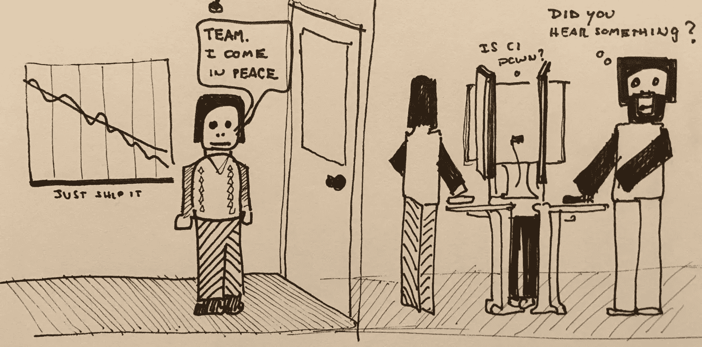

# 与软件开发人员合作(给产品经理的 9 条建议)

> 原文：<https://medium.com/hackernoon/working-with-software-developers-9-tips-for-product-managers-396f6953f844>

*注意:这是一个 Twitter 帖子的交叉帖子(如果 Twitter 是你的东西，请在@johncutlefish 关注我)。Twitter 原帖可以在这里找到:*

# 给产品经理和软件开发人员的一些建议:

1.  他们是论证、信息和陈述连贯性的大师。期待在某件事情上被(直言不讳地)指出…并且期待他们是对的。
2.  不要认为沉默意味着缺乏兴趣。可悲的是，内向的人被赶出了“商业世界”。在 swdev 团队世界里，外向者和内向者都茁壮成长(酷吧？).我的许多发展中国家的朋友选择在插话之前考虑一个想法很长时间。
3.  想象一下这样一个世界，你的每一次击键都被(基本上)测量、仔细检查、吉拉检查和审查。而* * * *向上意味着整个 app 可以向下(或者更糟)。相比之下，在你的世界里，你经常可以挥挥手“那是一门学问！”
4.  他们关心影响…但是很忙。所以，不要以为他们只想戴着 Bose 降噪耳机坐在那里，敲敲他们定制的改装键盘。他们这样做是为了阻止疯狂，这样他们就能产生影响。
5.  我的一些最好的开发朋友会坐在那里“无所事事”2 小时，休息一下，打打乒乓球，喝喝咖啡…然后用三行代码在 2 秒钟内解决问题。您应该在没有连续会议的时候尝试一下:)
6.  测试通过，或者不通过。要么成功，要么失败。是好代码，还是烂代码(当然是最后一个人)。相比之下，你的世界充满了优柔寡断的策略和“当我看到它的时候我就知道了”。一些怀疑是可以预料的。
7.  没有什么比在某件事情上工作六个月，然后看着它失败更糟糕的了(即使该组织的[成功剧场](/@johnpcutler/success-theater-b60a1666fe67)说不是这样)。这太痛苦了。你要向前看。他们需要维护粪便。好好想想。杀一些功能:)
8.  我和一个有后视镜的工程师一起工作，看着我带着一个“快速问题”走近。这时他会立刻戴上耳机(表示现在不行)。500 万个“快速问题”可能会占用一上午的时间。
9.  像任何事情和任何人一样，很难建立信任/尊重，也很容易失去信任/尊重。请记住，问题倾向于“向下流动”，开发人员需要清理混乱。所以如果他们脾气不好，就放他们一马。做得更好。他们会回来的。

暂时就这样了。新爸爸的职责占上风。但是我仍然会找一些时间来画画和写作(主要是在 Twitter 上)。