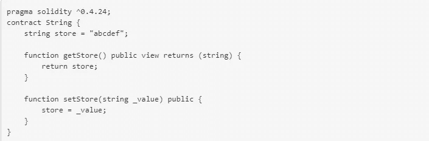
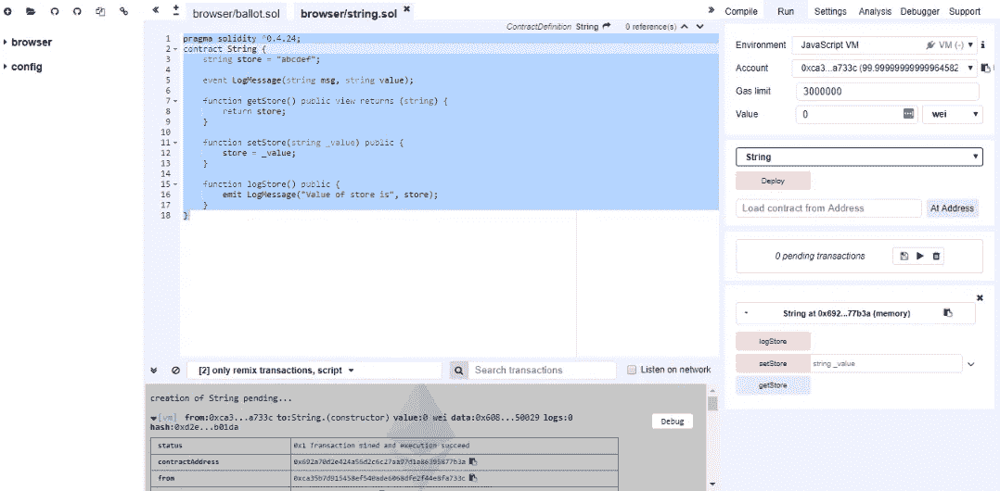
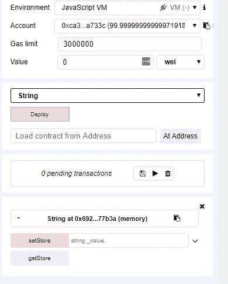
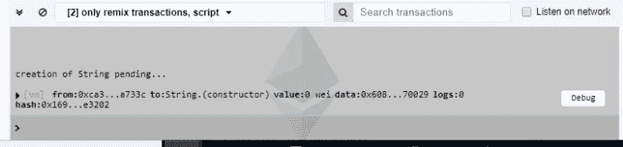
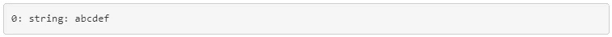
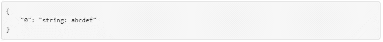
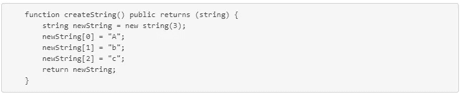
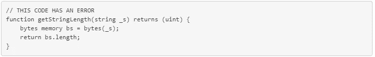
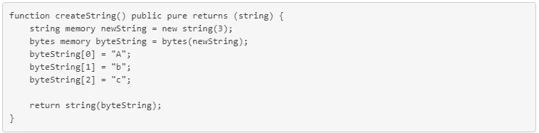
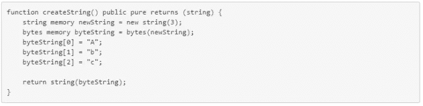

# 在 Solidity 中使用弦

> 原文：<https://medium.com/hackernoon/working-with-strings-in-solidity-c4ff6d5f8008>

这是一系列博客中的第一篇，我们将直接从战壕中为您带来，深入了解我们目前对该协议所做的一些事情的一些基本技术细节。

今天的文章来自 Alex Pinto，他是区块链工程团队的新成员，在过去的几周里，他一直在努力提高使用 Solidity 的速度，并将带我们了解这门语言的一些挑战和特性。

今天我给你一个关于使用 Solidity 语言为以太坊区块链编程的帖子。我不会按照任何计划来做这件事:我的目标只是写我在学习这门语言时遇到的障碍和我在日常工作中遇到的实际困难。

我想自由地写任何话题，而不必先介绍预备材料，如果我在写教科书的话，我就必须这样做。如果你注意到我在谈论我以前没有解释过的事情，那是故意的。请在下面给我留言，我会在稍后的帖子中回复。

## 基本存取

今天，我想谈谈坚实中的弦。首先，Solidity 在语法上类似于 Javascript 和其他类似 C 语言的语言。正因为如此，对于一个具有几种常见和广泛使用的语言基础的新手来说，很容易快速掌握 Solidity 程序的功能。然而，在隐藏不可预见的困难的众所周知的细节中，稳健是强大的。类型`string`和相关类型`bytes`就是这种情况。

这两者都是动态数组类型，这意味着它们可以存储任意大小的数据。不出所料，`bytes`类型变量的每个元素都是一个字节。类型为`string`的变量的每个元素都是字符串中的一个字符。到目前为止还不错，但最初的外观是骗人的。来自其他语言的人可能希望`string`类型提供几个有用的函数，比如:

*   确定字符串的长度
*   读取或改变字符串中给定位置的字符
*   连接两根弦
*   提取字符串的一部分

坏消息:Solidity 的`string`没有做到这一点！如果我们需要以上任何一项，我们必须手动完成。

所以，让我们来探讨一下这些困难，看看我们能做些什么。我打开 [Remix](https://remix.ethereum.org/) ，在名为 *string.sol* 的新文件中键入以下代码。

屏幕的右边，在混音中，是开发者的区域。在*编译*选项卡中，我选中了*自动编译*选项，这样 Remix 会在我编写代码时通知我错误和代码分析警告。静态代码分析由选项卡*分析*中的选项控制，我通常选择所有选项。

在当前的情况下，Remix 将报告两个相同类型的警告:我所写的方法可能会有很高甚至无限的气体成本。在这篇文章中，我将忽略这一点。

上面的合同很少。它定义了一个类型为`string`的状态变量`store`，一个设置它的方法和一个获取它的方法。我们来测试一下。

在 *Run* 选项卡中，我点击 *Deploy* ，如果合同没有问题，则在该按钮下方会出现一个新区域，显示合同所在的地址和可用的功能。

在工作区下面，Remix 显示了交易结果的详细记录。最初，它只显示一行，指示部署该契约的帐户、被调用的契约和方法，即`String.(constructor)`，以及有多少以太被传递给执行(最初这以卫显示，卫是以太的最小单位，对应于以太)。我们可以通过点击标题来展开它，显示日志、执行和交易成本、可用气体、最终结果等。

此时，我只想按下右边的按钮 *getStore* ，注意它是如何显示结果的:

同样，左侧有一个新的事务日志，单击它我们可以看到:

在解码输出中。一切都好。

现在，我在 *setStore* 右边的文本框中键入“0123456789”并点击那个按钮。然后我再次调用 *getStore* 并接收该字符串。竖起大拇指，我们可以用字符串做基本的存储/检索！

让我们现在去寻找更有趣的东西。

## 创建新字符串:数据位置

到目前为止，我已经访问了一个文字字符串，我们已经看到了如何通过给它赋值来改变它。但这只是处理字符串的一种非常粗糙的方式。让我们一个字符一个字符地创建一个字符串。这将向我们介绍可靠性编程的一个特点:数据位置。

我创建了一个新方法，它只返回一个包含三个特定字符的新字符串:“Abc”。

这是一个善意的努力，但不起作用。Remix 很友好地立即指出了 4 个错误和 1 个警告:

其中两个在同一条线上:`string newString = new string(3);`

*   警告:变量被声明为存储指针。使用显式的“storage”关键字来隐藏此警告。
*   TypeError:类型字符串内存不能隐式转换为预期的类型字符串存储指针

其他三个出现在下面的行中，例如`newString[0] = "A";`，并且都是同一类型:

*   TypeError:无法对字符串进行索引访问。

为了理解第一个问题，我必须告诉你数据位置。写信到区块链是非常昂贵的。运行事务的每个节点都必须进行相同的写入，这使得事务成本更高，区块链更大。当节点下载包含该事务的块时，由于这种写入，它将产生更大的存储成本。在以太坊，每笔交易都有一个相关的成本，叫做**气**，以激励程序员尽可能的节约。

当编写合同时，作者可以选择使用哪种数据:**内存**很便宜(即，它消耗相对较低的气体，但数据是易失的，并且在函数执行完毕后会丢失)；**存储**是最贵的(也是契约状态绝对需要的，从函数调用到函数调用都必须坚持)；还有一个 **calldata** 位置(对应于正在执行的函数的堆栈框架中的值)。这是最便宜的位置，但它的大小有限。特别是，这意味着函数的参数数量可能会受到限制。

每种数据类型都有一个默认位置。这是来自固体[文件](https://solidity.readthedocs.io/en/latest/types.html#data-location):

> ***强制数据位置:***
> 
> -外部函数的参数(不返回):calldata
> 
> -状态变量:存储
> 
> ***默认数据位置:***
> 
> -函数的参数(也是返回):内存
> 
> -所有其他局部变量:存储

请注意微妙之处:函数参数默认存储在内存中，除非函数是外部的，在这种情况下，它们将存储在堆栈中(即 calldata)。这意味着当`public`变得`external`时，一个完全正常的函数可能突然有太多的参数 *ts* 。

现在，让我们回到我们的代码，检查一下这一行

`string newString = new string(3);`

这是函数内部的一个局部变量，所以默认情况下，它在内存中。`new`关键字用于指定**内存动态数组**的初始大小。内存数组无法调整大小。另一方面，我们可以通过改变**存储动态数组**的`length`属性来改变其大小，但是不能与它们一起使用`new`。

这是我们误差的来源。在这种情况下，我们想对这个字符串做的就是创建它并将其返回到外部。让外界来决定如何处理它，以及它是仅仅是暂时的，还是重要到足以在区块链坚持下去。在这个例子中，存储并不重要，字符串将在内存中创建。为此，我们在声明中添加了关键字`memory`，就像这样:
`string memory newString = new string(3);`

## 直接访问字符串:等同于字节

现在让我们看看第二种错误。这是简单且不可避免的: **Solidity 目前不允许对字符串进行索引访问**。来自[常见问题解答](http://solidity.readthedocs.io/en/v0.4.24/frequently-asked-questions.html#what-is-the-relationship-between-bytes32-and-string-why-is-it-that-bytes32-somevar-stringliteral-works-and-what-does-the-saved-32-byte-hex-value-mean):

> `*string*` *与* `*bytes*` *基本相同，只是它被假定为保存真实字符串的 UTF-8 编码。由于* `*string*` *以 UTF-8 编码存储数据，所以计算字符串中的字符数是相当昂贵的(一些字符的编码需要不止一个字节)。正因为如此，*
> 
> `*string s; s.length;*`
> 
> *尚不支持，甚至不支持索引访问* `*s[2]*`

另一种方法是首先将字符串转换成字节，然后直接访问它。这是因为`string` **是**数组类型，尽管有一些限制。

但是有一个陷阱需要警惕。`bytes`存储原始数据；`string`店铺 UTF-8 字。以下代码**并不总是**返回`_s`中的字符数:

如果`_s`包含任何需要超过 1 个字节来表示 UTF 的字符，就会出现问题。在这种情况下，该函数返回输入字符串的字节表示的长度**，并且将大于字符数。**

当试图处理字符串中的特定字符时，这也会产生影响，因为我们无法预测字符的字节将位于哪个位置。我们必须线性地解析字符串，识别任何多字节字符，或者确保我们的输入限于固定长度的字符。例如，如果我们专门处理 ASCII 字符串，我们将是安全的。

回到我们之前的函数，这是可行的:

但是，例如，下面的代码试图将字符串的第三个字符设置为 X，当它接收多字节字符时将会失败。

对于“Abcdef”的输入，它返回“AbXdef”，但返回“XbÁ！”输入“€·班纳！”

## 结论

关于这个话题还有很多东西可以说，但是这篇文章已经够长了，所以我就结束了。关于类型`string`的关键概念是，这是一个 UTF-8 字符数组，可以无缝转换为`bytes`。这是操纵字符串的唯一方法。但是需要注意的是，UTF-8 字符并不完全匹配字节。在任一方向上的转换都是准确的，但是在每个字节索引和相应的字符串索引之间没有直接的关系。
大多数情况下，将字符串直接表示为类型`bytes`可能会有好处(避免转换)，并且在使用 UTF 编码的多个字节的字符时要非常小心。

现在够了。改天见，在这次编码冒险中有更多的步骤。

## 关于作者

Alex 是 Aventus 的一名软件工程师，在区块链工程团队工作。他拥有 20 年的技术工作经验，完成了计算机科学博士学位和密码学博士后学位。作为研究的一部分，亚历克斯[发表了关于 Kolmogorov 复杂性、密码学、数据库匿名化和代码混淆的论文](https://www.researchgate.net/profile/Alexandre_Pinto2)。

Alex 还在 Maia 大学学院教授了七年，包括指导计算机科学和信息系统与软件学士学位课程。

这篇文章最初发表在他的博客上。

## 关于 Aventus

[Aventus](http://www.aventus.io) 是一个总部位于区块链的协议，它为现场活动票务行业提供了更高的信任度、安全性和控制力，实际上消除了假票和不公平的倒票。组织者可以创建、管理和推广他们的活动和相关门票，大幅降低平台成本，并显著影响二级市场。

**欲了解更多信息，请访问**[**Aventus . io**](https://aventus.io/)**并在** [**Twitter、**](https://twitter.com/aventuspf?lang=en)[**Telegram**](https://t.me/joinchat/HIDa30p_VOA2Mk-V14EVMA)**和**[**Reddit**](https://www.reddit.com/r/Aventus/)**上关注 Aventus。**