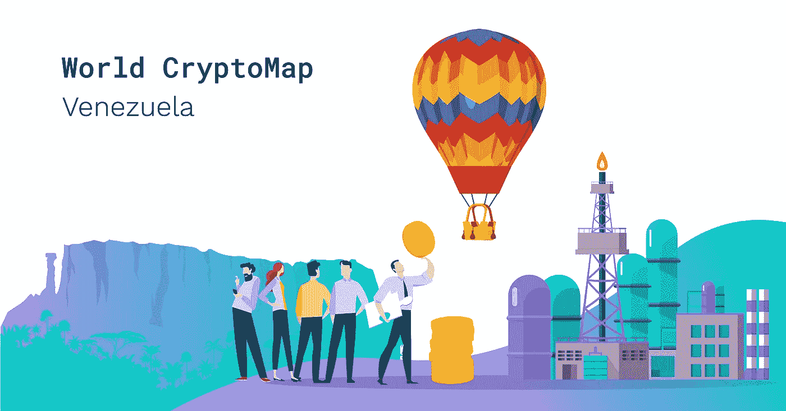

# 委内瑞拉对加密的希望:它能拯救崩溃的经济吗

> 原文：<https://medium.com/hackernoon/world-crypto-map-venezuelas-hopes-for-crypto-88fcecd04812>

如果你想知道在经济崩溃的情况下，加密是如何运作的，委内瑞拉是一个值得关注的有趣国家。为了走出恶性通货膨胀，该国政府推出了世界上第一种由国家支持的 [*加密货币*](https://hackernoon.com/tagged/cryptocurrency) *名为 Petro。与此同时，委内瑞拉人转向比特币，用它来支付从水电费到汽油和食品的一切费用。委内瑞拉的秘密采矿热成为主流。*

*虽然许多人说委内瑞拉展示了加密货币的另一个有前途的用例，并庆祝成功，但相反的观点每天都变得更加强烈。真实情况是怎样的？金融科技创新的使用有助于稳定经济吗？让我们找到我们的世界密码地图。*

# **石油丰富，现金匮乏**

这个国家发生的事情一点都不神秘。在前总统乌戈·查韦斯的领导下，正是石油收入推动了委内瑞拉的预算。当油价达到每桶 100 美元时，数十亿美元通过国有石油公司流入，并被用于社会项目和食品补贴。但当油价大幅下跌时，经济形势开始逆转。

截至目前，该国的本币玻利瓦尔几乎一文不值。恶性通货膨胀有望在年底达到 100 万的年增长率。

看来财务前景不会更糟了，对吗？半空的超市货架和长长的队伍已经成为日常生活的一部分。目前，大多数委内瑞拉人的月工资仅相当于 14 美元。在这种经济绝望的环境下，成千上万的人转向了加密货币。

# **秘密慈善机构**

2018 年 7 月，一个名为“windows 7733”[的委内瑞拉 Reddit 用户收到了 0.5 Nano](https://www.reddit.com/r/nanocurrency/comments/8v6dcy/got_my_first_05_nano_venezuelan_user/) 的捐赠。大约 1.8 美元的金额听起来可能不多，但对委内瑞拉人来说，这意味着为他的家人确保另一个月的产品和药品供应。当他在 Reddit 上宣布他找到了一个愿意接受代币购买食物的商家后，更多的捐款源源不断地涌入，Windows7733 能够购买 102 公斤的肉、大米、糖、豆类和水果。

此外，还有来自委内瑞拉的其他帖子解释了 crypto 如何帮助他们，并揭示了更大的画面。贫穷的委内瑞拉退休人员和富有的商界领袖都在网上将玻利瓦尔转换成数字货币，然后用它来支付从公用事业账单到煤气和水的一切费用。对于任何拥有智能手机的人来说，交易都相对快捷——像 LocalBitcoins 和 Colibit 这样的网站起到了委内瑞拉人可以买卖比特币的交易所的作用。

使用加密货币的委内瑞拉人数尚不清楚，但每日[比特币](https://hackernoon.com/tagged/bitcoin)交易量已经[达到 100 万美元](https://blockexplorer.com/news/bitcoin-trading-volume-hits-1-million-per-day-in-venezuela/)。

# **当恶性通货膨胀遭遇廉价电力**

秘密采矿也成为了在危机中生存的不可或缺的一部分。由于该国的廉价电力计划，它成为主流，加拉加斯几乎每家每户都有改装过的电脑嗡嗡作响。

根据最近的一项研究，这个国家现在是开采比特币最便宜的地方:成本大约 531 美元。相比之下，在全球最大的数字货币市场之一的韩国，开采一枚比特币的成本为 26170 美元。

然而，政府对国家对矿业的热情并不满意。它正在打击比特币采矿，尽管委内瑞拉没有法律禁止比特币或其制造。

# **官方加密货币**

Petro 是马杜罗的得意项目——一种由石油桶支持的官方政府加密货币。它的推出是为了吸引外国投资者，并绕过美国和欧盟的制裁。[在 Petro 的白皮书](http://www.elpetro.gob.ve/Whitepaper_Petro_en.pdf)中，据说它的一个用例是成为一种交换手段——用于实际购买商品和服务。为了继续推动新货币的采用，政府甚至引入了与石油挂钩的新工资制度。

对于这个项目的成功，人们意见不一。虽然许多人说，石油正是有助于稳定经济的东西，但其他人仍持怀疑态度。批评家怀疑货币是否真的由石油支撑。此外，媒体上有大量报道称，该石油公司的大部分所有权位于几个与政府相关的地址内。

# **总结**

目前仍不清楚委内瑞拉新推出的国家支持的数字货币是否正确。硬币对市场来说是新的，因此，判断石油是否是被摧毁的经济急需的药丸还为时过早。另一方面，委内瑞拉已经见证了加密货币的力量——数字货币让成千上万的居民能够支付他们的生活费用。