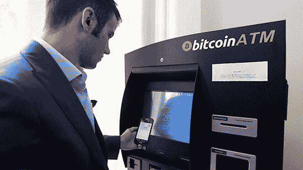

# 世界加密地图:澳大利亚如何成为第一个加密大陆

> 原文：<https://medium.com/hackernoon/world-cryptomap-how-australia-is-becoming-the-first-crypto-continent-9e2549207cc3>

几乎每家加密公司都是全球性的，带来新的技术解决方案，而不考虑国界。然而，我们需要跟上世界上加密的现状。

[***Crypterium***](http://www.crypterium.com)***在其新专栏《世界密码图》中开始探讨这个话题。在第一部分中，我们将仔细观察澳大利亚，看看为什么它已经赢得了“加密大陆”的绰号。***

# 政府:积极、支持和帮助

在撰写本文的 24 小时内，澳大利亚以 2956707.60 澳元或 268.38 BTC 的交易量[在全球 BTC 交易量](https://www.cryptocompare.com/coins/btc/analysis/USD)中排名第 13 位，是一个快速增长的比特币市场。

此外，政府对加密资产的立法采取了非常开放的态度。早在 2013 年 12 月，时任澳大利亚储备银行行长格伦·史蒂文斯(Glenn Stevens)宣布，澳大利亚公民可以自由选择任何喜欢的货币来支付商品和服务。

2017 年，司法部长迈克尔·基南(Michael Keenan)表示，澳大利亚的法律将旨在防止有组织犯罪和恐怖主义，但同时不会阻碍任何合法金融部门的发展。

澳大利亚有明确的支持性加密货币监管政策，重点关注交易所注册。上个月，澳大利亚交易报告和分析中心(AUSTRAC)公布了对加密货币交易提供商的最新要求。根据该文件，加密货币交易所必须向澳大利亚交易和报告中心注册，核实客户身份，采用和维护反洗钱/CTF 计划，以识别和减少洗钱，并向澳大利亚交易和报告中心报告任何可疑事项(包括涉及 10，000 美元或以上实物货币的任何交易)。此外，加密交易所必须将某些记录保存 7 年。到目前为止，已经有三家加密交易所获得了在澳大利亚运营的许可。

澳大利亚皇家铸币厂目前正致力于开发自己的黄金支持的加密货币。造币厂正在考虑[区块链](https://hackernoon.com/tagged/blockchain)技术的各种应用；例如，区块链可用于监控物流。这一决定旨在吸引更多的黄金投资。

另一个很好的例子是澳大利亚政府最近的[加密货币税收公告](https://www.ato.gov.au/General/Gen/Tax-treatment-of-crypto-currencies-in-Australia---specifically-bitcoin/)。3 月 16 日，他们没有简单地发布通知，而是花时间收集企业主的反馈，以了解当前的加密货币税收法律对企业的影响。发布公告时会考虑反馈。

# 商业:全球化和创新

澳大利亚是第一个在某些活动领域给加密货币开绿灯的国家。以下是几个例子:

*   布里斯班机场[通过与澳大利亚 TravelbyBit 达成协议，成为世界上第一个接受比特币的机场](https://www.telegraph.co.uk/travel/news/brisbane-becomes-worlds-first-airport-to-accept-bitcoin/)。昆士兰最繁忙的机场现在允许乘客用比特币支付机票、食物和购物；
*   澳大利亚的房地产市场是世界上最早接受比特币交易的市场之一。
*   澳大利亚证券交易所决心充当开路先锋，成为第一家实施基于区块链的交易后结算系统的大型证券交易所。
*   Power Ledger 是一家成功的澳大利亚创业公司，在 2017 年 10 月的 ICO 期间筹集了 3400 万美元，被评为能源领域区块链技术开发的全球领导者。Power Ledger 提供一种能源分配服务，可以识别能源的所有者，然后管理直接从 prosumer 购买剩余太阳能的买家之间的贸易协议，无需额外费用或利润。区块链被用来促进这些交易。这项技术目前正在澳大利亚的住宅以及批发和零售贸易中进行测试。
*   类似地，澳大利亚将建造一个 44.5 英亩的太阳能加密货币采矿农场，由 Hadouken Pty Ltd .提供。由当地能源企业家和加密爱好者 Ben Tan 领导，Hadouken 将在 Collie 安装 20 兆瓦的太阳能农场，用于加密货币采矿。澳大利亚拥有世界上最高的能源价格，而加密货币开采的环境成本正在全球范围内飙升。因此，秘密采矿经营者有一些很好的理由使用太阳能。

# 人物:中本聪之谜；日常生活中的秘密

*   最近的[调查](http://www.theaustralian.com.au/business/technology/who-is-using-bitcoin-in-australia/news-story/6594e4efd213b1603ed2e67281019ada)显示，63%的澳大利亚 BTC 用户将加密货币明确视为一种投资手段。澳大利亚的比特币用户以男性为主(86%)，年龄偏向于 34 岁或更小(59%，其中 25%在 24 岁以下)。大多数比特币持有者[也选择分散投资](https://www.finder.com.au/australias-bitcoin-users-are-exactly-who-youd-expect)，持有其他加密货币，如以太坊(17%)、莱特币(9%)、Monero (6%)和其他替代品。
*   澳大利亚企业家克雷格·赖特自称是神秘的中本聪，比特币的创始人。赖特甚至发表了一篇博客，大意是“聪死了。这仅仅是个开始”，[增加了如何验证他关于创造了加密货币的声明的真实性的详细说明](http://www.drcraigwright.net/jean-paul-sartre-signing-significance/)。果然，许多密码爱好者对此事持怀疑态度——但是如果赖特是对的呢？
*   越来越多的[比特币自动取款机](https://cointelegraph.com/news/bitcoin-continues-usage-acceptance-especially-in-australia) (ATM)正在澳大利亚各地安装。随着全国各地都有银行倒闭的报道，比特币自动取款机的涌入可能意味着澳大利亚数字货币的前景非常光明。

*   澳大利亚公民可以使用比特币支付账单。Satoshi 的客厅使这成为可能，这是一项免费的在线服务，允许以加密货币结算 BPAY 功能的账单。截至 2017 年 11 月，在电话费、学费、信用卡和税收中，Satoshi 的客厅报告每周处理高达 100 万美元的账单支付。一些澳大利亚人，比如墨尔本的 IT 专家[大卫·拉金](https://news.bitcoin.com/australian-company-processes-1-million-worth-of-cryptocurrency-in-bill-payments-weekly/)，甚至用比特币支付所有账单！
*   2018 年 4 月，联合国儿童基金会澳大利亚[宣布](https://cointelegraph.com/news/unicef-australia-offers-users-option-to-mine-crypto-as-donation)将为用户提供一种向慈善机构捐款的新方式:通过放弃自己电脑的处理能力来挖掘加密货币。正如联合国儿童基金会澳大利亚数字品牌和内容经理托尼·安德烈斯·唐(Tony Andres Tang)所解释的那样，这一程序将是绝对安全的:慈善机构在借用用户的机器进行采矿方面将是透明的，每个用户都可以选择放弃的处理能力的数量。
*   澳大利亚人对比特币的热爱有时可能会以完全意想不到的方式表现出来。现在，加密爱好者可以从全澳大利亚的 1200 个报刊亭购买比特币和以太坊。一个人需要的只是一个电子邮件地址、一个电话号码、一个电子钱包和至少 50 澳元(约 40 美元)。

# 摘要

澳大利亚展示了对加密货币监管的宽松态度。与此同时，市民在日常交易中普遍使用比特币。

澳大利亚社会对加密货币的积极态度和接受度促使企业想方设法占领这个利润丰厚的市场。如果到了紧要关头，澳大利亚很可能会成为世界上第一个投票支持比特币成为世界货币的国家。

我们很想在我们的[电报频道](https://t.me/crypterium)听到你对这个故事的看法。