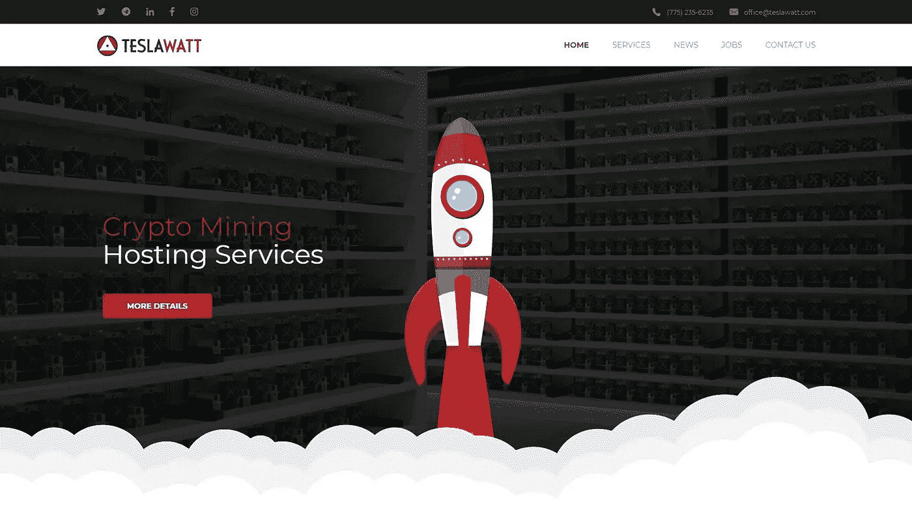
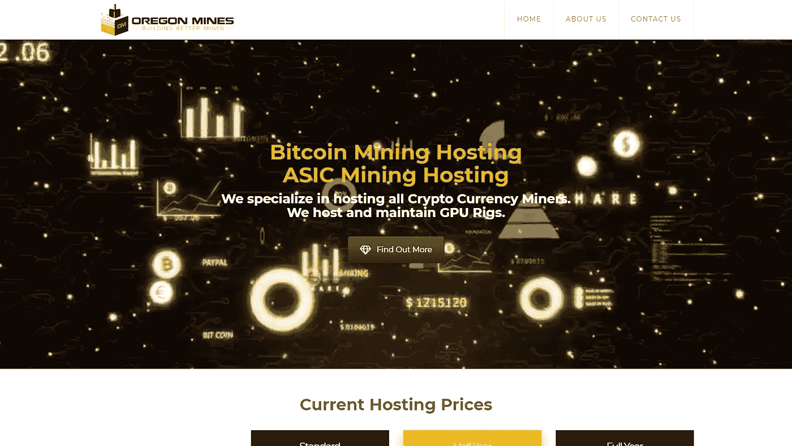
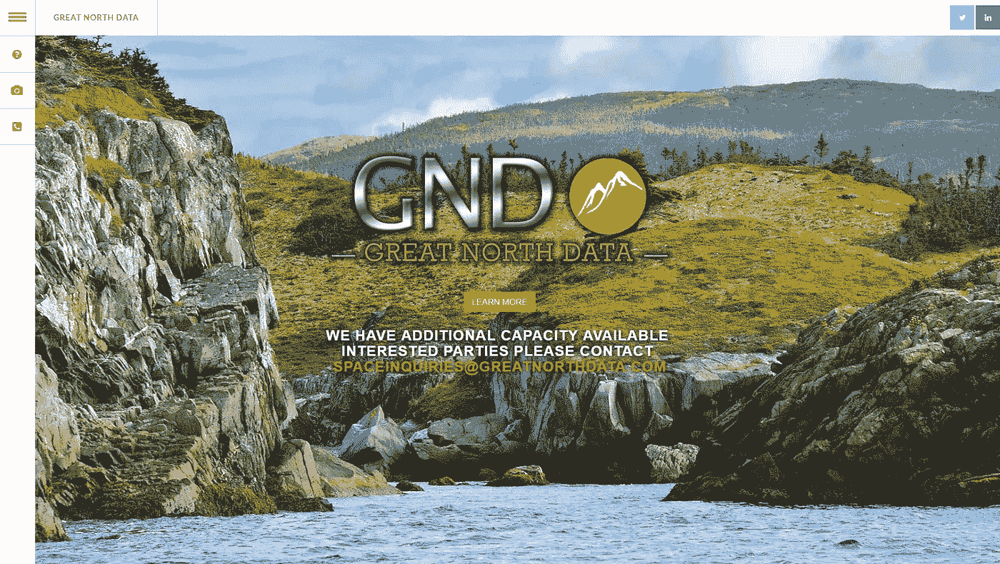
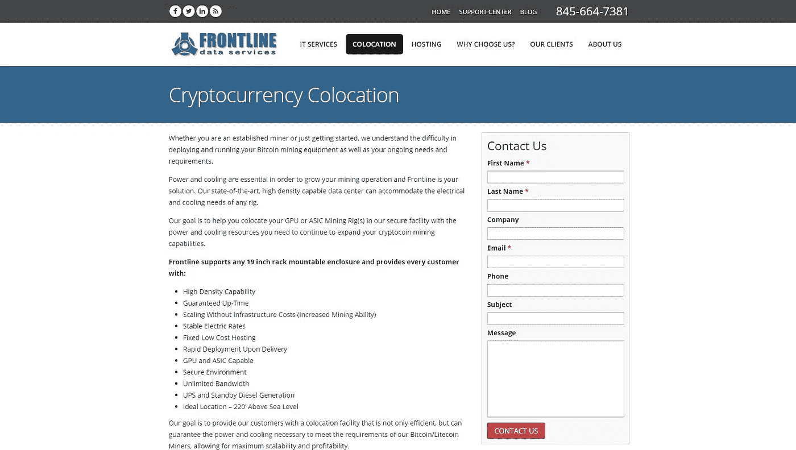
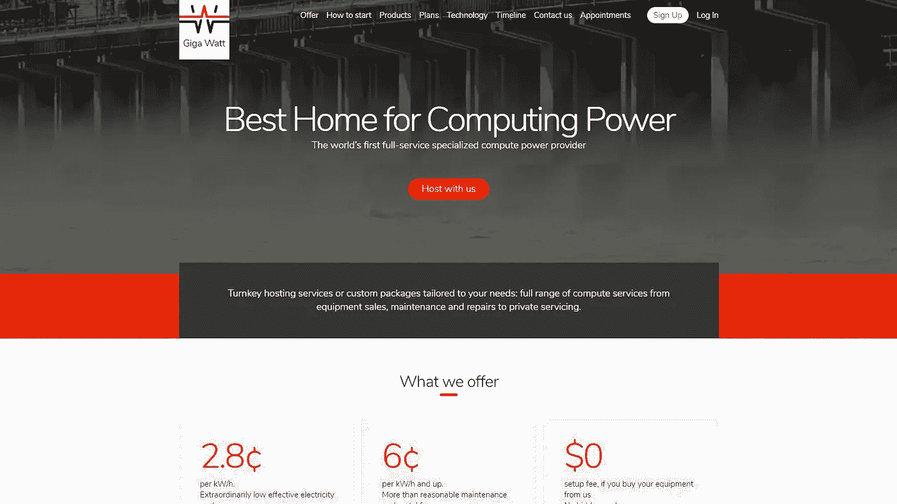
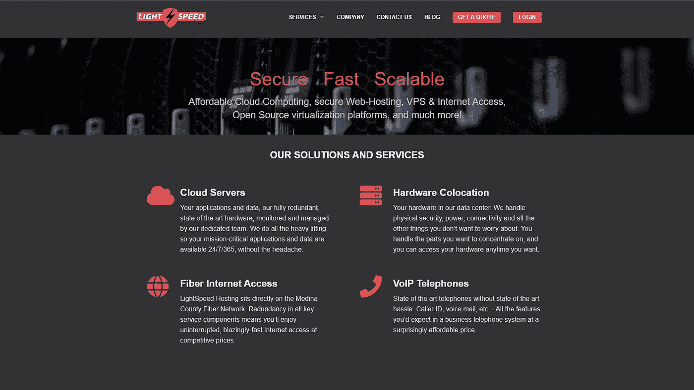
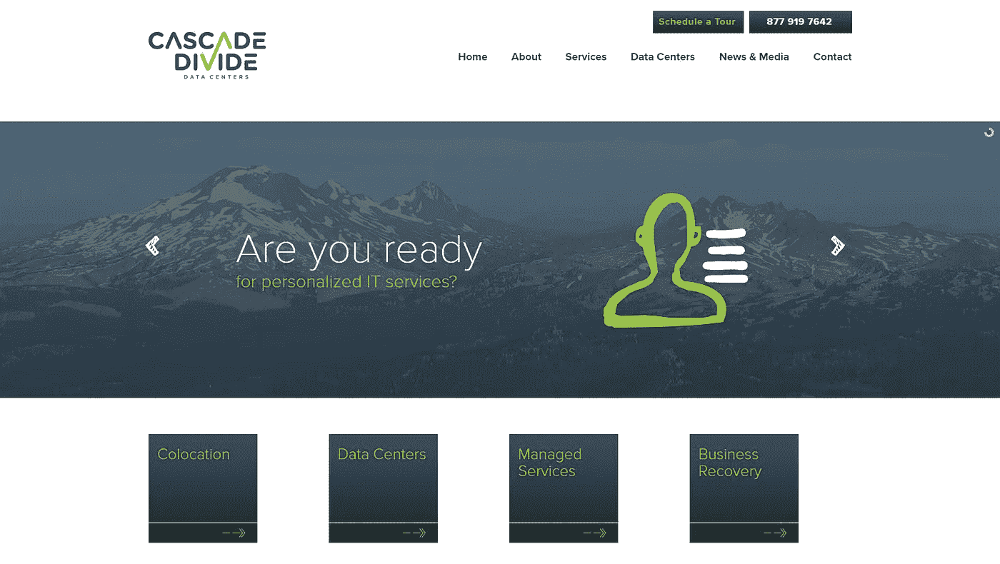

# 加密挖掘托管服务的世界

> 原文：<https://medium.com/hackernoon/world-of-crypto-mining-hosting-services-ef2a881326f>

Photo by [Andre Francois](https://unsplash.com/@silverhousehd?utm_source=medium&utm_medium=referral) on [Unsplash](https://unsplash.com?utm_source=medium&utm_medium=referral)

在这一点上，我相当肯定大多数人至少听说过或者很清楚加密货币是如何工作的。我自己在制作我的 [**赏金帖**](https://hackernoon.com/colorful-world-of-bounty-programs-d421df73f174) 的时候研究得更多一些。最令人惊讶的是有多大的密码挖掘托管业务，以及有多重要。

但是我有点想太多了。在我进入细节之前，对于你们这些新手来说，让我们来谈谈区块链技术和它是如何工作的。

在介绍关键人物之前，让我们先建立一个理解阶段。

# 什么是区块链？

今天，有许多加密货币，每一种都要归功于区块链理工大学。由于区块链，所有加密货币都是分散的和安全的。简而言之，这意味着发生的任何交易都是加密的。它是这样工作的。

**区块链·TL，博士**(在此了解更多信息):一旦加密交易发生，它就加入所谓的“块”当记录了固定数量的事务时，块本身被添加到一个巨大的链中，这被称为区块链。

需要指出的另一点是，区块链是公开可用的。正如我已经提到的，交易不是集中的，并且在位置上保持匿名，这代表了加密货币的另一个安全方面。比特币，最受欢迎的加密货币之一(你知道人人都在谈论的那种)，实际上不像以前那样有利可图，仅仅是因为它的高需求。矿工持有比特币越来越难了。但是有了深思熟虑的策略和合适的服务，一切皆有可能。

我待会再谈这个。

# 什么是采矿？

向区块链添加块意味着复杂的加密系统。你可以把这些过程想象成一个可以由计算机完成的相当复杂的难题，或者更确切地说，是一个有能力处理如此多复杂操作的硬件。这正是 CPU 和 GPU 的用武之地。例如，高端电脑，或者更具体地说，镭龙和英伟达(GeForce)显卡能够处理这样的过程。当将这些块添加到公共区块链背后的数学运算完成后，该操作实质上可以被描述为挖掘。

# 什么是密码矿工，硬币从何而来？

在矿工验证交易(检查它们是否真实)后，他们将因验证而获得奖励。奖励的形式是一笔费用，这笔费用是以该块硬币的形式支付的。基本上，一旦评估出矿工的硬件在解决难题(即验证过程)中的参与程度，就进行支付。这就是加密货币或硬币的来源。一旦砖块形成，每个矿工都会得到一定数量的硬币。

# 那么，你已经建立了你的第一个采矿机架，现在呢？

那好吧。首先要做的事。确定什么类型的加密挖掘是很重要的。虽然一开始事情看起来有点混乱，但事情真的很简单。加密货币挖掘分为以下不同类型:

*   **GPU 挖掘:**建立自己的家庭平台，通常为包含各种 GPU 的 PC 定制一个案例，以处理复杂的交易验证过程。
*   **ASIC 矿业:**尽管最近有一些[的政治争议](https://techcrunch.com/2018/03/27/ethereum-has-the-asic-blues/)，ASIC 矿业仍然相当受欢迎。简单来说，就是当挖掘的过程严格集中在单一加密货币上。
*   **联营采矿:**代表将你的采矿借给更大的团体，然后分享利润。对于那些仍然渴望获得比特币的人来说，与任何其他类型的挖掘相比，池挖掘将有更好的机会。
*   **云挖掘:**可能是消除家庭加密挖掘成本和费用的最快方法。云采矿为您提供了一个从其他采矿者处租赁采矿能力的机会，而无需自己成为采矿者(您可以从第三方公司租赁或直接从云采矿公司租赁)。

# 加密挖掘托管服务的目的是什么？

现在，任何已经在加密采矿游戏中玩了一段时间的人都会告诉你，在家采矿不像过去那样有利可图了。当然，这是可行的，也确实有一些优势，比如建立自己的系统，制定自己的盈利策略。正如我在做我的赏金帖子时发现的，有了加密采矿托管服务，许多新的大门将会打开。

例如，您将不再投入宝贵的时间来管理您的加密挖掘工作。所有这些都是专业为你做的。更重要的是，加密挖掘是一个昂贵的过程，一切需要进行这个过程将由你选择的托管公司处理。

其他优势包括不必担心采矿地点，你可以通过这些托管服务获得更好的带宽。传统上，这个过程是从几台设备开始的，即使如此，托管服务也比你通过家用钻机采矿要便宜。在家托管实际上会导致巨大的成本，更不用说担心散热，以及你为加密采矿设置的机器发出的噪音。

# 现在谁是最好的？

# [特斯拉瓦特](https://www.teslawatt.com/)

TeslaWatt 已经进入市场，为雄心勃勃的加密矿工提供一个非常有效和非常简单的系统。托管服务使你免于任何烦人和潜在复杂的硬件安装。他们的目标是帮助企业和个人远程管理和控制他们的采矿作业。

TeslaWatt 允许加密矿工使用他们的设施，享受内华达山脉的冰冷气候，拥有 2.5 兆瓦的容量。温度受到持续控制，因此秘密采矿过程不会中断。

# [俄勒冈州矿山](https://www.oregonmines.com/)

凭借极具竞争力的标准月结托管服务合同，俄勒冈矿无疑是更好的选择之一。除了标准合同，它们还包括长期合同和预付款的折扣。俄勒冈州的矿山似乎以最大化客户的采矿利润为荣，并欢迎新矿工帮助他们进行加密采矿，如钱包、池和设备选择。

# [大北数据](https://www.greatnorthdata.com/)

大北数据(GND)早在 2013 年就建立了他们的硬件运营。快进到今天，当 GND 提供专门的托管，利用高密度的计算机硬件。该服务还配备了处理主要功耗和冷却。尽管如此，他们的一揽子计划和交易承诺绿色水电(是的，事实上，他们是环保的)，这使得一些电力使用价格最低。简而言之，在 GND，你可以以合理的价格获得优质的服务。

# [前线数据服务](https://www.frontlineds.com/cryptocurrency_colocation/)

好吧，这是一个有效的选择，不管你是一个新的加密挖掘世界，还是你已经有一段时间了。这些人会满足你的需求——无论是设备方面还是温度方面——不管你对哪个级别的加密采矿感兴趣。您可以通过可靠安全的设施轻松处理您首选的 GPU 或 ASIC 采矿设备，除了增加冷却资源之外，还提供足够的电力，以便您可以在您的加密采矿操作中进一步推进。这项服务的一些优势包括无限带宽、无基础设施成本的扩展(允许提高采矿能力)，以及最重要的稳定电价。

# [千兆瓦](https://giga-watt.com/)

Giga Watt 为 GPU 和 ASIC 采矿设备提供了极具吸引力的选项，因其易于进入系统而脱颖而出。它们承诺提供紧凑的高密度设施，气流距离短，从而节省电力并提供极其高效的冷却。成本非常合理，他们提供了各种各样的技术解决方案，以及为战略合作伙伴定制的选项、风险共担的投资选项、利润共享的投资选项、设备融资等。

# [光速](https://www.lightspeedhosting.com/)

这些家伙已经把自己放在地图上，由于他们令人印象深刻的功能和服务，目前可用。其中包括使用高端硬件的云服务器，这些硬件由专门的团队监控和管理。该团队密切关注数据中心的硬件，这意味着安全性、电源和连接性，让您免去独立加密挖掘带来的所有头痛和烦恼。最近，这些家伙还增加了他们的客户群，这要归功于加密货币的支付选项，这是可能的，这要归功于 Coin payments——他们涵盖了比特币、比特币现金、莱特币、固化币、DASH、Decred、Ether、Monero、NEO、VertCoin 和 z-Cash 等加密货币。

# [梯级分割](http://www.cascadedivide.com/)

除了像 Cascade Divide 这样的服务，Divide 还通过其他令人印象深刻的服务使自己与众不同，例如主机托管，这种服务允许客户将他们的服务器放在公司的高科技数据中心。该数据中心采用高容量光纤连接，以合理的成本设置和维护客户的独立冗余设施和网络。换句话说，如果您选择这一选项，您将有机会在数据中心运行由专业人员管理的您自己的硬件，而没有构建、维护和升级内部数据中心的麻烦和费用。Cascade Divide 的其他优势包括顶级的现场安全性、总体可靠性和正常运行时间，以及高质量的电源和冷却。

## 继续阅读…链接:-)

相反，我对这篇文章做了一些总结，我更希望让你在这里自己决定。我在这里要做的是分享一些人的帖子/文章，他们对这些事情的解释远比我好，他们的帖子给了我很大的帮助。我分享经验，他们分享知识。

[*什么是比特币挖矿？*](https://www.bitcoinmining.com/)[*如何挖掘比特币？*](https://www.digitaltrends.com/computing/how-to-mine-bitcoin/)[*云挖矿比特币是如何工作的？*](https://www.coindesk.com/information/cloud-mining-bitcoin-guide)[*比特币挖矿硬件指南*](https://www.bitcoinmining.com/bitcoin-mining-hardware/)[*如何设置一个比特币 ASIC 挖矿机*](https://www.bitcoin.com/guides/how-to-setup-a-bitcoin-asic-miner-and-what-they-are)[*最佳挖矿 GPU 2018:挖矿比特币、以太坊等最佳显卡*](https://www.techradar.com/news/best-mining-gpu)[*什么是 GPU 挖矿*](https://bitcoinchaser.com/bitcoin-mining/gpu-v-asic-mining)

## 如果你喜欢这个故事，请点击👏按钮，在[中](/@blockguyeddie)、[推特](https://twitter.com/Block_Guy_Eddie)、[脸书](https://www.facebook.com/groups/179414492752527/)关注我，分享出来帮助别人找到！

## 我错过了什么吗？让我知道。在下面的评论区分享你的想法。