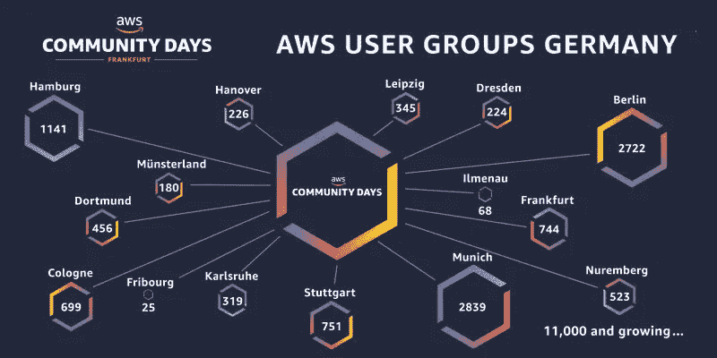

# 来自无服务器社区(德国？)

> 原文：<https://medium.com/hackernoon/worrying-and-promising-signals-from-serverless-community-of-germany-1d92a2db8e2c>

最近，我参加了在法兰克福[举行的](https://hackernoon.com/tagged/serverless) [AWS 社区日](https://aws.amazon.com/de/events/aws-community-days/)——无服务器计算专题讲座，我是其中一名演讲者。有 400 人参加，这是德国最大的 [AWS](https://hackernoon.com/tagged/aws) 社区活动。虽然不是一个明确的指标，但它可以反映该地区无服务器社区的技术水平。我想和你分享我对德国无服务器社区水平的评估。有些是好的(表示为“有希望”)，有些需要注意(表示为“令人担忧”)。以下是目录:

1.  [信号](https://hackernoon.com/worrying-and-promising-signals-from-serverless-community-of-germany-1d92a2db8e2c#d37e)
2.  [总体评估](https://hackernoon.com/worrying-and-promising-signals-from-serverless-community-of-germany-1d92a2db8e2c#a208)
3.  [那么，如何改善呢？](https://hackernoon.com/worrying-and-promising-signals-from-serverless-community-of-germany-1d92a2db8e2c#c6e1)
4.  [确认](https://hackernoon.com/worrying-and-promising-signals-from-serverless-community-of-germany-1d92a2db8e2c#ae14)
5.  [免责声明](https://hackernoon.com/worrying-and-promising-signals-from-serverless-community-of-germany-1d92a2db8e2c#ce28)

# **信号**

**1。** **用户完全忽略了安全(令人担忧)**

在我谈论无服务器 DevSecOps 期间，我进行了一次现场演示，并破解了一个无服务器函数。演示给我留下深刻印象的观众数量给我留下了深刻印象。许多人明确承认不知道无服务器功能有多脆弱和危险。令人担忧的是，大多数用户完全忽视了安全性，并认为无服务器是上天赐予的万无一失的礼物。

AWS 团队和社区应该做更多的工作来教育用户有关风险和防御措施。就个人而言，我更有决心在下一次会议中解决无服务器安全问题。

**2。** **DevOps 正在寻找出路(前途无量)**

有两个讲座(包括我的)是关于无服务器开发的。这是一个很有希望的观点，表明无服务器社区正朝着 DevOps 的方向发展。然而，根据观众提出的问题，我会说他们还没有练习 DevOps 那么多。

需要教育无服务器社区如何正确地执行开发运维，最好是以独立于供应商的方式。实践多云化变得越来越普遍，因此供应商锁定的 DevOps 解决方案不是最佳选择。

**3。基于无服务器的原型正在崛起(前景看好)**

看到在活动中展示的基于无服务器的原型和实验项目的数量，我印象深刻。作为一个例子，Olalekan Elesin 解释了他如何在短短三天内(没有任何先验知识)并且不需要任何深度学习等就可以组装基于图像的产品搜索。他的无服务器应用程序使用的是 AWS Rekogniton。

许多中小企业和大公司展示了他们的原型，我参观的所有演示都使用了 AWS Lambda 作为其架构的一部分。感谢 AWS 提供的大量产品，现在有可能在最短的时间内开发出又酷又方便的应用程序。

**4。可观察性是缺失的关键(令人担忧)**

没有任何关于可观察性的话题，不幸的是，在谈话和问答中，可观察性很少被简单提及。这让我很担心。解释一下，继续推广分布式应用(尤其是基于无服务器的)而不教育和授权开发人员如何维护(观察)它们是非常危险的。

云爱好者应该知道，可观察性是他们的应用程序的必备条件，否则他们超级酷的应用程序可能会给他们带来灾难。

**5。AWS SAR 未被发现的宝藏(令人担忧)**

Aleksandar Simovic 分享了他关于将 AWS 无服务器应用程序存储库(SAR)用于生产就绪型应用程序的有趣演示。“在无服务器架构中有许多重复的模式。那么为什么不重用别人的作品呢？”这是 SAR 背后的整个想法。有了它，你就可以在利用别人的专业知识的同时加快你的项目交付。但是，在很多情况下，组件没有经过正确的测试，或者存在安全漏洞。因此，在使用任何组件之前，您应该针对潜在的安全性、性能和技术问题仔细分析和测试它。

令我担心的是，很少观众听说过 SAR，尽管它有很大的潜力。

# **总体评估**

根据无服务器路线中提供的演示和提出的问题，我将在 200 级评估观众的技能(有 2 个演示在 300 级，但是观众问题在 200 级)。在这里，你可以看到[微软的标准等级定义(100 到 400)](https://blogs.technet.microsoft.com/ieitpro/2006/09/29/microsofts-standard-level-definitions-100-to-400/) 的定义

这是我第一次参加 AWS 社区日。不知道其他国家水平如何。所以，如果你能分享一下你的看法就好了。

# **那么，如何改善呢？**

AWS 产品令人惊叹。在努力保持其市场领先地位的同时，它还应该更加努力地教育社区(正确地)使用现有的产品。

*   AWS 团队在用 Lambda 教育社区创造和创新方面做得很好。但是，他们应该(平等地？对社区进行无服务器生态系统教育，特别是可观测性、安全性和 SAR。例如，此时我几乎找不到任何关于如何在 AWS SAR 中设计流程和正确组合组件的好教程。
*   AWS Lambda 文档中可以有一个关于安全性的专门章节。同时，传道者可以展示无服务器安全的重要性。目前，安全性在文档中被分散地提及。这样，大多数用户就不用担心安全性了。用户应该看到一个易受攻击的功能会造成多大的灾难，否则他们就不会认真对待安全性。
*   默认情况下，Lambda 环境可以包含一些安全措施。Protego Labs 和 PureSec 正在提供免费的安全工具包，可以提供一些基本的保护。Lambda 团队可以进行类似的测量。
*   AWS 社区可以更频繁地组织此类活动。与此同时，他们需要致力于教育社区正确使用服务，而不仅仅是展示很酷的应用。

当然，这只是我的看法。如果你对提高无服务器社区的水平有其他建议，或者对我的文章有其他意见，请在这里分享。

感谢您的时间和阅读这一点。

# **致谢**

我要特别感谢社区志愿者和亚马逊团队组织了这么好的活动。他们协调了整个项目。此外，我要感谢他们接受我作为演讲人。

# **免责声明**

1.  本文只是我的个人观点。
2.  无服务器跟踪总共有九次会谈。很少是用德语举办的，我也没听。然而，在阅读他们的幻灯片/描述时，我已经解决了这些问题。